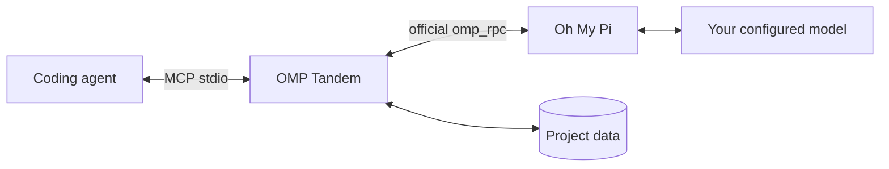

# OMP Tandem

**Give your coding agent an independent AI peer.**

Consult, design, implement, and review together through [Oh My Pi](https://github.com/can1357/oh-my-pi), with persistent conversations and project-isolated MCP tools.

**English** · [Русский](README.ru.md) · [简体中文](README.zh-CN.md)

[](https://github.com/Flyozzzz/omp-tandem-public/actions/workflows/ci.yml)
[](LICENSE)
[](pyproject.toml)

[Quick start](#quick-start) · [Full guide](docs/guide.md) · [Releases](https://github.com/Flyozzzz/omp-tandem-public/releases) · [Contributing](CONTRIBUTING.md)

## Why OMP Tandem?

A second agent should do more than approve the first agent's work. OMP Tandem lets your coordinator ask for independent reasoning, explore alternatives, delegate a separate implementation slice, and compare findings against evidence.

- **Real OMP, your provider.** Uses the official `omp_rpc` client and `omp --mode rpc`, not a substitute direct-API wrapper.
- **Complementary work.** Consultation, design, implementation, and review—not just testing at the end.
- **Persistent conversations.** Continue a discussion while replacing the current goal and preserving its base constraints.
- **Scoped knowledge.** Separate project histories, optional versioned product rules, and explicit cross-project sharing.
- **Honest results.** Structured outcomes, questions with deadlines, and recoverable intermediate artifacts.
- **Version-bound reviews.** Saved code and diffs, independent-first comparison, stale-result detection and finding history. [Review workflow](docs/guide.md#immutable-review-bundles).
- **Bounded waiting and visible usage.** Claude watchdog with polling fallback, explicit live diagnostics, and depth/budget settings separate from permissions. [Profiles and usage](docs/guide.md#computation-profiles-and-usage).
- **Portable integration.** Claude Code plugin, Agent Plugins package for Codex, and ordinary local stdio MCP for other hosts.

No company-specific policies or hardcoded project paths are bundled.

## Quick start

### 1. Install the prerequisites

Requires **macOS/Linux**, or **WSL with Linux tools**, plus `uv` and OMP on `PATH`.

With Homebrew:

```sh
brew install uv
brew install can1357/tap/omp
omp setup
```

Use OMP's setup flow to authenticate your own supported provider and select a tool-capable model. The host agent has its own separate login. For Linux/standalone installation, API keys, OAuth, and local models, see the [setup guide](docs/guide.md#install-omp-and-configure-a-provider).

### 2. Install for your host

**Claude Code**

```sh
claude plugin marketplace add Flyozzzz/omp-tandem-public
claude plugin install omp-tandem@omp-tandem
```

**Codex CLI**

```sh
codex plugin marketplace add Flyozzzz/omp-tandem-public
codex plugin add omp-tandem@omp-tandem --json
```

Start a new session from your project's directory. Do not keep an old standalone registration enabled alongside the plugin. While this repository is private, access is required; the commands do not bypass GitHub permissions.

Python dependencies are prepared automatically in a private cache. OMP installation and provider authentication remain explicit user setup. Other clients can use the [standard MCP configuration](docs/guide.md#other-mcp-clients).

### 3. Start collaborating

> Use OMP Tandem. First check `tandem_scope`. Ask OMP to independently challenge this design while you inspect the API constraints. Wait for the answer, compare the evidence, and explain the remaining disagreements.

Claude provides `/omp-tandem:tandem` and `/omp-tandem:setup`. Client prefixes vary; the MCP tool suffixes remain `tandem_*`.

## How it works



| Mode | Use it for | Project access |
|---|---|---|
| `think` | Consultation and reasoning over supplied context | No project/shell tools; collaboration tools remain available |
| `analyze` | Investigation and review | Read/search/web search; no edits or shell |
| `work` | Explicitly authorized implementation | Edit/write/shell and related tools; **not a sandbox** |

New tasks create independent conversations. Follow-ups retain native OMP history but replace the current objective. Questions and intermediate artifacts keep uncertainty visible instead of turning missing information into assumed success.

## Boundaries that matter

- Project data is bound to **trusted client workspace information**, never a task's model-supplied `cwd`. Foreign IDs do not open another project's history.
- The package does **not** sandbox processes with your OS permissions. Host shell sandbox settings do not automatically constrain an external OMP process.
- Reports are claims, not independent acceptance. `completed` does not prove `success`.
- Optional hooks diagnose prerequisites and provide a bounded Claude watchdog; they never install tools, read provider credentials, approve permissions, or replace polling when unavailable.
- Polling works without Channels. Claude push/webhooks are optional and remain subject to client and organization policy.
- Local storage is not offline inference: configured providers receive task context.

Read the [security policy](SECURITY.md) before reporting a vulnerability. Never include credentials, private conversations, or runtime databases in issues or pull requests.

## Documentation

| Topic | Reference |
|---|---|
| Installation, providers, and clients | [Complete guide](docs/guide.md) |
| Start Claude and the webhook with one short command | [Set up `claude-tandem`](docs/guide.md#one-command-launch) |
| Tasks, modes, results, questions, and artifacts | [Task workflow](docs/guide.md#tasks-and-execution-modes) |
| Product rules and decisions | [Product knowledge](docs/guide.md#product-knowledge-and-decisions) |
| Workspace isolation and explicit sharing | [Project isolation](docs/guide.md#project-isolation) |
| All MCP tools and limits | [API reference](docs/guide.md#mcp-tools) |
| Local data upgrades and migration | [Upgrades and legacy history](docs/guide.md#upgrades-and-legacy-history) |
| Claude Channels, webhook protocol, and managed setups | [Channels reference](docs/channels.md) |
| Development and contributions | [Contributing](CONTRIBUTING.md) |

Full guides are also available in [Russian](docs/guide.ru.md) and [Simplified Chinese](docs/guide.zh-CN.md).

## Development

```sh
uv sync --frozen --group dev
uv run pytest -q
uv run --frozen ruff check .
uv run --frozen ruff format --check .
uv build --wheel
```

`pytest` is a declared development dependency; `uv` installs the project package and its `omp_rpc` dependency into the same environment. Tests use temporary stores and local fault peers, not provider credentials. CI runs pytest, Ruff, wheel building, and distribution checks on Linux and macOS.

This repository begins with a reviewed snapshot of earlier private development. The **3.x** version series preserves that lineage without importing its Git history. “Legacy history” refers to local OMP conversation data, not hidden Git commits.

## License

[MIT](LICENSE), copyright (c) 2026 Flyozzzz. Commercial use, modification, and redistribution are allowed with the copyright and permission notice retained. The software is provided **AS IS**, without warranty. Dependencies keep their own licenses.
