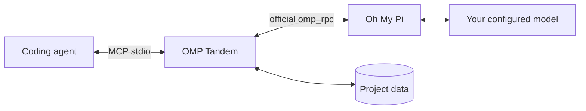

# OMP Tandem

**Give your coding agent an independent AI peer.**

Consult, design, implement, and review together through [Oh My Pi](https://github.com/can1357/oh-my-pi), with persistent conversations and project-isolated MCP tools.

**English** · [Русский](README.ru.md) · [简体中文](README.zh-CN.md)

[](https://github.com/Flyozzzz/omp-tandem-public/actions/workflows/ci.yml)
[](LICENSE)
[](pyproject.toml)

[Quick start](#quick-start) · [Jev assistance](#jev) · [Full guide](docs/guide.md) · [Releases](https://github.com/Flyozzzz/omp-tandem-public/releases) · [Contributing](CONTRIBUTING.md)

## Why OMP Tandem?

A second agent should do more than approve the first agent's work. OMP Tandem lets your coordinator ask for independent reasoning, explore alternatives, delegate a separate implementation slice, and compare findings against evidence.

- **Real OMP, your provider.** Uses the official `omp_rpc` client and `omp --mode rpc`, not a substitute direct-API wrapper.
- **Proportional planning.** Independent assessment, one comparison, a concrete plan, then implementation and cross-checking—not a fresh whole-project audit for every local fix.
- **Persistent conversations.** Continue a discussion while replacing the current goal and preserving its base constraints.
- **Scoped knowledge.** Separate project histories, optional versioned product rules, and explicit cross-project sharing.
- **Honest results.** Structured outcomes, questions with deadlines, and recoverable intermediate artifacts.
- **Version-bound reviews.** Choose worktree or staged-only material, then use independent-first comparison, stale-result detection and finding history. [Review workflow](docs/guide.md#immutable-review-bundles).
- **Bounded waiting and visible usage.** Claude watchdog with polling fallback, explicit live diagnostics, and depth/budget settings separate from permissions. [Profiles and usage](docs/guide.md#computation-profiles-and-usage).
- **Portable integration.** Claude Code plugin, Agent Plugins package for Codex, and ordinary local stdio MCP for other hosts.
- **Optional Jev assistance.** Report audits, candidate suggestions and task-start shadow model routing. Explicit export approval; no automatic acceptance or model switching. [Availability and setup](#jev).

No company-specific policies or hardcoded project paths are bundled.

## Quick start

### 1. Install the prerequisites

Requires **macOS/Linux**, or **WSL with Linux tools**, plus `uv` and OMP on `PATH`.

With Homebrew:

```sh
brew install uv
brew install can1357/tap/omp
omp setup
```

Use OMP's setup flow to authenticate your own supported provider and select a tool-capable model. The host agent has its own separate login. For Linux/standalone installation, API keys, OAuth, and local models, see the [setup guide](docs/guide.md#install-omp-and-configure-a-provider).

### 2. Install for your host

**Claude Code**

```sh
claude plugin marketplace add Flyozzzz/omp-tandem-public
claude plugin install omp-tandem@omp-tandem
```

**Codex CLI**

```sh
codex plugin marketplace add Flyozzzz/omp-tandem-public
codex plugin add omp-tandem@omp-tandem --json
```

Start a new session from your project's directory. Do not keep an old standalone registration enabled alongside the plugin. This repository is public; no invitation is required.

Python dependencies are prepared automatically in a private cache. OMP installation and provider authentication remain explicit user setup. Other clients can use the [standard MCP configuration](docs/guide.md#other-mcp-clients).

### 3. Check this project's setup

In Claude, run `/omp-tandem:setup` and ask for **local diagnosis only**. Confirm that Tandem is bound to your project, not the plugin/cache directory, and inspect runtime and delivery prerequisites. This does not call a model or prove provider authentication; a separate live diagnostic is optional and needs your approval.

### 4. Review your prepared commit

Stage the intended changes, then use `/omp-tandem:tandem` or ask in natural language:

> Use OMP Tandem to review my prepared commit, using staged changes only. Use this task's requirements and acceptance criteria; ask me if they are missing. Do not edit files. Report correctness risks with evidence and identify missing context.

The agent uses `tandem_review_run`: a saved staged/index snapshot, one independent read-only assessment and at most one comparison with separately supplied author rationale. It does not edit files or run supplied test commands. Missing source context requires a fresh expanded snapshot, not live files added to an old review. [Review details](docs/guide.md#one-read-only-review-scenario).

### 5. Give both agents one shared task

> Use OMP Tandem to agree a shared task for this feature. Record the goal, constraints, acceptance criteria, module owners and distinct reviewers. Split independent modules, add a final integration step, and keep the checklist and blockers current. Do not launch unattended work until I grant its limits.

`tandem_work` exposes the same durable card to both participants, including a readable Markdown view. Work survives a conversation ending; **a saved task is not a running agent**. Existing-client work is manual; opt-in unattended execution uses a separate bounded controller, dedicated Claude/OMP attempts and isolated Git worktrees. Accepted results are not silently merged into your current branch. [Shared-task workflow and operator commands](docs/guide.md#shared-tasks).

## Two entry paths

- [Staged review](docs/guide.md#one-read-only-review-scenario): independent assessment of a saved snapshot.
- [Shared development and operator grants](docs/guide.md#shared-tasks): plan, ownership, exact submissions and distinct review. Claim/submit require the bound Git root with HEAD; task `cwd` cannot repair that boundary. Unattended launches need explicit operator authorization. Shell is arbitrary execution, not a sandbox; reports are not acceptance.
- [Migration and disabled helpers](docs/helper-compatibility.md): no migration restarts work or retroactively makes a review independent.

## Compact state and recovery

See [compact views, runtime identity and recovery](docs/guide.md#compact-contracts) and [operator blocker resolution](docs/guide.md#operator-unblock). Hints and notifications grant no authority; resolving a blocker never resumes or authorizes work. Independent acceptance is separate from operator application and publication.

Latest published release: **[3.11.0](https://github.com/Flyozzzz/omp-tandem-public/releases/tag/v3.11.0)**. Managed submission checks ownership before recording intent; current views distinguish intent from committed output. Explicitly authorized [supervisor review checks](docs/guide.md#controlled-review-checks) use a prepared, immutable Linux Docker image and a separate exact-commit copy inside the existing product step, without reviewer shell tools. Network defaults to none; confirmed container removal is required, with no host fallback. Old grants are not upgraded. See the [changelog](CHANGELOG.md). Updating the repository does not restart existing work or authorize new execution.

<a id="jev"></a>
## Optional Jev assistance and shadow routing

Jev is a separate, optional structured-decision service—not the model that performs
the coding task. **The recommendation and shadow-routing additions on `main` are
not included in the published 3.11.0 release.** Inspect the loaded runtime's
`tandem_scope` capabilities before using them.

| Capability | Purpose | Availability |
|---|---|---|
| `tandem_audit` | Flag gaps between acceptance criteria and reported evidence | 3.11.0 and `main` |
| `tandem_recommend` | Suggest one caller-supplied skill or review direction before task creation | `main`, unreleased |
| `execution.routing` | Compare a task-start model suggestion with the unchanged execution model | `main`, **shadow-only** |

Audits and recommendations support exact keyless previews. Sending requires an
OpenRouter key and separate enablement: `--jev-audit` or `--jev-recommend`.
Recommendation sends additionally require the approved preview's matching hash.
They return advice and explicit uncertainty, not verified correctness or permission.

For **shadow model routing**:

1. The operator provides two or three exact models in a policy file through
   `--jev-routing-policy PATH` or `OMP_TANDEM_JEV_ROUTING_POLICY`.
2. Both the policy and the task's `execution.routing` must explicitly approve
   export of a short summary. No summary is inferred from prompts, files or history.
3. Code checks the catalog, capabilities, declared context/output estimates and
   optional estimated cost ceiling. An isolated metadata-only probe keeps catalog
   stalls separate from the execution process.
4. Jev may suggest an eligible model, `none`, or `unclear`. The task still uses its
   original model; `tandem_result.execution.routing` records the proposal, reason,
   routing time and separate Jev usage.

Explicit model choices, continuations, snapshot reviews and managed work bypass
the router. It never changes thinking, tools, roles, grants or acceptance. An
ordinary routing failure preserves the original selection; uncertain sends are
not retried. Missing `OPENROUTER_API_KEY` produces an explicit bypass.

Local RPC/HTTP checks verify the integration and safety boundaries. **Live Jev
recommendation accuracy, latency improvements and cost savings are not yet measured.**
See the [audit guide](docs/guide.md#optional-jev-evidence-audit),
[candidate recommendation guide](docs/guide.md#optional-jev-candidate-recommendation-unreleased)
and [shadow policy/configuration example](docs/guide.md#task-start-shadow-model-routing-unreleased).

## Plan changes and repository handover

See [plan transitions](docs/guide.md#plan-transitions) for stop evidence, saved checkpoints, capture-failure acknowledgments and fresh authorization; [repository handover](docs/guide.md#repository-handover) for boundary diagnostics and explicit closure/provenance commands.

Only the operator drives transitions and execution reconciliation. Supervisor teardown proves process stop, not absence of external effects. Never replay uncertain effects. Cross-scope links transfer no access, agreements, grants or acceptance; review the exact result in its own scope before explicit application.

## How it works



| Mode | Use it for | Project access |
|---|---|---|
| `think` | Consultation and reasoning over supplied context | No project/shell tools; collaboration tools remain available |
| `analyze` | Investigation and review | Read/search/web search; no edits or shell |
| `work` | Explicitly authorized implementation | Edit/write/shell and related tools; **not a sandbox** |

New tasks create independent conversations. Follow-ups retain native OMP history but replace the current objective. Questions and intermediate artifacts keep uncertainty visible instead of turning missing information into assumed success.

## Evidence, not a promise

In our [real review case](docs/case-study.md), the first attempt was blocked by missing context (**80.558 s wall time**). An expanded review found a real deadline/cancellation bug, but its **300 s total budget** ended in a timeout after **331.723 s wall time**. A focused recheck completed in **186.127 s wall time** and identified a distinct **shared-SQLite publication-lock risk**, not yet runtime-verified in that episode. Completion is not proof of bug-free code; the case preserves failures and remaining uncertainty.

The publication-lock risk was then reproduced and fixed before release; the case separates that passing runtime follow-up from the original static report.

[Compatibility checks](docs/compatibility.md) use an actual pinned OMP binary and RPC SDK with a deterministic **localhost provider** in CI—no paid account is needed. Evidence applies to the exact tested combination, not a broad version range or every provider. The [benchmark document](docs/benchmark.md) is a comparative protocol only: **no comparative results or superiority claim**.

## Boundaries that matter

- Project data is bound to **trusted client workspace information**, never a task's model-supplied `cwd`. Foreign IDs do not open another project's history.
- The package does **not** sandbox processes with your OS permissions. Host shell sandbox settings do not automatically constrain an external OMP process.
- Reports are claims, not independent acceptance. `completed` does not prove `success`.
- Optional hooks diagnose prerequisites and provide a bounded Claude watchdog; they never install tools, read provider credentials, approve permissions, or replace polling when unavailable.
- Polling works without Channels. Claude push/webhooks are optional and remain subject to client and organization policy.
- Local storage is not offline inference: configured providers receive task context.

Read the [security policy](SECURITY.md) before reporting a vulnerability. Never include credentials, private conversations, or runtime databases in issues or pull requests.

## Documentation

| Topic | Reference |
|---|---|
| Installation, providers, and clients | [Complete guide](docs/guide.md) |
| Start Claude and the webhook with one short command | [Set up `claude-tandem`](docs/guide.md#one-command-launch) |
| Tasks, modes, results, questions, and artifacts | [Task workflow](docs/guide.md#tasks-and-execution-modes) |
| Product rules and decisions | [Product knowledge](docs/guide.md#product-knowledge-and-decisions) |
| Workspace isolation and explicit sharing | [Project isolation](docs/guide.md#project-isolation) |
| All MCP tools and limits | [API reference](docs/guide.md#mcp-tools) |
| Jev audits, candidate advice and shadow model routing | [Jev assistance](#jev) |
| Local data upgrades and migration | [Upgrades and legacy history](docs/guide.md#upgrades-and-legacy-history) |
| Claude Channels, webhook protocol, and managed setups | [Channels reference](docs/channels.md) |
| Development and contributions | [Contributing](CONTRIBUTING.md) |

Full guides are also available in [Russian](docs/guide.ru.md) and [Simplified Chinese](docs/guide.zh-CN.md).

## Development

```sh
uv sync --frozen --group dev
uv run pytest -q
uv run --frozen ruff check .
uv run --frozen ruff format --check .
uv build --wheel
```

`pytest` is a declared development dependency; `uv` installs the project package and its `omp_rpc` dependency into the same environment. Tests use temporary stores and local fault peers, not provider credentials. CI runs pytest, Ruff, wheel building, and distribution checks on Linux and macOS.

This repository begins with a reviewed snapshot of earlier private development. The **3.x** version series preserves that lineage without importing its Git history. “Legacy history” refers to local OMP conversation data, not hidden Git commits.

## License

[MIT](LICENSE), copyright (c) 2026 Flyozzzz. Commercial use, modification, and redistribution are allowed with the copyright and permission notice retained. The software is provided **AS IS**, without warranty. Dependencies keep their own licenses.
