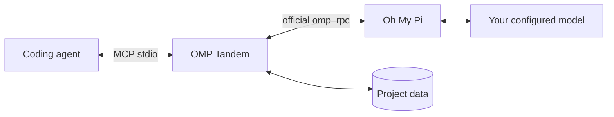

# OMP Tandem

**Give your coding agent an independent AI peer.**

Consult, design, implement, and review together through [Oh My Pi](https://github.com/can1357/oh-my-pi), with persistent conversations and project-isolated MCP tools.

**English** · [Русский](README.ru.md) · [简体中文](README.zh-CN.md)

[](https://github.com/Flyozzzz/omp-tandem-public/actions/workflows/ci.yml)
[](LICENSE)
[](pyproject.toml)

[Quick start](#quick-start) · [Full guide](docs/guide.md) · [Releases](https://github.com/Flyozzzz/omp-tandem-public/releases) · [Contributing](CONTRIBUTING.md)

## Why OMP Tandem?

A second agent should do more than approve the first agent's work. OMP Tandem lets your coordinator ask for independent reasoning, explore alternatives, delegate a separate implementation slice, and compare findings against evidence.

- **Real OMP, your provider.** Uses the official `omp_rpc` client and `omp --mode rpc`, not a substitute direct-API wrapper.
- **Proportional planning.** Independent assessment, one comparison, a concrete plan, then implementation and cross-checking—not a fresh whole-project audit for every local fix.
- **Persistent conversations.** Continue a discussion while replacing the current goal and preserving its base constraints.
- **Scoped knowledge.** Separate project histories, optional versioned product rules, and explicit cross-project sharing.
- **Honest results.** Structured outcomes, questions with deadlines, and recoverable intermediate artifacts.
- **Version-bound reviews.** Choose worktree or staged-only material, then use independent-first comparison, stale-result detection and finding history. [Review workflow](docs/guide.md#immutable-review-bundles).
- **Bounded waiting and visible usage.** Claude watchdog with polling fallback, explicit live diagnostics, and depth/budget settings separate from permissions. [Profiles and usage](docs/guide.md#computation-profiles-and-usage).
- **Portable integration.** Claude Code plugin, Agent Plugins package for Codex, and ordinary local stdio MCP for other hosts.

No company-specific policies or hardcoded project paths are bundled.

## Quick start

### 1. Install the prerequisites

Requires **macOS/Linux**, or **WSL with Linux tools**, plus `uv` and OMP on `PATH`.

With Homebrew:

```sh
brew install uv
brew install can1357/tap/omp
omp setup
```

Use OMP's setup flow to authenticate your own supported provider and select a tool-capable model. The host agent has its own separate login. For Linux/standalone installation, API keys, OAuth, and local models, see the [setup guide](docs/guide.md#install-omp-and-configure-a-provider).

### 2. Install for your host

**Claude Code**

```sh
claude plugin marketplace add Flyozzzz/omp-tandem-public
claude plugin install omp-tandem@omp-tandem
```

**Codex CLI**

```sh
codex plugin marketplace add Flyozzzz/omp-tandem-public
codex plugin add omp-tandem@omp-tandem --json
```

Start a new session from your project's directory. Do not keep an old standalone registration enabled alongside the plugin. This repository is public; no invitation is required.

Python dependencies are prepared automatically in a private cache. OMP installation and provider authentication remain explicit user setup. Other clients can use the [standard MCP configuration](docs/guide.md#other-mcp-clients).

### 3. Check this project's setup

In Claude, run `/omp-tandem:setup` and ask for **local diagnosis only**. Confirm that Tandem is bound to your project, not the plugin/cache directory, and inspect runtime and delivery prerequisites. This does not call a model or prove provider authentication; a separate live diagnostic is optional and needs your approval.

### 4. Review your prepared commit

Stage the intended changes, then use `/omp-tandem:tandem` or ask in natural language:

> Use OMP Tandem to review my prepared commit, using staged changes only. Use this task's requirements and acceptance criteria; ask me if they are missing. Do not edit files. Report correctness risks with evidence and identify missing context.

The agent uses **`tandem_review_run`**, not a manual sequence of low-level tools: one independent read-only assessment, then at most one comparison with separately supplied author proposal/rationale. Without author material there is only one stage. Progress stays compact; the terminal result includes the **full stage answers**. The default **600-second total budget** covers capture, startup, stages, and questions—not 600 seconds per stage. The scenario neither edits files nor runs supplied test commands.

The review uses a saved **staged/index snapshot**, not unstaged working files. Include requirements, criteria, and explicitly needed unchanged callers/tests in that capture. Missing source context requires a **fresh expanded snapshot and review**, never silently joining live files to an old review. You do not need to learn the low-level tool catalog. Client command prefixes vary; natural-language instructions work with connected Tandem tools.

For development, scale planning to uncertainty: a known local fix needs a brief risk/criteria check and a small plan, not a new audit of the whole project or a re-proof of user-confirmed facts. After one independent assessment and one comparison, choose an approach, run a distinguishing experiment, or state the unresolved question for the user. Do not loop until the agents agree.

### 5. Give both agents one shared task

> Use OMP Tandem to agree a shared task for this feature. Record the goal, constraints, acceptance criteria, module owners and distinct reviewers. Split independent modules, add a final integration step, and keep the checklist and blockers current. Do not launch unattended work until I grant its limits.

`tandem_work` exposes the same durable card to both participants, including a readable Markdown view. Work survives a conversation ending; **a saved task is not a running agent**. Existing-client work is manual; opt-in unattended execution uses a separate bounded controller, dedicated Claude/OMP attempts and isolated Git worktrees. Accepted results are not silently merged into your current branch. [Shared-task workflow and operator commands](docs/guide.md#shared-tasks).

## Two entry paths

- **Prepared change:** use `tandem_review_run` with `source="staged"` for the intended commit's index snapshot; it is a read-only review, not implementation or test execution.
- **Shared development:** use `tandem_work` for a two-agent plan, file ownership, claims, committed submissions and distinct review. The bound **project root must be a Git repository with a HEAD commit** for claim/submit; launching from its parent folder can produce `Work execution requires a Git repository with an immutable HEAD commit`. A task `cwd` cannot repair the launch boundary.
- **Operator grant:** inspect `authorize --preview` before activating. `--claude-model` (default `sonnet`) and `--omp-model` (alias of `--model`) go before `authorize`; `--max-attempt-cost-usd`, `--allow-shell` and deprecated `--allow-tests` go after it. Shell means arbitrary execution, not a test sandbox. The grant's `preview.permissions` and reserve policy disclose the actual permissions and default attempt ceiling (half the total budget, independent of launch count); model selections are pinned, not proof of observed model identity.
- **Independent-first review:** `report` → optional single `compare` → `accept`/`reject`. Author interpretation stays withheld through the independent report until comparison opens. Managed reviewers read only the pinned commit snapshot; a shell-granted review creates an operator blocker **before launch**, not a silently unrestricted review. A successful report is not acceptance.
- **Migration and limits:** unresolved blockers survive `propose`; removed steps leave card-level blockers. Only the blocker author/operator can resolve them with evidence. Legacy grants retain total-budget/`max_launches` attempt ceilings and `allow_tests` decoding; legacy review attempts are labelled `legacy_disclosure`, not retrospectively independent. No migration restarts work. Acceptance does not apply code: stop/recovery and explicit operator apply remain separate.

[Operator commands and migration details](docs/guide.md#shared-tasks). [Helper compatibility](docs/helper-compatibility.md) records **five unsatisfied gates**: child-tool restriction inheritance, project scout replacement, task-wide settings snapshots, exclusive parent usage, and extra model calls per spawn. Helpers remain disabled (`delegation.available=false`); stages C–F and helper savings are not released.

## Compact state and recovery

- `tandem_work` defaults to `view="summary"`; request `plan`, `step` or `full` explicitly. History is paged; use its cursor and refetch on `cursor_stale`. `next_actions` are hints, not authorization.
- Every task result carries `runtime_identity`: compare the loaded package/build and registered schema surface with the checkout, rather than assuming an updated checkout changed a running server.
- `recovery` descriptors explain report-only closure of the same claim. An operator must authorize another host with `successor` before `recover`; this does not rerun a model, tests or implementation. Independent clarification requires a new snapshot, with exact `review_context_paths`; prior waivers do not automatically cover changed inputs.
- `wake_acknowledgment` distinguishes `acknowledged`, `acknowledged_zero`, `deferred` and `not_attempted`. Acceptance is separate from application (`not_recorded` without evidence), `assess`, apply receipts and publication. Native usage is a scoped subtotal; Claude cost remains unknown unless separately measured.

[Contract, reporting and recovery details](docs/guide.md#compact-contracts). Package 3.6.0 was released on 2026-09-12; see the [changelog](CHANGELOG.md).

## How it works



| Mode | Use it for | Project access |
|---|---|---|
| `think` | Consultation and reasoning over supplied context | No project/shell tools; collaboration tools remain available |
| `analyze` | Investigation and review | Read/search/web search; no edits or shell |
| `work` | Explicitly authorized implementation | Edit/write/shell and related tools; **not a sandbox** |

New tasks create independent conversations. Follow-ups retain native OMP history but replace the current objective. Questions and intermediate artifacts keep uncertainty visible instead of turning missing information into assumed success.

## Evidence, not a promise

In our [real review case](docs/case-study.md), the first attempt was blocked by missing context (**80.558 s wall time**). An expanded review found a real deadline/cancellation bug, but its **300 s total budget** ended in a timeout after **331.723 s wall time**. A focused recheck completed in **186.127 s wall time** and identified a distinct **shared-SQLite publication-lock risk**, not yet runtime-verified in that episode. Completion is not proof of bug-free code; the case preserves failures and remaining uncertainty.

The publication-lock risk was then reproduced and fixed before release; the case separates that passing runtime follow-up from the original static report.

[Compatibility checks](docs/compatibility.md) use an actual pinned OMP binary and RPC SDK with a deterministic **localhost provider** in CI—no paid account is needed. Evidence applies to the exact tested combination, not a broad version range or every provider. The [benchmark document](docs/benchmark.md) is a comparative protocol only: **no comparative results or superiority claim**.

## Boundaries that matter

- Project data is bound to **trusted client workspace information**, never a task's model-supplied `cwd`. Foreign IDs do not open another project's history.
- The package does **not** sandbox processes with your OS permissions. Host shell sandbox settings do not automatically constrain an external OMP process.
- Reports are claims, not independent acceptance. `completed` does not prove `success`.
- Optional hooks diagnose prerequisites and provide a bounded Claude watchdog; they never install tools, read provider credentials, approve permissions, or replace polling when unavailable.
- Polling works without Channels. Claude push/webhooks are optional and remain subject to client and organization policy.
- Local storage is not offline inference: configured providers receive task context.

Read the [security policy](SECURITY.md) before reporting a vulnerability. Never include credentials, private conversations, or runtime databases in issues or pull requests.

## Documentation

| Topic | Reference |
|---|---|
| Installation, providers, and clients | [Complete guide](docs/guide.md) |
| Start Claude and the webhook with one short command | [Set up `claude-tandem`](docs/guide.md#one-command-launch) |
| Tasks, modes, results, questions, and artifacts | [Task workflow](docs/guide.md#tasks-and-execution-modes) |
| Product rules and decisions | [Product knowledge](docs/guide.md#product-knowledge-and-decisions) |
| Workspace isolation and explicit sharing | [Project isolation](docs/guide.md#project-isolation) |
| All MCP tools and limits | [API reference](docs/guide.md#mcp-tools) |
| Local data upgrades and migration | [Upgrades and legacy history](docs/guide.md#upgrades-and-legacy-history) |
| Claude Channels, webhook protocol, and managed setups | [Channels reference](docs/channels.md) |
| Development and contributions | [Contributing](CONTRIBUTING.md) |

Full guides are also available in [Russian](docs/guide.ru.md) and [Simplified Chinese](docs/guide.zh-CN.md).

## Development

```sh
uv sync --frozen --group dev
uv run pytest -q
uv run --frozen ruff check .
uv run --frozen ruff format --check .
uv build --wheel
```

`pytest` is a declared development dependency; `uv` installs the project package and its `omp_rpc` dependency into the same environment. Tests use temporary stores and local fault peers, not provider credentials. CI runs pytest, Ruff, wheel building, and distribution checks on Linux and macOS.

This repository begins with a reviewed snapshot of earlier private development. The **3.x** version series preserves that lineage without importing its Git history. “Legacy history” refers to local OMP conversation data, not hidden Git commits.

## License

[MIT](LICENSE), copyright (c) 2026 Flyozzzz. Commercial use, modification, and redistribution are allowed with the copyright and permission notice retained. The software is provided **AS IS**, without warranty. Dependencies keep their own licenses.
