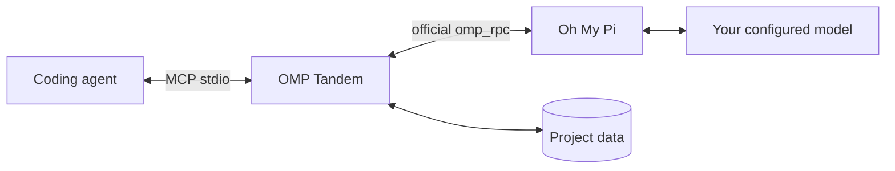

# OMP Tandem

**Независимый AI-напарник для твоего coding-агента.**

Обсуждайте решения, проектируйте, реализуйте и проводите ревью через [Oh My Pi](https://github.com/can1357/oh-my-pi), сохраняя беседы и разделяя данные проектов.

[English](README.md) · **Русский** · [简体中文](README.zh-CN.md)

[](https://github.com/Flyozzzz/omp-tandem-public/actions/workflows/ci.yml)
[](LICENSE)
[](pyproject.toml)

[Быстрый старт](#быстрый-старт) · [Полное руководство](docs/guide.ru.md) · [Релизы](https://github.com/Flyozzzz/omp-tandem-public/releases) · [Участие в разработке](CONTRIBUTING.md)

## Зачем OMP Tandem?

Второй агент нужен не только для одобрения работы первого. OMP Tandem позволяет получить независимый взгляд, сравнить альтернативы, поручить отдельный участок реализации и сопоставить выводы с доказательствами.

- **Настоящий OMP, твой провайдер.** Официальный `omp_rpc` и процесс `omp --mode rpc`, а не подмена прямым вызовом API.
- **Взаимодополняющая работа.** Консультации, проектирование, реализация и ревью — не только финальное тестирование.
- **Постоянные беседы.** Продолжай обсуждение с новой целью и сохранёнными базовыми ограничениями.
- **Разделённые знания.** Изоляция историй, необязательные версии правил продукта и явная передача контекста.
- **Честные результаты.** Структурированные отчёты, вопросы со сроками и сохранённые промежуточные материалы.
- **Разные клиенты.** Плагин Claude Code, пакет Agent Plugins для Codex и обычный локальный stdio MCP.

В поставке нет правил конкретной компании и зашитых путей к проекту.

## Быстрый старт

### 1. Установи необходимые инструменты

Нужны **macOS/Linux** либо **WSL с Linux-инструментами**, а также `uv` и OMP в `PATH`.

Через Homebrew:

```sh
brew install uv
brew install can1357/tap/omp
omp setup
```

В настройке OMP войди к своему поддерживаемому провайдеру и выбери модель с поддержкой инструментов. У основного агента отдельная авторизация. Linux/standalone-установка, API-ключи, OAuth и локальные модели описаны в [руководстве](docs/guide.ru.md#install-omp-and-configure-a-provider).

### 2. Подключи плагин

**Claude Code**

```sh
claude plugin marketplace add Flyozzzz/omp-tandem-public
claude plugin install omp-tandem@omp-tandem
```

**Codex CLI**

```sh
codex plugin marketplace add Flyozzzz/omp-tandem-public
codex plugin add omp-tandem@omp-tandem --json
```

Запусти новую сессию из папки своего проекта. Не оставляй одновременно включёнными старую standalone-регистрацию и плагин. Пока репозиторий приватный, нужен доступ: команды не обходят разрешения GitHub.

Python-зависимости готовятся автоматически в отдельном кеше. OMP и авторизацию провайдера пользователь настраивает явно. Для других клиентов есть [обычная MCP-конфигурация](docs/guide.ru.md#other-mcp-clients).

### 3. Начни совместную работу

> Используй OMP Tandem. Сначала проверь `tandem_scope`. Попроси OMP независимо разобрать слабые стороны этого решения, пока ты изучаешь ограничения API. Дождись ответа, сопоставь доказательства и объясни оставшиеся разногласия.

В Claude доступны `/omp-tandem:tandem` и `/omp-tandem:setup`. Префиксы клиентов отличаются, суффиксы MCP-инструментов остаются `tandem_*`.

## Как это устроено



| Режим | Для чего | Доступ к проекту |
|---|---|---|
| `think` | Консультация и рассуждение по переданным данным | Без инструментов проекта и shell; инструменты сотрудничества остаются |
| `analyze` | Исследование и ревью | Чтение, поиск и веб-поиск; без правок и shell |
| `work` | Явно разрешённая реализация | Редактирование, запись, shell и связанные инструменты; **не песочница** |

Новая задача создаёт отдельную беседу. Продолжение сохраняет native-историю OMP, но заменяет текущую цель. Вопросы и промежуточные материалы делают неопределённость видимой, а не превращают отсутствие данных в предполагаемый успех.

## Важные границы

- Данные привязаны к **доверенной рабочей папке клиента**, а не к `cwd`, который модель передала задаче. Чужой ID не открывает историю другого проекта.
- Пакет **не изолирует файловую систему** от процессов с правами пользователя ОС. Песочница shell основного агента не ограничивает автоматически внешний процесс OMP.
- Отчёт — утверждение агента, не независимая приёмка. `completed` не доказывает `success`.
- Хуки только сообщают об отсутствующих инструментах: не устанавливают их, не читают ключи, не одобряют разрешения и не блокируют ходы.
- Polling работает без Channels. Push и вебхуки Claude необязательны и подчиняются политикам клиента и организации.
- Локальное хранение не означает офлайн-модель: контекст задач получают настроенные провайдеры.

Перед сообщением об уязвимости прочитай [политику безопасности](SECURITY.md). Не публикуй ключи, приватные беседы или runtime-базы в issues и pull requests.

## Документация

| Тема | Материал |
|---|---|
| Установка, провайдеры и клиенты | [Полное руководство](docs/guide.ru.md) |
| Запуск Claude и webhook одной короткой командой | [Настроить `claude-tandem`](docs/guide.ru.md#one-command-launch) |
| Задачи, режимы, ответы, вопросы и артефакты | [Рабочий процесс](docs/guide.ru.md#tasks-and-execution-modes) |
| Правила продукта и решения | [База знаний продукта](docs/guide.ru.md#product-knowledge-and-decisions) |
| Изоляция и явная передача контекста | [Пространства проектов](docs/guide.ru.md#project-isolation) |
| Все MCP-инструменты и лимиты | [Справочник API](docs/guide.ru.md#mcp-tools) |
| Обновления и перенос локальных данных | [Миграция истории](docs/guide.ru.md#upgrades-and-legacy-history) |
| Claude Channels, вебхуки и корпоративное подключение | [Справочник Channels](docs/channels.md) |
| Разработка и участие | [Contributing](CONTRIBUTING.md) |

Полное руководство также доступно на [английском](docs/guide.md) и [китайском](docs/guide.zh-CN.md).

## Разработка

```sh
uv sync --frozen --group dev
uv run pytest -q
uv run --frozen ruff check .
uv run --frozen ruff format --check .
uv build --wheel
```

`pytest` явно включён в dev-зависимости; `uv` устанавливает пакет проекта и `omp_rpc` в то же окружение. Тесты используют временные хранилища и локальные fault peers, а не провайдерские ключи. CI запускает pytest, Ruff, сборку wheel и проверку поставки на Linux и macOS.

Репозиторий начинается с проверенного снимка предыдущей приватной разработки. Серия **3.x** сохраняет последовательность версий, но старая Git-история не импортирована. «Legacy history» относится к локальным беседам OMP, а не к скрытым Git-коммитам.

## Лицензия

[MIT](LICENSE), copyright (c) 2026 Flyozzzz. Разрешены коммерческое использование, изменение и распространение с сохранением уведомления об авторстве и разрешении. Программа предоставляется **КАК ЕСТЬ**, без гарантий. У зависимостей свои лицензии.
