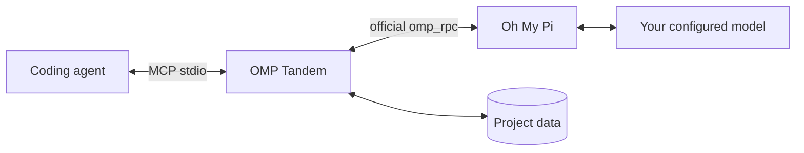

# OMP Tandem

**Независимый AI-напарник для твоего coding-агента.**

Обсуждайте решения, проектируйте, реализуйте и проводите ревью через [Oh My Pi](https://github.com/can1357/oh-my-pi), сохраняя беседы и разделяя данные проектов.

[English](README.md) · **Русский** · [简体中文](README.zh-CN.md)

[](https://github.com/Flyozzzz/omp-tandem-public/actions/workflows/ci.yml)
[](LICENSE)
[](pyproject.toml)

[Быстрый старт](#быстрый-старт) · [Jev и роутинг](#jev) · [Полное руководство](docs/guide.ru.md) · [Релизы](https://github.com/Flyozzzz/omp-tandem-public/releases) · [Участие в разработке](CONTRIBUTING.md)

## Зачем OMP Tandem?

Второй агент нужен не только для одобрения работы первого. OMP Tandem позволяет получить независимый взгляд, сравнить альтернативы, поручить отдельный участок реализации и сопоставить выводы с доказательствами.

- **Настоящий OMP, твой провайдер.** Официальный `omp_rpc` и процесс `omp --mode rpc`, а не подмена прямым вызовом API.
- **Соразмерное планирование.** Независимая оценка, одно сравнение, конкретный план, затем реализация и взаимная проверка — без нового аудита всего проекта ради каждой локальной правки.
- **Постоянные беседы.** Продолжай обсуждение с новой целью и сохранёнными базовыми ограничениями.
- **Разделённые знания.** Изоляция историй, необязательные версии правил продукта и явная передача контекста.
- **Ревью снимков и замечания.** Выбор worktree или только staged, независимая оценка до аргументов автора и история замечаний с отдельной проверкой исправлений.
- **Прозрачное выполнение.** Профили вычислений, фактическая модель, токены и стоимость с явными неизвестными значениями.
- **Надёжное получение.** Необязательный watchdog, ограниченное ожидание, квитанции обработки и диагностика текущей сессии.
- **Разные клиенты.** Плагин Claude Code, пакет Agent Plugins для Codex и обычный локальный stdio MCP.
- **Опциональный Jev.** Аудит отчётов, рекомендации скиллов и теневой роутинг моделей при старте задачи. Только с разрешением на экспорт, без автоматической приёмки или переключения модели. [Доступность и настройка](#jev).

В поставке нет правил конкретной компании и зашитых путей к проекту.

## Быстрый старт

### 1. Установи необходимые инструменты

Нужны **macOS/Linux** либо **WSL с Linux-инструментами**, а также `uv` и OMP в `PATH`.

Через Homebrew:

```sh
brew install uv
brew install can1357/tap/omp
omp setup
```

В настройке OMP войди к своему поддерживаемому провайдеру и выбери модель с поддержкой инструментов. У основного агента отдельная авторизация. Linux/standalone-установка, API-ключи, OAuth и локальные модели описаны в [руководстве](docs/guide.ru.md#install-omp-and-configure-a-provider).

### 2. Подключи плагин

**Claude Code**

```sh
claude plugin marketplace add Flyozzzz/omp-tandem-public
claude plugin install omp-tandem@omp-tandem
```

**Codex CLI**

```sh
codex plugin marketplace add Flyozzzz/omp-tandem-public
codex plugin add omp-tandem@omp-tandem --json
```

Запусти новую сессию из папки своего проекта. Не оставляй одновременно включёнными старую standalone-регистрацию и плагин. Репозиторий публичный; приглашение не требуется.

Python-зависимости готовятся автоматически в отдельном кеше. OMP и авторизацию провайдера пользователь настраивает явно. Для других клиентов есть [обычная MCP-конфигурация](docs/guide.ru.md#other-mcp-clients).

### 3. Проверь настройку именно этого проекта

В Claude вызови `/omp-tandem:setup` и попроси **только локальную диагностику**. Убедись, что Tandem привязан к твоему проекту, а не к папке плагина или кеша, и проверь среду запуска и условия доставки результатов. Такая диагностика не вызывает модель и не подтверждает авторизацию провайдера; отдельная живая проверка необязательна и требует твоего согласия.

### 4. Проверь подготовленный коммит

Добавь нужные изменения в индекс Git, затем вызови `/omp-tandem:tandem` или напиши обычным языком:

> Используй OMP Tandem для ревью подготовленного коммита — только изменений в индексе (staged). Опирайся на требования и критерии приёмки этой задачи; если их нет, спроси меня. Не редактируй файлы. Укажи риски корректности с доказательствами и недостающий контекст.

Агент использует `tandem_review_run`: сохранённый снимок индекса, одну независимую оценку и не более одного сравнения с отдельно переданными аргументами автора. Сценарий не редактирует файлы и не запускает переданные тесты. Недостающий исходный контекст требует нового расширенного снимка, а не живых файлов в старом ревью. [Подробнее о ревью](docs/guide.ru.md#first-review).

### 5. Заведи общую задачу с напарником

Если нужна реализация, а не только ревью, попроси:

> Создай через `tandem_work` общую задачу: цель, ограничения, точные файлы двух независимых модулей, критерии приёмки и заключительный шаг интеграции. Для каждого шага назначь исполнителя и другого проверяющего — `claude` или `omp`. Пусть оба участника согласуют одну версию плана. Покажи карточку с ролями, зависимостями и блокерами. Пока не разрешаю автономные запуски.

Общая карточка сохраняется между подключениями. `claim` только закрепляет шаг за текущей сессией: не запускает модель, не редактирует файлы и не выдаёт разрешений. В подключённых сессиях участники работают вручную и принимают конкретные коммиты друг друга. Чтобы работа продолжалась после закрытия клиентов, оператор отдельно разрешает ограниченный бюджет и запускает локальный контроллер; уведомление само по себе этого не делает.

[Полный пример: план, взаимная приёмка, автономный запуск, остановка и восстановление](docs/guide.ru.md#shared-tasks). Автономные worktree находятся вне рабочей копии, но **не являются песочницей**; перенос принятого результата в исходную ветку всегда явный.

## Два пути

- [Ревью индекса](docs/guide.ru.md#first-review): независимая оценка сохранённого снимка.
- [Совместная разработка и разрешения оператора](docs/guide.ru.md#shared-tasks): план, владение файлами, точные коммиты и другой проверяющий. Claim/submit требуют привязанного Git-root с HEAD; `cwd` задачи не исправляет границу. Автономные запуски требуют явного разрешения оператора. Shell — произвольное выполнение, не песочница; отчёт не равен приёмке.
- [Миграция и отключённые помощники](docs/helper-compatibility.md): миграция не перезапускает работу и не делает старое ревью независимым задним числом.

## Компактная карточка и восстановление

См. [компактные представления, runtime identity и восстановление](docs/guide.ru.md#compact-contracts), [снятие блокера оператором](docs/guide.ru.md#operator-unblock). Подсказки и уведомления не дают полномочий; снятие блокера не возобновляет и не авторизует работу. Приёмка, применение и публикация — отдельные решения.

Последний опубликованный релиз — **[3.11.0](https://github.com/Flyozzzz/omp-tandem-public/releases/tag/v3.11.0)**. Управляемый submit проверяет владение файлами до записи намерения; намерение отделено от закреплённого коммита. [Проверки супервайзера](docs/guide.ru.md#controlled-review-checks) требуют отдельного разрешения и подготовленного Linux Docker-образа, закреплённого по ID. Они выполняются на точной копии коммита внутри продуктового шага, без shell у модели-ревьюера; сеть по умолчанию отключена, успех требует подтверждённого удаления контейнера, подмены запуском на хосте нет. Старые гранты не расширяются. Обновление репозитория не перезапускает активную работу и не выдаёт новых разрешений. См. [CHANGELOG](CHANGELOG.md).

<a id="jev"></a>
## Jev: рекомендации и теневой роутинг

Jev — отдельная опциональная модель для структурированного выбора, а не замена
модели, выполняющей задачу. **Новые рекомендации и shadow-routing в ветке `main`
ещё не входят в опубликованную 3.11.0.** Проверяй возможности фактически
запущенного runtime через `tandem_scope`.

| Возможность | Назначение | Доступность |
|---|---|---|
| `tandem_audit` | Найти разрывы между критериями и описанными в отчёте доказательствами | 3.11.0 и `main` |
| `tandem_recommend` | Предложить один скилл или направление проверки из переданного списка, ещё до создания задачи | `main`, ещё не выпущен |
| `execution.routing` | Сопоставить предложение модели при старте задачи с неизменным фактическим выбором | `main`, **только shadow** |

Аудит и рекомендации поддерживают точный предпросмотр без ключа. Для отправки
нужны ключ OpenRouter и отдельное включение: `--jev-audit` или `--jev-recommend`.
Рекомендация дополнительно требует хэш одобренного предпросмотра. Совет и
уверенность модели не являются проверкой корректности или разрешением на действие.

**Теневой роутинг моделей** работает так:

1. Оператор задаёт два или три точных имени моделей в файле политики:
   `--jev-routing-policy PATH` либо `OMP_TANDEM_JEV_ROUTING_POLICY`.
2. Политика и `execution.routing` задачи отдельно разрешают экспорт короткой
   сводки. Она не извлекается автоматически из промпта, файлов или истории.
3. Код проверяет каталог, возможности, заявленные оценки контекста/ответа и
   необязательный предел оценочной стоимости. Отдельный процесс чтения метаданных
   не блокирует канал исполнения задачи при зависании каталога.
4. Jev может предложить подходящую модель, `none` или `unclear`. Исполнитель
   остаётся прежним; `tandem_result.execution.routing` показывает предложение,
   причину, время роутинга и отдельный учёт Jev.

Явный выбор модели, продолжения, snapshot-ревью и управляемые попытки обходят
роутер. Он не меняет thinking, инструменты, роли, гранты или приёмку. Обычный
сбой роутинга сохраняет исходный выбор; неопределённые отправки не повторяются.
Отсутствующий `OPENROUTER_API_KEY` явно отмечается как причина обхода.

Локальные RPC/HTTP-прогоны проверяют интеграцию и защитные границы.
**Точность живого Jev, ускорение и экономия пока не измерены.**
[Аудит](docs/guide.ru.md#mcp-tools),
[рекомендации кандидатов](docs/guide.md#optional-jev-candidate-recommendation-unreleased)
и [пример настройки shadow-routing](docs/guide.md#task-start-shadow-model-routing-unreleased).

## Изменение плана и переход в другой репозиторий

См. [переходы плана](docs/guide.ru.md#plan-transitions): доказательства остановки, checkpoint, подтверждение потери сохранённых правок и новое разрешение; [переход в другой репозиторий](docs/guide.ru.md#repository-handover): диагностика границ, явное закрытие и команды provenance.

Переходы и операторское восстановление выполняет только оператор. Supervisor teardown доказывает остановку процесса, не отсутствие внешних эффектов. Не повторяйте неопределённые эффекты. Межобластные ссылки не переносят доступ, согласования, grant или приёмку; точный результат проверяется в своей области до явного применения.

## Как это устроено



| Режим | Для чего | Доступ к проекту |
|---|---|---|
| `think` | Консультация и рассуждение по переданным данным | Без инструментов проекта и shell; инструменты сотрудничества остаются |
| `analyze` | Исследование и ревью | Чтение, поиск и веб-поиск; без правок и shell |
| `work` | Явно разрешённая реализация | Редактирование, запись, shell и связанные инструменты; **не песочница** |

Новая задача создаёт отдельную беседу. Продолжение сохраняет native-историю OMP, но заменяет текущую цель. Вопросы и промежуточные материалы делают неопределённость видимой, а не превращают отсутствие данных в предполагаемый успех.

## Доказательства, а не обещания

В нашем [реальном случае ревью](docs/case-study.md) первая попытка остановилась из-за нехватки контекста (**80,558 с полного времени**). Расширенное ревью обнаружило настоящий дефект дедлайна и отмены, но при **общем бюджете 300 с** завершилось тайм-аутом через **331,723 с полного времени**. Прицельная повторная проверка завершилась за **186,127 с** и выявила отдельный **риск блокировки общей SQLite при публикации снимка**, ещё не проверенный в исполнении в том эпизоде. Завершение не доказывает отсутствие ошибок: в разборе сохранены неудачи и оставшаяся неопределённость.

Риск блокировки публикации затем воспроизведён и исправлен до релиза; в разборе успешная проверка исполнения отделена от первоначального статического отчёта.

[Проверка совместимости](docs/compatibility.md) использует настоящий OMP и RPC SDK с закреплёнными версиями и детерминированным **локальным провайдером (localhost)** в CI — платный аккаунт не нужен. Доказательства относятся к точной проверенной комбинации, а не к широкому диапазону версий или всем провайдерам. [Документ о бенчмарке](docs/benchmark.md) содержит только протокол сравнения: **сравнительных результатов и заявления о превосходстве нет**.

## Важные границы

- Данные привязаны к **доверенной рабочей папке клиента**, а не к `cwd`, который модель передала задаче. Чужой ID не открывает историю другого проекта.
- Пакет **не изолирует файловую систему** от процессов с правами пользователя ОС. Песочница shell основного агента не ограничивает автоматически внешний процесс OMP.
- Отчёт — утверждение агента, не независимая приёмка. `completed` не доказывает `success`.
- Хуки Claude поддерживают необязательный ограниченный watchdog; не запускают задачи, не возвращают ответы OMP и не одобряют разрешения.
- Без Channels или доверенных хуков работает ограниченный polling. Подтверждённый push сам по себе не разрешает бессрочное ожидание события.
- Локальное хранение не означает офлайн-модель: контекст задач получают настроенные провайдеры.

Перед сообщением об уязвимости прочитай [политику безопасности](SECURITY.md). Не публикуй ключи, приватные беседы или runtime-базы в issues и pull requests.

## Документация

| Тема | Материал |
|---|---|
| Установка, провайдеры и клиенты | [Полное руководство](docs/guide.ru.md) |
| Запуск Claude и webhook одной короткой командой | [Настроить `claude-tandem`](docs/guide.ru.md#one-command-launch) |
| Задачи, режимы, ответы, вопросы и артефакты | [Рабочий процесс](docs/guide.ru.md#tasks-and-execution-modes) |
| Общий план, роли и автономный контроллер | [Общие задачи](docs/guide.ru.md#shared-tasks) |
| Снимки и независимое/сравнительное ревью | [Ревью снимков](docs/guide.ru.md#snapshot-reviews) |
| Профили, модель, токены и стоимость | [Настройки выполнения и учёт](docs/guide.ru.md#execution-and-accounting) |
| Подтверждение и проверка исправлений | [Жизненный цикл замечаний](docs/guide.ru.md#finding-lifecycle) |
| Обработка результата без повторных эффектов | [Квитанции обработки](docs/guide.ru.md#result-receipts) |
| Проверка проекта, модели и доставки | [Диагностика](docs/guide.ru.md#diagnostics) |
| Правила продукта и решения | [База знаний продукта](docs/guide.ru.md#product-knowledge-and-decisions) |
| Изоляция и явная передача контекста | [Пространства проектов](docs/guide.ru.md#project-isolation) |
| Все MCP-инструменты и лимиты | [Справочник API](docs/guide.ru.md#mcp-tools) |
| Jev-аудит, рекомендации и теневой роутинг моделей | [Jev и роутинг](#jev) |
| Обновления и перенос локальных данных | [Миграция истории](docs/guide.ru.md#upgrades-and-legacy-history) |
| Claude Channels, вебхуки и корпоративное подключение | [Справочник Channels](docs/channels.md) |
| Разработка и участие | [Contributing](CONTRIBUTING.md) |

Полное руководство также доступно на [английском](docs/guide.md) и [китайском](docs/guide.zh-CN.md).

## Разработка

```sh
uv sync --frozen --group dev
uv run pytest -q
uv run --frozen ruff check .
uv run --frozen ruff format --check .
uv build --wheel
```

`pytest` явно включён в dev-зависимости; `uv` устанавливает пакет проекта и `omp_rpc` в то же окружение. Тесты используют временные хранилища и локальные fault peers, а не провайдерские ключи. CI запускает pytest, Ruff, сборку wheel и проверку поставки на Linux и macOS.

Репозиторий начинается с проверенного снимка предыдущей приватной разработки. Серия **3.x** сохраняет последовательность версий, но старая Git-история не импортирована. «Legacy history» относится к локальным беседам OMP, а не к скрытым Git-коммитам.

## Лицензия

[MIT](LICENSE), copyright (c) 2026 Flyozzzz. Разрешены коммерческое использование, изменение и распространение с сохранением уведомления об авторстве и разрешении. Программа предоставляется **КАК ЕСТЬ**, без гарантий. У зависимостей свои лицензии.
