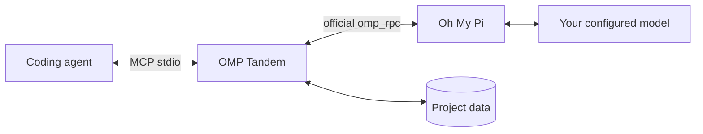

# OMP Tandem

**为你的编程智能体配备一位独立的 AI 搭档。**

通过 [Oh My Pi](https://github.com/can1357/oh-my-pi) 共同讨论、设计、实现和审查，保留对话，并隔离各项目的 MCP 数据。

[English](README.md) · [Русский](README.ru.md) · **简体中文**

[](https://github.com/Flyozzzz/omp-tandem-public/actions/workflows/ci.yml)
[](LICENSE)
[](pyproject.toml)

[快速开始](#快速开始) · [Jev 与路由](#jev) · [完整指南](docs/guide.zh-CN.md) · [发布版本](https://github.com/Flyozzzz/omp-tandem-public/releases) · [参与贡献](CONTRIBUTING.md)

## 为什么选择 OMP Tandem？

第二个智能体不应只是认可第一个智能体的工作。OMP Tandem 可以提供独立推理、比较替代方案、承担互不重叠的实现任务，并根据证据核对结论。

- **真正的 OMP，自选提供商。** 使用官方 `omp_rpc` 和 `omp --mode rpc`，而不是替代性的直接 API 包装器。
- **适度规划。** 独立评估、一次比较、明确计划，然后实现与交叉检查；不因每次局部修复重新审计整个项目。
- **持久对话。** 保留基础约束，在同一对话中更新当前目标。
- **隔离的知识。** 分离项目历史，可选用版本化产品规则，并显式共享上下文。
- **诚实的结果。** 结构化结果、带期限的问题，以及可恢复的中间产物。
- **可移植集成。** Claude Code 插件、面向 Codex 的 Agent Plugins 包，以及适用于其他宿主的本地 stdio MCP。
- **共享任务与可选自主执行。** [双方确认同一版本的计划，按文件拆分、交叉验收并最终集成](docs/guide.zh-CN.md#shared-work)；只有操作者明确授权后，本地控制器才可在客户端断开后继续运行。
- **可选择来源的快照审查。** [选择 worktree 或仅 staged，先独立判断再比较作者方案](docs/guide.zh-CN.md#snapshot-reviews)，并[追踪问题的确认与修复验证](docs/guide.zh-CN.md#finding-lifecycle)。
- **可解释的执行。** [逐轮选择计算配置，分别查看实际模型、令牌与已知费用](docs/guide.zh-CN.md#execution-and-accounting)。
- **可靠接收。** [可选看门狗与有界轮询](docs/guide.zh-CN.md#polling-channels-and-webhooks)、[结果处理凭据](docs/guide.zh-CN.md#result-receipts)和[当前客户端诊断](docs/guide.zh-CN.md#live-diagnostics)明确区分投递、处理与验证。
- **可选 Jev 辅助。** 报告审计、候选技能建议及任务启动时的影子模型路由；需明确批准导出，不自动验收或切换模型。[功能状态与配置](#jev)。

软件包不包含特定公司的规则或硬编码项目路径。

## 快速开始

### 1. 安装前置工具

需要 **macOS/Linux**，或使用 Linux 工具的 **WSL**，并确保 `uv` 和 OMP 位于 `PATH`。

使用 Homebrew：

```sh
brew install uv
brew install can1357/tap/omp
omp setup
```

在 OMP 设置中登录你自己的受支持提供商，并选择支持工具调用的模型。宿主智能体使用独立的登录。Linux／独立安装、API 密钥、OAuth 和本地模型的说明见[设置指南](docs/guide.zh-CN.md#install-omp-and-configure-a-provider)。

### 2. 为宿主安装插件

**Claude Code**

```sh
claude plugin marketplace add Flyozzzz/omp-tandem-public
claude plugin install omp-tandem@omp-tandem
```

**Codex CLI**

```sh
codex plugin marketplace add Flyozzzz/omp-tandem-public
codex plugin add omp-tandem@omp-tandem --json
```

从目标项目目录启动新会话。不要同时启用旧的独立 MCP 注册和插件。[仓库公开可访问](https://github.com/Flyozzzz/omp-tandem-public)，无需访问邀请。

Python 依赖会自动在私有缓存中准备。OMP 安装和提供商认证仍由用户明确完成。其他客户端可使用[标准 MCP 配置](docs/guide.zh-CN.md#other-mcp-clients)。

### 3. 检查当前项目的设置

在 Claude 中运行 `/omp-tandem:setup`，并要求**仅进行本地诊断**。确认 Tandem 绑定的是你的项目，而非插件或缓存目录，并检查运行环境和结果投递的前置条件。这不会调用模型，也不能证明提供商认证有效；单独的在线诊断是可选项，需要你的批准。

### 4. 审查准备提交的改动

先将要提交的改动暂存到 Git 索引，再使用 `/omp-tandem:tandem`，或直接用自然语言说明：

> 使用 OMP Tandem 审查我准备提交的改动，只检查暂存区（staged）。依据当前任务的需求和验收标准；如果缺少这些信息，请先问我。不要编辑文件。指出正确性风险并提供证据，说明还缺少哪些上下文。

智能体使用 `tandem_review_run`：保存的索引快照、一次独立只读评估，以及至多一次与单独提供的作者理由的比较。不编辑文件，也不运行提供的测试。缺少源代码上下文时，必须重新采集扩展快照，不能将实时文件加入旧审查。[审查详情](docs/guide.zh-CN.md#first-review)。

### 5. 需要共同实现时，创建共享任务

> 使用 `tandem_work` 创建共享任务。先记录目标、约束、上下文和验收标准，将独立模块分给 `claude` 和 `omp`，互为审查者，最后增加依赖所有模块的集成步骤。双方确认同一计划版本后，再领取步骤。先保持在线手动模式；不要批准自主执行、启动后台进程或自动应用结果。

`tandem_work` 是宿主与 OMP 共用的持久任务卡，不是普通对话或一次性审查的替代品。`claim` 只领取工作，不启动模型、不编辑文件；手动提交必须引用真实的完整 Git 提交哈希及证据。若要在关闭客户端后继续工作，需要用户另行批准并执行操作者 CLI 的有界授权与 `run`／`start`。在线唤醒通知不会启动已退出的客户端，机器关机时不会执行。完整的 JSON、授权、停止、异常恢复和显式应用命令见[共享任务指南](docs/guide.zh-CN.md#shared-work)。

## 两个入口

- [暂存审查](docs/guide.zh-CN.md#first-review)：独立评估保存的快照。
- [共享开发与操作者授权](docs/guide.zh-CN.md#shared-work)：计划、文件归属、精确提交和独立审查者。Claim/submit 要求绑定的 Git-root 已有 HEAD；任务 `cwd` 不能修复边界。无人值守启动需操作者明确授权。Shell 是任意执行能力，不是沙箱；报告不等于验收。
- [迁移与禁用的助手](docs/helper-compatibility.md)：迁移不会重启工作，也不会追认旧审查的独立性。

## 精简状态与恢复

参见[精简视图、运行身份与恢复](docs/guide.zh-CN.md#compact-contracts)、[操作者解除阻塞](docs/guide.zh-CN.md#operator-unblock)。提示与通知不授予权限；解除阻塞不会恢复或授权工作。验收、应用和发布是各自独立的决定。

最新已发布版本为 **[3.11.0](https://github.com/Flyozzzz/omp-tandem-public/releases/tag/v3.11.0)**。受管 submit 在记录意图前检查文件归属，明确区分提交意图与已保存的提交。[监督器审查检查](docs/guide.zh-CN.md#controlled-review-checks) 需要单独授权及预先准备、绑定不可变 ID 的 Linux Docker 镜像，在同一产品步骤的精确提交副本上执行，不向审查模型授予 shell。网络默认关闭，成功要求确认容器已删除，不回退到主机执行。旧授权不会升级；更新仓库不会重启活跃工作或授予新权限。详见[变更日志](CHANGELOG.md)。

<a id="jev"></a>
## Jev：建议与影子模型路由

Jev 是可选的结构化决策模型，不替代实际执行任务的模型。
**`main` 分支中的候选建议和 shadow-routing 尚未包含在已发布的 3.11.0 中。**
请通过 `tandem_scope` 检查实际加载 runtime 的能力。

| 功能 | 用途 | 可用状态 |
|---|---|---|
| `tandem_audit` | 查找验收条件与报告证据之间的缺口 | 3.11.0 与 `main` |
| `tandem_recommend` | 在创建任务前，从明确提供的列表建议一个技能或审查方向 | `main`，未发布 |
| `execution.routing` | 将任务启动时的模型建议与保持不变的实际模型对照 | `main`，**仅影子模式** |

审计和候选建议支持无需密钥的精确预览。发送需要 OpenRouter 密钥及独立启用：
`--jev-audit` 或 `--jev-recommend`；候选建议发送还必须携带获批预览的匹配哈希。
建议与模型置信度不是正确性验证，也不授予操作权限。

**影子模型路由流程：**

1. 操作者在策略文件中指定两个或三个精确模型，通过
   `--jev-routing-policy PATH` 或 `OMP_TANDEM_JEV_ROUTING_POLICY` 加载。
2. 策略与任务的 `execution.routing` 分别批准导出简短摘要；
   不从完整提示、文件或历史自动生成摘要。
3. 代码检查目录、能力、声明的上下文/输出估计和可选的估计费用上限。
   独立元数据进程将目录停滞与任务执行通道隔离。
4. Jev 可以建议一个合格模型、`none` 或 `unclear`。实际模型保持不变；
   `tandem_result.execution.routing` 显示建议、原因、路由耗时及单独的 Jev 用量。

显式模型选择、续接、快照审查和受管尝试均绕过路由。
它不改变 thinking、工具、角色、grant 或验收。普通路由故障保留原选择；
不确定的发送不会重放。缺少 `OPENROUTER_API_KEY` 会明确记录为绕过原因。

本地 RPC/HTTP 检查验证集成及安全边界。
**真实 Jev 的推荐准确率、速度提升和费用节省尚未测量。**
参见[审计说明](docs/guide.zh-CN.md#mcp-tools)、
[候选建议](docs/guide.md#optional-jev-candidate-recommendation-unreleased)和
[影子路由配置示例](docs/guide.md#task-start-shadow-model-routing-unreleased)。

## 计划变更与仓库交接

参见[计划转换](docs/guide.zh-CN.md#plan-transitions)：停止证据、保存 checkpoint、捕获失败确认和重新授权；[仓库交接](docs/guide.zh-CN.md#repository-handover)：边界诊断、显式关闭与来源记录命令。

只有操作者执行转换与操作者恢复。Supervisor teardown 证明进程停止，不证明没有外部副作用。不要重放不确定的副作用。跨作用域链接不转移访问权、共识、grant 或验收；必须在结果所属作用域审查精确提交，再显式应用。

## 工作原理



| 模式 | 用途 | 项目访问 |
|---|---|---|
| `think` | 根据已提供上下文进行咨询和推理 | 无项目或 shell 工具；保留协作工具 |
| `analyze` | 调查和审查 | 读取、搜索、网页搜索；无编辑或 shell |
| `work` | 经明确授权的实现 | 编辑、写入、shell 及相关工具；**不是沙箱** |

新任务创建独立对话。后续轮次保留 OMP 原生历史，但替换当前目标。问题和中间产物让不确定性保持可见，而不是把缺少信息当作成功。

## 证据，而非承诺

在我们的[真实审查案例](docs/case-study.md)中，首次尝试因缺少上下文而受阻，**墙钟耗时 80.558 秒**。扩展上下文后的审查发现了真实的截止时间／取消缺陷，但在 **300 秒总预算**下，直到**墙钟耗时 331.723 秒**才以超时结束。针对性复查在**墙钟耗时 186.127 秒**后完成，却又指出了另一项**共享 SQLite 快照发布锁风险**；该风险在那次运行中尚未得到运行时验证。完成不等于没有缺陷，案例保留了失败和剩余的不确定性。

发布锁风险随后已被复现并在发布前修复；案例将通过的运行时验证与原始静态报告分开记录。

[兼容性检查](docs/compatibility.md)在 CI 中使用固定版本的真实 OMP 二进制及 RPC SDK，配合确定性的 **localhost 提供商**，无需付费账户。证据仅适用于实际测试的精确组合，不代表支持宽泛版本范围或所有提供商。[基准文档](docs/benchmark.md)仅提供比较实验协议：**没有比较结果，也不声称 Tandem 更优**。

## 重要边界

- 项目数据绑定到**客户端提供的可信工作区信息**，而不是模型在任务中传入的 `cwd`。其他项目的 ID 不会开放其历史。
- 软件包**不会对具有你操作系统权限的进程实施文件系统沙箱**。宿主的 shell 沙箱设置不会自动限制外部 OMP 进程。
- 报告是智能体的声明，而非独立验收。`completed` 不代表已证明 `success`。
- Claude 钩子提供前置工具诊断和可选的有界看门狗；不会安装工具、读取凭据、批准权限、启动任务或返回任务答案。
- 轮询不依赖 Channels 或钩子。推送确认本身不足以无限等待事件；只有当前有效的独立看门狗已就绪时才使用 `await_event`，否则使用有界等待。
- 本地存储不等于离线推理：已配置的提供商会收到任务上下文。

报告漏洞前请阅读[安全政策](SECURITY.md)。不要在 issues 或 pull requests 中包含凭据、私有对话或运行时数据库。

## 文档

| 主题 | 参考 |
|---|---|
| 安装、提供商和客户端 | [完整指南](docs/guide.zh-CN.md) |
| 用一条简短命令启动 Claude 和 Webhook | [设置 `claude-tandem`](docs/guide.zh-CN.md#one-command-launch) |
| 任务、模式、结果、问题和产物 | [任务流程](docs/guide.zh-CN.md#tasks-and-execution-modes) |
| 共享计划、交叉验收与自主控制器 | [共享任务与自主执行](docs/guide.zh-CN.md#shared-work) |
| 产品规则和决策 | [产品知识](docs/guide.zh-CN.md#product-knowledge-and-decisions) |
| 工作区隔离和显式共享 | [项目隔离](docs/guide.zh-CN.md#project-isolation) |
| 全部 MCP 工具和限制 | [API 参考](docs/guide.zh-CN.md#mcp-tools) |
| Jev 审计、候选建议与影子模型路由 | [Jev 与路由](#jev) |
| 本地数据升级和迁移 | [升级与旧历史](docs/guide.zh-CN.md#upgrades-and-legacy-history) |
| Claude Channels、Webhook 协议和受管部署 | [Channels 参考](docs/channels.md) |
| 开发与贡献 | [贡献指南](CONTRIBUTING.md) |

完整指南还提供[英文](docs/guide.md)和[俄文](docs/guide.ru.md)版本。

## 开发

```sh
uv sync --frozen --group dev
uv run pytest -q
uv run --frozen ruff check .
uv run --frozen ruff format --check .
uv build --wheel
```

`pytest` 是明确声明的开发依赖；`uv` 会将项目包和 `omp_rpc` 安装到同一环境。测试使用临时存储和本地故障模拟 peer，不需要提供商凭据。CI 在 Linux 和 macOS 上执行 pytest、Ruff、wheel 构建及分发校验。

本仓库从经过审查的早期私有开发快照开始。**3.x** 系列延续版本顺序，但不导入旧 Git 历史。“Legacy history”指本地 OMP 对话数据，而不是隐藏的 Git 提交。

## 许可证

[MIT](LICENSE)，copyright (c) 2026 Flyozzzz。允许商业使用、修改和再分发，但必须保留版权及许可声明。软件按**原样**提供，不附带担保。依赖项保留各自的许可证。
