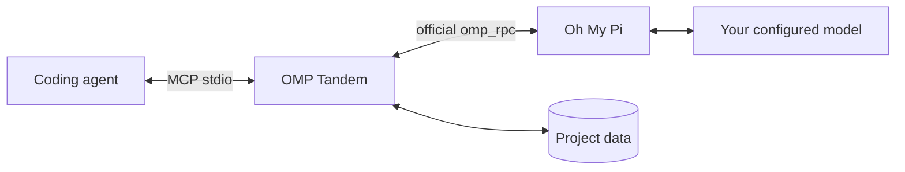

# OMP Tandem

**为你的编程智能体配备一位独立的 AI 搭档。**

通过 [Oh My Pi](https://github.com/can1357/oh-my-pi) 共同讨论、设计、实现和审查，保留对话，并隔离各项目的 MCP 数据。

[English](README.md) · [Русский](README.ru.md) · **简体中文**

[](https://github.com/Flyozzzz/omp-tandem-public/actions/workflows/ci.yml)
[](LICENSE)
[](pyproject.toml)

[快速开始](#快速开始) · [完整指南](docs/guide.zh-CN.md) · [发布版本](https://github.com/Flyozzzz/omp-tandem-public/releases) · [参与贡献](CONTRIBUTING.md)

## 为什么选择 OMP Tandem？

第二个智能体不应只是认可第一个智能体的工作。OMP Tandem 可以提供独立推理、比较替代方案、承担互不重叠的实现任务，并根据证据核对结论。

- **真正的 OMP，自选提供商。** 使用官方 `omp_rpc` 和 `omp --mode rpc`，而不是替代性的直接 API 包装器。
- **先规划再开发。** 对非机械开发先获取协作者的独立判断、明确共同计划，再实现与交叉检查；机械修改或未变的用户批准计划可简化。
- **持久对话。** 保留基础约束，在同一对话中更新当前目标。
- **隔离的知识。** 分离项目历史，可选用版本化产品规则，并显式共享上下文。
- **诚实的结果。** 结构化结果、带期限的问题，以及可恢复的中间产物。
- **可移植集成。** Claude Code 插件、面向 Codex 的 Agent Plugins 包，以及适用于其他宿主的本地 stdio MCP。
- **可选择来源的快照审查。** [选择 worktree 或仅 staged，先独立判断再比较作者方案](docs/guide.zh-CN.md#snapshot-reviews)，并[追踪问题的确认与修复验证](docs/guide.zh-CN.md#finding-lifecycle)。
- **可解释的执行。** [逐轮选择计算配置，分别查看实际模型、令牌与已知费用](docs/guide.zh-CN.md#execution-and-accounting)。
- **可靠接收。** [可选看门狗与有界轮询](docs/guide.zh-CN.md#polling-channels-and-webhooks)、[结果处理凭据](docs/guide.zh-CN.md#result-receipts)和[当前客户端诊断](docs/guide.zh-CN.md#live-diagnostics)明确区分投递、处理与验证。

软件包不包含特定公司的规则或硬编码项目路径。

## 快速开始

### 1. 安装前置工具

需要 **macOS/Linux**，或使用 Linux 工具的 **WSL**，并确保 `uv` 和 OMP 位于 `PATH`。

使用 Homebrew：

```sh
brew install uv
brew install can1357/tap/omp
omp setup
```

在 OMP 设置中登录你自己的受支持提供商，并选择支持工具调用的模型。宿主智能体使用独立的登录。Linux／独立安装、API 密钥、OAuth 和本地模型的说明见[设置指南](docs/guide.zh-CN.md#install-omp-and-configure-a-provider)。

### 2. 为宿主安装插件

**Claude Code**

```sh
claude plugin marketplace add Flyozzzz/omp-tandem-public
claude plugin install omp-tandem@omp-tandem
```

**Codex CLI**

```sh
codex plugin marketplace add Flyozzzz/omp-tandem-public
codex plugin add omp-tandem@omp-tandem --json
```

从目标项目目录启动新会话。不要同时启用旧的独立 MCP 注册和插件。[仓库公开可访问](https://github.com/Flyozzzz/omp-tandem-public)，无需访问邀请。

Python 依赖会自动在私有缓存中准备。OMP 安装和提供商认证仍由用户明确完成。其他客户端可使用[标准 MCP 配置](docs/guide.zh-CN.md#other-mcp-clients)。

### 3. 开始协作

> 使用 OMP Tandem。先检查 `tandem_scope`。请 OMP 独立质疑这个设计，同时你检查 API 约束。等待回答、比较证据，并说明仍未解决的分歧。

Claude 提供 `/omp-tandem:tandem` 和 `/omp-tandem:setup`。不同客户端的前缀可能不同，但 MCP 工具后缀始终为 `tandem_*`。

## 工作原理



| 模式 | 用途 | 项目访问 |
|---|---|---|
| `think` | 根据已提供上下文进行咨询和推理 | 无项目或 shell 工具；保留协作工具 |
| `analyze` | 调查和审查 | 读取、搜索、网页搜索；无编辑或 shell |
| `work` | 经明确授权的实现 | 编辑、写入、shell 及相关工具；**不是沙箱** |

新任务创建独立对话。后续轮次保留 OMP 原生历史，但替换当前目标。问题和中间产物让不确定性保持可见，而不是把缺少信息当作成功。

## 重要边界

- 项目数据绑定到**客户端提供的可信工作区信息**，而不是模型在任务中传入的 `cwd`。其他项目的 ID 不会开放其历史。
- 软件包**不会对具有你操作系统权限的进程实施文件系统沙箱**。宿主的 shell 沙箱设置不会自动限制外部 OMP 进程。
- 报告是智能体的声明，而非独立验收。`completed` 不代表已证明 `success`。
- Claude 钩子提供前置工具诊断和可选的有界看门狗；不会安装工具、读取凭据、批准权限、启动任务或返回任务答案。
- 轮询不依赖 Channels 或钩子。推送确认本身不足以无限等待事件；只有当前有效的独立看门狗已就绪时才使用 `await_event`，否则使用有界等待。
- 本地存储不等于离线推理：已配置的提供商会收到任务上下文。

报告漏洞前请阅读[安全政策](SECURITY.md)。不要在 issues 或 pull requests 中包含凭据、私有对话或运行时数据库。

## 文档

| 主题 | 参考 |
|---|---|
| 安装、提供商和客户端 | [完整指南](docs/guide.zh-CN.md) |
| 用一条简短命令启动 Claude 和 Webhook | [设置 `claude-tandem`](docs/guide.zh-CN.md#one-command-launch) |
| 任务、模式、结果、问题和产物 | [任务流程](docs/guide.zh-CN.md#tasks-and-execution-modes) |
| 产品规则和决策 | [产品知识](docs/guide.zh-CN.md#product-knowledge-and-decisions) |
| 工作区隔离和显式共享 | [项目隔离](docs/guide.zh-CN.md#project-isolation) |
| 全部 MCP 工具和限制 | [API 参考](docs/guide.zh-CN.md#mcp-tools) |
| 本地数据升级和迁移 | [升级与旧历史](docs/guide.zh-CN.md#upgrades-and-legacy-history) |
| Claude Channels、Webhook 协议和受管部署 | [Channels 参考](docs/channels.md) |
| 开发与贡献 | [贡献指南](CONTRIBUTING.md) |

完整指南还提供[英文](docs/guide.md)和[俄文](docs/guide.ru.md)版本。

## 开发

```sh
uv sync --frozen --group dev
uv run pytest -q
uv run --frozen ruff check .
uv run --frozen ruff format --check .
uv build --wheel
```

`pytest` 是明确声明的开发依赖；`uv` 会将项目包和 `omp_rpc` 安装到同一环境。测试使用临时存储和本地故障模拟 peer，不需要提供商凭据。CI 在 Linux 和 macOS 上执行 pytest、Ruff、wheel 构建及分发校验。

本仓库从经过审查的早期私有开发快照开始。**3.x** 系列延续版本顺序，但不导入旧 Git 历史。“Legacy history”指本地 OMP 对话数据，而不是隐藏的 Git 提交。

## 许可证

[MIT](LICENSE)，copyright (c) 2026 Flyozzzz。允许商业使用、修改和再分发，但必须保留版权及许可声明。软件按**原样**提供，不附带担保。依赖项保留各自的许可证。
