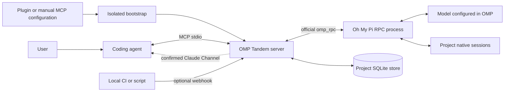

# OMP Tandem — Reference guide

[Project overview](../README.md)

**English** · [Русский](guide.ru.md) · [简体中文](guide.zh-CN.md)

**An independent AI peer for your coding agent: consult, design, implement, and review together through Oh My Pi.**

OMP Tandem packages a local MCP bridge as a Claude Code plugin and a portable Agent Plugins package for Codex and compatible hosts. Other local MCP clients can use the same server without plugin support.

**Version: 3.0.1** · [MIT License](../LICENSE) · [Releases](https://github.com/Flyozzzz/omp-tandem-public/releases) · [Channels and webhooks](channels.md) · [Oh My Pi](https://github.com/can1357/oh-my-pi)

There are no built-in rules for a particular company, repository, or product. You supply product knowledge when needed. Project isolation is a generic data boundary, not a hardcoded project association.

This repository starts from a reviewed snapshot of earlier private development; its version numbers preserve that lineage. “Legacy history” means migration of local OMP conversation data, not imported Git commits. The new repository does not include the old Git history.

[Contributing](../CONTRIBUTING.md) · [Security policy](../SECURITY.md) · [Continuous integration](https://github.com/Flyozzzz/omp-tandem-public/actions)

> OMP Tandem launches the real `omp --mode rpc` process using the official `omp_rpc` Python client. It does not replace OMP with direct OpenAI API calls. Configure a supported provider in OMP; the host coding agent has its own independent authentication. Local storage does not mean offline inference: task context is sent to the configured model providers.

## Contents

- [What it does](#what-it-does)
- [Architecture](#architecture)
- [Requirements](#requirements)
- [Install OMP and configure a provider](#install-omp-and-configure-a-provider)
- [Install the plugin](#install-the-plugin)
- [Other MCP clients](#other-mcp-clients)
- [Automatic runtime preparation](#automatic-runtime-preparation)
- [Hooks and skills](#hooks-and-skills)
- [Working with a peer](#working-with-a-peer)
- [Tasks and execution modes](#tasks-and-execution-modes)
- [Product knowledge and decisions](#product-knowledge-and-decisions)
- [Project isolation](#project-isolation)
- [Explicit context sharing](#explicit-context-sharing)
- [MCP tools](#mcp-tools)
- [Results, questions, and artifacts](#results-questions-and-artifacts)
- [Polling, Channels, and webhooks](#polling-channels-and-webhooks)
- [Configuration and limits](#configuration-and-limits)
- [Upgrades and legacy history](#upgrades-and-legacy-history)
- [Security and limitations](#security-and-limitations)
- [Troubleshooting](#troubleshooting)
- [Repository layout](#repository-layout)
- [Development and verification](#development-and-verification)
- [Distribution and licensing](#distribution-and-licensing)

## What it does

A second agent is useful before implementation, not only after it. OMP can challenge assumptions, compare alternatives, take ownership of a separate implementation slice, or review a change against product requirements. The coordinator is not automatically right; neither is its peer.

| Capability | Purpose |
|---|---|
| Reciprocal collaboration | Consultation, independent reasoning, design, implementation, and review |
| Asynchronous tasks | Launch work and continue with a complementary task |
| Native conversation history | Continue an existing OMP conversation without silently opening a different chat |
| Per-turn goals | Replace the current objective instead of repeating an entire earlier audit |
| Structured contracts | Specify constraints, file ownership, context, and acceptance criteria |
| Versioned product snapshots | Preserve sourced rules, examples, and accepted/rejected decisions |
| Questions with deadlines | Ask the coordinator rather than inventing an unresolved decision |
| Immutable artifacts | Share reports and evidence with versioned IDs and SHA-256 digests |
| Provisional results | Recover useful materials even when a final report is missing |
| Group waiting | Wait for any selected task to finish or ask a question |
| Project isolation | Separate task, history, artifact, product, and event stores |
| Explicit context transfer | Share only a selected snapshot and its referenced evidence |
| Optional push delivery | Claude Code Channels plus a protected localhost webhook |
| Copy-only migration | Preserve old results and native sessions without deleting their originals |

## Architecture



1. The host loads the plugin or starts the configured stdio command.
2. The bootstrap prepares a locked, non-editable Python environment outside the plugin code directory.
3. The MCP server obtains a trusted workspace from the client before opening project data. It never uses a model-supplied task `cwd` to choose a namespace.
4. A task acquires a shared worker slot and starts an OMP process with its current goal, persistent policy, and optional product snapshot.
5. OMP can ask questions, publish evidence, and submit a structured final report through host tools.
6. The coordinator reads the actual answer and independently assesses important claims.

Completion uses request acknowledgment and terminal `agent_end` events, not a scan for the beginning of a request in retained event history.

## Requirements

- **macOS or Linux**, or **WSL** with Linux-installed tools. The bridge uses POSIX locking; native Windows is not supported.
- **[uv](https://docs.astral.sh/uv/getting-started/installation/)** on `PATH`. It selects/downloads Python 3.12+ and prepares dependencies.
- **[Oh My Pi](https://github.com/can1357/oh-my-pi)** on `PATH`, with a supported provider and model configured.
- A configured host such as **[Claude Code](https://code.claude.com/docs/en/quickstart)** or **[Codex CLI](https://developers.openai.com/codex/cli)**.
- Network access for first-time dependency downloads and the selected remote model providers.

Plugin installation registers the bundled MCP server automatically. It does **not** silently install OMP, authenticate providers, copy credentials, or bypass organization policy. Install `uv` and OMP once; Python application dependencies are prepared automatically.

| Host | Integration | Workspace source |
|---|---|---|
| Claude Code | Native plugin or manual stdio MCP | `CLAUDE_PROJECT_DIR`; explicit operator override also supported |
| Codex CLI | Portable Agent Plugins package or manual stdio MCP | Client-generated `codex/sandbox-state-meta.sandboxCwd` request metadata; supported by Codex 0.145.0 |
| Codex IDE integration | Manual MCP configuration where supported; plugin availability differs by surface | Same client metadata mechanism when emitted |
| Other local MCP hosts | Manual stdio configuration; portable plugin if the host supports it | One unambiguous client root or an explicit operator project root; ordinary non-plugin launch cwd is also supported |
| Web-only ChatGPT/mobile | Local processes are not deployed by installing a package | Requires a suitable local execution host or a separately designed remote integration |

A local GitHub marketplace is not the same as acceptance into a vendor's public plugin directory. In particular, a local stdio server is not automatically a public HTTPS MCP service.

## Install OMP and configure a provider

### Install the prerequisites

On a machine using Homebrew:

```sh
brew install uv
brew install can1357/tap/omp
```

Official standalone installers for macOS/Linux:

```sh
curl -LsSf https://astral.sh/uv/install.sh | sh
curl -fsSL https://omp.sh/install | sh
```

These commands execute scripts from the official distribution endpoints. Review them or use an approved package manager if your organization requires it. OMP Tandem does not execute them from a hook.

If you already use a supported Bun version, OMP also documents:

```sh
bun install -g @oh-my-pi/pi-coding-agent
```

Follow the [current OMP installation instructions](https://github.com/can1357/oh-my-pi#install) for platform details and Bun requirements. Reopen your terminal if the installer changed `PATH`.

### Configure your own provider

Start OMP's setup flow:

```sh
omp setup
```

Or open an OMP session:

```sh
omp
```

Inside OMP, use `/login` for supported account-based authentication and `/model` to select the default model. For API-key providers, follow OMP's provider-specific setup or environment-variable instructions. Do not put keys in the plugin manifest, a product snapshot, a repository, or chat examples.

OMP supports multiple hosted providers and local/OpenAI-compatible backends. Use a model that supports the tool-calling workflow and can follow the required reporting contract. “Any provider” means a provider supported by OMP, not a guarantee that every arbitrary model will reliably complete agentic tasks.

For a custom backend, use OMP's `~/.omp/agent/models.yml` configuration and select that provider/model through `omp setup` or `/model`. See the [provider reference](https://omp.sh/docs/providers). The bridge inherits OMP's model choice unless explicitly overridden.

Before using the plugin, make one harmless request directly in OMP. This verifies real provider access; executable discovery alone does not verify authentication. Configuring OMP does not log you into Claude Code or Codex.

## Install the plugin

During private development, you need repository access. If access is granted by invitation, accept it first and authenticate your Git client. The installer never switches GitHub accounts for you.

### Claude Code

```sh
claude plugin marketplace add Flyozzzz/omp-tandem-public
claude plugin install omp-tandem@omp-tandem
```

Start a new Claude session from the intended project directory. If the client requests `/reload-plugins`, follow that instruction after active delegated work has finished.

Ask:

> Use OMP Tandem. Call `tandem_scope` and report the bound project, then ask OMP for an independent `think`-mode perspective on my proposal. Wait for the answer and assess it rather than treating it as automatically correct.

The shared workflow skill is available as `/omp-tandem:tandem`; the setup skill as `/omp-tandem:setup`. Client-visible MCP tool names include a plugin prefix, but the tool suffixes remain `tandem_*`.

### Codex CLI

```sh
codex plugin marketplace add Flyozzzz/omp-tandem-public
codex plugin add omp-tandem@omp-tandem --json
```

Start a new Codex session in the intended project. Use `/plugins` to inspect the installation. Ask it to use OMP Tandem and call `tandem_scope` before delegating.

Codex requires explicit trust review for non-managed hooks; inspect them with `/hooks`. The MCP server works without the optional diagnostic hook, so no hook-trust bypass is needed.

### Local development or a checked-out copy

```sh
TANDEM_ROOT=/absolute/path/to/omp-tandem
claude plugin marketplace add "$TANDEM_ROOT"
codex plugin marketplace add "$TANDEM_ROOT"
```

Install the plugin through the respective client after adding the local marketplace. Both marketplace catalogs point at the self-contained repository root. Do not reference files outside the plugin directory: hosts may copy it to a versioned cache.

**Avoid duplicate registrations.** If you already installed the standalone MCP, finish its tasks and remove/disable the old registration explicitly before switching to the plugin. The setup helper does not silently overwrite an existing entry. A manual registration can take precedence over a plugin server in Codex.

## Other MCP clients

Plugin support is optional. Configure a local stdio MCP server using the same launcher. Substitute a real, absolute package path:

```json
{
  "mcpServers": {
    "omp-tandem": {
      "command": "uv",
      "args": [
        "run", "--no-project", "--python", ">=3.12",
        "python", "-I", "/absolute/path/to/omp-tandem/server.py"
      ]
    }
  }
}
```

The host must supply a trustworthy workspace. If it cannot, add `--project-root` and the intended project's absolute path to the server arguments **in that project's client configuration**, not one hardcoded global configuration shared by unrelated projects.

The standalone helper can prepare the runtime and return an exact configuration plan without changing client settings:

```sh
uv run --no-project --python '>=3.12' python -I \
  "$TANDEM_ROOT/scripts/install.py" --client none --json
```

For standalone registration, select `--client claude` or `--client codex`. Claude supports `--scope user` and `--scope local`; the helper's Codex registration supports user scope only. Project-local Codex TOML configuration can be maintained explicitly by the operator. Use `--check` for prerequisites only, or `--no-register` to prepare without registration.

Client configuration formats and approval controls differ. Standard MCP support does not imply support for Claude Channels, plugin skills, hooks, or a local process inside a web-only client.

## Automatic runtime preparation

The canonical launcher uses isolated Python:

```sh
uv run --no-project --python '>=3.12' python -I "$TANDEM_ROOT/server.py"
```

`--no-project` prevents the host project's Python configuration from being treated as the launch environment. `-I` prevents cwd/PYTHONPATH modules from replacing bootstrap or runtime imports; it is **not** an OS sandbox. The actual working directory and provider environment remain available to the launched application.

On first use, the bootstrap:

1. Computes an identity from source/resource bytes, dependency/build metadata, relevant ignore files, and the selected interpreter.
2. Acquires a per-identity lock so concurrent starts do not publish partial environments.
3. Installs frozen dependencies and a non-editable package into a fresh private generation.
4. Checks that the prepared interpreter can import the runtime.
5. Publishes an atomic ready marker only after success.
6. Executes `python -I -m omp_tandem`, with MCP stdout reserved for protocol traffic.

A failed preparation does not mark the environment ready. New or repaired generations do not overwrite an older running environment. Dependency logs go to stderr.

Caches live under `PLUGIN_DATA` or `CLAUDE_PLUGIN_DATA`, or otherwise `~/.cache/omp-tandem/runtimes`. They are separate from project histories. A client may remove plugin dependency data on uninstall; the default project state directory is not stored there.

Useful commands:

```sh
uv run --no-project --python '>=3.12' python -I "$TANDEM_ROOT/server.py" --doctor
uv run --no-project --python '>=3.12' python -I "$TANDEM_ROOT/server.py" --prepare
```

`--doctor` does not install application dependencies, read credentials, or verify a provider login. The outer `uv` invocation may still acquire Python. `--prepare` performs the real installation and returns the interpreter path as JSON.

Cold downloads can exceed a client's startup timeout. Prewarm or reconnect after resolving the setup error; do not mistake “MCP configured” for a ready worker. A manual preparation outside the client may use a different cache: use the same client-provided data directory when warming that client's plugin runtime.

## Hooks and skills

The plugin deliberately ships **one kind of hook: a lightweight `SessionStart` diagnostic**.

- Checks only whether `uv` and `omp` are available on `PATH`.
- Is silent when both are present.
- Emits bounded setup guidance when a prerequisite is missing.
- Ignores hook payloads instead of copying prompts or paths into output.
- Does not install packages, call a model, read authentication, poll tasks, cancel work, or approve permissions.

There are no `Stop`, `SessionEnd`, or permission-approval hooks. Task waiting, cancellation, and durable events already belong to the bridge; duplicating them in hooks could interfere with other sessions. Missing or untrusted hooks do not disable the core MCP workflow.

The shared skills provide:

- **`tandem`**: reciprocal consultation/design/implementation/review, scoped delegation, questions, reports, and explicit sharing.
- **`setup`**: prerequisite installation with user consent, runtime preparation, provider configuration, and client-specific connection guidance.

## Working with a peer

Good requests split complementary work rather than duplicating it:

> Ask OMP to independently challenge this design and compare alternatives. While it works, inspect our API constraints. Then compare the evidence and explain remaining disagreements.

> Divide this implementation into non-overlapping files. Assign one slice to OMP in `work` mode with acceptance criteria. Integrate the changes and cross-check the important behavior in both directions.

> Review this change against the pinned product rules. If a security improvement breaks a required user scenario, explain the conflict and propose alternatives instead of silently deleting that scenario.

> Continue the same conversation, but discuss only the proposed fix. Do not repeat the entire earlier audit or inherit its old acceptance checklist as the new goal.

User-confirmed observations are distinct from peer hypotheses. Do not rerun an already confirmed experiment merely to reconfirm the user; investigate new claims or changed code. Neither participant is a rubber stamp.

## Tasks and execution modes

| Mode | OMP tools | Typical use |
|---|---|---|
| `think` | No project/shell tools; collaboration host tools remain available | Consultation and reasoning over supplied context |
| `analyze` | Read/search/glob/web search; no shell, editing, or LSP | Investigation and review; default mode |
| `work` | Analysis plus edit/write/bash/LSP/todo | Explicitly authorized implementation and verification |

`work` permits unattended execution and is not a sandbox. Per-tool deny policies still apply. File ownership declarations prevent overlapping assignments within a project store, not all possible filesystem access.

Provide **exactly one** of `prompt` and `contract`. Example `tandem_start` arguments; replace paths and file names with your own:

```json
{
  "cwd": "/absolute/project",
  "mode": "work",
  "contract": {
    "goal": "Fix repeated upload handling",
    "context": "The cause is established; investigate the proposed fix, not the entire system again",
    "scope": {"owned_files": ["src/upload.py"]},
    "constraints": ["Keep the public API", "Preserve concurrent changes"],
    "acceptance": ["Repeated uploads behave correctly", "The existing successful flow is preserved"]
  },
  "timeout_seconds": 1800,
  "question_timeout_seconds": 300
}
```

Owned files are explicit relative paths inside `cwd`, without globs or traversal. Do not declare ownership you have not actually agreed on.

A new `tandem_start` creates a new conversation. A `tandem_continue` creates a new task/turn in the existing conversation. Mode, cwd, and base `WorkPolicy` persist; a new `TurnContract` replaces goal/context/acceptance and supplies turn-only constraints. It cannot change file ownership or expand the base policy.

## Product knowledge and decisions

`tandem_project_context` publishes immutable snapshots of a product's summary, components, rules, examples, sources, and decisions. No snapshot is automatically invented from the repository name.

Example publication, using **fictional teaching data**, not rules for your actual product:

```json
{
  "action": "publish",
  "context": {
    "project_id": "example-product",
    "product_summary": "A sample product with an automatic normal upload flow",
    "components": ["upload"],
    "rules": [{
      "id": "UX-01",
      "text": "Normal uploads do not require an extra manual confirmation",
      "requirement": "required",
      "applies_to": ["upload"],
      "source": "Teaching example; replace with a confirmed source",
      "positive_examples": ["The authorized flow completes automatically"],
      "negative_examples": ["Every ordinary upload requires manual approval"]
    }],
    "decisions": [{
      "id": "D-01",
      "text": "Use a substring match as a path ownership boundary",
      "status": "rejected",
      "source": "Teaching example of a rejected proposal"
    }]
  }
}
```

- Rules are `required` or `advisory`; each rule/decision needs a source.
- Decision statuses: `accepted`, `rejected`, `deferred`, `superseded`.
- `supersedes` references another decision in the snapshot; cycles are rejected.
- Rule/decision IDs are unique within the snapshot.
- Source URLs are not fetched automatically and do not prove the claims written beside them.

Pass the returned `context_id` as `project_context_id` when starting work. Updating an existing `project_id` requires its current `expected_revision`, preventing silent author conflicts.

Publishing does not update running tasks. A follow-up inherits its exact snapshot unless explicitly changed to another revision of the same product. Changing products requires a new conversation.

OMP receives the full selected snapshot and can propose changes, but does not receive a publication host tool. Reports can cite known rules through `rule_references` and decisions through `decision_references`. Unknown IDs are rejected; a valid reference still does not prove the conclusion.

## Project isolation

The namespace is a hash of the canonical project root, not the plugin installation path, model choice, Git branch, or product name.

- Different project roots have separate tasks, conversations, artifacts, snapshots, and event queues.
- Multiple coordinators in the same root may deliberately collaborate through the shared project store.
- A new task's `cwd` never chooses or switches the history namespace.
- Foreign IDs cannot read, reply to, cancel, continue, or recover another namespace's data.
- The same `project_id` can exist independently in different namespaces.

### Trusted client binding

An explicit operator `--project-root` is authoritative. Otherwise:

- **Claude Code:** uses its exported `CLAUDE_PROJECT_DIR`.
- **Codex:** the server advertises `codex/sandbox-state-meta`; it lazily binds from the first tool request's client-generated `sandboxCwd` file URI. Later missing or changed roots are rejected rather than rebinding an existing connection.
- **Other hosts:** one unambiguous `roots/list` root is supported. Multiple unlabelled roots require an explicit operator root. Non-plugin launches can use their original cwd.
- **Unknown plugin workspace:** fails closed. Portable plugin processes normally start in the plugin directory; that directory is never guessed to be the user's project.

`tools/list` can be served without opening an unknown project's database. Call `tandem_scope` to inspect `project_root`, `scope_id`, and `root_source`.

Claude's additional directory grants are re-read through `roots/list` before each new turn. Codex's sandbox metadata is used for identity, not reimplemented as an OS permission engine. An additional filesystem grant does not open a different project's history. If the client changes the working root of an already bound connection, reconnect for the intended project or configure a deliberate stable operator root.

Do not launch both windows from the same broad parent folder if you expect nested repositories to be isolated. Do not put one fixed project's `--project-root` in a global registration used by unrelated projects.

Default data layout:

```text
~/.local/state/omp-tandem/
  projects/<scope_id>/
    scope.json
    tasks.sqlite3
    sessions/
    channels/
  worker-slots/
  transfers/
```

Data is local to the host/user by default. Git does not synchronize runtime history. A different root path/worktree has a different namespace; the bridge does not guess that a moved folder should inherit another namespace.

## Explicit context sharing

To share selected product knowledge from A to B:

1. In A, call `tandem_export_context(context_id, target_project_root)` using B's actual root.
2. Give the resulting `transfer_id` to B only when the user intends that sharing.
3. In B, call `tandem_import_context(transfer_id, expected_revision)`.
4. Use the new local `context_id` for B's tasks.

Only the selected snapshot and directly referenced evidence are transferred. Tasks, conversations, questions, and events are not. Context/evidence IDs are regenerated and references remapped. Imported evidence belongs to the snapshot, not a fake task.

Exports are recipient-bound. A third project cannot import one instead of B; source IDs remain unavailable. Import is atomic, revision-aware, and idempotent for the same transfer ID. Provenance is preserved, but import is **not approval** and grants no tool permissions.

This mechanism is local to the same state-base. Transfer packages persist until operator removal; there is no automatic expiry. Treat package contents and transfer IDs as sensitive, not public download links.

## MCP tools

Host prefixes vary; these are the stable tool suffixes. MCP `Context` is injected and is not a user argument.

| Tool | Main inputs | Purpose |
|---|---|---|
| `tandem_scope` | None | Inspect the immutable project boundary and startup migration result |
| `tandem_start` | `cwd`, `prompt` or `contract`, `mode`, timeouts, `project_context_id` | New task and conversation |
| `tandem_continue` | `conversation_id`, `prompt` or `contract`, timeouts, `project_context_id` | New turn with existing history |
| `tandem_result` | `task_id`, `wait_seconds`, `details` | Read answer, outcome, question, artifacts, and diagnostics |
| `tandem_wait` | `task_ids`, `wait_seconds` | Wait for any selected result/question |
| `tandem_list` | `limit` | Recent tasks in this namespace without large bodies |
| `tandem_reply` | `task_id`, `question_id`, `answer` | Answer the exact pending question |
| `tandem_cancel` | `task_id` | Request cancellation; does not undo edits |
| `tandem_publish_artifact` | `conversation_id`, `name`, `content`, `media_type` | Publish an immutable material version |
| `tandem_read_artifact` | `artifact_id`, `offset`, `limit` | Read material in pages |
| `tandem_project_context` | `action=publish/get/list`, snapshot/IDs, `expected_revision`, `limit` | Manage sourced product snapshots |
| `tandem_export_context` | `context_id`, `target_project_root` | Offer a snapshot to a specific recipient |
| `tandem_import_context` | `transfer_id`, `expected_revision` | Accept an addressed snapshot |
| `tandem_channel` | `action=status/probe/ack/pending/recover`, relevant IDs/token, `include_previous`, `limit` | Manage optional delivery |

OMP itself receives `tandem_ask`, `tandem_finish`, `tandem_publish_artifact`, and `tandem_read_artifact` as host tools bound to its task. `tandem_finish` is mandatory even for a plain-text answer; it is not an ordinary coordinator tool.

## Results, questions, and artifacts

`task_id` identifies one turn; `conversation_id` identifies its persistent OMP conversation. `question_id`, `artifact_id`, and `context_id` identify a specific question, immutable material version, and product snapshot respectively.

| Status | Meaning |
|---|---|
| `starting` | Worker startup |
| `running` | Active work |
| `waiting_input` | Awaiting a coordinator answer |
| `cancelling` | Cancellation requested |
| `completed` | Turn finished; inspect its outcome |
| `failed` | Execution failure or missing required report |
| `cancelled` | Cancelled work |
| `interrupted` | Recovery found work without a live owner |

`completed` is not proof of `success`. An outcome is `success`, `partial`, or `blocked`; a historical unstructured response may have no assessed outcome.

Read **`answer`**, not just `summary`. Long default responses expose `answer_truncated` and `answer_artifact_id`. `details=true` includes the full answer/report, contract, current goal, and `diagnostics` such as native session path and effective limits.

A missing `tandem_finish` does not become success because ordinary text sounds confident. Preserved text and `provisional_artifacts` remain available. Review them before rerunning an entire task.

The coordinator controls question deadlines. Expiry is not consent. `tandem_reply` resumes the waiting worker; a new `tandem_continue` is for a new turn after completion. Identical duplicate replies are idempotent; conflicting or stale replies are rejected.

`tandem_wait` returns readiness, not complete answers. Read ready results and remove handled terminal IDs from later wait sets. With confirmed push, follow `await_event` instead of repeatedly polling.

Artifacts are immutable text/Markdown/JSON versions with SHA-256. Names are logical labels, not arbitrary filesystem paths. Read pages using `next_offset`; offsets count Unicode characters, not bytes. Provisional artifacts are not endorsed final results.

## Polling, Channels, and webhooks

Polling is the normal, fully functional path for every supported MCP client. Use `tandem_result` or `tandem_wait`; Channels are not required for peer collaboration.

Claude Code can optionally deliver task/question/webhook events through Channels. A launch flag or connected MCP server does not prove delivery: the coordinator must acknowledge a probe token received from a real channel event before `delivery=push` is confirmed.

For an installed Claude plugin:

```sh
uv run --no-project --python '>=3.12' python -I \
  "$TANDEM_ROOT/scripts/launch.py" --approved-plugin omp-tandem@omp-tandem
```

For a standalone local MCP registration, omit `--approved-plugin`; the launcher requests the local development channel. Use `--delivery poll` to disable probes, `--no-webhook` for task events without HTTP, and `--check` to print the launch plan. Forward Claude arguments after `--`.

The launcher does not add a tool-permission bypass or change managed settings. Keep the client open to receive events. Organizational `channelsEnabled`/plugin allowlists still apply; a tested Team account previously blocked Channels, and the bridge did not bypass that restriction.

The optional webhook starts only after confirmation, binds to `127.0.0.1`, and requires a bearer token. Select the exact session descriptor from `tandem_channel(status)`, never the newest file across all windows. HTTP 202 means durable storage, not model execution. Webhooks are data, not permission approval or an HTTP MCP endpoint.

See [Channels and webhooks](channels.md) for request format, recipient selection, acknowledgments, recovery, and corporate setup.

## Configuration and limits

### Runtime arguments

| Argument | Purpose |
|---|---|
| `--state-dir` | Shared state-base; defaults to `OMP_TANDEM_STATE_DIR` or `~/.local/state/omp-tandem` |
| `--project-root` | Explicit operator workspace override |
| `--scope-info` | Operator JSON inspection without starting MCP or importing history |
| `--omp` | OMP executable; default lookup on `PATH` |
| `--model` | Override OMP model; otherwise `OMP_TANDEM_MODEL` or OMP configuration |
| `--disable-channel` | Force polling without probes/webhook |
| `--no-webhook` | Disable the HTTP listener |
| `--webhook-port` | Loopback port; `0` selects a free per-session port |
| `--no-legacy-import` | Disable automatic legacy copying |
| `--migrate-only` | Explicit operator migration, JSON output, no MCP session |
| `--legacy-cwd` | Explicit old-cwd/worktree assignment; repeatable with `--migrate-only` |
| `--legacy-context` | Explicit old snapshot assignment; repeatable with `--migrate-only` |

The bootstrap additionally handles `--doctor` and `--prepare`. Runtime options can be appended to the canonical launcher command. Environment controls include `OMP_TANDEM_STATE_DIR`, `OMP_TANDEM_MODEL`, `OMP_TANDEM_CHANNEL`, `OMP_TANDEM_WEBHOOK`, and `OMP_TANDEM_WEBHOOK_PORT`. Hosts that sanitize environment variables need explicit client-side forwarding/configuration.

### Effective limits

| Limit | Value |
|---|---|
| Concurrent OMP workers | 4 across project namespaces sharing one state-base |
| Active turns per conversation | 1 |
| Turn budget | Default 1800 seconds; 1–7200 |
| Question deadline | Default 300 seconds; 1–1800, also bounded by the turn deadline |
| One MCP wait | Up to 25 seconds |
| Selected `tandem_wait` tasks | 1–32 IDs |
| Diagnostic RPC event history | 200,000 events; not unlimited memory or a substitute for native history |
| Resolved task input | Up to 200,000 UTF-8 bytes including context |
| Product snapshot | Up to 64,000 UTF-8 bytes, 50 rules, 100 decisions |
| Artifact | Up to 4 MiB UTF-8; plain text, Markdown, or JSON |
| Artifact page | Default 16,000 characters, maximum 50,000 |
| Structured answer | Up to 60,000 characters; default inline result up to 16,000 |
| Context transfer | Up to 8 MiB UTF-8, no silent truncation |
| Automatic legacy file copying | Up to 64 MiB per startup |

Workers disable automatic memory backends and autolearn to avoid a shared cross-project knowledge bank. User-configured global OMP instructions and authentication remain user-owned and shared as configured.

## Upgrades and legacy history

Finish active work before upgrading or switching installation methods. Already-running MCP processes keep their loaded code; plugin hosts can retain an old code directory during an update. Reconnect/start a new session to use the new version.

For plugin installations, refresh/update through the host's plugin manager. For a standalone checkout:

```sh
TANDEM_ROOT="$HOME/.local/share/omp-tandem"
git -C "$TANDEM_ROOT" pull --ff-only &&
uv run --no-project --python '>=3.12' python -I "$TANDEM_ROOT/server.py" --prepare
```

Do not force-reset local work to make an update succeed. The root `server.py` remains the public launcher; Python implementation modules now live in `src/omp_tandem`, and helper scripts in `scripts`. Old Python import paths are not retained as compatibility modules.

Old global `state-base/tasks.sqlite3` and native files are never deleted or rewritten by migration. Suitable completed conversations are copied to the correct project namespace with their IDs/results/materials preserved.

- Automatic attribution requires an exact old cwd match; nested projects and temporary worktrees are not guessed.
- Active, mixed-owner, locked, or cross-project-reference conversations are deferred.
- Native title/session metadata and same-stem sidecars are preserved.
- Missing native history leaves readable results, but cannot support native continuation.
- Copying files does not hold SQLite read/write transactions open and block other workers.
- An imported conversation is not overwritten by later changes in an old process.
- Old Channels tokens and queues are not imported.

Operator examples, using explicit real paths:

```sh
uv run --no-project --python '>=3.12' python -I "$TANDEM_ROOT/server.py" \
  --project-root /absolute/project --scope-info
uv run --no-project --python '>=3.12' python -I "$TANDEM_ROOT/server.py" \
  --project-root /absolute/project --migrate-only
uv run --no-project --python '>=3.12' python -I "$TANDEM_ROOT/server.py" \
  --project-root /absolute/project --migrate-only --legacy-cwd /absolute/old-worktree
```

Explicit `--migrate-only` removes the automatic 64 MiB file-copy budget. An explicitly assigned deleted worktree keeps its original cwd: results remain readable, but continuation needs an existing directory and a current grant. Inspect migration counters/reasons; deferred work remains in the original store.

## Security and limitations

- **Not an OS sandbox:** scoped MCP IDs do not prevent a process with your OS permissions from directly reading files. Use separate OS accounts/containers for mutually untrusted clients.
- **Not an approval proxy:** product rules, imports, artifacts, and webhook messages cannot expand permissions. OMP work-mode tools are not automatically governed by a host agent's shell sandbox.
- **Not independent acceptance:** reports, checks, and rule references are agent claims. Verify important behavior.
- **Not a detached job service:** closing the MCP owner stops its work. Cancellation does not undo edits.
- **Not invisible credential sharing:** provider setup stays in OMP; plugin installation does not transfer another user's access.
- **Not universal hosted execution:** local stdio requires a local execution environment with the tools and repositories available.
- **Not hidden Git synchronization:** do not commit state databases, native sessions, transfer bundles, tokens, private configuration, or runtime environments.

Do not put one product's confidential rules in global instructions if other projects must not receive them. The packaged prompts are product-neutral.

## Troubleshooting

| Symptom | Action |
|---|---|
| Repository/marketplace cannot be fetched | Check access and Git authentication; private development requires authorization |
| `uv` or `omp` missing | Install the prerequisite and reopen the terminal if `PATH` changed |
| Runtime preparation failed | Inspect stderr; no ready marker is published on failure |
| First MCP startup times out | Prewarm the correct cache or reconnect after downloads; inspect host timeout controls |
| OMP cannot access a model | Configure and verify the provider directly in OMP; doctor does not check login |
| Duplicate standalone/plugin tools | Finish work and explicitly disable/remove the old registration |
| Existing Codex registration | The helper refuses to replace an observed existing entry; resolve it explicitly and avoid concurrent config edits |
| Plugin workspace cannot be inferred | Use a supported client metadata/root mechanism or an explicit per-project `--project-root` |
| Codex workspace changed | Reconnect for the new root instead of continuing against the old namespace |
| An ID from another window is unknown | Compare `tandem_scope`; different roots intentionally have different data |
| Both windows show the same tasks | Check for the same broad launch root or a shared fixed operator override |
| cwd outside granted roots | Open the proper project or use supported client grants; task text is not a grant |
| No worker slot | Shared state-base capacity is busy; foreign task contents remain hidden |
| Question expired | Do not assume approval; inspect the result and supply a new explicit decision |
| Missing final report | Inspect errors, preserved text, and provisional artifacts before rerunning work |
| Product revision conflict | Read the current revision and deliberately publish with `expected_revision` |
| Transfer unavailable | Check the intended recipient and shared state-base, not a foreign source ID |
| Connected but `delivery=poll` | Probe/confirmation or organization policy has not enabled push |
| Untrusted/disabled hooks | Core MCP still works; review hooks normally rather than bypassing trust |

## Repository layout

```text
omp-tandem/
  plugin.json                 Portable Agent Plugins identity
  mcp.json                    Portable MCP entry
  .claude-plugin/             Claude manifest and marketplace
  .agents/plugins/            OpenAI/Codex marketplace
  config/                     Client-specific MCP/hook wiring
  skills/tandem/              Collaboration workflow
  skills/setup/               Setup/provider guidance
  server.py                   Public dependency-preparing launcher
  src/omp_tandem/
    bootstrap.py              Frozen private runtime preparation
    binding.py                Trusted client workspace binding
    api.py                    MCP handlers
    cli.py                    Operator/runtime CLI
    bridge.py                 Composition facade
    task_store.py             Scoped SQL, recovery, locks, and lifecycle commits
    task_runtime.py           Task admission, threads, and worker leases
    native_worker.py          OMP RPC execution and host tools
    task_interaction.py       Questions and structured report validation
    task_contracts.py         Persistent policy and per-turn messages
    task_results.py           Result projection and readiness snapshots
    runtime_models.py         Shared request/status types
    prompts.py                Product-neutral peer instructions
    models.py                 Contracts and reports
    workspace.py              Namespace and worker-slot controls
    project_context.py        Immutable product knowledge
    context_transfer.py       Explicit recipient-bound sharing
    artifacts.py              Immutable material store
    migration.py              Copy-only old-history import
    channel.py                Optional Claude delivery
    events.py                 Durable event outbox
    webhook.py                Protected loopback HTTP input
    worker_turn.py            Event-driven turn completion
    resources/worker.yml      Packaged worker overlay
  scripts/                    Setup, launch, and maintenance commands
  tests/                      Isolated regression suite and RPC fixtures
  docs/                       Additional reference material
  pyproject.toml              Package metadata and development tools
  uv.lock                     Locked dependency resolution
  SHA256SUMS                  Distribution file checksums
```

## Development and verification

From a checkout:

```sh
uv sync --frozen
uv run --frozen pytest -q
uv run --frozen ruff check .
uv run --frozen ruff format --check .
claude plugin validate .claude-plugin/plugin.json
claude plugin validate .claude-plugin/marketplace.json
uv build --wheel
```

Regression tests use temporary stores, local fault peers, and HTTP/MCP clients rather than paid model calls. Significant runtime changes also need isolated real-client smoke checks: package installation, workspace binding, native OMP completion, and migration where affected.

Before the plugin refactor, version 2.4.0 passed 142 tests plus real two-project Claude/OMP isolation and a native-history migration/continuation check with byte-identical originals. Current-release verification belongs in the release notes; prior results are not a claim that new changes are automatically correct.

Keep the eager annotation convention in the MCP API layer: the pinned FastMCP Context wrappers resolve those types at registration. Do not weaken isolation, infer success from missing reports, or introduce hidden cross-project memory to make a test pass.

## Distribution and licensing

OMP Tandem is licensed under the [MIT License](../LICENSE), copyright (c) 2026 Flyozzzz. You may use, copy, modify, redistribute, sublicense, and sell the software, including in commercial and closed-source products. Retain the copyright and permission notice in copies or substantial portions. The software is provided “AS IS”, without warranty. Dependencies retain their own licenses and terms.

Repository visibility remains under the owner's control; the MIT license does not itself make a private repository public. Before publication, review the distribution for secrets/internal data and verify the release artifacts. Follow the [contribution guidelines](../CONTRIBUTING.md) and [security reporting policy](../SECURITY.md). Installation and updates must not rewrite Git history or change repository visibility.

Upstream references: [Oh My Pi](https://github.com/can1357/oh-my-pi), [Claude plugins](https://code.claude.com/docs/en/plugins-reference), [Codex plugins](https://developers.openai.com/plugins/build/plugins), [Agent Plugins specification](https://agent-plugins.org/specification), [uv](https://docs.astral.sh/uv/).
