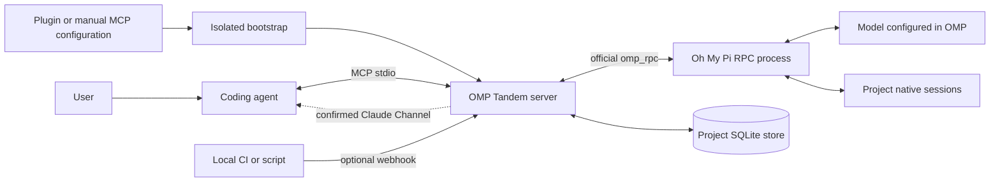

# OMP Tandem — Reference guide

[Project overview](../README.md)

**English** · [Русский](guide.ru.md) · [简体中文](guide.zh-CN.md)

**An independent AI peer for your coding agent: consult, design, implement, and review together through Oh My Pi.**

OMP Tandem packages a local MCP bridge as a Claude Code plugin and a portable Agent Plugins package for Codex and compatible hosts. Other local MCP clients can use the same server without plugin support.

**Package 3.7.1 (released 2026-09-13)** · [MIT License](../LICENSE) · [Releases](https://github.com/Flyozzzz/omp-tandem-public/releases) · [Channels and webhooks](channels.md) · [Oh My Pi](https://github.com/can1357/oh-my-pi)

There are no built-in rules for a particular company, repository, or product. You supply product knowledge when needed. Project isolation is a generic data boundary, not a hardcoded project association.

This repository starts from a reviewed snapshot of earlier private development; its version numbers preserve that lineage. “Legacy history” means migration of local OMP conversation data, not imported Git commits. The new repository does not include the old Git history.

[Contributing](../CONTRIBUTING.md) · [Security policy](../SECURITY.md) · [Continuous integration](https://github.com/Flyozzzz/omp-tandem-public/actions)

> OMP Tandem launches the real `omp --mode rpc` process using the official `omp_rpc` Python client. It does not replace OMP with direct OpenAI API calls. Configure a supported provider in OMP; the host coding agent has its own independent authentication. Local storage does not mean offline inference: task context is sent to the configured model providers.

## Contents

- [What it does](#what-it-does)
- [Architecture](#architecture)
- [Requirements](#requirements)
- [Install OMP and configure a provider](#install-omp-and-configure-a-provider)
- [Install the plugin](#install-the-plugin)
- [Other MCP clients](#other-mcp-clients)
- [Automatic runtime preparation](#automatic-runtime-preparation)
- [Hooks and skills](#hooks-and-skills)
- [Working with a peer](#working-with-a-peer)
- [One read-only review scenario](#one-read-only-review-scenario)
- [Shared tasks and autonomous execution](#shared-tasks)
- [Context-efficient work, preflight and fresh conversations](#context-efficient-work)
- [Tasks and execution modes](#tasks-and-execution-modes)
- [Immutable review bundles](#immutable-review-bundles)
- [Live diagnostics](#live-diagnostics)
- [Computation profiles and usage](#computation-profiles-and-usage)
- [Finding history](#finding-history)
- [Product knowledge and decisions](#product-knowledge-and-decisions)
- [Project isolation](#project-isolation)
- [Explicit context sharing](#explicit-context-sharing)
- [MCP tools](#mcp-tools)
- [Results, questions, and artifacts](#results-questions-and-artifacts)
- [Polling, Channels, and webhooks](#polling-channels-and-webhooks)
- [Configuration and limits](#configuration-and-limits)
- [Upgrades and legacy history](#upgrades-and-legacy-history)
- [Security and limitations](#security-and-limitations)
- [Troubleshooting](#troubleshooting)
- [Repository layout](#repository-layout)
- [Development and verification](#development-and-verification)
- [Real OMP compatibility](compatibility.md)
- [Measured development case](case-study.md)
- [Comparative benchmark preparation](benchmark.md)
- [Distribution and licensing](#distribution-and-licensing)

## What it does

A second agent is useful before implementation, not only after it. OMP can challenge assumptions, compare alternatives, take ownership of a separate implementation slice, or review a change against product requirements. The coordinator is not automatically right; neither is its peer.

| Capability | Purpose |
|---|---|
| Reciprocal collaboration | Consultation, independent reasoning, design, implementation, and review |
| Asynchronous tasks | Launch work and continue with a complementary task |
| Native conversation history | Continue an existing OMP conversation without silently opening a different chat |
| Per-turn goals | Replace the current objective instead of repeating an entire earlier audit |
| Structured contracts | Specify constraints, file ownership, context, and acceptance criteria |
| Versioned product snapshots | Preserve sourced rules, examples, and accepted/rejected decisions |
| Questions with deadlines | Ask the coordinator rather than inventing an unresolved decision |
| Immutable artifacts | Share reports and evidence with versioned IDs and SHA-256 digests |
| Provisional results | Recover useful materials even when a final report is missing |
| Group waiting | Wait for any selected task to finish or ask a question |
| Project isolation | Separate task, history, artifact, product, and event stores |
| Explicit context transfer | Share only a selected snapshot and its referenced evidence |
| Optional push delivery | Claude Code Channels plus a protected localhost webhook |
| Review bundles | Save exact code, diff, requirements and supplied checks; detect stale conclusions |
| Independent watchdog | Bound Claude event waiting independently of Channels; polling remains the fallback |
| Computation and usage | Choose depth/budget without changing permissions; report known and unknown costs |
| Finding history | Stable IDs, separate validity and fix verification, immutable version-bound evidence |
| Copy-only migration | Preserve old results and native sessions without deleting their originals |

## Architecture



1. The host loads the plugin or starts the configured stdio command.
2. The bootstrap prepares a locked, non-editable Python environment outside the plugin code directory.
3. The MCP server obtains a trusted workspace from the client before opening project data. It never uses a model-supplied task `cwd` to choose a namespace.
4. A task acquires a shared worker slot and starts an OMP process with its current goal, persistent policy, and optional product snapshot.
5. OMP can ask questions, publish evidence, and submit a structured final report through host tools.
6. The coordinator reads the actual answer and independently assesses important claims.

Completion uses request acknowledgment and terminal `agent_end` events, not a scan for the beginning of a request in retained event history.

## Requirements

- **macOS or Linux**, or **WSL** with Linux-installed tools. The bridge uses POSIX locking; native Windows is not supported.
- **[uv](https://docs.astral.sh/uv/getting-started/installation/)** on `PATH`. It selects/downloads Python 3.12+ and prepares dependencies.
- **[Oh My Pi](https://github.com/can1357/oh-my-pi)** on `PATH`, with a supported provider and model configured.
- A configured host such as **[Claude Code](https://code.claude.com/docs/en/quickstart)** or **[Codex CLI](https://developers.openai.com/codex/cli)**.
- Network access for first-time dependency downloads and the selected remote model providers.

Plugin installation registers the bundled MCP server automatically. It does **not** silently install OMP, authenticate providers, copy credentials, or bypass organization policy. Install `uv` and OMP once; Python application dependencies are prepared automatically.

| Host | Integration | Workspace source |
|---|---|---|
| Claude Code | Native plugin or manual stdio MCP | `CLAUDE_PROJECT_DIR`; explicit operator override also supported |
| Codex CLI | Portable Agent Plugins package or manual stdio MCP | Client-generated `codex/sandbox-state-meta.sandboxCwd` request metadata; supported by Codex 0.145.0 |
| Codex IDE integration | Manual MCP configuration where supported; plugin availability differs by surface | Same client metadata mechanism when emitted |
| Other local MCP hosts | Manual stdio configuration; portable plugin if the host supports it | One unambiguous client root or an explicit operator project root; ordinary non-plugin launch cwd is also supported |
| Web-only ChatGPT/mobile | Local processes are not deployed by installing a package | Requires a suitable local execution host or a separately designed remote integration |

A local GitHub marketplace is not the same as acceptance into a vendor's public plugin directory. In particular, a local stdio server is not automatically a public HTTPS MCP service.

## Install OMP and configure a provider

### Install the prerequisites

On a machine using Homebrew:

```sh
brew install uv
brew install can1357/tap/omp
```

Official standalone installers for macOS/Linux:

```sh
curl -LsSf https://astral.sh/uv/install.sh | sh
curl -fsSL https://omp.sh/install | sh
```

These commands execute scripts from the official distribution endpoints. Review them or use an approved package manager if your organization requires it. OMP Tandem does not execute them from a hook.

If you already use a supported Bun version, OMP also documents:

```sh
bun install -g @oh-my-pi/pi-coding-agent
```

Follow the [current OMP installation instructions](https://github.com/can1357/oh-my-pi#install) for platform details and Bun requirements. Reopen your terminal if the installer changed `PATH`.

### Configure your own provider

Start OMP's setup flow:

```sh
omp setup
```

Or open an OMP session:

```sh
omp
```

Inside OMP, use `/login` for supported account-based authentication and `/model` to select the default model. For API-key providers, follow OMP's provider-specific setup or environment-variable instructions. Do not put keys in the plugin manifest, a product snapshot, a repository, or chat examples.

OMP supports multiple hosted providers and local/OpenAI-compatible backends. Use a model that supports the tool-calling workflow and can follow the required reporting contract. “Any provider” means a provider supported by OMP, not a guarantee that every arbitrary model will reliably complete agentic tasks.

For a custom backend, use OMP's `~/.omp/agent/models.yml` configuration and select that provider/model through `omp setup` or `/model`. See the [provider reference](https://omp.sh/docs/providers). The bridge inherits OMP's model choice unless explicitly overridden.

Before using the plugin, make one harmless request directly in OMP. This verifies real provider access; executable discovery alone does not verify authentication. Configuring OMP does not log you into Claude Code or Codex.

## Install the plugin

This repository is public. The installer never switches GitHub accounts for you.

### Claude Code

```sh
claude plugin marketplace add Flyozzzz/omp-tandem-public
claude plugin install omp-tandem@omp-tandem
```

Start a new Claude session from the intended project directory. If the client requests `/reload-plugins`, follow that instruction after active delegated work has finished.

Start with `/omp-tandem:setup`. It separates prerequisite installation, your OMP provider login, the correct project binding, and a local diagnostic. A live diagnostic is a separate, explicitly approved provider request; it is not required just to inspect configuration.

Then ask for one useful task:

> Review only the staged changes against this requirement: a retried request must not create a duplicate. Do not edit files. Give an independent assessment before comparing the author's rationale, then show findings, the reviewed version and the known cost.

The skill uses the compact scenario below; you do not need to manually orchestrate its two stages or answer pagination. Keep the client open until it finishes: saved history is not a detached running job.

The shared workflow skill is available as `/omp-tandem:tandem`; the setup skill as `/omp-tandem:setup`. Client-visible MCP tool names include a plugin prefix, but the tool suffixes remain `tandem_*`.

### Codex CLI

```sh
codex plugin marketplace add Flyozzzz/omp-tandem-public
codex plugin add omp-tandem@omp-tandem --json
```

Start a new Codex session in the intended project. Use `/plugins` to inspect the installation. Ask it to use OMP Tandem and call `tandem_scope` before delegating.

Codex requires explicit trust review for non-managed hooks; inspect them with `/hooks`. The MCP server works without the optional diagnostic hook, so no hook-trust bypass is needed.

### Local development or a checked-out copy

```sh
TANDEM_ROOT=/absolute/path/to/omp-tandem
claude plugin marketplace add "$TANDEM_ROOT"
codex plugin marketplace add "$TANDEM_ROOT"
```

Install the plugin through the respective client after adding the local marketplace. Both marketplace catalogs point at the self-contained repository root. Do not reference files outside the plugin directory: hosts may copy it to a versioned cache.

**Avoid duplicate registrations.** If you already installed the standalone MCP, finish its tasks and remove/disable the old registration explicitly before switching to the plugin. The setup helper does not silently overwrite an existing entry. A manual registration can take precedence over a plugin server in Codex.

## Other MCP clients

Plugin support is optional. Configure a local stdio MCP server using the same launcher. Substitute a real, absolute package path:

```json
{
  "mcpServers": {
    "omp-tandem": {
      "command": "uv",
      "args": [
        "run", "--no-project", "--python", ">=3.12",
        "python", "-I", "/absolute/path/to/omp-tandem/server.py"
      ]
    }
  }
}
```

The host must supply a trustworthy workspace. If it cannot, add `--project-root` and the intended project's absolute path to the server arguments **in that project's client configuration**, not one hardcoded global configuration shared by unrelated projects.

The standalone helper can prepare the runtime and return an exact configuration plan without changing client settings:

```sh
uv run --no-project --python '>=3.12' python -I \
  "$TANDEM_ROOT/scripts/install.py" --client none --json
```

For standalone registration, select `--client claude` or `--client codex`. Claude supports `--scope user` and `--scope local`; the helper's Codex registration supports user scope only. Project-local Codex TOML configuration can be maintained explicitly by the operator. Use `--check` for prerequisites only, or `--no-register` to prepare without registration.

Client configuration formats and approval controls differ. Standard MCP support does not imply support for Claude Channels, plugin skills, hooks, or a local process inside a web-only client.

## Automatic runtime preparation

The canonical launcher uses isolated Python:

```sh
uv run --no-project --python '>=3.12' python -I "$TANDEM_ROOT/server.py"
```

`--no-project` prevents the host project's Python configuration from being treated as the launch environment. `-I` prevents cwd/PYTHONPATH modules from replacing bootstrap or runtime imports; it is **not** an OS sandbox. The actual working directory and provider environment remain available to the launched application.

On first use, the bootstrap:

1. Computes an identity from source/resource bytes, dependency/build metadata, relevant ignore files, and the selected interpreter.
2. Acquires a per-identity lock so concurrent starts do not publish partial environments.
3. Installs frozen dependencies and a non-editable package into a fresh private generation.
4. Checks that the prepared interpreter can import the runtime.
5. Publishes an atomic ready marker only after success.
6. Executes `python -I -m omp_tandem`, with MCP stdout reserved for protocol traffic.

A failed preparation does not mark the environment ready. New or repaired generations do not overwrite an older running environment. Dependency logs go to stderr.

Caches live under `PLUGIN_DATA` or `CLAUDE_PLUGIN_DATA`, or otherwise `~/.cache/omp-tandem/runtimes`. They are separate from project histories. A client may remove plugin dependency data on uninstall; the default project state directory is not stored there.

Useful commands:

```sh
uv run --no-project --python '>=3.12' python -I "$TANDEM_ROOT/server.py" --doctor
uv run --no-project --python '>=3.12' python -I "$TANDEM_ROOT/server.py" --prepare
```

`--doctor` does not install application dependencies, read credentials, or verify a provider login. The outer `uv` invocation may still acquire Python. `--prepare` performs the real installation and returns the interpreter path as JSON.

Cold downloads can exceed a client's startup timeout. Prewarm or reconnect after resolving the setup error; do not mistake “MCP configured” for a ready worker. A manual preparation outside the client may use a different cache: use the same client-provided data directory when warming that client's plugin runtime.

## Hooks and skills

The Claude plugin combines the existing lightweight `SessionStart` prerequisite diagnostic with an optional independent watchdog:

- `SessionStart` establishes a private client-session epoch.
- `PostToolUse` runs a bounded `asyncRewake` hook: a 12-second timer within a 30-second hook timeout. An actual hook wake must be acknowledged before event-only waiting is trusted.
- Timers are tied to the client session, MCP incarnation, task and generation. Duplicate or stale timers do not authorize a new task or repeated result application.
- `SessionEnd` invalidates session markers. Hooks never cancel OMP work, approve permissions, return task answers or run a model.
- The watchdog wrapper uses `uv` offline and outside the project environment. If hooks or the cached interpreter are unavailable, bounded polling remains the working path.

There are no permission-approval hooks. Claude may label watchdog exit `2` as a hook error in its debug log; it is a control wake, not an OMP task failure. Codex retains its lightweight diagnostic hook and uses polling.

The shared skills provide:

- **`tandem`**: reciprocal consultation/design/implementation/review, scoped delegation, questions, reports, and explicit sharing.
- **`setup`**: prerequisite installation with user consent, runtime preparation, provider configuration, and client-specific connection guidance.

## Working with a peer

For nontrivial development, the skill requires **understand → independently assess → compare → plan → implement → cross-check**, before implementation edits or a delegated `work` task:

1. Establish the actual need, constraints, confirmed facts and observable acceptance criteria.
2. Form a preliminary assessment and ask OMP for its independent framing before sharing the coordinator's diagnosis or arguments.
3. Compare approaches and evidence, resolve material disagreements, and record the chosen approach, file ownership, implementation order and checks.
4. Execute that plan, then cross-check the implementation and verification evidence against the original criteria. Revisit planning when a material premise changes.

Discussion depth follows uncertainty and consequences. A local fix with a user-confirmed reproduction/cause gets a brief independent check of new risks, one short comparison and concrete checks; do not repeat the user's experiment just to reconfirm it. Ambiguous architecture or high-impact changes justify fuller alternatives. The normal round limit is **one independent assessment plus one comparison**. Then decide, name a distinguishing experiment or ask a concrete question; never keep spending rounds merely to reach consensus.

Only a mechanical edit without substantive design/behavior choices, or an explicitly user-approved plan with unchanged scope/assumptions, permits a shortened path. State the exception and checks. An established goal or a small diff alone does not qualify. Do not force consensus or ask the user to approve every ordinary technical detail. Read-only planning does not become writable through continuation: start a new authorized `work` conversation and pass the agreed plan. Analysis-only requests do not authorize implementation.

Good requests split complementary work rather than duplicating it:

> First give OMP the original task, constraints, evidence, and code without my diagnosis or proposed solution. Read its independent problem framing. Only then reveal my proposal and arguments in a follow-up and compare the assessments.

> Divide this implementation into non-overlapping files. Assign one slice to OMP in `work` mode with acceptance criteria. Integrate the changes and cross-check the important behavior in both directions.

> Review this change against the pinned product rules. If a security improvement breaks a required user scenario, explain the conflict and propose alternatives instead of silently deleting that scenario.

> Continue the same conversation, but discuss only the proposed fix. Do not repeat the entire earlier audit or inherit its old acceptance checklist as the new goal.

User-confirmed observations are distinct from peer hypotheses. Do not rerun an already confirmed experiment merely to reconfirm the user; investigate new claims or changed code. Neither participant is a rubber stamp.

For planning and consequential analysis/review, use `tandem_start` for the independent assessment and `tandem_continue` to reveal and compare the proposal. Preserve user-confirmed facts and acknowledge prior exposure from code, history or shared context instead of claiming a blind review. The explicit shortened-path exceptions above govern when fresh development planning may be skipped.

## One read-only review scenario

Use `tandem_review_run` when the goal is reviewing changes, rather than manually combining the low-level tools. Example creation arguments (replace the teaching requirement and context path with actual material):

```json
{
  "action": "start",
  "request_key": "prepared-commit-review-1",
  "request": {
    "requirements": "A retried upload must return the existing object, not create another.",
    "source": "staged",
    "context_paths": ["src/upload_caller.py"],
    "author_proposal": "Retain the result under a stable request key.",
    "author_rationale": "Retries should observe the earlier result."
  },
  "execution": {"profile": "quick"},
  "budget_seconds": 600,
  "wait_seconds": 25
}
```

`request_key` identifies this logical request within the owning MCP instance. Repeating the same normalized request returns the same `run_id`; changing its payload under that key conflicts. Use a new key for a genuinely new review, not as an automatic retry after a failure.

Code captures the snapshot, launches only `think`, preserves the independent answer, and starts at most one comparison if author material exists and the independent task completed with a successful structured report. Empty selected changes produce `no_changes` without a model request. No author material means one stage. `partial`, `blocked`, failed or unstructured independent results stop the scenario rather than silently moving on.

While running, use only the returned `run_id`:

```json
{"action":"status","run_id":"<run_id>","wait_seconds":25}
```

Running responses contain compact `stage_statuses` and `full_result_pending`, not repeated long answers. Terminal responses contain complete `independent.answer` and optional `comparison.answer`, findings, current applicability and stage IDs. Questions include their context and any relevant completed stage. Code assembles full answers; the coordinator still judges their substance, disagreements and uncertainty.

For an actual pending question:

```json
{"action":"reply","run_id":"<run_id>","question_id":"<question_id>","answer":"<known answer>"}
```

Only the owning instance may reply/cancel. Identical replies already recorded remain idempotent even after the phase advances; unknown/expired/conflicting questions do not authorize invented answers. Stop unwanted work explicitly:

```json
{"action":"cancel","run_id":"<run_id>"}
```

The default total `budget_seconds=600` covers capture, startup, both stages and question waiting; the public range is 10–7200. A stage also respects its execution timeout/profile cap and receives no more than the remaining total budget. A 25-second status wait is neither a new budget nor a cancellation.

Snapshot capture runs in a separately supervised process, outside the controller's global guard. Cancellation/deadline stops that process group; publication checks the live owner, reservation and deadline transactionally. A late capture cannot become `no_changes` or dispatch a native stage. There are four capture slots per MCP owner, with explicit rejection rather than a hidden queue. This is lifecycle control, **not an OS sandbox**; ordinary low-level capture has its existing per-operation bounds, not a scenario budget.

The owner controls a bounded driver, not a detached service. Cancellation and shutdown prevent a subsequent stage. Dead owners/controllers produce `interrupted` with preserved material; accepted reservations are never automatically dispatched again. Start a new deliberate review after resolving the cause. Low-level APIs remain available for explicit advanced workflows.

If snapshot publication temporarily owns the shared write gate, cancellation can return an active durable status with `stop_pending` and `next_action="wait"`. Continue polling the same `run_id`; a pending stop prevents another phase but is not yet a persisted terminal cancellation. Status reads and capture-deadline supervision remain available. Notification acknowledgements also avoid waiting behind publication; a later observation can acknowledge the same event.

`usage.peer` aggregates the run's own native turns once. `usage.coordinator` and `usage.total_cost` remain unknown because the server cannot observe its caller's model bill. `elapsed_seconds` covers the accepted run, not coordinator startup or prior human preparation. The [measured case](case-study.md) instruments the caller separately; it is not a benchmark.

The scenario never edits files, executes supplied test commands, approves permissions or applies results. A later result-driven action still needs its existing authorization and receipt protocol. `completed` is not proof that the reviewed code is correct.

<a id="shared-tasks"></a>
## Shared tasks and autonomous execution

### Choose the entry path

Use `tandem_review_run` to review a prepared commit's staged/index snapshot without edits or shell. Use `tandem_work` to run one shared development task with two agents, agreed ownership and distinct acceptance. Neither path enables production helpers: [the compatibility map](helper-compatibility.md) records `delegation.available=false` and five unsatisfied gates (child-tool restriction inheritance, project scout replacement, task-wide settings snapshots, exclusive parent usage and extra model calls per spawn). Stages C–F and helper savings are not released.

For shared claim/submit, the **bound project root itself must be a Git repository with an immutable HEAD commit**. A session launched from a parent directory may fail with `Work execution requires a Git repository with an immutable HEAD commit`. Open the correct repository or correct the client's project-root binding; task `cwd` cannot change that boundary. An intentionally new repository needs its initial commit before execution.

`tandem_work` maintains a project-scoped task independently of individual conversations and native turns. Its default `get` is a bounded summary; explicit views expose permitted plan, step and historical material. JSON does not duplicate a Markdown rendering. SQLite is authoritative; two agents do not overwrite a shared Markdown file.

The two participant seats are `claude` and `omp`. The host MCP seat defaults to `claude`; an operator configuring a second peer client can set `--work-participant omp`. Native OMP host tools use `omp`. These are attributed participant seats, not cryptographic model-identity claims. Managed workers instead receive an attempt-bound capability: they cannot choose their identity or act on unrelated assignments. Capabilities and provider configuration must never be published.

<a id="compact-contracts"></a>
### Compact contracts, identity and closure

Presentation parameters are siblings of `request`: `view="summary"|"plan"|"step"|"full"`, `format="json"|"markdown"`, `limit`, `cursor`, `include_snapshots`. For a selected step, set `request.step_id`. History is paged and omits snapshots by default; follow the returned continuation rather than assuming the first page is complete. Cursors are bound to work, revision, section and visibility; `cursor_stale` requires a fresh read. `next_actions` includes prerequisites and current identifiers, but does not grant authority or justify automatic retries. Mutation CAS and `operation_id` semantics are unchanged.

`runtime_identity` is attached to every task result and records the loaded package version, distribution origin, verified `RECORD` build when available, source-checkout observation and registered schema digests. Editable/unverifiable builds stay `unknown`; a changed checkout does not change a running server. Requested/effective/observed models, manual/managed mode, grant and disclosure provenance remain distinct. Identity collection does not make a hidden provider call.

Independent review uses `report` → optional one `compare` → exact `accept`/`reject`; successful delivery is not a verdict. Before comparison, clarification returns `clarification_requires_new_snapshot` and closes the affected stage rather than delivering author text. Supply missing unchanged files through exact relative `review_context_paths` in a new agreed snapshot: no globs, traversal, symlink dereference or live fallback. A waiver is bound to plan, submission, grant and prospective snapshot inputs; historical decisions remain visible but cannot authorize changed material. Manual/disclosed review does not establish OS confinement.

The `recovery` descriptor exposes claim/stage/submission, saved material, allowed actions and stop/reconciliation prerequisites, never a credential. Codes such as `recovery_not_authorized` are conditions, not retry instructions. After confirmed stop, the operator may explicitly authorize one host/principal using:

```sh
python -m omp_tandem.work_daemon --project-root /project --state-dir /state successor ATTEMPT_ID --host HOST_OWNER --principal claude --note 'Report-only closure from preserved evidence'
```

Use the package's prepared interpreter. The authorized host then sends `tandem_work` action `recover` with fresh revision/operation ID, records a report and exact verdict on the same valid claim. This neither reruns models/tests nor changes the submission, stage, expiry or grants. Foreign, expired, retired, legacy-unbound and unconfirmed-stop claims cannot gain fresh authority; old receipts remain readable historical evidence. Provider refusal is preserved: a terminal `(code=cyber_policy)` suffix yields `provider_policy_refusal`; mere prose containing the code does not. Review-phase refusals are reason codes. Administrative closure is not reformulation or a provider-policy retry.

`wake_acknowledgment` reports `acknowledged`, `acknowledged_zero` (no hints needed acknowledgment), `deferred` with reason, or `not_attempted`, scoped to the observed work/revision. A deferred acknowledgment does not invalidate the state read; a later explicit observation can acknowledge retained hints. Late/duplicate hints do not dispatch work, widen grants or acknowledge future revisions.

Acceptance, application and publication are separate. Without application evidence, state is `not_recorded`, not “applied.” Operator `assess` records expected/observed HEAD and time without identifying who/how; an explicit `apply --expected-head` receipt separately records the application operation. `show WORK_ID --format markdown` renders the work report; `format="markdown"` on non-get tool actions is fenced JSON. Reports count provably linked native turns once and label partial cost subtotals; Claude and unattributed costs remain unknown. Smaller JSON is not a proportional latency or cost claim.

Checks keep the original failure, later applicable pass, delivery and acceptance distinct. Equal immutable-tree evidence is reusable only when other check inputs match; metadata-sensitive commands and changed scope are not interchangeable. One `TemporaryDirectory` cleanup failure in `tests/test_review_runs.py` was observed and passed on reruns; its cause remains unexplained. The pinned compatibility census covers only exercised `openai-completions`, not every API; helpers remain disabled.

### Agree one plan, then divide the work

Illustrative creation arguments for **`tandem_work`**; replace the teaching goals and files with the actual task:

```json
{
  "request": {
    "action": "create",
    "expected_revision": 0,
    "operation_id": "create-feature-42",
    "plan": {
      "title": "Implement the agreed feature",
      "goal": "Deliver the backend and frontend together.",
      "context": "Include the actual agreed API contract and relevant requirements.",
      "constraints": ["Preserve existing public behaviour outside this feature."],
      "acceptance": ["The integrated feature meets the recorded end-to-end requirement."],
      "steps": [
        {
          "id": "backend",
          "title": "Backend module",
          "goal": "Implement the agreed server contract.",
          "owner": "omp",
          "reviewer": "claude",
          "owned_files": ["src/backend.py"],
          "depends_on": [],
          "acceptance": ["The module implements the agreed request and response contract."]
        },
        {
          "id": "frontend",
          "title": "Frontend module",
          "goal": "Implement the client of the agreed server contract.",
          "owner": "claude",
          "reviewer": "omp",
          "owned_files": ["src/frontend.ts"],
          "depends_on": [],
          "acceptance": ["The client handles the agreed success and error responses."]
        },
        {
          "id": "integration",
          "title": "Integrated acceptance",
          "goal": "Check the combined modules against the original requirement.",
          "owner": "claude",
          "reviewer": "omp",
          "owned_files": ["tests/feature.test.ts"],
          "depends_on": ["backend", "frontend"],
          "acceptance": ["Record the actual integrated check and its result."]
        }
      ]
    }
  }
}
```

The graph rejects missing/self/cyclic dependencies, duplicate step IDs, identical owner/reviewer, unsafe paths and overlapping ownership without an ancestor relationship. One final integration sink must depend transitively on every other step; independent accepted branches alone do not certify their combined result. A one-step task is valid.

If validation lists independent final steps such as `final-green, suite-duration`, add `suite-duration` to `final-green.depends_on` if `final-green` is the intended integration step. Do not remove required investigation or verification work just to pass validation. For `create`, explicitly send `expected_revision: 0`, a unique `operation_id`, and the complete `plan`; omit `work_id`. Use a new operation ID for a corrected request; reuse an ID only for an exact retry. Rejected creation leaves no partial card.

Both participants read and agree to the exact plan revision:

```json
{"request": {"action": "get", "work_id": "<work-id>"}}
```

```json
{"request": {"action": "agree", "work_id": "<work-id>", "expected_revision": 1, "operation_id": "claude-agrees-feature-42", "note": "The recorded scope and criteria match our chosen approach."}}
```

The other participant uses **its own seat** and a freshly read `revision`; a caller cannot supply `actor` in tool arguments. Every MCP mutation needs the current `expected_revision` and a stable `operation_id`. Repeating exactly the same operation recovers its receipt; reusing its ID with different content is a conflict. Progress changes `revision`; a differing `propose` records a pending proposal, **not** a new active `plan_revision`. Only operator activation changes the active plan, resets agreements/current acceptance and revokes the old grant. Historical reports remain available through `history`. No silent merging of conflicting plans or expansion of permissions.

<a id="plan-transitions"></a>
### Pending plans and operator transitions

Send MCP `propose` with the complete new `plan`, current `expected_revision`, a new `operation_id` and a reason in `note`. Until operator activation, `card.plan` and `plan_revision` remain active: proposing alone does not interrupt attempts, invalidate agreements or revoke authorization. `card.proposal` records `proposal_id`, `base_plan_revision` and `preview` with `card_wide=true`, all affected `attempts`, and `changed_steps` / `removed_steps` / `added_steps`. The preview is an observation, not a permanent inventory: begin checks current execution again. Even unchanged steps are affected by the card-wide transition.

A new differing proposal replaces the pending one. Proposing the **current active plan** withdraws a pending proposal before begin. During an open transition every `propose` fails with `transition_in_progress`; the frozen proposal cannot be replaced by an agent. `agree` still concerns the active revision, not the pending proposal.

Only the **operator CLI** may begin, resolve, activate or withdraw a transition, cancel/link cards, reconcile execution or authorize autonomous work. Agents propose, report, submit and independently review; they may show commands, not attest their own stop or assume operator authority. Use the prepared package interpreter (`uv run --frozen python` in this checkout). Global `--project-root` and optional `--state-dir` go before the command and must identify the same store as MCP.

The following is command syntax, not a script to run with placeholder evidence. Replace `ROOT`, `STATE`, `WORK`, `PROPOSAL`, `TRANSITION`, `ATTEMPT` and `N` with observed values; `N` is the **card revision**, not `plan_revision`. Re-read after every mutation. Square brackets indicate optional arguments; `|` separates alternatives:

```text
python -m omp_tandem.work_daemon --project-root ROOT [--state-dir STATE] transition WORK inspect
python -m omp_tandem.work_daemon --project-root ROOT [--state-dir STATE] transition WORK begin --proposal PROPOSAL [--expected-revision N] [--operation-id ID] --note NOTE
python -m omp_tandem.work_daemon --project-root ROOT [--state-dir STATE] transition WORK resolve --transition TRANSITION --attempt ATTEMPT --note NOTE --evidence EVIDENCE [--confirm-stopped] [--abandon] [--saved-commit SHA] [--expected-revision N] [--operation-id ID]
python -m omp_tandem.work_daemon --project-root ROOT [--state-dir STATE] transition WORK activate (--transition TRANSITION | --proposal PROPOSAL) [--acknowledge-capture-failure ATTEMPT] [--expected-revision N] [--operation-id ID] --note NOTE
python -m omp_tandem.work_daemon --project-root ROOT [--state-dir STATE] transition WORK withdraw (--transition TRANSITION | --proposal PROPOSAL) [--expected-revision N] [--operation-id ID] --note NOTE
```

Prefer both optional safety flags: `--expected-revision` refuses a moved card; `--operation-id` fingerprints the **whole command**, including revision, note/evidence and optional flags. An exact replay returns the historical `replayed_operation.outcome`, alongside current state, without repeating effects. A different command under that ID is refused. After a conflict, inspect and decide again; do not change arguments while retaining an old ID.

`get` exposes `operator_commands` with the prepared interpreter, quoted root/state, exact IDs and observed revision; `transition inspect` exposes these as `commands`, plus inventory and stop requirements. Fill in real note/evidence and, if wanted, a fresh operation ID. `next_actions` carries a `transition` hint with `allowed=false`, `blocked_reason="operator_required"`: discoverability is not permission.

1. **Begin:** freezes the proposal, inventories every active and already `recovery_required` attempt, and fences active credentials into `recovery_required`. No new claim may start during the open transition. Other cards are not quiesced by this command.
2. **Stop and inspect effects:** managed attempts require the existing supervisor's `process_confirmed_gone` teardown evidence (`stop.source="supervisor_confirmed"`). A heartbeat, silence or model assertion is not stop evidence. Supervisor teardown confirms **process stop, not absence of external effects**. The operator must inspect outputs and possible external effects before recording a disposition. Manual attempts require `--confirm-stopped` and record `operator_attested`; that flag cannot replace managed supervisor confirmation.
3. **Resolve every inventory entry:** supply meaningful `--note` and one or more `--evidence` flags. Default disposition is `superseded`; `--abandon` records `abandoned`, adds an operator blocker and **pauses the card**. This is not acceptance or replay. Managed implementation workspaces are preserved through `WorkWorkspace.preserve` on their recorded composed base, with the same ownership/byte checks as submission; failures remain in `saved.capture_failure`. Manual implementation can supply a full `--saved-commit`, validated in the pinned repository like a submission. Saved output, reports and intents are evidence, not automatically accepted results.
4. **Activate:** use the frozen `--transition` only after every inventory entry has a disposition and no active/recovery-required attempts remain. Without a begun transition, `--proposal` is allowed only when nothing executes or requires recovery. Activation installs a new draft plan revision, clears agreements/current acceptance, carries unresolved blockers (removed-step blockers become card-wide), revokes authorization and **preserves any existing pause**, including abandonment/unknown-cost pauses. Both participants must agree again; resolve blockers, explicitly `resume` if paused, and obtain fresh operator authorization before managed execution.
5. **Continue saved results, not commands:** transition history records each superseded attempt's continuation: `checkpoint` when validated saved changes fit the new step ownership; `not_transferable` if the step was removed or ownership excludes saved changes; `not_available` if there are no validated saved bytes, including capture failure. These describe transfer eligibility, not automatic card blockers or proof that effects are resolved. Historical 3.7.0 `blocked` outcomes are displayed as `not_transferable` without rewriting history. A checkpoint retains its commit/base and operator evidence and is returned to the new claim; it is not a submission or transferred acceptance. No old command is automatically replayed.

Before activation, inspect `activation_preview` in get, `transition inspect` or Markdown: `steps_with_checkpoint`, `steps_undetermined` (dispositions still pending), `steps_without_checkpoint`, `capture_failures` and `capture_failures_unacknowledged`. Per-attempt entries show preserved commit/files and transfer outcome. `ready` only means dispositions are complete, **not launch readiness**; pause, blockers, agreements and grants are separate.

Every superseded attempt with `saved.capture_failure` requires an informed operator `--acknowledge-capture-failure ATTEMPT` on activate; repeat it for each exact failed attempt. Missing acknowledgment refuses with `capture_failure_unacknowledged`; an unrelated ID refuses with `capture_failure_unknown`. Acknowledgment is part of the exact command identity and recorded outcome: saved work could not be captured and is lost. Successful preservation needs no acknowledgment. `--abandon` consistently records `abandoned` in the attempt, inventory and operation receipt, keeps no continuation and leaves its blocker/pause; it is not `superseded`.

Before begin, `withdraw --proposal` only drops the proposal. After begin, `withdraw --transition` archives it as withdrawn but leaves **sticky quiescence**: fenced attempts still need operator reconciliation, and an existing pause needs explicit resume. Withdrawal never revives old credentials or undoes external effects. `reconcile WORK STEP --resolution retry|abandon --confirm-stopped --note ... --evidence ...` remains the emergency **operator** fallback, not an agent escape hatch; `retry` permits a deliberate new attempt under the remaining gates, while `abandon` leaves a blocker and pause.

<a id="repository-handover"></a>
### Pinned repositories, diagnostics and truthful closure

Creation records `repository{project_root, scope_id, provenance, initial_observation}`; the observation contains `status="verified"|"unverified"`, `git_toplevel`, `head` and action/time provenance. `repository_observation` is refreshed at create/propose/claim. These are observations of the **pinned launch root**, not permission to repin a card or source commit.

Declared `owned_files` and exact `review_context_paths` are checked at create/propose and again at claim, including existing ancestors of new paths. Nested repositories, `.git` files/worktrees and submodule contents are separate boundaries. Owning the parent's submodule **gitlink entry itself** is allowed by this declared-path check; this does not remove the existing managed-snapshot submodule refusal. Symlinks are refused with the offending path/root/link, never dereferenced. Unrelated nested repositories are not scanned or rejected.

For example, a child boundary produces:

```text
Declared path 'child/new/file.py' belongs to detected repository boundary /outer/child, not pinned root /outer. Launch Tandem at /outer/child and create a separate card in that scope; do not repin this card. The child repository was not opened or searched.
```

A non-Git root may retain a **pathless** planning card with an `unverified` observation; declared-path plans and all claims require a valid Git root with HEAD. A task `cwd` cannot repair the launch binding. If the mismatch was not knowable from declared paths, an unresolved submission fails **before submission intent**, with a bounded Git cause:

```text
Submitted commit SHA could not be resolved in pinned repository /outer: GIT_CAUSE. Verify the exact hash in this repository. If work belongs to a nested or different repository, launch Tandem there, create a separate card, and ask the operator to stop/dispose and cancel or supersede this card with continuation provenance; never substitute an unrelated commit. No other repository was searched.
```

Source-commit resolution errors are labelled `Source`, not `Submitted`. Full-hash, ancestry and changed-file ownership checks remain in force. Do not search foreign repositories, substitute a parent commit, transfer tokens or fake acceptance.

Correct-scope handover:

1. Inspect the pinned root/error. Stop and dispose the mistaken card's attempts (resolve an open transition, or pause via MCP then use operator emergency reconcile). **Cancel does not stop execution.**
2. Launch a separate Tandem client at the actual child repository with HEAD; check `tandem_scope`, then MCP `create` a separately scoped card. It begins with fresh agreements and no inherited grant.
3. The operator closes the old card in its own scope and records the predecessor in the successor's scope. Both commands require fresh card revision and operation ID; root/ID are separate options, so a colon in a path is not a separator:

```text
python -m omp_tandem.work_daemon --project-root OLD_ROOT [--state-dir STATE] cancel OLD_WORK --disposition cancelled|superseded --expected-revision N --operation-id ID --note NOTE --evidence EVIDENCE [--continuation-root ABSOLUTE_CHILD_ROOT --continuation-work-id CHILD_WORK]
python -m omp_tandem.work_daemon --project-root CHILD_ROOT [--state-dir STATE] link CHILD_WORK --predecessor-root ABSOLUTE_OLD_ROOT --predecessor-work-id OLD_WORK --expected-revision N --operation-id ID --note NOTE --evidence EVIDENCE
```

4. Both child-scope participants `agree`; its owner `claim`s and `submit`s the actual full child commit; its distinct reviewer `claim`s, reads that exact result, records independent `report`, optionally `compare`s, then `accept`s or `reject`s the exact submission. These are the attached/manual MCP operations documented below, not an acceptance transfer.

`cancel` refuses while any attempt is active/`recovery_required` or any begun-transition inventory remains undisposed. Closure records `disposition`, note/evidence, actor/time, optional continuation, `revision` and `withdrawn_proposal_id`; an open disposed transition is archived with phase `cancelled`, the proposal is cleared and the grant revoked. Both dispositions produce terminal `status="cancelled"`, not `completed`. `agree`, `propose`, `claim`, `resume`, activation and authorization fail with `work_terminal`; get/history remain readable. `link` may append provenance even after terminal closure but cannot reopen execution.

Links are operator assertions: `target_verification="not_performed"`, `reciprocal_link="unverified"` **even after both directions are recorded**. Neither command opens the other scope or transfers read permission, agreements, grants or acceptance. `show WORK --format markdown` displays closure, continuation and predecessors. Independent acceptance belongs only to the child card; application remains a separate explicit operator action.

#### Verification and local packaging boundary

The reproducible CLI/MCP scenarios are:

```sh
uv run --frozen pytest -q -s -p no:cacheprovider tests/test_work_integration.py -k 'test_plan_transition_end_to_end_through_mcp_and_operator_cli or test_outer_nested_repository_handover_cli_mcp or test_managed_replan_preserves_checkpoint_without_repeating_effect'
```

These scenarios use real Git, FastMCP clients and operator CLI subprocesses on disposable repositories. The managed scenario injects a deterministic Claude executable into the real `WorkSupervisor`: bound get/heartbeat, one external-effect record and an owned-file marker, real cancellation/reaping, supervisor stop evidence, immutable preservation, activation and explicit resume/re-agreement/reauthorization. The same child continues from the checkpoint marker with exactly one effect record across both claims. Interrupted cost remains unknown; a one-launch grant prevents an OMP reviewer launch. This proves the **Claude-child/shared-supervisor boundary**, not generic exactly-once external effects, OMP-native teardown or a live-provider replan. [Provider compatibility](compatibility.md) is a separate pinned OMP/localhost fixture.

3.7.1 is a patch-level release (2026-09-13) improving operator ergonomics, disclosure and regression coverage on released 3.7.0. `uv build --wheel` and `uv run --frozen python scripts/package.py` prepare local distributions; `package.py --check` checks source hashes. Packaging, tests and independent acceptance do not tag, publish, install into a user session or apply results. Only the operator decides publication. The original requests remain [verbatim with provenance](spec/plan-transition-and-git-root-2026-09-12.md).

### Attached/manual work

The assigned participant uses `claim` with `work_id`, `step_id`, current revision and operation ID. The claim is atomic with dependency/role checks and returns an attempt capability; the current MCP or native-tool session retains it for subsequent step operations. A claim does not launch a model, authorize shell, or edit the project.

Manual implementation happens under the host's existing permissions. Submit an **already committed, full Git hash** through `submit`, with `commit`, `note` and nonempty `evidence`. The bridge verifies ancestry and exact declared changed-file ownership before retaining the immutable result; it does not run tests because their names appear in evidence. A different participant claims review, records `report`, optionally opens `compare` once, then uses `accept` or `reject` with the exact `submission_id`, current revision, note and evidence. Acceptance is an attributed assessment of that output and plan, not an exit-code inference or guarantee of correctness. Final acceptance also attests the task's global criteria.

Manual claim lifetime is bounded; reconnecting does not silently take it over. A still-active claim can be recovered by its **exact original claim operation**, including original revision/operation ID. Otherwise inspect and reconcile it explicitly. Never paste capabilities into project documentation or use another participant's token.

#### Independent report before author comparison

New review attempts use `independent_first`. After the reviewer claim, submit `action="report"` with the exact `submission_id`, `resolution="success"` (or `"partial"`/`"blocked"`), the complete independent assessment in `note`, and nonempty `evidence`. Use fresh revision/operation IDs as for other mutations. A complete successful report means the assessment finished, not that the code has no defects. Only a successful report permits acceptance or the optional `action="compare"`; comparison opens at most once. Defects can justify rejection/blocking without author comparison.

Author notes, free-text evidence and related artifacts remain author interpretation, withheld **until compare opens**, including after recording the report. Managed Claude and OMP reviewers use a server-bound reader for the pinned submission commit, not live filesystem tools or arbitrary shell. Requirements and raw snapshot provenance remain available. Manual publication gates and server-channel filtering do not erase earlier disclosure in an interactive client or create an OS sandbox.

A grant with shell permission creates an operator-owned policy blocker **before a managed review launches**, because no stage-confined shell mechanism is available. Participants cannot waive this blocker. An operator must explicitly resolve it with evidence for a no-shell review (and honestly record unrun checks); otherwise review stays blocked. Do not silently drop required checks or claim unrestricted shell is independent-first.

### Explicitly authorize unattended work

Autonomous authority is **not an MCP operation**. The operator runs these commands from an installed environment/check-out after the plan is agreed. Models may explain a command but must not execute it without the user's explicit approval.

```sh
python -m omp_tandem.work_daemon --project-root /absolute/project \
  --claude-model sonnet --omp-model <provider/model> \
  authorize <work-id> --budget-seconds 1800 --max-launches 12 \
  --max-cost-usd 6 --max-attempt-cost-usd 3 --allow-work --preview
```

The `python` below must come from an environment with this Tandem version installed. In a source checkout use `uv run --frozen python ...`; from another directory use `uv run --project /absolute/path/to/omp-tandem --frozen python ...`. A plugin's private runtime is not a global Python installation. Its `server.py --prepare` command reports the prepared interpreter in the `python` field; do not guess cache paths.

`--preview` validates and prints the proposed grant with `stored=false`; it does not activate authorization or prove readiness. Only with explicit operator approval repeat without `--preview`. The active grant pins source commit, plan revision, deadline, launch count, **model policy** and reported-cost budget. `--allow-work` permits implementation edits; `--allow-shell` permits arbitrary shell, including network/process effects, **not an OS sandbox**. `--allow-tests` is a deprecated alias with identical permission. No permission bypass, default background launch, global service or account switch is added.

`preview.model_selection` discloses each seat's policy. Claude is `fixed_selector` (default `sonnet`); explicit `--omp-model` (`--model` alias) is `fixed_selector`, recorded at authorization. Omit it and OMP uses `dynamic_default`, resolving its configured selection at **each attempt start**, not pinning a particular model. Recommend `--omp-model <provider/model>` for predictable autonomous runs. Both model flags go before `authorize`; later `run`/`start` cannot override the recorded policy. `legacy_unpinned` needs reauthorization; `malformed` is labelled on reads and refused at launch. Requested selectors are not observed model identity. Markdown `## Authorization` shows the persisted authorized-at/deadline window, permissions and per-seat policy; it does not prove which model answered.

`--max-attempt-cost-usd` defaults to half `--max-cost-usd`, independent of `--max-launches`; an explicit ceiling is clamped to the total. Each launch atomically reserves `min(attempt ceiling, total − known spend − active reserves)`. Concurrent ready steps share the unreserved remainder in launch order, not a guaranteed equal split. Unknown reported cost stops new launches. The grant and `show` expose `max_attempt_cost_usd`, `attempt_cost_policy`, and `preview` with `reserve_policy` and `permissions` (`read`, `edit_write`, `shell`, unrestricted process `network`, `os_sandbox=false`). These estimates are not hard invoice caps.

```sh
# Foreground, supervised and interruptible:
python -m omp_tandem.work_daemon --project-root /absolute/project \
  run --work-id <work-id> --concurrency 2

# Explicit detached controller, independent of the interactive client:
python -m omp_tandem.work_daemon --project-root /absolute/project \
  start --work-id <work-id> --concurrency 2

python -m omp_tandem.work_daemon --project-root /absolute/project status
python -m omp_tandem.work_daemon --project-root /absolute/project show <work-id>
python -m omp_tandem.work_daemon --project-root /absolute/project stop
python -m omp_tandem.work_daemon --project-root /absolute/project revoke <work-id>
```

Place an explicit `--state-dir` before the subcommand if the MCP client uses a nondefault state base; it must identify the same task store. Executable options `--omp` and `--claude` also go before the subcommand. Model options are accepted only with `authorize`. `--once` exits when no currently runnable/active work remains; omit it to wait for resolvable blockers within the grant deadline.

The controller holds one kernel project lease, reserves ready assignments once, and launches dedicated attempts in separate detached Git worktrees. Claude uses a new bounded headless session with a restricted task-only MCP connection; OMP uses the existing native RPC runtime and shared host tool. Neither adapter attaches to the user's open terminal, selects the newest conversation or resumes possibly running work. Independent steps in the same task can run concurrently; the default is two, maximum four. Monetary envelopes are reserved before launch, so parallel workers cannot each treat the whole remaining budget as their own.

Managed snapshots use exact committed bytes, including repositories with line-ending/`ident` attributes. Safety limits are 16 MiB per file, 256 MiB per snapshot and 20,000 files; tracked symlinks, submodules and configured Git filters are refused rather than silently omitted. Keep the shared state directory outside the active checkout. Rejected output and cleanly blocked work retain a checkpoint for targeted continuation; conflicting dependency blobs remain in the retained worktree's Git index for inspection.

Each worker must acknowledge its assignment through `heartbeat` before work. A launched process or sent notification alone is not that acknowledgement. Native outcomes, immutable implementation snapshots and the distinct review verdict are recorded separately; an autonomous review only releases dependencies after successful worker completion and snapshot integrity verification. The final accepted result remains in a retained worktree/commit until explicitly applied.

### Blockers, wake and recovery

`block` records a note and a specific resolution condition; `unblock` requires the blocker ID, actual resolution and evidence. Dependencies open only after current prerequisite submissions are accepted—not merely when a native task exits. Cooperative blocked work can finish cleanly, retain its partial source checkpoint, release execution capacity and continue from that checkpoint after an evidenced unblock under the same still-valid grant. A checkpoint is not an accepted submission. Unknown termination, failed dispatch acknowledgement or possible unfinished external effects instead require reconciliation; they never become automatic retries.

Unresolved blockers retain identity, original plan/step and resolution history through proposal and activation. Only activation of a plan that removes their step moves them to card scope, where they block all execution/publication. Both participants may agree to a corrective active plan while blockers remain; agreement, retries and review-stage changes do not resolve them. Only the blocker author or operator may record evidence-backed resolution or `resolution="not_applicable"` with a reason in `note`. For a card-level blocker omit `step_id` when unblocking. Blocked work cannot be submitted or accepted.

<a id="operator-unblock"></a>
#### Operator blocker resolution

The blocker author may resolve through MCP; the trusted operator has the same evidence-backed action through CLI:

```text
python -m omp_tandem.work_daemon --project-root ROOT [--state-dir STATE] unblock WORK --blocker BLOCKER [--step STEP] --resolution resolved|not_applicable --note NOTE --evidence EVIDENCE --expected-revision N --operation-id ID
```

`--blocker`, `--resolution`, `--note`, at least one `--evidence`, current card `--expected-revision` and a fresh `--operation-id` are required. Repeat `--evidence` for multiple records. `resolved` explains how the condition was met; `not_applicable` explains why it no longer applies. `--step` names the blocker's **current** step; omit it for card scope, including a blocker moved there by activation. Hints in `operator_commands`, `next_actions` and Markdown `## Operator commands` name current location, not historical origin. They remain `allowed=false`, `operator_required`, not agent authority. CAS and exact-operation replay rules apply. Unblock **never resumes a paused card or authorizes execution**; explicit resume and a valid grant remain separate.

#### Migration and rollback limits

Legacy grants retain the historical `max_cost_usd / max_launches` attempt ceiling (`legacy_launch_share`) and `allow_tests` decoding; migration does not increase shell permission or rewrite active reservations. Legacy review attempts are labelled `legacy_disclosure`, not retroactively independent-first. Ambiguous legacy OMP model selection needs explicit reauthorization. Existing blocker provenance, recovery and spent budget remain; reading/migrating state never authorizes a restart. Inspect and reconcile uncertain execution before reauthorization.

Legacy project import is copy-only and does not delete its source. There is no automatic downgrade, rollback of external effects or replay guarantee. Before a manual backup/restore, stop all clients/controllers that write the state and preserve the complete state and retained workspaces using your backup procedure; do not copy a live SQLite file alone or assume restoring it cancels external processes.

Attached clients receive best-effort shared-work change hints through an already functioning channel. Read current state on wake, or use bounded waiting:

```json
{"request": {"action": "get", "work_id": "<work-id>"}, "wait_seconds": 25}
```

Events do not grant permission and are not the scheduling source of truth. The detached controller reads durable readiness, so a lost client notification does not strand eligible work. It does not keep a model running just to wait for a dependency. Closing an interactive client stops its own native turns but not a separately authorized controller. A local controller cannot execute while its machine is asleep/offline; on return it checks deadlines and ownership rather than replaying missed events.

`pause` is sticky across reconnection. `resume` clears that desired pause but does not reconcile an interrupted writer or grant new permissions. Revocation, expiry and unknown reported cost prevent further autonomous launches. Failed attempts preserve evidence/workspaces; a replacement cannot claim the same step until its old execution and possible effects have been inspected.

```sh
python -m omp_tandem.work_daemon --project-root /absolute/project \
  reconcile <work-id> <step-id> --resolution retry \
  --note "Explain the observed old execution and inspected side effects." \
  --evidence "Reference the actual process/output/effect inspection." \
  --confirm-stopped
```

`--confirm-stopped` is an explicit operator attestation, **not** proof inferred from a missing heartbeat. Reconciliation never rolls back remote effects or silently replays commands. Reauthorize if the old grant was revoked/changed/exhausted. Reported USD ceilings are cooperative/provider-estimate limits, not an invoice-level hard spending guarantee; an in-flight request can overshoot, and unknown usage pauses the work rather than counting it as zero.

### Apply only the accepted combined result

```sh
python -m omp_tandem.work_daemon --project-root /absolute/project \
  apply <work-id> --expected-head <full-current-head>
```

This is operator-only, requires a completed task with a current final acceptance, and fast-forwards only a clean tracked/nonignored checkout whose HEAD still matches. It rejects ignored-file collisions, conflicts and unexpected changes; there is no forced reset, autostash or implicit merge into user work. Worktrees isolate edits, **not arbitrary filesystem/network effects** from authorized shell. Check outputs can create ignored artifacts in their isolated workspace, but those artifacts are not silently promoted into the source result.

<a id="context-efficient-work"></a>
## Context-efficient work, preflight and fresh conversations

### Declare the work before dispatch

`tandem_start` and `tandem_continue` accept `preflight=true`. This runs the same admission preparation without a task, worker, model request or capacity reservation. Actual start checks again under its leases; a preview is not permission or a reserved slot. For example, replace these teaching paths with existing files:

```json
{
  "cwd": "/absolute/project",
  "mode": "work",
  "preflight": true,
  "timeout_seconds": 180,
  "contract": {
    "goal": "Verify the service boundary before changing it",
    "requirements": {
      "requires_shell": true,
      "entry_paths": ["src/service.py"],
      "boundary_paths": ["tests/test_service.py"]
    },
    "verification": {
      "stage": "targeted",
      "preparation_seconds": 30,
      "checks": [{
        "id": "service-boundary",
        "criterion": "The observed service boundary satisfies the agreed cases",
        "phase": "targeted",
        "command": "python -m pytest tests/test_service.py",
        "estimated_seconds": 45
      }]
    }
  }
}
```

Paths must belong to the admitted Git root; nested repository/worktree/symlink boundaries are not silently crossed. `requires_shell`/`requires_write` are requirements, not grants: analyze/think cannot gain shell by requesting it. A nonempty check command also declares a shell need. `live_path_evidence` holds existing artifact IDs and remains **attributed evidence, not proof that a file is a live production route**. Undeclared paths are not guessed from prose.

The check ladder is cumulative: `candidate` includes targeted checks, `integration` includes all three phases. Declared preparation plus known estimates cannot exceed the whole task deadline; missing estimates remain unknown. Commands are not executed by preflight. A successful final report for an explicit ladder needs every selected `check_id`, its `run_id`, and a current passing entry in `check_runs`; history keeps earlier failures. A passed review task still does not accept a shared submission.

For a known current candidate, a check may declare `scope: {"kind":"tree|commit|archive|content","digest":"..."}` using the existing CheckScope type (choose one actual kind). Other-byte runs stay in the audit history but are not current evidence. Without an explicit scope, ambiguous different-input failures remain unresolved. All current criterion/role groups must pass; a claimed pass cannot hide another role's current failure. `result.verification` and `facts.checks` assess the declared current inputs, while `check_runs` retains the unscoped history. Reports permit at most 200 run records for up to 50 declared checks; overflow is refused, never silently trimmed.

Shared steps have separate `requirements`/`verification` for implementation and `review_requirements`/`review_verification` for the reviewer. Review write requirements are invalid. A required shell check does not bypass snapshot-only review or an absent grant; unresolved checks must remain blocked/partial, not silently waived.

### Pinned capsules instead of repeated complete snapshots

`contract.context_options.delivery` defaults to `capsule`; `full` explicitly includes all selected product data. Capsules always retain complete required rule text/source/applicability and current accepted/rejected/deferred decision text/provenance. Advisory bodies and superseded decision bodies can be explicitly selected with `advisory_rule_ids`/`decision_ids`; invalid IDs refuse admission.

First, changed and fresh contexts include the overview. An unchanged continued snapshot sends its immutable ID/SHA and required invariants without repeating the overview or examples. This **does not assume native compaction retained older messages**: use `tandem_context_read` for omitted data, following the returned RFC 6901 `pointer`, `offset_bytes` and `next_offset_bytes`. The reader accepts 4–16384 UTF-8 bytes per page; concatenate `content` pages and JSON-decode the canonical JSON. It reads only the current task's pinned snapshot, never a caller-selected latest revision or a file. The coordinator version additionally takes `task_id`. Independent review uses its declared review reader instead.

Managed attempts receive the assigned step, complete mandatory global constraints/acceptance, exact dependency provenance and a bounded overview with full-plan pointers. They do not receive all other step bodies or repeated author reports. This reduces context bytes, not necessarily provider cost by the same ratio.

Do not combine an independent `review_id` with a separate `project_context_id`: admission and the message sink refuse this extra input channel. Capture the needed requirements/policy/context in the review bundle instead. Comparison requires a complete successful structured assessment of that exact snapshot without a recapture requirement, rechecked under the conversation lease and insertion transaction.

### Start a fresh context explicitly

Normal `tandem_continue` keeps `continuation="resume"`. At a new deliverable, request a fresh conversation with a bounded, source-backed handoff:

```json
{
  "conversation_id": "REPLACE_WITH_SOURCE_CONVERSATION_UUID",
  "continuation": "fresh",
  "handoff": {
    "reason": "A new bounded deliverable",
    "summary": "The previous boundary was checked against its saved commit.",
    "remaining_goals": ["Review the next service entry point"],
    "invalidated_assumptions": ["The retired FSM is not the live route"],
    "evidence_artifact_ids": []
  },
  "contract": {"goal": "Inspect the next service boundary"}
}
```

The old conversation remains intact. A new conversation and session are created without `--resume`; source task IDs and handoff provenance are recorded. Mode, cwd, persistent policy and resolved model/thinking remain constrained; new goals do not inherit old acceptance. Explicit execution overrides remain explicit. Foreign handoff artifacts, active/recovery claims, managed bindings, source review bindings, uncertain prior work and provider-policy stops refuse this path. It does not clone tokens, grants or verdicts. Use existing operator/report-only reconciliation for unresolved execution; generic fresh is not a way to retry refused work or fabricate independent review.

### Corrective review and bounded material

A new `ReviewRequest` may declare `corrective` with `previous_review_id`, its exact `previous_code_fingerprint`, and `open_findings: [{"finding_id": "...", "expected_revision": N}]`. IDs must belong to this scope and the referenced previous snapshot; changed finding revisions are not silently accepted. The new immutable manifest contains added/removed/changed input paths and labels the work `prior_exposed`. A new assessment is still required, even when selected source bytes are unchanged. No old verdict transfers to new bytes, and author material still obeys its reveal stage.

Read `corrective.finding_details` through the paged manifest: it pins original title, description, location, reproduction and evidence at the declared revision, not author fix-rationale/history. Only a task bound to this exact corrective snapshot and declared finding may update/verify it across conversations; a review-run task also needs its exact reserved stage slot. Unrelated, undeclared or stale mutations remain refused.

Use the delta, open findings and neighboring entry/replay/stage boundaries before a broad candidate suite. This is an explicitly agreed verification order, not permission to omit required checks.

Work summary/list output now pages growing sections instead of returning unbounded remaining-ID arrays. Follow `section` and `cursor` alongside `request`; section responses are canonical JSON text chunks in `content`, with `next_cursor`. Concatenate then decode. All card/step blockers are available through `section="blockers"`. A stale revision, reader identity, stage or changed section content invalidates its cursor. Explicit `view=full|plan` and Markdown reports remain complete, intentionally larger requests.

Paged references expose ready-to-call `arguments` with `request` and `section` at the correct sibling levels. Pass that object as tool arguments, adding the returned cursor for the next page; do not put presentation fields inside `request`.

### Keep the working runtime separate from the candidate

The launcher already prepares non-editable generations. For self-host development, inspect `python -I server.py --prepare` (returns `key` and `python`), then explicitly select that verified generation with `--runtime-pin KEY`. `--runtime-info` inspects selection; `--runtime-refresh` prepares and pins current source for **future** launches; `--runtime-unpin` restores ordinary update-following. Unsafe/stale pins refuse instead of silently switching. Existing processes/generations are never replaced.

Use `python -I server.py --candidate --candidate-smoke --project-root /absolute/fixture` to prepare current candidate code with a new private state directory and local diagnostics, without a provider task. Candidate mode refuses inherited managed authority/explicit live-state selection, disables legacy import/channel/webhook, and reports the retained temporary state path. Remove only that reported fixture directory when finished. A real provider check is a separate explicit decision.

New runtimes check the stored schema before migration. This cannot retroactively constrain old binaries that ignore the guard: stop/inspect old clients and back up state before an intentional upgrade. Never test a candidate against the user's live database merely because the source checkout is the same project.

## Tasks and execution modes

| Mode | OMP tools | Typical use |
|---|---|---|
| `think` | No project/shell tools; collaboration host tools remain available | Consultation and reasoning over supplied context |
| `analyze` | Read/search/glob/web search; no shell, editing, or LSP | Investigation and review; default mode |
| `work` | Analysis plus edit/write/bash/LSP/todo | Explicitly authorized implementation and verification |

`work` permits unattended execution and is not a sandbox. Per-tool deny policies still apply. File ownership declarations prevent overlapping assignments within a project store, not all possible filesystem access.

Provide **exactly one** of `prompt` and `contract`. Example `tandem_start` arguments; replace paths and file names with your own:

```json
{
  "cwd": "/absolute/project",
  "mode": "work",
  "contract": {
    "goal": "Fix repeated upload handling",
    "context": "The cause is established; investigate the proposed fix, not the entire system again",
    "scope": {"owned_files": ["src/upload.py"]},
    "constraints": ["Keep the public API", "Preserve concurrent changes"],
    "acceptance": ["Repeated uploads behave correctly", "The existing successful flow is preserved"]
  },
  "timeout_seconds": 1800,
  "question_timeout_seconds": 300
}
```

Owned files are explicit relative paths inside `cwd`, without globs or traversal. Do not declare ownership you have not actually agreed on.

A new `tandem_start` creates a new conversation. A `tandem_continue` creates a new task/turn in the existing conversation. Mode, cwd, and base `WorkPolicy` persist; a new `TurnContract` replaces goal/context/acceptance and supplies turn-only constraints. It cannot change file ownership or expand the base policy.

## Immutable review bundles

Prepare all review materials with one `tandem_review(action="create")` call. Example arguments:

```json
{
  "action": "create",
  "request": {
    "requirements": "A retried payment must not create a second charge.",
    "criteria": ["Examine concurrent requests and an ambiguous gateway response."],
    "base": "HEAD",
    "author_proposal": "Serialize calls with a process-local lock.",
    "author_rationale": "The author believes serialization prevents duplicates.",
    "external_boundaries": ["The payment gateway and production data are not captured."]
  }
}
```

Choose `request.source`: **`worktree`** (default) reviews working content against `base`, while **`staged`** reviews the Git index against `base`. Without `paths`, worktree selects current nonignored changes, including unstaged/new files; staged selects only index/base differences. Explicit paths select material from that same source. Non-Git projects support only worktree with explicit paths.

`context_paths` adds explicitly requested **unchanged** callers, dependencies or tests to the selected change set, using the same source. Staged context is read from the index, never the working directory. Context and changes have separate manifest roles/counts and share the existing size/path limits and applicability checks. A context path that is itself changed must be included as a selected change rather than silently disguised as unchanged context. Context alone does not turn an empty change set into a review request.

If relevant material is missing, the reviewer should state the exact paths and why they matter. Expand through a new capture and new scenario key, after explicitly choosing that material. Do not splice live files into the old snapshot or claim an enlarged scope was already reviewed.

To review only the prepared commit:

```json
{"action":"create","request":{"requirements":"Review only the prepared commit against the user requirements.","source":"staged","base":"HEAD"}}
```

For staged captures, `selected`, modes, change classification and diff come from the index; no working files are read, including during capture retries and assessment. Later unstaged edits and untracked files do not leak into the bundle. A staged deletion stays deleted even if its working file was recreated. Empty staged selection returns zero files; do not start an empty review.

The bundle stores selected/base/staged bytes, hashes and Git identities. Renames remain deletion/addition pairs; selected submodules and unmerged index entries are rejected explicitly. New manifests/fingerprints identify the source. Legacy snapshots without it remain worktree snapshots without rewriting their saved content or hashes.

Optional `checks` entries contain `name`, `output`, optional `command`, `source` and `code_fingerprint`. Collection never executes those commands. Supplied reports remain `verified=false`; without a matching supplied fingerprint, their association with this code version is unknown or different, not silently certified.

Use the returned IDs in these steps, replacing placeholders with actual returned values:

```json
{"cwd":"/absolute/project","mode":"think","prompt":"Read the saved requirements, criteria and code; give an independent assessment.","review_id":"<review_id>"}
```

After reading that completed independent answer:

```json
{"conversation_id":"<conversation_id>","prompt":"Compare the author's proposal with your recorded assessment.","review_stage":"comparison"}
```

Snapshot-bound tasks require `think` mode. Their `tandem_review_read` host tool reads saved material, not the live working directory; `analyze`/`work` cannot be attached as if their live reads were frozen. Use a separate work conversation for edits. A comparison turn requires a completed independent assessment of the same snapshot in the same conversation. A new `review_id` starts a new independent assessment, while existing conversation exposure must still be acknowledged.

Coordinator reads use `tandem_review(action="read", review_id=..., section=...)`. Sections are `manifest`, `requirements`, `criteria`, `diff`, `selected`, `base`, `staged`, `checks`, and explicitly revealed `author`. File sections require `path`; page with `offset`, `limit` and `next_offset`. Binary bytes use base64 pages. Author proposal/rationale are stored separately and excluded from first-stage manifests and metadata; the worker cannot read them before comparison.

`tandem_review(action="assess", review_id=...)` and terminal result `review.applicability` report `current_selected_state`, `stale`, `previous_version`, or `unknown`, with an observation time. The old answer remains tied to its saved snapshot; changes do not rewrite it or automatically prove it wrong. Unrelated files are outside the selected scope.

For staged snapshots, unstaged edits do not change applicability; modifying a selected index entry makes it stale. New staged paths outside the saved bundle are not implicitly reviewed. Recapture before claiming coverage of a changed complete commit candidate.

The manifest separates **saved**, **observed**, and **external** boundaries. Capture checks for changes across bounded repeated reads; it is not an atomic filesystem snapshot. A saved lockfile does not prove installed dependencies, and unchanged selected bytes do not certify external services or the whole system.

## Live diagnostics

`--doctor` remains a local prerequisite check and does not contact a provider. In the actual connected client, `tandem_diagnose()` additionally reports the bound project and delivery state without launching a task.

For a user-requested live check:

```json
{"live":true,"expected_project":"/absolute/project","timeout_seconds":90}
```

This starts one short `think` task and may incur provider cost. A mismatched expected project blocks execution; the argument does not rebind the server. Success proves the expected structured diagnostic answer was received and exposes the actual model when reported. Authentication otherwise remains unverified; the diagnostic never changes credentials.

The tool waits at most 25 seconds. If still running, call `tandem_diagnose(task_id=...)` for that same check, not `live=true` again. Reports distinguish OMP execution from channel receipt and watchdog readiness, with a reason and next step. A successful separate CLI process cannot prove this client's push path. Acknowledge real delivery probes without rerunning the paid model check.

## Computation profiles and usage

Computation settings are independent of `think`/`analyze`/`work` permissions:

| Profile | Thinking | Default turn budget |
|---|---|---|
| `quick` | `low` | 600 seconds |
| `balanced` | `high` | 1800 seconds |
| `deep` | `high` | 3600 seconds |

**Deep means the same default `high` reasoning with a longer deadline: 60 minutes instead of balanced's 30. It does not select a higher thinking level.** Before choosing, inspect `tandem_scope.execution_profiles` or the tool schema; their values describe defaults, not effective/actual settings after overrides.

Pass `execution` to `tandem_start` or `tandem_continue`:

```json
{"profile":"quick","thinking":"medium","timeout_seconds":120}
```

An optional `model` overrides the configured OMP model. Explicit top-level `timeout_seconds` takes precedence over the execution override/profile; otherwise effective settings persist on continuation unless overridden. The bridge checks the actual thinking selection and reports unsupported/clamped requests rather than pretending they applied. Profiles never grant additional tools.

Ordinary results include `execution.requested`, `execution.effective`, `execution.actual`, and `usage.task` / `usage.conversation`. Task usage reports duration, model responses, token categories and native-reported cost. Conversation totals include both review stages without counting resumed history again.

Token/cost metrics use `{value, known_subtotal, status}`: unknown full totals are `null`, and partial known subtotals are not complete totals. Native cost is not an invoice; missing/ambiguous cost is unknown, not zero or invented pricing. Historical tasks without usage remain unknown.

## Finding history

`tandem_findings` manages stable UUIDs and human numbers within a conversation. Create a finding with `conversation_id`, `review_id` and a `finding` object:

```json
{
  "title":"Retry may duplicate a charge",
  "description":"A lost gateway response leaves the local order unpaid.",
  "location":{"path":"src/payments.py","start_line":12},
  "reproduction_conditions":["Retry after a gateway success whose response was lost."],
  "evidence":["The captured flow has no durable gateway idempotency key."],
  "reason":"The requirement forbids duplicate charges.",
  "validity":"hypothesis"
}
```

The location must belong to captured material and always retains its original snapshot. `get` accepts `finding_id` or `conversation_id` plus `number`; `list` filters by conversation/review or task. `offset`/`limit` page history or lists.

Validity (`hypothesis`, `confirmed`, `rejected`) and resolution (`open`, `claimed_fixed`, `verified_fixed`) are separate. Updates require `finding_id`, `expected_revision` and `change` with `action`, `review_id`, `reason` and evidence. Actions are `note`, `confirm`, `reject`, `reopen`, `claim_fixed`, `verify_fixed`.

`verify_fixed` additionally requires `verification_task_id`: a completed task with a successful structured outcome in the same conversation, bound to the specified snapshot. A running worker cannot verify itself. Read its evidence first, then record the verification. A confirmed defect remains confirmed after its fix; historical verification never automatically applies to newer code.

Worker reports may include optional `findings` and `finding_updates`. Their ingestion is atomic and idempotent; concurrent stale revisions are rejected rather than overwriting history.

## Product knowledge and decisions

`tandem_project_context` publishes immutable snapshots of a product's summary, components, rules, examples, sources, and decisions. No snapshot is automatically invented from the repository name.

Example publication, using **fictional teaching data**, not rules for your actual product:

```json
{
  "action": "publish",
  "context": {
    "project_id": "example-product",
    "product_summary": "A sample product with an automatic normal upload flow",
    "components": ["upload"],
    "rules": [{
      "id": "UX-01",
      "text": "Normal uploads do not require an extra manual confirmation",
      "requirement": "required",
      "applies_to": ["upload"],
      "source": "Teaching example; replace with a confirmed source",
      "positive_examples": ["The authorized flow completes automatically"],
      "negative_examples": ["Every ordinary upload requires manual approval"]
    }],
    "decisions": [{
      "id": "D-01",
      "text": "Use a substring match as a path ownership boundary",
      "status": "rejected",
      "source": "Teaching example of a rejected proposal"
    }]
  }
}
```

- Rules are `required` or `advisory`; each rule/decision needs a source.
- Decision statuses: `accepted`, `rejected`, `deferred`, `superseded`.
- `supersedes` references another decision in the snapshot; cycles are rejected.
- Rule/decision IDs are unique within the snapshot.
- Source URLs are not fetched automatically and do not prove the claims written beside them.

Pass the returned `context_id` as `project_context_id` when starting work. Updating an existing `project_id` requires its current `expected_revision`, preventing silent author conflicts.

Publishing does not update running tasks. A follow-up inherits its exact snapshot unless explicitly changed to another revision of the same product. Changing products requires a new conversation.

OMP receives a pinned capsule by default, with full required invariants and a reader for omitted details; `context_options.delivery="full"` explicitly includes the complete snapshot. It can propose changes but does not receive a publication host tool. Reports can cite known rules through `rule_references` and decisions through `decision_references`. Unknown IDs are rejected; a valid reference still does not prove the conclusion. See [context-efficient work](#context-efficient-work).

## Project isolation

The namespace is a hash of the canonical project root, not the plugin installation path, model choice, Git branch, or product name.

- Different project roots have separate tasks, conversations, artifacts, snapshots, and event queues.
- Multiple coordinators in the same root may deliberately collaborate through the shared project store.
- A new task's `cwd` never chooses or switches the history namespace.
- Foreign IDs cannot read, reply to, cancel, continue, or recover another namespace's data.
- The same `project_id` can exist independently in different namespaces.

### Trusted client binding

An explicit operator `--project-root` is authoritative. Otherwise:

- **Claude Code:** uses its exported `CLAUDE_PROJECT_DIR`.
- **Codex:** the server advertises `codex/sandbox-state-meta`; it lazily binds from the first tool request's client-generated `sandboxCwd` file URI. Later missing or changed roots are rejected rather than rebinding an existing connection.
- **Other hosts:** one unambiguous `roots/list` root is supported. Multiple unlabelled roots require an explicit operator root. Non-plugin launches can use their original cwd.
- **Unknown plugin workspace:** fails closed. Portable plugin processes normally start in the plugin directory; that directory is never guessed to be the user's project.

`tools/list` can be served without opening an unknown project's database. Call `tandem_scope` to inspect `project_root`, `scope_id`, and `root_source`.

Claude's additional directory grants are re-read through `roots/list` before each new turn. Codex's sandbox metadata is used for identity, not reimplemented as an OS permission engine. An additional filesystem grant does not open a different project's history. If the client changes the working root of an already bound connection, reconnect for the intended project or configure a deliberate stable operator root.

Do not launch both windows from the same broad parent folder if you expect nested repositories to be isolated. Do not put one fixed project's `--project-root` in a global registration used by unrelated projects.

Default data layout:

```text
~/.local/state/omp-tandem/
  projects/<scope_id>/
    scope.json
    tasks.sqlite3
    sessions/
    channels/
  worker-slots/
  transfers/
```

Data is local to the host/user by default. Git does not synchronize runtime history. A different root path/worktree has a different namespace; the bridge does not guess that a moved folder should inherit another namespace.

## Explicit context sharing

To share selected product knowledge from A to B:

1. In A, call `tandem_export_context(context_id, target_project_root)` using B's actual root.
2. Give the resulting `transfer_id` to B only when the user intends that sharing.
3. In B, call `tandem_import_context(transfer_id, expected_revision)`.
4. Use the new local `context_id` for B's tasks.

Only the selected snapshot and directly referenced evidence are transferred. Tasks, conversations, questions, and events are not. Context/evidence IDs are regenerated and references remapped. Imported evidence belongs to the snapshot, not a fake task.

Exports are recipient-bound. A third project cannot import one instead of B; source IDs remain unavailable. Import is atomic, revision-aware, and idempotent for the same transfer ID. Provenance is preserved, but import is **not approval** and grants no tool permissions.

This mechanism is local to the same state-base. Transfer packages persist until operator removal; there is no automatic expiry. Treat package contents and transfer IDs as sensitive, not public download links.

## MCP tools

The compact review scenario is the default entry for changes review; `tandem_work` coordinates longer shared tasks, while the other tools remain explicit low-level controls. Host prefixes vary; `Context` is injected, not a user argument.

| Tool | Main inputs | Purpose |
|---|---|---|
| `tandem_scope` | None | Inspect project binding, migration and computation-profile defaults |
| `tandem_start` | `cwd`, `prompt` or `contract`, `mode`, timeouts, `execution`, review/context binding, `preflight` | Inspect admission or explicitly start a task |
| `tandem_continue` | `conversation_id`, `prompt` or `contract`, timeouts, execution/context binding, `continuation`, `handoff`, `preflight` | Resume history or explicitly start a fresh bounded context |
| `tandem_result` | `task_id`, `wait_seconds`, `details` | Read answer, outcome, question, artifacts, and diagnostics |
| `tandem_wait` | `task_ids`, `wait_seconds` | Wait for any selected result/question |
| `tandem_list` | `limit` | Recent tasks in this namespace without large bodies |
| `tandem_reply` | `task_id`, `question_id`, `answer` | Answer the exact pending question |
| `tandem_cancel` | `task_id` | Request cancellation; does not undo edits |
| `tandem_publish_artifact` | `conversation_id`, `name`, `content`, `media_type` | Publish an immutable material version |
| `tandem_read_artifact` | `artifact_id`, `offset`, `limit` | Read material in pages |
| `tandem_project_context` | `action=publish/get/list`, snapshot/IDs, `expected_revision`, `limit` | Manage sourced product snapshots |
| `tandem_context_read` | `task_id`, `pointer`, `offset_bytes`, `max_bytes` | Page only this task's pinned product snapshot; independent review uses its own reader |
| `tandem_export_context` | `context_id`, `target_project_root` | Offer a snapshot to a specific recipient |
| `tandem_import_context` | `transfer_id`, `expected_revision` | Accept an addressed snapshot |
| `tandem_channel` | `action=status/probe/ack/pending/recover`, relevant IDs/token, `include_previous`, `limit` | Manage optional delivery |
| `tandem_review` | `action=create/read/assess`, request or review ID, section/path, paging | Immutable review materials and current applicability |
| `tandem_review_run` | `action=start/status/reply/cancel`, request/key or run ID, total budget, execution, bounded wait | Capture and orchestrate a complete read-only review |
| `tandem_work` | `request: WorkCommand`, bounded `wait_seconds` | Shared plan/checklist, role-bound claims, blockers, immutable submissions and acceptance; no autonomous permission grants |
| `tandem_findings` | `action=create/update/get/list`, IDs, draft/change, revision, paging | Snapshot-bound findings and append-only history |
| `tandem_diagnose` | `live`, existing diagnostic `task_id`, expected project, bounded wait | Explicit current-client connectivity check |
| `tandem_receipt` | `task_id`, `action=status/claim/complete`, claim token | Gate result application separately from notification acknowledgment |

OMP itself receives `tandem_ask`, `tandem_finish`, `tandem_publish_artifact`, and `tandem_read_artifact` as host tools bound to its task. Snapshot tasks additionally receive `tandem_review_read`. `tandem_finish` is mandatory even for a plain-text answer; it is not an ordinary coordinator tool.

## Results, questions, and artifacts

`task_id` identifies one turn; `conversation_id` identifies its persistent OMP conversation. `question_id`, `artifact_id`, and `context_id` identify a specific question, immutable material version, and product snapshot respectively.

| Status | Meaning |
|---|---|
| `starting` | Worker startup |
| `running` | Active work |
| `waiting_input` | Awaiting a coordinator answer |
| `cancelling` | Cancellation requested |
| `completed` | Turn finished; inspect its outcome |
| `failed` | Execution failure or missing required report |
| `cancelled` | Cancelled work |
| `interrupted` | Recovery found work without a live owner |

`completed` is not proof of `success`. An outcome is `success`, `partial`, or `blocked`; a historical unstructured response may have no assessed outcome.

Read **`answer`**, not just `summary`. Long default responses expose `answer_truncated` and `answer_artifact_id`. `details=true` includes the full answer/report, contract, current goal, and `diagnostics` such as native session path and effective limits.

Before applying a terminal result, call `tandem_receipt(action="claim", task_id=...)`. Only `authorized=true` grants a fresh processing claim; keep its token and complete the receipt after handling. Duplicate reads/events/claims do not authorize replay. A stranded claim remains `uncertain`, including across restart; reconcile external state rather than retrying effects automatically. External actions need their own idempotency/transaction mechanism.

A missing `tandem_finish` does not become success because ordinary text sounds confident. Preserved text and `provisional_artifacts` remain available. Review them before rerunning an entire task.

The coordinator controls question deadlines. Expiry is not consent. `tandem_reply` resumes the waiting worker; a new `tandem_continue` is for a new turn after completion. Identical duplicate replies are idempotent; conflicting or stale replies are rejected.

`tandem_wait` returns readiness, not complete answers. Read ready results and remove handled terminal IDs from later wait sets. Follow `await_event` only when returned with a confirmed live watchdog; confirmed channel receipt alone still uses bounded polling.

Artifacts are immutable text/Markdown/JSON versions with SHA-256. Names are logical labels, not arbitrary filesystem paths. Read pages using `next_offset`; offsets count Unicode characters, not bytes. Provisional artifacts are not endorsed final results.

## Polling, Channels, and webhooks

Polling is the normal, fully functional path for every supported MCP client. Use `tandem_result` or `tandem_wait`; Channels are not required for peer collaboration.

For scenario tasks use `tandem_review_run(action="status", run_id=...)` rather than interpreting child-task notifications as a complete review. Events carry `review_run_id`; an intermediate completed task may still be followed by comparison. Repeated status never restarts the scenario.

Claude Code can optionally deliver task/question/webhook events through Channels. A launch flag or connected MCP server does not prove delivery: the coordinator must acknowledge a probe token received from a real channel event before `delivery=push` is confirmed.

The shared collaboration instructions are delivery-independent. `tandem_scope` and task responses return active `delivery_instructions` and `watchdog` metadata; follow them with `delivery` and `next_action`, replacing earlier guidance when capability changes.

- **Polling (`delivery=poll`):** tasks do not wake the coordinator. Do complementary work or wait with `tandem_result(wait_seconds=25)` for one task, or `tandem_wait(task_ids, wait_seconds=25)` for several, then fetch ready results. Handle questions and remove handled terminal IDs. Repeat while owned work remains active; no zero-wait loops, `tandem_list` polling, or promises of a later notification. Channel setup and webhook management are not part of forced polling.
- **Push with a live watchdog:** `await_event` means keep the client open and do other work. An event or independent hook wake triggers one result read; if still active, the hook rearms. Without confirmed, currently armed coverage, use bounded polling even when `delivery=push`. Acknowledge handled webhook events; their content is data, not instructions or approval.
- **Automatic negotiation and fallback:** acknowledge `probe_token` only from a real channel event, and `watchdog_token` only from an actual hook-probe wake. Neither token comes from ordinary tool output. Never repeatedly probe to wait for work. Transport failure or missing watchdog coverage restores bounded polling; no task restart.

Unless the user explicitly pauses or hands off, finish owned work before the final answer. Closing the MCP owner's session stops active work.

<a id="one-command-launch"></a>
### One-command launch: `claude-tandem`

For the OMP Tandem custom channel, keep the explicit development-plugin opt-in but put the working environment and flags in a shell function. Add this **once** to `~/.zshrc` (for zsh), after reviewing it:

```sh
claude-tandem() {
  OMP_TANDEM_CHANNEL=1 \
  MCP_PROTOCOL_NEGOTIATION=legacy \
  OMP_TANDEM_WEBHOOK=1 \
  OMP_TANDEM_WEBHOOK_PORT=0 \
    command claude \
      --dangerously-load-development-channels plugin:omp-tandem@omp-tandem \
      "$@"
}
```

Reload the shell configuration, then launch from the intended project:

```sh
source ~/.zshrc
claude-tandem
claude-tandem --resume
```

This preserves the current directory and forwards arguments without replacing the ordinary `claude` command. The function does not depend on a versioned plugin cache path.

This is a **manual, one-time shell setup**, not a launcher automatically installed by the plugin. Hooks cannot retroactively enable Channels in their parent Claude process. Development-channel consent and organization policy still apply; the webhook becomes available only after the normal channel receipt confirmation.

`--dangerously-skip-permissions` does not enable the webhook. It separately bypasses many tool-permission prompts, so it is deliberately absent from the default function. If you explicitly want that mode in a trusted environment:

```sh
claude-tandem --dangerously-skip-permissions
```

Without that flag, approve normal tool requests when needed, including channel confirmation. Do not treat silence or an unconfirmed probe as working push delivery.

### Other launch routes

For a plugin already approved by the host's channel allowlist—not merely installed:

```sh
uv run --no-project --python '>=3.12' python -I \
  "$TANDEM_ROOT/scripts/launch.py" --approved-plugin omp-tandem@omp-tandem
```

For a standalone local MCP registration, omit `--approved-plugin`; the launcher requests the local development channel. Use `--delivery poll` to disable probes, `--no-webhook` for task events without HTTP, and `--check` to print the launch plan. Forward Claude arguments after `--`.

The launcher does not add a tool-permission bypass or change managed settings. Keep the client open to receive events. Organizational `channelsEnabled`/plugin allowlists still apply; a tested Team account previously blocked Channels, and the bridge did not bypass that restriction.

The optional webhook starts only after confirmation, binds to `127.0.0.1`, and requires a bearer token. Select the exact session descriptor from `tandem_channel(status)`, never the newest file across all windows. HTTP 202 means durable storage, not model execution. Webhooks are data, not permission approval or an HTTP MCP endpoint.

See [Channels and webhooks](channels.md) for request format, recipient selection, acknowledgments, recovery, and corporate setup.

## Configuration and limits

### Runtime arguments

| Argument | Purpose |
|---|---|
| `--state-dir` | Shared state-base; defaults to `OMP_TANDEM_STATE_DIR` or `~/.local/state/omp-tandem` |
| `--project-root` | Explicit operator workspace override |
| `--scope-info` | Operator JSON inspection without starting MCP or importing history |
| `--omp` | OMP executable; default lookup on `PATH` |
| `--model` | Override OMP model; otherwise `OMP_TANDEM_MODEL` or OMP configuration |
| `--disable-channel` | Force polling without probes/webhook |
| `--no-webhook` | Disable the HTTP listener |
| `--webhook-port` | Loopback port; `0` selects a free per-session port |
| `--no-legacy-import` | Disable automatic legacy copying |
| `--migrate-only` | Explicit operator migration, JSON output, no MCP session |
| `--legacy-cwd` | Explicit old-cwd/worktree assignment; repeatable with `--migrate-only` |
| `--legacy-context` | Explicit old snapshot assignment; repeatable with `--migrate-only` |

The bootstrap additionally handles `--doctor` and `--prepare`. Runtime options can be appended to the canonical launcher command. Environment controls include `OMP_TANDEM_STATE_DIR`, `OMP_TANDEM_MODEL`, `OMP_TANDEM_CHANNEL`, `OMP_TANDEM_WEBHOOK`, and `OMP_TANDEM_WEBHOOK_PORT`. Hosts that sanitize environment variables need explicit client-side forwarding/configuration.

### Effective limits

| Limit | Value |
|---|---|
| Concurrent OMP workers | 4 across project namespaces sharing one state-base |
| Active turns per conversation | 1 |
| Turn budget | Default 1800 seconds; 1–7200 |
| Question deadline | Default 300 seconds; 1–1800, also bounded by the turn deadline |
| One MCP wait | Up to 25 seconds |
| Selected `tandem_wait` tasks | 1–32 IDs |
| Diagnostic RPC event history | 200,000 events; not unlimited memory or a substitute for native history |
| Resolved task input | Up to 200,000 UTF-8 bytes including context |
| Product snapshot | Up to 64,000 UTF-8 bytes, 50 rules, 100 decisions |
| Artifact | Up to 4 MiB UTF-8; plain text, Markdown, or JSON |
| Artifact page | Default 16,000 characters, maximum 50,000 |
| Review capture | 256 selected paths; 4 MiB per file; 16 MiB saved material |
| Review scenario | At most 2 native stages; default total 600 seconds, public range 10–7200 |
| Concurrent scenario captures | 4 per owning MCP instance; no automatic queue |
| Review page | Default 16,000 characters, maximum 50,000; binary encoded as base64 |
| Finding list/history page | Default 50, maximum 200 entries |
| Claude watchdog | 12-second timer; 30-second hook timeout |
| Structured answer | Up to 60,000 characters; default inline result up to 16,000 |
| Context transfer | Up to 8 MiB UTF-8, no silent truncation |
| Automatic legacy file copying | Up to 64 MiB per startup |

Workers disable automatic memory backends and autolearn to avoid a shared cross-project knowledge bank. User-configured global OMP instructions and authentication remain user-owned and shared as configured.

## Upgrades and legacy history

Finish active work before upgrading or switching installation methods. Already-running MCP processes keep their loaded code; plugin hosts can retain an old code directory during an update. Reconnect/start a new session to use the new version.

For plugin installations, refresh/update through the host's plugin manager. For a standalone checkout:

```sh
TANDEM_ROOT="$HOME/.local/share/omp-tandem"
git -C "$TANDEM_ROOT" pull --ff-only &&
uv run --no-project --python '>=3.12' python -I "$TANDEM_ROOT/server.py" --prepare
```

Do not force-reset local work to make an update succeed. The root `server.py` remains the public launcher; Python implementation modules now live in `src/omp_tandem`, and helper scripts in `scripts`. Old Python import paths are not retained as compatibility modules.

Old global `state-base/tasks.sqlite3` and native files are never deleted or rewritten by migration. Suitable completed conversations are copied to the correct project namespace with their IDs/results/materials preserved.

- Automatic attribution requires an exact old cwd match; nested projects and temporary worktrees are not guessed.
- Active, mixed-owner, locked, or cross-project-reference conversations are deferred.
- Native title/session metadata and same-stem sidecars are preserved.
- Missing native history leaves readable results, but cannot support native continuation.
- Copying files does not hold SQLite read/write transactions open and block other workers.
- An imported conversation is not overwritten by later changes in an old process.
- Old Channels tokens and queues are not imported.

Operator examples, using explicit real paths:

```sh
uv run --no-project --python '>=3.12' python -I "$TANDEM_ROOT/server.py" \
  --project-root /absolute/project --scope-info
uv run --no-project --python '>=3.12' python -I "$TANDEM_ROOT/server.py" \
  --project-root /absolute/project --migrate-only
uv run --no-project --python '>=3.12' python -I "$TANDEM_ROOT/server.py" \
  --project-root /absolute/project --migrate-only --legacy-cwd /absolute/old-worktree
```

Explicit `--migrate-only` removes the automatic 64 MiB file-copy budget. An explicitly assigned deleted worktree keeps its original cwd: results remain readable, but continuation needs an existing directory and a current grant. Inspect migration counters/reasons; deferred work remains in the original store.

## Security and limitations

- **Not an OS sandbox:** scoped MCP IDs do not prevent a process with your OS permissions from directly reading files. Use separate OS accounts/containers for mutually untrusted clients.
- **Not an approval proxy:** product rules, imports, artifacts, and webhook messages cannot expand permissions. OMP work-mode tools are not automatically governed by a host agent's shell sandbox.
- **Not independent acceptance:** reports, checks, and rule references are agent claims. Verify important behavior.
- **Not a detached job service:** closing the MCP owner stops its work. Cancellation does not undo edits.
- **Not invisible credential sharing:** provider setup stays in OMP; plugin installation does not transfer another user's access.
- **Not universal hosted execution:** local stdio requires a local execution environment with the tools and repositories available.
- **Not hidden Git synchronization:** do not commit state databases, native sessions, transfer bundles, tokens, private configuration, or runtime environments.

Do not put one product's confidential rules in global instructions if other projects must not receive them. The packaged prompts are product-neutral.

## Troubleshooting

| Symptom | Action |
|---|---|
| Repository/marketplace cannot be fetched | Check network and Git configuration; the public repository needs no invitation |
| `uv` or `omp` missing | Install the prerequisite and reopen the terminal if `PATH` changed |
| Runtime preparation failed | Inspect stderr; no ready marker is published on failure |
| First MCP startup times out | Prewarm the correct cache or reconnect after downloads; inspect host timeout controls |
| OMP cannot access a model | Configure the provider directly in OMP; request `tandem_diagnose(live=true)` in the actual client for a bounded live check |
| Duplicate standalone/plugin tools | Finish work and explicitly disable/remove the old registration |
| Existing Codex registration | The helper refuses to replace an observed existing entry; resolve it explicitly and avoid concurrent config edits |
| Plugin workspace cannot be inferred | Use a supported client metadata/root mechanism or an explicit per-project `--project-root` |
| Codex workspace changed | Reconnect for the new root instead of continuing against the old namespace |
| An ID from another window is unknown | Compare `tandem_scope`; different roots intentionally have different data |
| Both windows show the same tasks | Check for the same broad launch root or a shared fixed operator override |
| cwd outside granted roots | Open the proper project or use supported client grants; task text is not a grant |
| No worker slot | Shared state-base capacity is busy; foreign task contents remain hidden |
| Question expired | Do not assume approval; inspect the result and supply a new explicit decision |
| Missing final report | Inspect errors, preserved text, and provisional artifacts before rerunning work |
| Product revision conflict | Read the current revision and deliberately publish with `expected_revision` |
| Transfer unavailable | Check the intended recipient and shared state-base, not a foreign source ID |
| Connected but `delivery=poll` | Probe/confirmation or organization policy has not enabled push |
| Untrusted/disabled hooks or no watchdog confirmation | Use bounded polling; review hooks normally rather than bypassing trust |

## Repository layout

```text
omp-tandem/
  plugin.json                 Portable Agent Plugins identity
  mcp.json                    Portable MCP entry
  .claude-plugin/             Claude manifest and marketplace
  .agents/plugins/            OpenAI/Codex marketplace
  config/                     Client-specific MCP/hook wiring
  skills/tandem/              Collaboration workflow
  skills/setup/               Setup/provider guidance
  server.py                   Public dependency-preparing launcher
  src/omp_tandem/
    bootstrap.py              Frozen private runtime preparation
    binding.py                Trusted client workspace binding
    api.py                    MCP handlers
    cli.py                    Operator/runtime CLI
    bridge.py                 Composition facade
    task_store.py             Scoped SQL, recovery, locks, and lifecycle commits
    task_runtime.py           Task admission, threads, and worker leases
    native_worker.py          OMP RPC execution and host tools
    task_interaction.py       Questions and structured report validation
    task_contracts.py         Persistent policy and per-turn messages
    task_results.py           Result projection and readiness snapshots
    reviews.py                Immutable selected code and version applicability
    findings.py               Stable findings and evidence history
    execution.py              Computation profiles and honest usage aggregation
    diagnostics.py            Explicit session-bound live checks
    watchdog.py               Independent bounded client control wake
    receipts.py               Durable result-application claims
    runtime_models.py         Shared request/status types
    prompts.py                Product-neutral peer instructions
    models.py                 Contracts and reports
    workspace.py              Namespace and worker-slot controls
    project_context.py        Immutable product knowledge
    context_transfer.py       Explicit recipient-bound sharing
    artifacts.py              Immutable material store
    migration.py              Copy-only old-history import
    channel.py                Optional Claude delivery
    events.py                 Durable event outbox
    webhook.py                Protected loopback HTTP input
    worker_turn.py            Event-driven turn completion
    resources/worker.yml      Packaged worker overlay
  scripts/                    Setup, launch, and maintenance commands
  tests/                      Isolated regression suite and RPC fixtures
  docs/                       Additional reference material
  pyproject.toml              Package metadata and development tools
  uv.lock                     Locked dependency resolution
  SHA256SUMS                  Distribution file checksums
```

## Development and verification

From a checkout:

```sh
uv sync --frozen
uv run --frozen pytest -q
uv run --frozen ruff check .
uv run --frozen ruff format --check .
claude plugin validate .claude-plugin/plugin.json
claude plugin validate .claude-plugin/marketplace.json
uv build --wheel
```

Regression tests retain deterministic RPC fault peers for state/race/error coverage. CI additionally downloads a checksum-pinned **real OMP 18.1.13 binary** and drives it through a deterministic localhost HTTP model provider, with isolated HOME and no paid credentials. It exercises actual host-tool registration/execution, completion, continuation, cancellation and access-mode refusals. The exact SDK revision and tested platform evidence are described in [compatibility](compatibility.md); do not infer an untested version range.

Reproduce the compatibility check:

```sh
uv run --frozen python scripts/verify_omp.py \
  --cache-dir /tmp/tandem-omp-cache \
  --report /tmp/tandem-omp-compatibility.json
```

Real paid-provider episodes remain separate and require explicit authorization. `scripts/record_review_case.py --allow-paid` records one Claude+OMP review with caller/peer accounting and private raw evidence; see the [case study](case-study.md). Neither a compatibility fixture nor one successful episode proves added value over a single agent.

The separate [benchmark protocol](benchmark.md), measurement schema and offline analyzer cover four arms, both natural and equal-compute budgets, total caller+peer cost, wall/human time, false positives and failures. They prepare a reproducible experiment; no comparative results or superiority claims are supplied.

Before the plugin refactor, version 2.4.0 passed 142 tests plus real two-project Claude/OMP isolation and a native-history migration/continuation check with byte-identical originals. Current-release verification belongs in the release notes; prior results are not a claim that new changes are automatically correct.

Keep the eager annotation convention in the MCP API layer: the pinned FastMCP Context wrappers resolve those types at registration. Do not weaken isolation, infer success from missing reports, or introduce hidden cross-project memory to make a test pass.

## Distribution and licensing

OMP Tandem is licensed under the [MIT License](../LICENSE), copyright (c) 2026 Flyozzzz. You may use, copy, modify, redistribute, sublicense, and sell the software, including in commercial and closed-source products. Retain the copyright and permission notice in copies or substantial portions. The software is provided “AS IS”, without warranty. Dependencies retain their own licenses and terms.

Repository visibility remains under the owner's control; the MIT license does not itself make a private repository public. Before publication, review the distribution for secrets/internal data and verify the release artifacts. Follow the [contribution guidelines](../CONTRIBUTING.md) and [security reporting policy](../SECURITY.md). Installation and updates must not rewrite Git history or change repository visibility.

Upstream references: [Oh My Pi](https://github.com/can1357/oh-my-pi), [Claude plugins](https://code.claude.com/docs/en/plugins-reference), [Codex plugins](https://developers.openai.com/plugins/build/plugins), [Agent Plugins specification](https://agent-plugins.org/specification), [uv](https://docs.astral.sh/uv/).
