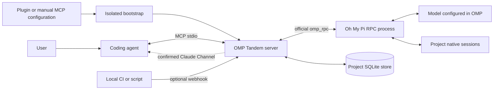

# OMP Tandem — Полное руководство

[Главная страница проекта](../README.ru.md)

[English](guide.md) · **Русский** · [简体中文](guide.zh-CN.md)

**Независимый ИИ-напарник для вашего агента разработки: советуйтесь, проектируйте, реализуйте и проверяйте вместе через Oh My Pi.**

OMP Tandem предоставляет локальный MCP-мост в виде плагина Claude Code и переносимого пакета Agent Plugins для Codex и совместимых клиентов. Другие локальные MCP-клиенты могут использовать тот же сервер без поддержки плагинов.

**Версия: 3.4.0** · [Лицензия MIT](../LICENSE) · [Релизы](https://github.com/Flyozzzz/omp-tandem-public/releases) · [Channels и вебхуки (на английском)](channels.md) · [Oh My Pi](https://github.com/can1357/oh-my-pi)

Встроенных правил для конкретной компании, репозитория или продукта нет. При необходимости вы сами передаёте знания о продукте. Изоляция проектов — это универсальная граница данных, а не жёстко заданная привязка к определённому проекту.

Этот репозиторий начинается с проверенного снимка предыдущей приватной разработки; нумерация версий сохраняет её последовательность. «Legacy history» означает перенос локальных бесед OMP, а не импорт старых Git-коммитов. Старая Git-история в новый репозиторий не включена.

[Участие в разработке](../CONTRIBUTING.md) · [Политика безопасности](../SECURITY.md) · [Непрерывная интеграция](https://github.com/Flyozzzz/omp-tandem-public/actions)

> OMP Tandem запускает настоящий процесс `omp --mode rpc` через официальный Python-клиент `omp_rpc`. Он не подменяет OMP прямыми вызовами OpenAI API. Настройте в OMP поддерживаемого провайдера; у основного агента разработки своя независимая аутентификация. Локальное хранение не означает выполнение модели без сети: контекст задач отправляется настроенным провайдерам моделей.

<a id="contents"></a>
## Содержание

- [Возможности](#what-it-does)
- [Архитектура](#architecture)
- [Требования](#requirements)
- [Установка OMP и настройка провайдера](#install-omp-and-configure-a-provider)
- [Установка плагина](#install-the-plugin)
- [Первое ревью: настройка и один сценарий](#first-review)
- [Другие MCP-клиенты](#other-mcp-clients)
- [Автоматическая подготовка среды выполнения](#automatic-runtime-preparation)
- [Хуки и навыки](#hooks-and-skills)
- [Работа с напарником](#working-with-a-peer)
- [Общие задачи и автономный контроллер](#shared-tasks)
- [Задачи и режимы выполнения](#tasks-and-execution-modes)
- [Настройки выполнения и учёт](#execution-and-accounting)
- [Сценарий ревью: start/status/reply/cancel](#review-run)
- [Ревью неизменяемых снимков](#snapshot-reviews)
- [Жизненный цикл замечаний](#finding-lifecycle)
- [Знания о продукте и решения](#product-knowledge-and-decisions)
- [Изоляция проектов](#project-isolation)
- [Явная передача контекста](#explicit-context-sharing)
- [Инструменты MCP](#mcp-tools)
- [Результаты, вопросы и артефакты](#results-questions-and-artifacts)
- [Квитанции обработки результатов](#result-receipts)
- [Диагностика текущей сессии](#diagnostics)
- [Опрос, Channels и вебхуки](#polling-channels-and-webhooks)
- [Настройки и ограничения](#configuration-and-limits)
- [Обновления и прежняя история](#upgrades-and-legacy-history)
- [Безопасность и ограничения](#security-and-limitations)
- [Устранение неполадок](#troubleshooting)
- [Структура репозитория](#repository-layout)
- [Разработка и проверка](#development-and-verification)
- [Совместимость с настоящим OMP](#real-omp-compatibility)
- [Подготовка сравнительного бенчмарка и разбор случая](#benchmark-and-case-study)
- [Распространение и лицензирование](#distribution-and-licensing)

<a id="what-it-does"></a>
## Возможности

Второй агент полезен ещё до реализации, а не только после неё. OMP может поставить под сомнение предположения, сравнить альтернативы, взять на себя отдельную часть реализации или проверить изменение на соответствие требованиям продукта. Координатор не считается правым по умолчанию — как и его напарник.

| Возможность | Назначение |
|---|---|
| Взаимное сотрудничество | Консультации, независимые рассуждения, проектирование, реализация и ревью |
| Асинхронные задачи | Запуск работы с возможностью параллельно заняться дополняющей её задачей |
| Собственная история диалога OMP | Продолжение существующего диалога OMP без незаметного открытия другого чата |
| Цели для каждого хода | Замена текущей цели вместо повторения всего предыдущего аудита |
| Структурированные контракты | Явное задание ограничений, закреплённых файлов, контекста и критериев приёмки |
| Версионируемые снимки знаний о продукте | Сохранение правил с источниками, примеров, принятых и отклонённых решений |
| Вопросы со сроком ответа | Обращение к координатору вместо выдумывания ответа на нерешённый вопрос |
| Неизменяемые артефакты | Обмен отчётами и подтверждающими материалами с идентификаторами версий и хешами SHA-256 |
| Предварительные результаты | Восстановление полезных материалов даже при отсутствии итогового отчёта |
| Ревью снимков | Сохранённые байты и diff; независимая оценка до сравнения с аргументами автора |
| Сценарий ревью | Один `tandem_review_run`: захват снимка, независимая оценка и не более одного сравнения, общий срок и полные ответы |
| Настройки и учёт | Профили quick/balanced/deep, фактическая модель, токены и стоимость без выдуманных нулей |
| Жизненный цикл замечаний | Неизменяемая история, обоснованность отдельно от проверки исправления |
| Диагностика и квитанции | Проверка текущей сессии и явное право обработать терминальный результат |
| Групповое ожидание | Ожидание завершения любой из выбранных задач или появления вопроса |
| Изоляция проектов | Раздельные хранилища задач, истории, артефактов, знаний о продукте и событий |
| Явная передача контекста | Передача только выбранного снимка и материалов, на которые он ссылается |
| Необязательная push-доставка | Claude Code Channels и защищённый вебхук на localhost |
| Миграция только копированием | Сохранение прежних результатов и собственных сессий OMP без удаления оригиналов |

<a id="architecture"></a>
## Архитектура



1. Клиент загружает плагин или запускает настроенную stdio-команду.
2. Загрузчик подготавливает Python-окружение с зафиксированными зависимостями и обычной, не editable-установкой пакета вне каталога кода плагина.
3. MCP-сервер получает от клиента доверенный рабочий каталог, прежде чем открывать данные проекта. Он никогда не использует переданный моделью `cwd` задачи для выбора пространства имён.
4. Задача занимает один из общих слотов исполнителей и запускает процесс OMP с текущей целью, постоянной политикой и, при необходимости, снимком знаний о продукте.
5. OMP может задавать вопросы, публиковать подтверждающие материалы и отправлять структурированный итоговый отчёт через инструменты, предоставляемые мостом.
6. Координатор читает сам ответ и независимо оценивает важные утверждения.

Для определения завершения используются подтверждение запроса и завершающие события `agent_end`, а не поиск начала запроса в сохранённой истории событий.

<a id="requirements"></a>
## Требования

- **macOS или Linux**, либо **WSL** с инструментами, установленными внутри Linux. Мост использует POSIX-блокировки; нативный Windows не поддерживается.
- **[uv](https://docs.astral.sh/uv/getting-started/installation/)** в `PATH`. Он выбирает/скачивает Python 3.12+ и подготавливает зависимости.
- **[Oh My Pi](https://github.com/can1357/oh-my-pi)** в `PATH` с настроенными поддерживаемым провайдером и моделью.
- Настроенный клиент, например **[Claude Code](https://code.claude.com/docs/en/quickstart)** или **[Codex CLI](https://developers.openai.com/codex/cli)**.
- Доступ к сети для первоначального скачивания зависимостей и обращения к выбранным удалённым провайдерам моделей.

Установка плагина автоматически регистрирует входящий в комплект MCP-сервер. Она **не** устанавливает OMP скрытно, не выполняет аутентификацию у провайдеров, не копирует учётные данные и не обходит политику организации. Установите `uv` и OMP один раз; Python-зависимости приложения подготавливаются автоматически.

| Клиент | Интеграция | Источник рабочего каталога |
|---|---|---|
| Claude Code | Нативный плагин или ручная настройка stdio MCP | `CLAUDE_PROJECT_DIR`; также поддерживается явное переопределение оператором |
| Codex CLI | Переносимый пакет Agent Plugins или ручная настройка stdio MCP | Созданные клиентом метаданные запроса `codex/sandbox-state-meta.sandboxCwd`; поддерживаются в Codex 0.145.0 |
| Интеграция Codex с IDE | Ручная настройка MCP там, где она поддерживается; доступность плагинов зависит от интерфейса | Тот же механизм клиентских метаданных, если клиент их передаёт |
| Другие локальные MCP-клиенты | Ручная настройка stdio; переносимый плагин, если клиент его поддерживает | Один однозначно определённый корень клиента или явно заданный оператором корень проекта; при обычном запуске вне плагина также поддерживается исходный cwd |
| ChatGPT только в браузере / мобильное приложение | Установка пакета не развёртывает локальные процессы | Нужен подходящий локальный клиент с возможностью выполнения процессов либо отдельно спроектированная удалённая интеграция |

Подключение локального маркетплейса из GitHub не означает принятия в публичный каталог плагинов поставщика. В частности, локальный stdio-сервер не становится автоматически публичным HTTPS-сервисом MCP.

<a id="install-omp-and-configure-a-provider"></a>
## Установка OMP и настройка провайдера

<a id="install-the-prerequisites"></a>
### Установка необходимых инструментов

На машине с Homebrew:

```sh
brew install uv
brew install can1357/tap/omp
```

Официальные автономные установщики для macOS/Linux:

```sh
curl -LsSf https://astral.sh/uv/install.sh | sh
curl -fsSL https://omp.sh/install | sh
```

Эти команды выполняют скрипты с официальных адресов распространения. Ознакомьтесь с ними или используйте одобренный пакетный менеджер, если этого требует ваша организация. OMP Tandem не выполняет их из хука.

Если вы уже используете поддерживаемую версию Bun, документация OMP также предлагает:

```sh
bun install -g @oh-my-pi/pi-coding-agent
```

Сведения о платформах и требованиях к Bun приведены в [актуальных инструкциях по установке OMP](https://github.com/can1357/oh-my-pi#install). Откройте терминал заново, если установщик изменил `PATH`.

<a id="configure-your-own-provider"></a>
### Настройка собственного провайдера

Запустите процедуру настройки OMP:

```sh
omp setup
```

Либо откройте сессию OMP:

```sh
omp
```

Внутри OMP используйте `/login` для поддерживаемых способов входа через учётную запись и `/model` для выбора модели по умолчанию. Для провайдеров с API-ключами следуйте инструкциям OMP по настройке конкретного провайдера или переменных окружения. Не помещайте ключи в манифест плагина, снимок знаний о продукте, репозиторий или примеры в чате.

OMP поддерживает несколько облачных провайдеров, а также локальные и OpenAI-совместимые бэкенды. Используйте модель, которая поддерживает вызов инструментов и способна соблюдать требуемый контракт отчётности. «Любой провайдер» означает провайдера, поддерживаемого OMP, а не гарантию того, что любая произвольная модель будет надёжно выполнять агентные задачи.

Для собственного бэкенда используйте конфигурацию OMP `~/.omp/agent/models.yml` и выберите этого провайдера/модель через `omp setup` или `/model`. См. [справочник провайдеров](https://omp.sh/docs/providers). Мост наследует выбранную в OMP модель, если она не переопределена явно.

Обнаружение исполняемого файла не проверяет аутентификацию. После установки плагина начните с локальной диагностики и отдельно разрешите потенциально платную живую проверку, как описано в [первом сценарии](#first-review). Настройка OMP не выполняет вход в Claude Code или Codex.

<a id="install-the-plugin"></a>
## Установка плагина

Публичный репозиторий [Flyozzzz/omp-tandem-public](https://github.com/Flyozzzz/omp-tandem-public) не требует приглашения. Политики GitHub, сети и организации продолжают действовать; установщик не переключает за вас учётные записи.

<a id="claude-code"></a>
### Claude Code

```sh
claude plugin marketplace add Flyozzzz/omp-tandem-public
claude plugin install omp-tandem@omp-tandem
```

Запустите новую сессию Claude из каталога нужного проекта. Если клиент просит выполнить `/reload-plugins`, следуйте этой инструкции после завершения активной делегированной работы.

Начните с `/omp-tandem:setup`, затем следуйте [короткому пути к первому ревью](#first-review). Знать все инструменты MCP заранее не требуется.

Общий навык совместной работы доступен как `/omp-tandem:tandem`, а навык настройки — как `/omp-tandem:setup`. Видимые в клиенте имена инструментов MCP включают префикс плагина, но суффиксы инструментов остаются `tandem_*`.

<a id="codex-cli"></a>
### Codex CLI

```sh
codex plugin marketplace add Flyozzzz/omp-tandem-public
codex plugin add omp-tandem@omp-tandem --json
```

Запустите новую сессию Codex в нужном проекте. Используйте `/plugins`, чтобы проверить установку. Запустите навык `/omp-tandem:setup` (или попросите Codex использовать навык настройки OMP Tandem, если интерфейс показывает другое имя), затем следуйте [первому сценарию](#first-review).

Codex требует явной проверки доверия для хуков, не управляемых централизованной политикой; просмотрите их через `/hooks`. MCP-сервер работает без необязательного диагностического хука, поэтому обход проверки доверия к хукам не нужен.

<a id="local-development-or-a-checked-out-copy"></a>
### Локальная разработка или рабочая копия репозитория

```sh
TANDEM_ROOT=/absolute/path/to/omp-tandem
claude plugin marketplace add "$TANDEM_ROOT"
codex plugin marketplace add "$TANDEM_ROOT"
```

После добавления локального маркетплейса установите плагин через соответствующий клиент. Оба каталога маркетплейсов указывают на самодостаточный корень репозитория. Не ссылайтесь на файлы за пределами каталога плагина: клиенты могут скопировать его в версионируемый кеш.

**Избегайте повторной регистрации.** Если вы уже установили MCP отдельно, завершите его задачи и явно удалите/отключите прежнюю регистрацию перед переходом на плагин. Помощник настройки не перезаписывает существующую запись скрытно. В Codex ручная регистрация может иметь приоритет над сервером плагина.

<a id="first-review"></a>
## Первое ревью: настройка и один сценарий

1. Установите плагин для своего клиента командами выше и откройте нужный проект в новой сессии.
2. Выполните `/omp-tandem:setup`. Навык помогает установить необходимые инструменты с вашего согласия, настроить провайдера OMP и подключить MCP; он не копирует чужие ключи и не обходит разрешения.
3. Попросите: **«Проверь OMP Tandem локально через `tandem_diagnose`, без обращения к модели. Покажи привязанный проект и проблемы настройки»**. Это не платный запрос и не доказательство входа к провайдеру.
4. Если нужна проверка настоящего доступа к модели, отдельно разрешите её: **«Разрешаю короткую потенциально платную живую диагностику OMP Tandem»**. Координатор использует `tandem_diagnose(live=true)` и ожидает тот же диагностический `task_id`, а не запускает новые проверки.
5. Передайте исходное требование, затем попросите: **«Через OMP Tandem проверь только staged-изменения по этому требованию. Используй сценарий `tandem_review_run`: сначала независимая оценка, затем не более одного сравнения с моим сохранённым предложением, если оно есть. Ничего не меняй, не запускай shell или тесты. Покажи полные ответы, применимость снимка и неизвестные границы»**.

Координатор выбирает staged-источник, сохраняет один ключ логического запроса и ожидает тот же `run_id`. Если подготовленных изменений нет, сценарий возвращает `no_changes` без обращения к модели. Если для оценки нужен неизменённый вызывающий код или тест, его нужно явно включить в `context_paths` **из того же источника**, а не разрешать скрытое чтение рабочего дерева.

Результат — оценка, а не автоматически применённое исправление или доказательство прохождения тестов. Вы решаете, что делать с замечаниями; реализация и реальные проверки требуют отдельной задачи и соответствующего разрешения. Аргументы для воспроизводимого ручного вызова приведены в [справочнике сценария](#review-run), диагностика — в [отдельном разделе](#diagnostics).

<a id="other-mcp-clients"></a>
## Другие MCP-клиенты

Поддержка плагинов необязательна. Настройте локальный stdio MCP-сервер с тем же скриптом запуска. Подставьте настоящий абсолютный путь к пакету:

```json
{
  "mcpServers": {
    "omp-tandem": {
      "command": "uv",
      "args": [
        "run", "--no-project", "--python", ">=3.12",
        "python", "-I", "/absolute/path/to/omp-tandem/server.py"
      ]
    }
  }
}
```

Клиент должен передать доверенный рабочий каталог. Если он не может этого сделать, добавьте `--project-root` и абсолютный путь к нужному проекту в аргументы сервера **в клиентской конфигурации этого проекта**, а не в одну глобальную конфигурацию с жёстко заданным путём, общую для несвязанных проектов.

Помощник для отдельной установки может подготовить среду выполнения и вернуть точный план конфигурации без изменения настроек клиента:

```sh
uv run --no-project --python '>=3.12' python -I \
  "$TANDEM_ROOT/scripts/install.py" --client none --json
```

Для отдельной регистрации выберите `--client claude` или `--client codex`. Claude поддерживает `--scope user` и `--scope local`; регистрация Codex через помощник поддерживает только пользовательскую область. Локальную для проекта конфигурацию Codex в TOML оператор может вести явно. Используйте `--check` только для проверки необходимых инструментов или `--no-register` для подготовки без регистрации.

Форматы клиентской конфигурации и механизмы одобрения различаются. Поддержка стандартного MCP не подразумевает поддержку Claude Channels, навыков плагина, хуков или локального процесса внутри клиента, работающего только в браузере.

<a id="automatic-runtime-preparation"></a>
## Автоматическая подготовка среды выполнения

Канонический способ запуска использует изолированный Python:

```sh
uv run --no-project --python '>=3.12' python -I "$TANDEM_ROOT/server.py"
```

`--no-project` не позволяет считать Python-конфигурацию основного проекта окружением запуска. `-I` не позволяет модулям из cwd/PYTHONPATH подменить импорты загрузчика или среды выполнения; это **не** песочница ОС. Фактический рабочий каталог и окружение провайдера остаются доступны запущенному приложению.

При первом использовании загрузчик:

1. Вычисляет идентификатор по байтам исходников/ресурсов, метаданным зависимостей/сборки, соответствующим файлам исключений и выбранному интерпретатору.
2. Захватывает блокировку для этого идентификатора, чтобы параллельные запуски не публиковали частично подготовленные окружения.
3. Устанавливает зафиксированные зависимости и пакет не в editable-режиме в новое отдельное поколение окружения.
4. Проверяет, что подготовленный интерпретатор может импортировать среду выполнения.
5. Атомарно публикует маркер готовности только после успешной подготовки.
6. Выполняет `python -I -m omp_tandem`; stdout MCP зарезервирован для протокольного обмена.

Неудачная подготовка не помечает окружение как готовое. Новые или восстановленные поколения не перезаписывают старое работающее окружение. Логи зависимостей выводятся в stderr.

Кеши находятся в `PLUGIN_DATA` или `CLAUDE_PLUGIN_DATA`, а при их отсутствии — в `~/.cache/omp-tandem/runtimes`. Они отделены от историй проектов. При удалении плагина клиент может удалить данные его зависимостей; каталог состояния проектов по умолчанию хранится не там.

Полезные команды:

```sh
uv run --no-project --python '>=3.12' python -I "$TANDEM_ROOT/server.py" --doctor
uv run --no-project --python '>=3.12' python -I "$TANDEM_ROOT/server.py" --prepare
```

`--doctor` не устанавливает зависимости приложения, не читает учётные данные и не проверяет вход к провайдеру. При этом внешний вызов `uv` всё же может скачать Python. `--prepare` выполняет настоящую установку и возвращает путь к интерпретатору в JSON.

Первоначальное скачивание может занять больше времени, чем допускает тайм-аут запуска клиента. Заранее подготовьте окружение или переподключитесь после устранения ошибки настройки; не путайте «MCP настроен» с готовностью исполнителя. Ручная подготовка вне клиента может использовать другой кеш: при предварительной подготовке среды плагина используйте тот же каталог данных, который предоставляет этот клиент.

<a id="hooks-and-skills"></a>
## Хуки и навыки

Пакет Claude содержит `SessionStart`, `PostToolUse` с `asyncRewake` и `SessionEnd` для **необязательного ограниченного watchdog**. Диагностика необходимых инструментов не устанавливает пакеты, не читает ключи и не одобряет разрешения.

- Watchdog независимо от push-доставки возвращает управление для проверки задачи: его срок ограничен 12 секундами, тайм-аут хука — 30 секундами.
- Привязка включает сессию, задачу, поколение задачи и экземпляр MCP; устаревшие и дублирующие сигналы инвалидируются. `SessionEnd` закрывает привязку сессии.
- Работоспособность доказывает отдельное реальное пробуждение хука: подтвердите полученный из него `watchdog_token` через `tandem_channel(action="ack")`. Текст ответа MCP не доказывает, что таймер запущен.
- Хук не запускает задачу и не возвращает ответ OMP. Его сигнал пробуждения — управляющий сигнал, а не ошибка OMP, даже если отладочный вывод Claude помечает код выхода хука 2 как ошибку.

В других клиентах или при отключённых/недоверенных хуках используйте ограниченное ожидание MCP. Основная работа не требует хуков, но `await_event` допустим только при живом, подтверждённом и вооружённом watchdog для выбранных задач; одного подтверждения Channels недостаточно. Проверку доверия не обходят.

Общие навыки предоставляют:

- **`tandem`**: взаимные консультации/проектирование/реализацию/ревью, делегирование с заданными границами, вопросы, отчёты и явную передачу данных.
- **`setup`**: установку необходимых инструментов с согласия пользователя, подготовку среды выполнения, настройку провайдера и инструкции по подключению для конкретного клиента.

<a id="working-with-a-peer"></a>
## Работа с напарником

Перед нетривиальной разработкой скилл задаёт порядок **выяснить задачу → независимо оценить → сопоставить варианты → зафиксировать план → выполнить → взаимно проверить**. Независимая первая оценка должна предшествовать содержательным правкам и поручению реализации в `work`, но объём планирования соразмерен неопределённости и риску.

1. Установите настоящую потребность, ограничения, подтверждённые факты и наблюдаемые критерии результата.
2. Сформируйте свою предварительную оценку и получите независимую постановку задачи от OMP, пока не передавая ему диагноз и аргументы координатора.
3. Выполните одно сравнение вариантов и доказательств, сохраните существенные расхождения и зафиксируйте решение с конкретными проверками. Если данных недостаточно, выберите различающий гипотезы эксперимент либо задайте пользователю необходимый вопрос.
4. Выполните план и взаимно проверьте реализацию по исходным критериям. Если изменилась существенная предпосылка, вернитесь к планированию.

Для локальной задачи с уже подтверждённой причиной и понятным исправлением достаточно краткой первой оценки и короткого сравнения с конкретными проверками; не разворачивайте полный архитектурный обзор. При неоднозначности, высоком риске или широких последствиях нужны полноценные альтернативы и их компромиссы. Обычная граница — **первая независимая оценка + одно сравнение**, затем решение, различающий эксперимент или вопрос, а не бесконечные раунды согласования. Новые раунды и расширение области не запускаются автоматически.

Пропустить новую независимую оценку допустимо только для механической правки без существенного выбора поведения/дизайна либо для явно утверждённого пользователем плана с неизменными границами и предпосылками. Назовите исключение и проверки. Установленная цель или маленький diff сами по себе не являются исключением. Не добивайтесь искусственного единогласия и не запрашивайте одобрение каждой технической мелочи. Read-only беседа не получает права записи через продолжение: для реализации начните отдельную разрешённую `work`-беседу и передайте согласованный план. Запрос только на анализ не разрешает реализацию.

Хорошие запросы разделяют взаимодополняющую работу, а не дублируют её:

> Сначала передай OMP исходную задачу, ограничения, факты и код без моего диагноза и предлагаемого решения. Прочитай его самостоятельную постановку проблемы. Только затем раскрой моё решение и аргументы в следующем ходе и сопоставь оценки.

> Раздели эту реализацию на непересекающиеся наборы файлов. Поручи одну часть OMP в режиме `work` с критериями приёмки. Объедини изменения и организуй взаимную проверку важного поведения.

> Проверь это изменение по закреплённым правилам продукта. Если улучшение безопасности нарушает обязательный пользовательский сценарий, объясни конфликт и предложи альтернативы, а не удаляй этот сценарий молча.

> Продолжи тот же диалог, но обсуждай только предложенное исправление. Не повторяй весь предыдущий аудит и не переноси его старый список критериев приёмки в новую цель.

Наблюдения, подтверждённые пользователем, отличаются от гипотез напарника. Не запускайте уже подтверждённый эксперимент снова лишь для повторной проверки слов пользователя; исследуйте новые утверждения или изменённый код. Ни один участник не должен автоматически одобрять всё, что предлагает другой.

При планировании используйте `tandem_start` для независимой оценки, а `tandem_continue` — для одного раскрытия и сравнения предложения. Для ревью сохранённого кода проще [сценарий `tandem_review_run`](#review-run). Сохраняйте подтверждённые пользователем факты. Если код, история или общий контекст уже раскрывают решение, признайте это влияние, а не называйте ревью слепым. Пропуск нового планирования определяется только явными исключениями выше.

Это **политика инструкций для координатора**, а не исполняемый сервером шлюз разрешений на план или запись. Отдельно код действительно обеспечивает границы снимка и доступность этапа сравнения; в сценарии он также ограничивает число ходов и общий срок. Наличие плана не выдаёт разрешений ОС или клиента.

<a id="shared-tasks"></a>
## Общие задачи и автономный контроллер

Общая задача (`work_id`) — сохраняемый план и карточка прогресса для двух участников, а не один ход OMP (`task_id`). Для первого раза попросите: **«Раздели задачу на два независимых модуля и финальную интеграцию. Зафиксируй файлы, роли и критерии через `tandem_work`, получи согласие обоих участников и покажи карточку. Не запускай автономную работу»**.

| Способ работы | Кто выполняет следующий шаг | Что происходит при отключении клиента |
|---|---|---|
| Подключённые сессии, ручное выполнение | Участник читает карточку, делает `claim`, работает с отдельно разрешёнными инструментами и сдаёт коммит | Карточка остаётся; она не запускает замену отключившемуся агенту |
| Автономный контроллер | Локальный supervisor запускает доступные реализации и проверки в рамках явного разрешения оператора | Отдельно запущенный `start` продолжает работать без MCP-клиентов, пока действуют разрешение и лимиты |

Обе стороны используют **один `tandem_work(request: WorkCommand, wait_seconds=0..25)`**. Место участника у обычного клиентского сервера по умолчанию называется `claude`, даже если основной клиент — Codex. Для второго доверенного клиента оператор задаёт `--work-participant omp` в его конфигурации запуска. Native OMP получает место `omp` от моста. Это роли внутри задачи, а не проверка личности модели: модель не передаёт `actor` и не меняет роль текстом запроса. Участники должны использовать один канонический `--project-root` и одну базовую директорию состояния; не привязывайте второго клиента к пространству имён отдельного worktree.

### План: два модуля, затем интеграция

Ниже аргументы инструмента, не shell-команда. Замените предметную область и пути реальными данными проекта:

```json
{
  "request": {
    "action": "create",
    "expected_revision": 0,
    "operation_id": "report-plan-create-1",
    "plan": {
      "title": "Импорт и сводка отчёта",
      "goal": "Добавить CLI, который читает CSV и выводит сводку",
      "constraints": [
        "Сохранить существующие команды CLI",
        "Не добавлять зависимости",
        "Не запускать shell или тесты без отдельного разрешения"
      ],
      "context": "Контракт: parse_csv(text) возвращает список записей; summarize(records) возвращает сводку. Ошибки входа должны быть видимы пользователю.",
      "acceptance": [
        "CLI связывает оба модуля и выводит корректную сводку",
        "Ошибочный CSV не выдаётся за успешный пустой отчёт"
      ],
      "steps": [
        {
          "id": "parser",
          "title": "Чтение CSV",
          "goal": "Реализовать parse_csv(text) по общему контракту",
          "owner": "claude",
          "reviewer": "omp",
          "owned_files": ["src/report_parser.py"],
          "depends_on": [],
          "acceptance": ["Корректные строки разобраны; повреждённые строки дают явную ошибку"]
        },
        {
          "id": "summary",
          "title": "Расчёт сводки",
          "goal": "Реализовать summarize(records) по общему контракту",
          "owner": "omp",
          "reviewer": "claude",
          "owned_files": ["src/report_summary.py"],
          "depends_on": [],
          "acceptance": ["Суммы соответствуют входным записям; пустой вход обрабатывается явно"]
        },
        {
          "id": "integration",
          "title": "Интеграция и общая приёмка",
          "goal": "Соединить принятые модули с CLI и проверить все общие критерии",
          "owner": "claude",
          "reviewer": "omp",
          "owned_files": ["src/report_cli.py", "src/report_parser.py", "src/report_summary.py"],
          "depends_on": ["parser", "summary"],
          "acceptance": [
            "CLI использует оба принятых модуля",
            "Успешный и ошибочный вход соответствуют общим критериям; сохранены прежние команды"
          ]
        }
      ]
    }
  }
}
```

Каждый шаг имеет разных `owner` и `reviewer`, только `claude` или `omp`. `owned_files` — точные относительные пути, не каталоги/glob-шаблоны. Независимые шаги не могут делить файлы; интеграция может менять файлы предшественников благодаря явным зависимостям. Граф не содержит циклов и имеет ровно один конечный шаг, зависящий прямо или косвенно от всех остальных. Зависимость открывается после **приёмки**, а не после отчёта исполнителя.

Если ошибка перечисляет независимые конечные шаги, например `final-green, suite-duration`, добавьте `suite-duration` в `depends_on` шага `final-green`, если именно он должен объединить результаты. Не удаляйте обязательное исследование или проверку ради прохождения валидации. При `create` явно передавайте `expected_revision: 0`, уникальный `operation_id` и полный `plan`, без `work_id`. Исправленный запрос получает новый `operation_id`; повтор с прежним ключом предназначен только для точно того же запроса. Отклонённое создание не оставляет частичную карточку.

### Согласование, захват шага и взаимная приёмка

В примерах ниже `WORK_ID` — возвращённый `work_id`, `R` — свежий `revision` из `get`, `COMMIT` — полный хеш реально существующего коммита (40 или 64 шестнадцатеричных символа), `SUBMISSION_ID` — текущий `submission.submission_id`. Это запись вызовов инструмента с переменными, не готовый Python-скрипт. Каждый участник вызывает инструмент в своей сессии:

```python
tandem_work(request={"action": "get", "work_id": WORK_ID})

# Сначала claude, затем omp: перед каждым изменением перечитать R.
tandem_work(
    request={
        "action": "agree",
        "work_id": WORK_ID,
        "expected_revision": R,
        "operation_id": "claude-agree-plan-1",
    }
)
tandem_work(
    request={
        "action": "agree",
        "work_id": WORK_ID,
        "expected_revision": R,
        "operation_id": "omp-agree-plan-1",
    }
)

# В сессии claude, когда parser доступен для реализации.
tandem_work(
    request={
        "action": "claim",
        "work_id": WORK_ID,
        "step_id": "parser",
        "expected_revision": R,
        "operation_id": "parser-claim-1",
    }
)
```

Оба `agree` относятся к **точной текущей `plan_revision`**. `revision` меняется и при обычном прогрессе, поэтому после действия другого участника нужна новая карточка. Все изменения, включая `create`, требуют `expected_revision` и `operation_id`: это сравнение-и-замена (CAS) и защита от повторной обработки. После потери ответа допускается повторить только **тот же самый запрос с тем же ключом**; при конфликте перечитайте состояние и создайте новое осмысленное действие с новым ключом. Квитанция не разрешает повторять правки, shell или запуск модели. `get`/`list` не требуют CAS; `history` с `expected_revision` возвращает события после этой ревизии.

`claim` выбирает реализацию или ревью по текущему состоянию шага. Сам вызов не создаёт рабочую копию, не запускает агента и не даёт права редактировать проект. В ручном режиме отдельно организуйте работу в Git и сохраните результат в коммите, доступном исходному репозиторию. Он должен происходить от `source_commit`, закреплённого при захвате, и менять только `owned_files`. Сборку принятых зависимостей для ручной интеграции участник организует сам; автономный контроллер делает её в управляемом worktree.

После фактической реализации в той же сессии:

```python
tandem_work(
    request={
        "action": "submit",
        "work_id": WORK_ID,
        "step_id": "parser",
        "expected_revision": R,
        "operation_id": "parser-submit-1",
        "commit": COMMIT,
        "note": IMPLEMENTATION_NOTE,
        "evidence": IMPLEMENTATION_EVIDENCE,
    }
)
```

`IMPLEMENTATION_NOTE` — непустое описание результата, `IMPLEMENTATION_EVIDENCE` — непустой список реальных материалов: ссылки на коммит/строки, входы и наблюдаемые результаты, сохранённые логи, известные ограничения. Не заменяйте доказательство фразой «тесты прошли», если их не запускали. В управляемом автономном исполнении `commit` **не передают**: supervisor сам сохраняет снимок, проверяет границы файлов и фиксирует коммит после завершения исполнителя.

Проверяющий `omp` читает свежую карточку и **именно сохранённый коммит**, а не меняющееся рабочее дерево, затем захватывает ревью и выносит решение:

```python
tandem_work(
    request={
        "action": "claim",
        "work_id": WORK_ID,
        "step_id": "parser",
        "expected_revision": R,
        "operation_id": "parser-review-claim-1",
    }
)
tandem_work(
    request={
        "action": "accept",
        "work_id": WORK_ID,
        "step_id": "parser",
        "expected_revision": R,
        "operation_id": "parser-accept-1",
        "submission_id": SUBMISSION_ID,
        "note": REVIEW_NOTE,
        "evidence": REVIEW_EVIDENCE,
    }
)
```

`REVIEW_NOTE` и непустой `REVIEW_EVIDENCE` объясняют проверку критериев на текущем снимке. При несоответствии используйте `reject` вместо `accept` и новый ключ операции, укажите причину и доказательства; исполнитель затем получает новую попытку. Для `summary` роли обратные. Финальная приёмка `integration` также подтверждает **общие** критерии плана. Запись приёмки — атрибутированное утверждение модели/человека; хранилище не выполняет тесты и не сертифицирует корректность.

`propose` передаёт **полный** новый `plan`, а не частичный патч. Изменение плана снимает прежние согласования и текущую приёмку, запрещает старым попыткам публиковать результат и отзывает автономное разрешение. Нужны новое согласование обоих участников, разбор незавершённых попыток и, при необходимости, новое разрешение оператора.

### Карточка, блокеры и приватные права попытки

`get` возвращает JSON и поле `markdown` с той же карточкой: цель, ограничения, шаги, роли, зависимости, закреплённые файлы, критерии, блокеры, текущие коммиты, доказательства и `next_action`. Показывайте пользователю эту карточку, а не только «агент занят». `list` перечисляет задачи проекта; `history` сохраняет историю изменений. Проверяйте `status`, `plan_revision`, `agreements`, `steps`, `authorization` и актуальность `result`, прежде чем продолжать работу.

Блокер создают через `block` с `step_id`, непустыми `note` и `condition` — что мешает и при каком условии можно продолжить. Его автор снимает блокер через `unblock` с `blocker_id`, `resolution` и непустым `evidence`; оба действия также требуют свежие `expected_revision` и `operation_id`. При обычном снятом блокере без неопределённого исполнения доступные шаги могут продолжаться в рамках оставшегося разрешения. Блокировка активной попытки, напротив, запрещает ей публиковать результат и может потребовать операторского восстановления.

Если действующий исполнитель сам сообщает блокер и корректно завершает попытку с исходом `blocked`, контроллер сохраняет промежуточный коммит как `checkpoint`, подтверждает завершение процесса и освобождает слот. После снятия блокера новая попытка продолжает эти сохранённые правки, а не начинает модуль с нуля. Это не приёмка результата. Внешняя остановка, потерянное подтверждение, неизвестная стоимость или незавершённые эффекты по-прежнему требуют восстановления оператором.

Право конкретной попытки — приватный токен, а не `work_id` или текст плана. Ручной `claim` возвращает его только при захвате, и мост сохраняет его для последующих вызовов этой сессии; обычные карточки и история токены не раскрывают. Не копируйте токены в репозиторий, переписку или доказательства. Управляемому процессу supervisor передаёт приватный файл capability; сервер проверяет токен и связывает доступ с задачей, шагом, ролью и типом попытки. Такой процесс не может перечислять чужие задачи, подменять роль, сам согласовывать план, выдавать себе автономное разрешение или выполнять операторский `reconcile`.

Повторное подключение даёт доступ к карточке, но **не восстанавливает автоматически ручной захват**. Обычный `WorkCommand` не принимает токен; совпадение роли не передаёт право старой попытки новому процессу. Не делайте новый `claim` ради обхода потерянной сессии. При утрате токена/истечении попытки остановите старое исполнение и используйте описанное ниже восстановление. `heartbeat` фиксирует присутствие владельца, но не является разрешением на повторный запуск и не снимает фиксированный срок попытки.

### Явное разрешение и запуск без подключённого клиента

Для автономной работы нужны Git-репозиторий с коммитом `HEAD`, установленные и отдельно авторизованные CLI `omp` и `claude`. Это не запуск Codex вместо Claude. Команды ниже выполняет **оператор в shell либо агент только после его явного одобрения**, не модель через `tandem_work`. Используйте Python-окружение, где установлен текущий `omp_tandem`; из рабочей копии пакета можно запускать `uv run python -m omp_tandem.work_daemon …`. Подставьте абсолютный корень своего проекта и ID:

```sh
python -m omp_tandem.work_daemon --project-root /absolute/project authorize WORK_ID \
  --budget-seconds 1800 --max-launches 6 --max-cost-usd 5 --allow-work
python -m omp_tandem.work_daemon --project-root /absolute/project start \
  --work-id WORK_ID --concurrency 2
python -m omp_tandem.work_daemon --project-root /absolute/project status
python -m omp_tandem.work_daemon --project-root /absolute/project show WORK_ID
```

Если MCP использует нестандартный `--state-dir`, передавайте тот же путь **перед подкомандой** во всех вызовах. По умолчанию CLI контроллера использует `~/.local/state/omp-tandem`. `authorize` закрепляет текущую согласованную версию плана и исходный коммит, срок, число запусков и бюджет. Шесть запусков в примере — по одной реализации и проверке для трёх шагов, без резерва на исправления. `--allow-work` разрешает реализацию. Дополнительный **`--allow-tests` разрешает произвольный shell для проверок, а не только безопасные тестовые команды**; добавляйте его лишь после отдельного решения о таком доступе.

Разрешение не запускает процесс само по себе. Вместо `start` можно выполнить `run --work-id WORK_ID --concurrency 2` на переднем плане. `start` проверяет наличие действующего разрешения перед отделением процесса; одновременный controller для проекта только один. `--concurrency` допускает 1–4, по умолчанию 2. `--once` завершает контроллер, когда сейчас нет доступной или активной работы; он не обещает дождаться будущего снятия блокера.

Контроллер создаёт detached Git worktree в приватном состоянии проекта вне исходной рабочей копии, составляет принятые зависимости и передаёт проверяющему точный коммит результата. Это защита от случайного смешивания правок, **не песочница ОС**. Процессы сохраняют права пользователя ОС, а разрешённый shell способен выходить за границы worktree. Модель и провайдер могут получать контекст проекта.

Снимки используют точные байты коммитов, в том числе при Git-атрибутах преобразования строк и `ident`. Ограничения: 16 МиБ на файл, 256 МиБ на снимок и 20 000 файлов. Отслеживаемые симлинки, подмодули и настроенные Git-фильтры отклоняются, а не пропускаются молча. Состояние должно находиться вне исходной рабочей копии. Отклонённый проверяющим результат и корректно заблокированная работа сохраняют checkpoint для доработки; конфликтующие версии зависимостей остаются в Git-индексе сохранённого worktree.

Срок и число допущенных запусков ограничены разрешением. Денежный предел — **оценка/мягкий лимит**, не гарантия максимального счёта провайдера: расходы могут стать известны после выполнения. Неизвестная стоимость не считается нулём и приостанавливает работу; исчерпанные лимиты не увеличиваются автоматически. Установка не добавляет глобальные `launchd`/`systemd`-службы. Отключённая машина не выполняет задачи.

Уведомления Channels и пробуждение подключённой сессии только подсказывают перечитать карточку. Для ограниченного ожидания используйте `tandem_work(request={"action": "get", "work_id": WORK_ID}, wait_seconds=25)`. Контроллер читает сохранённое состояние независимо от доставки уведомлений; потерянное уведомление не повод заново запускать работу. Без явно запущенного контроллера закрытие обоих клиентов не превращает ручной план в автономный.

### Пауза, неопределённый исход и применение результата

Для паузы одной задачи участник вызывает `pause` с `work_id`, свежим `expected_revision`, новым `operation_id` и пояснением в `note`. Пауза сохраняется, даже если пришло новое событие. `resume` с теми же обязательными CAS-полями возобновляет состояние задачи, но **не снимает неопределённость старых попыток и не выдаёт нового разрешения**.

```sh
python -m omp_tandem.work_daemon --project-root /absolute/project stop
python -m omp_tandem.work_daemon --project-root /absolute/project status
python -m omp_tandem.work_daemon --project-root /absolute/project revoke WORK_ID
python -m omp_tandem.work_daemon --project-root /absolute/project show WORK_ID
```

`stop` запрашивает остановку контроллера проекта и паузу управляемых им задач; ответ `stop_requested` ещё не подтверждает завершение. Дождитесь остановки через `status` и проверьте попытки. `revoke` отзывает разрешение указанной задачи и запрещает публикацию из прежних активных попыток; сам отзыв также не доказывает исчезновение всех внешних процессов.

После падения контроллера, тайм-аута, утраченного ручного захвата или ошибки после возможного запуска карточка может содержать `recovery_required`. Автоматического повтора нет: процесс мог изменить файлы или внешние системы. Остановите старое исполнение, изучите сохранённые коммиты/worktree, логи и возможные внешние эффекты. Только после этого оператор подтверждает проверку и выбирает новую попытку:

```sh
python -m omp_tandem.work_daemon --project-root /absolute/project reconcile WORK_ID parser \
  --resolution retry --confirm-stopped \
  --note "Решение оператора после проверки старой попытки" \
  --evidence "ЗАМЕНИТЕ на реальные материалы проверки остановки и побочных эффектов"
```

`--confirm-stopped` — ваше явное подтверждение, не вывод из тишины процесса. Не выполняйте пример с фиктивным доказательством. `retry` разрешает переход к новой попытке после снятия остальных препятствий; он не воспроизводит старые команды. `--resolution abandon` оставляет блокер и паузу вместо продолжения. При неизвестной стоимости сначала разберите расходы; после восстановления может понадобиться явный `resume` и новое ограниченное `authorize`. Ни `unblock`, ни повторная доставка события не заменяют `reconcile`.

После независимой приёмки всех шагов карточка имеет `status="completed"` и текущий `result` финальной интеграции. Прочитайте его неизменяемый коммит и доказательства, а затем отдельно решите, переносить ли результат. В исходную ветку ничего не сливается автоматически:

```sh
python -m omp_tandem.work_daemon --project-root /absolute/project apply WORK_ID \
  --expected-head FULL_HASH_OF_INSPECTED_PROJECT_HEAD
```

Подставьте полный хеш `HEAD`, который вы действительно просмотрели. `apply` принимает только актуальный окончательно принятый результат, требует чистую исходную рабочую копию, проверяет ожидаемый `HEAD` и возможность fast-forward; он не делает reset, автоматическое разрешение конфликтов или скрытый stash. Если исходная ветка ушла вперёд либо файлы изменены, сохранённый результат нужно сначала изучить и отдельно согласовать интеграцию. Даже принятая карточка не означает, что непроведённые проверки вдруг выполнены.

<a id="tasks-and-execution-modes"></a>
## Задачи и режимы выполнения

| Режим | Инструменты OMP | Типичное применение |
|---|---|---|
| `think` | Без инструментов проекта/оболочки; предоставленные мостом инструменты сотрудничества остаются доступны | Консультации и рассуждения по переданному контексту |
| `analyze` | Чтение/поиск/glob/веб-поиск; без оболочки, редактирования и LSP | Исследование и ревью; режим по умолчанию |
| `work` | Анализ плюс edit/write/bash/LSP/todo | Явно разрешённая реализация и проверка |

`work` разрешает выполнение без постоянного надзора и не является песочницей. Политики запрета отдельных инструментов продолжают действовать. Декларации закрепления файлов предотвращают пересечение назначений внутри хранилища проекта, но не ограничивают все возможные обращения к файловой системе.

Укажите **ровно одно** из `prompt` и `contract`. Пример аргументов `tandem_start`; замените пути и имена файлов своими:

```json
{
  "cwd": "/absolute/project",
  "mode": "work",
  "contract": {
    "goal": "Fix repeated upload handling",
    "context": "The cause is established; investigate the proposed fix, not the entire system again",
    "scope": {"owned_files": ["src/upload.py"]},
    "constraints": ["Keep the public API", "Preserve concurrent changes"],
    "acceptance": ["Repeated uploads behave correctly", "The existing successful flow is preserved"]
  },
  "timeout_seconds": 1800,
  "question_timeout_seconds": 300
}
```

Закреплённые файлы задаются явными относительными путями внутри `cwd`, без glob-шаблонов и выхода за пределы каталога. Не объявляйте закрепление файлов, о котором вы в действительности не договорились.

Новый `tandem_start` создаёт новый диалог. `tandem_continue` создаёт новую задачу/ход в существующем диалоге. Режим, cwd и базовая `WorkPolicy` сохраняются; новый `TurnContract` заменяет цель/контекст/критерии приёмки и добавляет ограничения только для текущего хода. Он не может изменить закрепление файлов или расширить базовую политику.

<a id="execution-and-accounting"></a>
## Настройки выполнения и учёт

`execution` в `tandem_start`, `tandem_continue` и `tandem_review_run` управляет вычислениями, **не разрешениями**. Профиль не меняет `mode` и не расширяет доступ к файлам или shell.

| Профиль | Уровень thinking | Срок задачи |
|---|---|---|
| `quick` | `low` | 600 секунд |
| `balanced` (по умолчанию) | `high` | 1800 секунд |
| `deep` | `high` | 3600 секунд |

**Deep — тот же `thinking=high`, но срок 60 минут вместо 30 у balanced, а не более высокий уровень рассуждения.** Это прямо показано в схеме выбора и `tandem_scope.execution_profiles`. Каталог описывает значения по умолчанию; после переопределений смотрите effective/actual, а не выводите настройки из названия профиля.

Пример аргументов `tandem_start`:

```json
{
  "cwd": "/absolute/project",
  "mode": "think",
  "prompt": "Сравни два варианта: обработка повторного запроса как ошибки или возврат сохранённого результата. Перечисли необходимые гарантии.",
  "execution": {
    "profile": "quick",
    "thinking": "low",
    "timeout_seconds": 900
  },
  "timeout_seconds": 1200
}
```

Здесь действует 1200 секунд: явный верхнеуровневый `timeout_seconds` имеет приоритет над `execution.timeout_seconds`, затем идут значения выбранного профиля и унаследованные настройки. Необязательный `execution.model` — строка идентификатора реально настроенной модели OMP; без неё используется настройка сервера/OMP. Не подставляйте выдуманного провайдера. Поддержка выбранного thinking проверяется по фактической модели: если OMP понизил уровень или не поддерживает запрос, задача честно завершается ошибкой, а не заявляет запрошенный уровень как достигнутый.

Продолжение наследует эффективные настройки, если они не переопределены. Выбор нового профиля переустанавливает его thinking и срок; отдельные поля уточняют их. После завершения предыдущего хода вызовите `tandem_continue`, подставив возвращённый `conversation_id`:

```json
{
  "conversation_id": "<conversation_id>",
  "prompt": "Уточни поведение при одновременных повторных запросах.",
  "execution": {"profile": "deep"}
}
```

Обычный результат содержит `execution.requested`, `execution.effective`, `execution.actual` и `usage.task`/`usage.conversation`. Запрос и эффективная настройка не доказывают фактическое выполнение; смотрите `actual`. На каждом уровне учёта есть `tokens.input`, `output`, `cache_read`, `cache_write`, `total` и `cost`. Каждая метрика имеет `value`, `known_subtotal`, `status`:

```json
{
  "value": null,
  "known_subtotal": 1200,
  "status": "partial"
}
```

Это учебный пример **одной метрики**, а не результат запуска. `complete` означает полное покрытие сообщённых данных; `partial` сохраняет известный подытог, но оставляет итог `null`; `unknown` оставляет неизвестными и итог, и подытог. Отсутствие данных не равно нулю. Стоимость берётся из native-отчётов OMP, не является счётом провайдера и не вычисляется по выдуманному тарифу; отсутствие цены не означает бесплатную работу. Итог беседы суммирует непересекающиеся ходы модели, включая оба этапа ревью, без повторного прибавления накопленных итогов сессии.

В сценарии `tandem_review_run` есть отдельный **общий `budget_seconds`**: по умолчанию 600 секунд, допустимо 10–7200. Он охватывает захват и запуск, оба этапа и ожидание уточнений. Срок каждого этапа берётся из `execution`/профиля и дополнительно ограничивается оставшимся общим временем. Например, `quick` с общим бюджетом 1200 не получает 1200 секунд на первый этап: его профильный предел остаётся 600; `deep` с общим бюджетом 600 также не получает час. `wait_seconds` (0–25) ограничивает только один вызов MCP и не увеличивает бюджет.

Захват выполняется отдельным управляемым процессом, без удержания общей блокировки контроллера. Отмена/deadline останавливают его группу процессов; публикация транзакционно проверяет владельца, резервирование и срок. Поздний захват не становится `no_changes` и не запускает следующий этап. На владельца MCP — четыре слота захвата, без скрытой очереди. Это управление жизненным циклом, **не песочница ОС**; у низкоуровневого захвата остаются собственные ограничения операций, а не бюджет сценария.

Если публикация снимка временно удерживает общий шлюз записи, отмена может вернуть ещё активный сохранённый статус вместе с `stop_pending` и `next_action="wait"`. Продолжай опрашивать тот же `run_id`: ожидающая фиксации остановка запрещает новый этап, но ещё не означает сохранённую терминальную отмену. Чтение статуса и контроль срока захвата продолжают работать. Подтверждения уведомлений также не ждут публикации; следующее наблюдение может подтвердить событие.

Верхнеуровневый `usage` сценария явно имеет `scope="OMP worker turns only; excludes coordinator usage"`: `peer` агрегирует учёт этапов, а `coordinator=null` и `total_cost=null`. Native-стоимость OMP — не стоимость всего процесса с координатором. `elapsed_seconds` начинается с принятия сценария сервером, а не с начала внешней работы координатора. Полное время процесса, трудозатраты человека и использование модели координатора измеряются отдельно; неизвестное значение нельзя подменять нулём.

<a id="review-run"></a>
## Сценарий ревью: start/status/reply/cancel

Для обычного ревью не нужно вручную создавать снимок и связывать ходы. `tandem_review_run` принимает тот же `ReviewRequest`, что низкоуровневый `tandem_review`, сохраняет неизменяемый источник и выполняет read-only оценку. Все четыре примера ниже — аргументы **одного инструмента `tandem_review_run`**, а не shell-команды. Замените требования, реальные пути и сохранённое предложение автора; метки идентификаторов берите из ответов.

### Запуск

```json
{
  "action": "start",
  "request_key": "upload-staged-review-1",
  "request": {
    "requirements": "Повторная загрузка с тем же ключом не создаёт второй объект.",
    "criteria": ["Первый запрос сохраняет объект", "Повторный запрос возвращает тот же результат"],
    "source": "staged",
    "base": "HEAD",
    "paths": ["src/upload.py"],
    "context_paths": ["src/upload_caller.py", "tests/test_upload.py"],
    "checks": [],
    "author_proposal": "Сохранять результат по ключу идемпотентности.",
    "author_rationale": "Повторное выполнение побочных эффектов недопустимо.",
    "external_boundaries": ["Атомарность внешнего хранилища не проверена"]
  },
  "execution": {"profile": "balanced"},
  "budget_seconds": 600,
  "compare": true,
  "wait_seconds": 25
}
```

Пример предполагает, что вызывающий код и тест не изменены относительно базы и существуют в индексе. Если они изменены и должны входить в ревью, включите их в `paths`; для всех staged-изменений можно вообще опустить `paths`. `context_paths` добавляет сохранённый контекст, а не скрывает дополнительные изменения.

Код сначала выполняет `independent` в `think`, скрывая сохранённые `author_proposal`/`author_rationale`. Затем разрешён **максимум один** `comparison`, только если `compare=true` (по умолчанию), сохранены материалы автора и независимый этап имеет `status="completed"` со структурированным `outcome="success"`. Без автора либо с `compare=false` выполняется только один ход; при `partial`, `blocked`, ошибке или отмене первого этапа сравнение не запускается. Максимум — два хода, не цикл достижения согласия. Пустой набор выбранных изменений, даже с контекстными файлами, даёт `status="no_changes"` без запуска модели.

`request_key` — стабильный непустой ключ одного логического запроса в области **процесса-владельца MCP**. Тот же ключ с тем же нормализованным запросом и настройками возвращает тот же `run_id`; изменённые данные с тем же ключом дают конфликт. Это защита от повторного запуска, не способ ждать и не глобальный ключ между новыми сессиями. Сохраняйте возвращённый `run_id`. Потерявший владельца запуск становится `interrupted`; принятые этапы не воспроизводятся и не передаются новому процессу скрытно. Сценарий не является автономной фоновой службой.

### Ожидание того же запуска

```json
{"action": "status", "run_id": "<run_id>", "wait_seconds": 25}
```

Повторяйте `status`, пока работа активна, обрабатывая вопросы. **Не повторяйте `start` для polling**, не создавайте новый ключ для ожидания и не используйте циклы с нулевым ожиданием. `status` не принимает параметры создания (`request`, `request_key`, `execution`, `budget_seconds`, `compare`). Клиент и владелец MCP должны оставаться открытыми.

### Ответ на текущий вопрос

```json
{
  "action": "reply",
  "run_id": "<run_id>",
  "question_id": "<question_id_from_current_question>",
  "answer": "Атомарность внешнего хранилища неизвестна; сохрани её как блокирующую границу, не считай гарантированной.",
  "wait_seconds": 25
}
```

Ответ относится к текущему ожидающему вопросу, не создаёт новый ход и не расширяет снимок. Точный повтор уже принятого ответа на тот же вопрос идемпотентен; противоречащие или устаревшие ответы отклоняются. Не выдумывайте ответ ради продолжения. Если недостаёт исходного файла, нужен явный новый расширенный захват с новым ключом, а не живое чтение через уточнение. Ожидание ответа расходует общий бюджет.

### Отмена

```json
{"action": "cancel", "run_id": "<run_id>", "wait_seconds": 0}
```

Отмена блокирует запуск следующего этапа и запрашивает остановку активной дочерней задачи; уже полученные ответы сохраняются. Это не откат внешних действий. Сам сценарий не запускает `work`, shell, тестовые команды или автоматическое применение исправлений. Сохранённые `checks` — переданные утверждения о проверках, не поручение исполнить их.

### Что читать в результате

- `run_id`, `review_id`, `task_id` — запуск, снимок и текущий/последний этап; до назначения этапа `task_id` может быть `null`.
- `status`, `phase`, `outcome`, `error` различают состояние запуска, этап (`capture`, `independent`, `comparison`) и исход. Завершение не доказывает правильность оценки.
- `independent` и `comparison` содержат **полные результаты этапов** либо `null`. Читайте их `answer` и структурированный отчёт, а не только `summary`: сценарий уже собирает полные ответы, дополнительный `details=true` ему не нужен.
- `question` содержит текущий вопрос; `findings` сохраняет замечания отдельно по этапам. Это утверждения, а не автоматически принятые дефекты или применённые исправления.
- `applicability` наблюдает применимость к выбранному источнику на момент чтения. Для staged-снимка изменение выбранных записей индекса делает его устаревшим, а посторонние unstaged-правки — нет. Это не гарантия всей среды или невыбранных файлов.
- `created`, `deadline`, `elapsed_seconds` относятся к принятому запуску; `usage` учитывает только OMP-этапы с [явными границами стоимости и времени](#execution-and-accounting).

Координатор сохраняет разногласия и неизвестные границы, независимо проверяет важные утверждения и принимает решение. Код не делает результаты автоматически истинными. Для ручного управления отдельными задачами все прежние API доступны ниже.

<a id="snapshot-reviews"></a>
## Ревью неизменяемых снимков

`tandem_review(action="create")` сохраняет требования, критерии, байты выбранного источника (`selected`), версии из базы (`base`) и индекса (`staged`), хеши и полученный из них diff. Он возвращает неизменяемый `review_id` и метаданные, включая `source` и `code_fingerprint`. Команды тестов **не выполняются автоматически**.

Следующие примеры — учебный сценарий: замените пути, требования и доказательства настоящими, а `<review_id>`, `<conversation_id>` и другие метки — идентификаторами из ответов инструментов. Вызовите `tandem_review`:

```json
{
  "action": "create",
  "request": {
    "requirements": "Повторная загрузка с тем же ключом не создаёт второй объект.",
    "criteria": ["Первый запрос сохраняет объект", "Повторный запрос возвращает тот же результат"],
    "base": "HEAD",
    "paths": ["src/upload.py", "tests/test_upload.py"],
    "checks": [],
    "author_proposal": "Сохранять результат по ключу идемпотентности.",
    "author_rationale": "Повторное выполнение побочных эффектов недопустимо.",
    "external_boundaries": ["Поведение внешнего хранилища не проверено"]
  }
}
```

Выберите `request.source`: **`worktree`** по умолчанию сравнивает рабочее содержимое с базой, **`staged`** — только Git-индекс с базой. Без `paths` первый режим выбирает текущие неигнорируемые изменения, включая unstaged/untracked, второй — только отличия index/base. Явные пути также читаются из выбранного источника. Вне Git поддерживается только worktree с явными путями.

Для проверки только подготовленного коммита:

```json
{"action":"create","request":{"requirements":"Проверь только подготовленный коммит по исходным требованиям пользователя.","source":"staged","base":"HEAD"}}
```

В staged-режиме `selected`, режимы файлов, тип изменения и diff берутся из индекса; рабочие файлы не читаются даже при повторном захвате и `assess`. Поздние unstaged-правки и untracked не попадают в материал. Staged-удаление остаётся удалением даже при восстановленном рабочем файле. Пустой набор честно возвращает ноль файлов; запускать пустое ревью не нужно.

Новые снимки и fingerprint фиксируют источник. Старые снимки без поля остаются worktree-снимками без переписывания сохранённого содержимого и хешей. Выбранные submodule и неслитые записи индекса отклоняются явно. Лимиты прежние: 256 файлов, 4 MiB на файл, 16 MiB материалов; ограниченные повторные чтения не являются транзакцией файловой системы.

### Явно сохранённые вызывающие файлы и тесты

`request.context_paths` добавляет неизменённые относительно базы файлы, необходимые для понимания выбранных изменений: вызывающий код, тесты, определения контрактов. Эти пути сохраняются вместе со снимком и читаются тем же привязанным reader. В `staged` их байты берутся **только из индекса**, в `worktree` — из рабочего дерева. Это относится и к явным `paths`; staged-снимок не дополняется поздними рабочими правками.

Если файл из `context_paths` отсутствует в выбранном источнике, захват завершается явной ошибкой, а не молча пропускает его. Изменённый относительно базы контекстный файл в Git нужно явно включить в набор выбранных изменений `paths` (либо выбрать все изменения, опустив `paths`). Он не может пройти под видом неизменённого контекста. Роли файлов отражаются в manifest как `change`/`context`, с `change_count` и `context_count`; одни контекстные файлы не запускают сценарий ревью.

Общие ограничения **256 файлов и 16 MiB материалов** включают изменения и контекст вместе, а не дают каждому набору отдельный лимит; предел на файл остаётся 4 MiB. Если во время оценки обнаружен отсутствующий необходимый контекст, исполнитель должен задать вопрос или явно сообщить блокирующую границу. Расширение требует нового захвата и новой независимой оценки; скрытое чтение живого файла не допускается. Сохранение контекста не превращает весь репозиторий или внешнюю среду в неизменяемый снимок.

Если проверки действительно выполнялись отдельно, можно передать `checks` в запросе создания. Например, учебная форма одной записи:

```json
{
  "name": "Повторная загрузка",
  "command": "pytest tests/test_upload.py -q",
  "output": "Вставьте сюда фактический сохранённый вывод команды",
  "source": "Локальный запуск координатора"
}
```

`name` и `output` обязательны; `command`, `source`, `code_fingerprint` необязательны. `code_fingerprint`, если известен, — настоящий SHA-256 из 64 строчных шестнадцатеричных символов. Переданный вывод всегда считается **непроверенным утверждением источника**, даже при совпадении fingerprint; неизвестная связь с кодом не считается подтверждённой. Не запускайте пример с учебным текстом как доказательство успешного теста.

### Независимая оценка

Вызовите `tandem_start` со снимком, **обязательно `mode="think"`**:

```json
{
  "cwd": "/absolute/project",
  "mode": "think",
  "review_id": "<review_id>",
  "review_stage": "independent",
  "prompt": "Прочитай сохранённые требования, критерии, файлы, diff и проверки. Дай независимую оценку, укажи доказательства, гипотезы и неизвестные границы.",
  "execution": {"profile": "balanced"}
}
```

`independent` — этап по умолчанию. Исполнитель использует привязанный к задаче `tandem_review_read`, а не живые инструменты файловой системы; аргументы автора скрыты. Не раскрывайте их самостоятельно в `prompt` или общем контексте независимого этапа. Снимок не стирает уже видимое влияние кода/истории: такое ревью не следует называть слепым.

Дождитесь завершения и прочитайте первый ответ. Координатор может читать страницы через `tandem_review`:

```json
{
  "action": "read",
  "review_id": "<review_id>",
  "section": "selected",
  "path": "src/upload.py",
  "offset": 0,
  "limit": 16000
}
```

Разделы: `manifest`, `requirements`, `criteria`, `diff`, `selected`, `base`, `staged`, `checks`, `author`. `path` нужен только для `selected`/`base`/`staged`. Следуйте `next_offset`; `offset`/`limit` относятся к символам выдаваемого текста, а `encoding` различает UTF-8 и base64 для двоичных данных. `author` читается только с явным `reveal_author=true`; не раскрывайте его независимому исполнителю.

### Сравнение с автором и применимость

Только после завершённой независимой оценки **того же снимка в той же беседе** со структурированным `outcome="success"` вызовите `tandem_continue`:

```json
{
  "conversation_id": "<conversation_id>",
  "review_id": "<review_id>",
  "review_stage": "comparison",
  "prompt": "Теперь прочитай аргументы автора и сравни их с первой оценкой. Раздели согласие, обоснованные возражения и вопросы, требующие новых доказательств."
}
```

На этом этапе привязанный reader разрешает раскрытие автора. Явное чтение координатором:

```json
{"action": "read", "review_id": "<review_id>", "section": "author", "reveal_author": true}
```

Первый ответ сохраняется и не переписывается задним числом. Для изменённого кода создайте новый снимок и начните с `independent`, а не переносите разрешение сравнения со старого `review_id`.

Для staged-снимка дальнейшие unstaged-правки не меняют применимость, а изменение выбранной записи индекса делает его устаревшим. Новые staged-пути вне сохранённого набора не считаются проверенными: перед выводом обо всём изменившемся коммите создайте новый снимок.

Перед применением выводов вызовите:

```json
{"action": "assess", "review_id": "<review_id>"}
```

`status` бывает `current_selected_state`, `stale`, `previous_version`, `unknown`. Это наблюдение выбранных файлов, индекса и Git-идентичности в момент проверки, **не гарантия всей среды**. Невыбранные файлы, зависимости, окружение, внешние сервисы и фактическое выполнение тестов остаются за границей; `whole_environment_immutable=false`. В результате задачи `review.applicability` относится к сохранённому снимку и моменту наблюдения, а не навсегда к текущему проекту.

<a id="finding-lifecycle"></a>
## Жизненный цикл замечаний

`tandem_findings` хранит замечания с устойчивым UUID `finding_id`, человеческим номером внутри беседы и неизменяемой дополняемой историей. **Обоснованность (`validity`) и исправление (`resolution`) независимы:** подтверждённое замечание остаётся подтверждённым после исправления; заявление об исправлении не является его проверкой.

Создайте гипотезу по существующим беседе и снимку:

```json
{
  "action": "create",
  "conversation_id": "<conversation_id>",
  "review_id": "<review_id>",
  "finding": {
    "title": "Одновременный повтор может создать второй объект",
    "description": "Между проверкой ключа и сохранением возможен второй запрос.",
    "location": {"path": "src/upload.py", "start_line": 40, "end_line": 48},
    "reproduction_conditions": ["Два запроса с одинаковым ключом приходят одновременно"],
    "evidence": ["В выбранных строках снимка проверка и запись разделены"],
    "reason": "Нужны доказательства атомарности внешнего хранилища.",
    "validity": "hypothesis"
  }
}
```

`location.path` должен присутствовать в manifest исходного снимка; путь вне сохранённых материалов отклоняется. При достаточных доказательствах можно создать сразу `validity="confirmed"`. Обновление требует текущий `expected_revision`; при конфликте перечитайте замечание, а не повторяйте запись вслепую. `change.review_id` должен обозначать текущий или более новый снимок.

| `change.action` | Переход |
|---|---|
| `note` | Добавляет причину/доказательства, не меняет обоснованность или состояние исправления |
| `confirm` | Переводит `hypothesis` в `confirmed`; нужны доказательства |
| `reject` | Переводит в `rejected`, сбрасывает состояние исправления в `open`; нужны доказательства |
| `reopen` | Возвращает исправленное замечание в `open`; отклонённое — в `hypothesis`/`open` |
| `claim_fixed` | Только `confirmed`/`open` → `claimed_fixed`; нужны доказательства |
| `verify_fixed` | Только `confirmed`/`claimed_fixed` → `verified_fixed`; нужны доказательства и завершённая задача проверки со структурированным `outcome="success"` |

Пример подтверждения гипотезы (только после получения настоящего доказательства):

```json
{
  "action": "update",
  "finding_id": "<finding_id>",
  "expected_revision": 1,
  "change": {
    "action": "confirm",
    "review_id": "<review_id>",
    "reason": "Воспроизведение подтвердило нарушение требования.",
    "evidence": ["Вставьте фактический протокол двух параллельных запросов и идентификаторы созданных объектов"]
  }
}
```

После исправления захватите новый снимок и заявите об исправлении. Число ревизии в примере предполагает ровно предыдущее обновление; всегда используйте реально возвращённую ревизию:

```json
{
  "action": "update",
  "finding_id": "<finding_id>",
  "expected_revision": 2,
  "change": {
    "action": "claim_fixed",
    "review_id": "<new_review_id>",
    "reason": "Проверка и сохранение объединены в атомарную операцию.",
    "evidence": ["Сохранённый diff нового снимка: атомарное создание по ключу"]
  }
}
```

Организуйте отдельный завершённый ход проверки в той же беседе, привязанный к `<new_review_id>` (новый снимок требует независимого этапа). Требуется успешный структурированный исход, не `partial` или `blocked`. Проверка только снимка не выполняет тесты сама: реальные результаты проверок следует получить отдельно и сохранить как доказательства. Затем координатор вызывает:

```json
{
  "action": "update",
  "finding_id": "<finding_id>",
  "expected_revision": 3,
  "change": {
    "action": "verify_fixed",
    "review_id": "<new_review_id>",
    "reason": "Завершённая проверка оценила исправление и приложенные доказательства.",
    "evidence": ["Укажите фактический вывод завершённой проверки и её границы"],
    "verification_task_id": "<completed_verification_task_id>"
  }
}
```

`verification_task_id` допустим только для `verify_fixed`; задача обязана быть `completed` со структурированным `outcome="success"`, из той же беседы и именно указанного снимка. Исполнитель не может проверить собственное исправление через ещё не завершённый ход. Даже успешный статус сам по себе не делает доказательства истинными: координатор должен оценить отчёт, доказательства и их границы. Историческое `verified_fixed` относится к проверенному снимку и не гарантирует отсутствие ошибки в живом проекте или корректность произвольных внешних эффектов.

Чтение по UUID либо по номеру беседы и постраничный список:

```json
{"action": "get", "conversation_id": "<conversation_id>", "number": 1, "offset": 0, "limit": 50}
```

```json
{"action": "list", "conversation_id": "<conversation_id>", "review_id": "<new_review_id>", "offset": 0, "limit": 50}
```

Для UUID используйте `{"action":"get","finding_id":"<finding_id>"}` без `conversation_id`/`number`. `get` возвращает историю страницами, `list` — краткие записи. Можно отобрать список по `task_id` вместо фильтров беседы/снимка. Структурированный `TaskOutcome` также принимает необязательные `findings` (черновики) и `finding_updates` (`finding_id`, `expected_revision`, `change`); это не обходит ограничения переходов и не переписывает историю.

<a id="product-knowledge-and-decisions"></a>
## Знания о продукте и решения

`tandem_project_context` публикует неизменяемые снимки краткого описания продукта, его компонентов, правил, примеров, источников и решений. Снимок никогда не выдумывается автоматически из имени репозитория.

Пример публикации с **вымышленными учебными данными**, а не правилами вашего реального продукта:

```json
{
  "action": "publish",
  "context": {
    "project_id": "example-product",
    "product_summary": "A sample product with an automatic normal upload flow",
    "components": ["upload"],
    "rules": [{
      "id": "UX-01",
      "text": "Normal uploads do not require an extra manual confirmation",
      "requirement": "required",
      "applies_to": ["upload"],
      "source": "Teaching example; replace with a confirmed source",
      "positive_examples": ["The authorized flow completes automatically"],
      "negative_examples": ["Every ordinary upload requires manual approval"]
    }],
    "decisions": [{
      "id": "D-01",
      "text": "Use a substring match as a path ownership boundary",
      "status": "rejected",
      "source": "Teaching example of a rejected proposal"
    }]
  }
}
```

- Правила имеют уровень `required` или `advisory`; каждому правилу/решению нужен источник.
- Статусы решений: `accepted`, `rejected`, `deferred`, `superseded`.
- `supersedes` ссылается на другое решение в снимке; циклы отклоняются.
- Идентификаторы правил/решений уникальны в пределах снимка.
- URL источников не загружаются автоматически и не доказывают записанные рядом с ними утверждения.

При запуске работы передайте полученный `context_id` как `project_context_id`. Для обновления существующего `project_id` требуется его текущий `expected_revision`, что предотвращает незаметные конфликты между авторами.

Публикация не обновляет уже работающие задачи. Следующий ход наследует тот же самый снимок, если явно не выбрать другую ревизию того же продукта. Для смены продукта нужен новый диалог.

OMP получает полный выбранный снимок и может предлагать изменения, но ему не предоставляется инструмент публикации снимков. Отчёты могут ссылаться на известные правила через `rule_references`, а на решения — через `decision_references`. Неизвестные идентификаторы отклоняются; корректная ссылка всё равно не доказывает вывод.

<a id="project-isolation"></a>
## Изоляция проектов

Пространство имён определяется хешем канонического корня проекта, а не путём установки плагина, выбранной моделью, веткой Git или названием продукта.

- У разных корней проектов отдельные задачи, диалоги, артефакты, снимки и очереди событий.
- Несколько координаторов в одном корне могут намеренно сотрудничать через общее хранилище проекта.
- `cwd` новой задачи никогда не выбирает и не переключает пространство имён истории.
- По идентификаторам из другого пространства имён нельзя читать его данные, отвечать на вопросы, отменять или продолжать задачи либо восстанавливать данные.
- Один и тот же `project_id` может независимо существовать в разных пространствах имён.

<a id="trusted-client-binding"></a>
### Привязка по доверенным данным клиента

Явно заданный оператором `--project-root` имеет приоритет. В остальных случаях:

- **Claude Code:** используется экспортированный им `CLAUDE_PROJECT_DIR`.
- **Codex:** сервер объявляет поддержку `codex/sandbox-state-meta`; привязка выполняется отложенно по файловому URI `sandboxCwd`, созданному клиентом и переданному с первым запросом инструмента. Последующие запросы без корня или с изменённым корнем отклоняются, а не перепривязывают существующее соединение.
- **Другие клиенты:** поддерживается один однозначно определённый корень `roots/list`. Несколько корней без меток требуют явного корня от оператора. При запуске вне плагина может использоваться исходный cwd.
- **Неизвестный рабочий каталог плагина:** доступ отклоняется по безопасному принципу. Процессы переносимых плагинов обычно запускаются в каталоге плагина; этот каталог никогда не принимается по догадке за проект пользователя.

`tools/list` может обслуживаться без открытия базы данных неизвестного проекта. Вызовите `tandem_scope`, чтобы посмотреть `project_root`, `scope_id` и `root_source`.

Дополнительные разрешения Claude на каталоги перечитываются через `roots/list` перед каждым новым ходом. Метаданные песочницы Codex используются для идентификации, а не для повторной реализации механизма разрешений ОС. Дополнительное разрешение на файловую систему не открывает историю другого проекта. Если клиент меняет рабочий корень уже привязанного соединения, переподключитесь к нужному проекту или осознанно настройте стабильный корень от оператора.

Не запускайте оба окна из одной широкой родительской папки, если ожидаете изоляции вложенных репозиториев. Не указывайте фиксированный `--project-root` одного проекта в глобальной регистрации, используемой несвязанными проектами.

Расположение данных по умолчанию:

```text
~/.local/state/omp-tandem/
  projects/<scope_id>/
    scope.json
    tasks.sqlite3
    sessions/
    channels/
  worker-slots/
  transfers/
```

По умолчанию данные локальны для машины/пользователя. Git не синхронизирует историю выполнения. Другой корневой путь или worktree получает другое пространство имён; мост не предполагает, что перемещённая папка должна унаследовать чужое пространство имён.

<a id="explicit-context-sharing"></a>
## Явная передача контекста

Чтобы передать выбранные знания о продукте из A в B:

1. В A вызовите `tandem_export_context(context_id, target_project_root)`, указав настоящий корень B.
2. Передайте полученный `transfer_id` в B только тогда, когда пользователь намерен поделиться этими данными.
3. В B вызовите `tandem_import_context(transfer_id, expected_revision)`.
4. Используйте новый локальный `context_id` для задач B.

Передаются только выбранный снимок и подтверждающие материалы, на которые он непосредственно ссылается. Задачи, диалоги, вопросы и события не передаются. Идентификаторы контекста/материалов создаются заново, а ссылки переназначаются. Импортированные материалы принадлежат снимку, а не фиктивной задаче.

Экспорт привязан к получателю. Третий проект не может выполнить импорт вместо B; исходные идентификаторы остаются недоступны. Импорт атомарен, учитывает ревизии и идемпотентен для одного и того же идентификатора передачи. Происхождение сохраняется, но импорт **не означает одобрения** и не предоставляет разрешений на инструменты.

Механизм работает локально в пределах одной базовой директории состояния (state-base). Пакеты передачи сохраняются до удаления оператором; автоматического срока истечения нет. Считайте содержимое пакетов и идентификаторы передачи конфиденциальными данными, а не публичными ссылками для скачивания.

<a id="mcp-tools"></a>
## Инструменты MCP

Для первого ревью начните со сценария `tandem_review_run`, для общего плана и взаимной приёмки — с [`tandem_work`](#shared-tasks). Остальные инструменты нужны для более точного ручного управления. Префиксы зависят от клиента; ниже приведены стабильные суффиксы. MCP `Context` внедряется автоматически и не является пользовательским аргументом.

| Инструмент | Основные входные данные | Назначение |
|---|---|---|
| `tandem_scope` | Нет | Просмотр неизменяемой границы проекта и результата миграции при запуске |
| `tandem_work` | `request: WorkCommand`, `wait_seconds` | Общая карточка, согласование плана, роли, блокеры и приёмка; без выдачи автономных разрешений |
| `tandem_start` | `cwd`, `prompt` или `contract`, `mode`, тайм-ауты, `project_context_id`, `execution`, `review_id`, `review_stage` | Новая задача и диалог |
| `tandem_continue` | `conversation_id`, `prompt` или `contract`, тайм-ауты, `project_context_id`, `execution`, `review_id`, `review_stage` | Новый ход с существующей историей |
| `tandem_result` | `task_id`, `wait_seconds`, `details` | Чтение ответа, исхода, вопроса, артефактов и диагностики |
| `tandem_wait` | `task_ids`, `wait_seconds` | Ожидание любого выбранного результата/вопроса |
| `tandem_list` | `limit` | Последние задачи в этом пространстве имён без объёмного содержимого |
| `tandem_reply` | `task_id`, `question_id`, `answer` | Ответ на конкретный ожидающий вопрос |
| `tandem_cancel` | `task_id` | Запрос отмены; не откатывает правки |
| `tandem_publish_artifact` | `conversation_id`, `name`, `content`, `media_type` | Публикация неизменяемой версии материала |
| `tandem_read_artifact` | `artifact_id`, `offset`, `limit` | Постраничное чтение материала |
| `tandem_project_context` | `action=publish/get/list`, снимок/идентификаторы, `expected_revision`, `limit` | Управление снимками знаний о продукте с указанием источников |
| `tandem_export_context` | `context_id`, `target_project_root` | Предложение снимка конкретному получателю |
| `tandem_import_context` | `transfer_id`, `expected_revision` | Приём адресованного снимка |
| `tandem_channel` | `action=status/probe/ack/pending/recover`, `event_id`/`probe_token`/`watchdog_token`, `task_id`, `include_previous`, `limit` | Управление необязательной доставкой |
| `tandem_review` | `action=create/read/assess`, `request` или `review_id`, `section`, `path`, `offset`, `limit`, `reveal_author` | Снимок ревью, чтение и наблюдение применимости |
| `tandem_review_run` | `action=start/status/reply/cancel`, `request_key`, `request`, `run_id`, `execution`, `budget_seconds`, `compare`, `wait_seconds`, `question_id`, `answer` | Ограниченный read-only сценарий: снимок, независимая оценка, максимум одно сравнение и полные результаты |
| `tandem_findings` | `action=create/update/get/list`, идентификаторы, `finding`, `change`, `expected_revision`, `offset`, `limit` | История замечаний по версиям |
| `tandem_diagnose` | `live`, `task_id`, `expected_project`, `wait_seconds`, `timeout_seconds` | Локальная или явно запрошенная живая диагностика |
| `tandem_receipt` | `task_id`, `action=status/claim/complete`, `token` | Право обработать терминальный результат |

Сам OMP получает `tandem_ask`, `tandem_finish`, `tandem_publish_artifact` и `tandem_read_artifact` как инструменты моста, привязанные к его задаче. Для ревью доступен также `tandem_review_read`, привязанный к снимку и этапу задачи: он читает только сохранённые материалы, а не текущую файловую систему. `tandem_finish` обязателен даже для обычного текстового ответа; это не обычный инструмент координатора.

<a id="results-questions-and-artifacts"></a>
## Результаты, вопросы и артефакты

`task_id` обозначает один ход, а `conversation_id` — его сохраняемый диалог OMP. `question_id`, `artifact_id` и `context_id` обозначают соответственно конкретный вопрос, неизменяемую версию материала и снимок знаний о продукте.

| Статус | Значение |
|---|---|
| `starting` | Запуск исполнителя |
| `running` | Активная работа |
| `waiting_input` | Ожидание ответа координатора |
| `cancelling` | Запрошена отмена |
| `completed` | Ход завершён; проверьте его исход |
| `failed` | Ошибка выполнения или отсутствие обязательного отчёта |
| `cancelled` | Работа отменена |
| `interrupted` | При восстановлении обнаружена работа без живого владельца |

`completed` не доказывает `success`. Исход бывает `success`, `partial` или `blocked`; у исторического неструктурированного ответа может не быть оценённого исхода.

Читайте **`answer`**, а не только `summary`. Для длинных ответов в стандартном результате доступны `answer_truncated` и `answer_artifact_id`. `details=true` включает полный ответ/отчёт, контракт, текущую цель и `diagnostics`, например путь к собственной сессии OMP и действующие лимиты.

Отсутствие `tandem_finish` не превращается в успех лишь потому, что обычный текст звучит уверенно. Сохранённый текст и `provisional_artifacts` остаются доступны. Просмотрите их перед повторным запуском всей задачи.

Сроки ответа на вопросы задаёт координатор. Истечение срока не означает согласия. `tandem_reply` возобновляет ожидающего исполнителя; новый `tandem_continue` нужен для нового хода после завершения. Одинаковые повторные ответы идемпотентны; противоречащие или устаревшие ответы отклоняются.

`tandem_wait` возвращает сведения о готовности, а не полные ответы. Прочитайте готовые результаты и исключите обработанные идентификаторы завершённых задач из последующих наборов ожидания. Следуйте текущему `next_action`: `await_event` допустим только при живом вооружённом watchdog, а не лишь подтверждённом push. Перед применением терминального результата получите [квитанцию обработки](#result-receipts).

Артефакты — это неизменяемые версии текста/Markdown/JSON с SHA-256. Имена являются логическими метками, а не произвольными путями файловой системы. Читайте страницы с помощью `next_offset`; смещения считаются в символах Unicode, а не в байтах. Предварительные артефакты не являются одобренными итоговыми результатами.

<a id="result-receipts"></a>
## Квитанции обработки результатов

Чтение результата и подтверждение уведомления не дают права повторно применить его эффекты. После чтения терминального результата (`completed`, `failed`, `cancelled`, `interrupted`), **до его применения**, вызовите `tandem_receipt`:

```json
{"task_id": "<task_id>", "action": "claim"}
```

Только свежий ответ с `authorized=true` разрешает обработку. Сохраните возвращённый `token`; при `authorized=false` не повторяйте эффекты. После завершения обработки:

```json
{"task_id": "<task_id>", "action": "complete", "token": "<token_from_authorized_claim>"}
```

`action="status"` показывает `not_ready`, `unclaimed`, `uncertain` или `completed`, но сам не авторизует обработку. Повторное чтение, уведомление, восстановление события и повторный `claim` даже тем же владельцем не создают нового разрешения.

Если обработчик остановился после `claim`, состояние остаётся `uncertain`: автоматического освобождения нет. Сверьте внешнее состояние и проведите явное согласование вне этого протокола. Квитанция не является транзакцией с внешней системой и не гарантирует exactly-once для произвольных действий; нужны собственные ключи идемпотентности или транзакционная граница.

<a id="diagnostics"></a>
## Диагностика текущей сессии

`tandem_diagnose` по умолчанию проверяет локальное состояние **без вызова провайдера**:

```json
{"expected_project": "/absolute/project"}
```

Он сообщает привязку `project`, доступность OMP, модель и состояние аутентификации в `runtime`, а также доставку и watchdog в `channel`. `expected_project` только сравнивается с доверенным корнем и не меняет привязку. При несовпадении откройте нужный проект/переподключитесь; аргумент задачи не исправляет границу пространства имён.

Только по явному запросу пользователя на живую проверку запустите короткую **потенциально платную** задачу:

```json
{
  "live": true,
  "expected_project": "/absolute/project",
  "wait_seconds": 25,
  "timeout_seconds": 90
}
```

`wait_seconds` ограничен 25 секундами; общий `timeout_seconds` проверки — 10–300 секунд. Если ответ имеет `status="running"`, используйте возвращённый `task_id`, **не запускайте ещё одну проверку**:

```json
{"task_id": "<diagnostic_task_id>", "wait_seconds": 25}
```

В этом вызове не передавайте `live=true`. Только успешная завершённая задача с ожидаемым одноразовым ответом подтверждает `runtime.authentication="verified_by_task"` и показывает фактическую `runtime.actual_model`. Обнаружение исполняемого файла, настройка модели или одна лишь отметка `completed` не доказывают аутентификацию. Отчёт также содержит `execution` и `usage` с теми же неизвестными границами, что обычные результаты.

Локальный CLI `--doctor` остаётся отдельной проверкой без провайдера и указывает на живую MCP-диагностику. Отдельный процесс CLI не может доказать получение push текущим клиентом. Успешный запрос к модели, подтверждённый канал и независимое пробуждение watchdog — разные проверки; даже при успешном push соблюдайте текущие инструкции ограниченного ожидания.

<a id="polling-channels-and-webhooks"></a>
## Опрос, Channels и вебхуки

Опрос — обычный и полностью функциональный способ работы для каждого поддерживаемого MCP-клиента. Для сценария используйте `tandem_review_run(action="status", run_id, wait_seconds=25)`; для отдельных задач — `tandem_result` или `tandem_wait`. Для сотрудничества с напарником Channels не требуются.

Claude Code может дополнительно доставлять события задач/вопросов/вебхуков через Channels. Флаг запуска или подключённый MCP-сервер не доказывает работоспособность доставки: прежде чем будет подтверждено `delivery=push`, координатор должен подтвердить проверочный токен, полученный из настоящего события канала.

Общие инструкции сотрудничества не зависят от доставки. `tandem_scope` и ответы инструментов задач возвращают активные `delivery_instructions`; следуйте им вместе с `delivery` и `next_action`, заменяя прежнюю процедуру при смене доставки. Набор MCP-инструментов остаётся неизменным.

- **Опрос (`delivery=poll`):** задачи не будят координатора. Делайте взаимодополняющую работу либо ожидайте через `tandem_result(wait_seconds=25)` для одной задачи или `tandem_wait(task_ids, wait_seconds=25)` для нескольких, затем читайте готовые результаты. Обрабатывайте вопросы и исключайте обработанные терминальные ID. Повторяйте, пока есть активная работа; без циклов с нулевым ожиданием, опроса `tandem_list` и обещаний будущего уведомления. Настройка каналов и управление вебхуками не входят в процедуру принудительного polling.
- **Подтверждённый push (`delivery=push`):** событие ускоряет получение результата, но само по себе не заменяет ограниченный polling. `await_event` допустим лишь при живом вооружённом watchdog для выбранных задач и подтверждённом независимом пробуждении. Тогда оставьте клиент открытым, делайте другую работу и по событию или сигналу watchdog прочитайте результат. При отсутствии такого watchdog используйте те же ожидания до 25 секунд.
- **Две независимые проверки:** подтвердите `probe_token` только из настоящего события Channels, а `watchdog_token` — только из настоящего пробуждения хука, отдельными вызовами `tandem_channel(action="ack")`. Не подтверждайте токены из ответа инструмента и не выводите наличие таймера из его текста. Проверки канала не служат циклом ожидания задач.
- **Откат:** сбой транспорта, истечение срока или потеря watchdog возвращают ограниченное ожидание. Не используйте цикл с `wait_seconds=0`. Подтверждение вебхука через `event_id` и чтение результата не дают права повторять эффекты: для этого действует отдельный протокол квитанций.

Если пользователь явно не приостановил работу и не принял передачу управления, завершите свою активную работу до финального ответа. Закрытие сессии владельца MCP останавливает активные задачи.

<a id="one-command-launch"></a>
### Запуск одной командой: `claude-tandem`

Для собственного канала OMP Tandem сохрани явное разрешение development-плагина, но спрячь рабочие переменные и флаги в shell-функцию. **Один раз** добавь в `~/.zshrc` (для zsh), предварительно просмотрев код:

```sh
claude-tandem() {
  OMP_TANDEM_CHANNEL=1 \
  MCP_PROTOCOL_NEGOTIATION=legacy \
  OMP_TANDEM_WEBHOOK=1 \
  OMP_TANDEM_WEBHOOK_PORT=0 \
    command claude \
      --dangerously-load-development-channels plugin:omp-tandem@omp-tandem \
      "$@"
}
```

Перезагрузи настройки shell и запускай из папки нужного проекта:

```sh
source ~/.zshrc
claude-tandem
claude-tandem --resume
```

Функция сохраняет текущую папку и передаёт аргументы без подмены обычного `claude`. Она не зависит от пути к конкретной версии плагина в кеше.

Это **одноразовая ручная настройка shell**, а не launcher, который уже автоматически устанавливает плагин. Хук не может задним числом включить Channels в родительском процессе Claude. Подтверждение доверия development-каналу и политика организации продолжают действовать; webhook появляется только после обычного подтверждения получения события канала.

`--dangerously-skip-permissions` не включает webhook. Он отдельно отключает многие запросы разрешений на инструменты, поэтому намеренно не добавлен в функцию по умолчанию. Если ты явно выбираешь такой режим в доверенной среде:

```sh
claude-tandem --dangerously-skip-permissions
```

Без этого флага подтверждай обычные запросы разрешений при необходимости, включая подтверждение канала. Молчание или неподтверждённая проба не означают работающий push.

### Другие способы запуска

Для плагина, уже одобренного списком разрешённых каналов клиента, а не просто установленного:

```sh
uv run --no-project --python '>=3.12' python -I \
  "$TANDEM_ROOT/scripts/launch.py" --approved-plugin omp-tandem@omp-tandem
```

Для отдельно зарегистрированного локального MCP опустите `--approved-plugin`; скрипт запуска запросит локальный канал разработки. Используйте `--delivery poll` для отключения проверок, `--no-webhook` для событий задач без HTTP и `--check` для вывода плана запуска. Аргументы Claude передавайте после `--`.

Скрипт запуска не добавляет обход разрешений на инструменты и не изменяет централизованно управляемые настройки. Держите клиент открытым, чтобы получать события. Организационные настройки `channelsEnabled` и списки разрешённых плагинов продолжают действовать; ранее проверенная учётная запись Team блокировала Channels, и мост не обходил это ограничение.

Необязательный вебхук запускается только после подтверждения, привязывается к `127.0.0.1` и требует bearer-токен. Выбирайте точный дескриптор сессии из `tandem_channel(status)`, а не самый новый файл среди всех окон. HTTP 202 означает устойчивое сохранение, а не выполнение модели. Вебхуки — это данные, а не одобрение разрешений и не HTTP-эндпоинт MCP.

Формат запросов, выбор получателя, подтверждения, восстановление и корпоративная настройка описаны в [документе о Channels и вебхуках (на английском)](channels.md).

<a id="configuration-and-limits"></a>
## Настройки и ограничения

<a id="runtime-arguments"></a>
### Аргументы среды выполнения

| Аргумент | Назначение |
|---|---|
| `--state-dir` | Общая базовая директория состояния; по умолчанию `OMP_TANDEM_STATE_DIR` или `~/.local/state/omp-tandem` |
| `--project-root` | Явное переопределение рабочего каталога оператором |
| `--scope-info` | Просмотр оператором в JSON без запуска MCP и импорта истории |
| `--work-participant` | Доверенное место участника общей задачи: `claude` по умолчанию или `omp`; настраивается оператором, не запросом модели |
| `--work-token-file` | Приватная capability управляемой попытки; ограничивает сервер общим work API, не предназначена для публикации или ручного переноса |
| `--omp` | Исполняемый файл OMP; по умолчанию поиск в `PATH` |
| `--model` | Переопределение модели OMP; иначе `OMP_TANDEM_MODEL` или конфигурация OMP |
| `--disable-channel` | Принудительный опрос без проверок канала/вебхука |
| `--no-webhook` | Отключение HTTP-слушателя |
| `--webhook-port` | Порт loopback; `0` выбирает свободный порт для каждой сессии |
| `--no-legacy-import` | Отключение автоматического копирования прежних данных |
| `--migrate-only` | Явная миграция оператором, вывод JSON, без MCP-сессии |
| `--legacy-cwd` | Явное назначение старого cwd/worktree; можно повторять с `--migrate-only` |
| `--legacy-context` | Явное назначение старого снимка; можно повторять с `--migrate-only` |

Загрузчик дополнительно обрабатывает `--doctor` и `--prepare`. Параметры среды выполнения можно дописывать к канонической команде запуска. Управляющие переменные окружения: `OMP_TANDEM_STATE_DIR`, `OMP_TANDEM_MODEL`, `OMP_TANDEM_CHANNEL`, `OMP_TANDEM_WEBHOOK` и `OMP_TANDEM_WEBHOOK_PORT`. В клиентах, фильтрующих переменные окружения, нужна явная передача/настройка на стороне клиента.

<a id="effective-limits"></a>
### Действующие лимиты

| Ограничение | Значение |
|---|---|
| Одновременные исполнители OMP | 4 суммарно для пространств имён проектов с общей базовой директорией состояния |
| Активные ходы на один диалог | 1 |
| Время на ход | По умолчанию 1800 секунд; 1–7200 |
| Общий срок `tandem_review_run` | По умолчанию 600 секунд; 10–7200, включая запуск, этапы и уточнения |
| Ходы `tandem_review_run` | Не более 2: независимый + одно сравнение; без автора — 1, без выбранных изменений — 0 |
| Одновременные захваты сценариев | 4 на владельца MCP; без автоматической очереди |
| Срок ответа на вопрос | По умолчанию 300 секунд; 1–1800, дополнительно ограничен сроком завершения хода |
| Одно ожидание MCP | До 25 секунд |
| Выбранные задачи `tandem_wait` | 1–32 идентификатора |
| Диагностическая история событий RPC | 200,000 событий; не неограниченная память и не замена собственной истории OMP |
| Полностью сформированные входные данные задачи | До 200,000 байт UTF-8, включая контекст |
| Снимок знаний о продукте | До 64,000 байт UTF-8, 50 правил, 100 решений |
| Снимок ревью | До 256 файлов суммарно с `context_paths`, 4 MiB на файл и 16 MiB сохранённых материалов |
| Страница ревью | По умолчанию 16,000 символов, максимум 50,000 |
| Страница замечаний/истории | По умолчанию 50 записей, максимум 200 |
| Артефакт | До 4 MiB UTF-8; обычный текст, Markdown или JSON |
| Страница артефакта | По умолчанию 16,000 символов, максимум 50,000 |
| Структурированный ответ | До 60,000 символов; стандартный встроенный результат — до 16,000 |
| Передача контекста | До 8 MiB UTF-8, без скрытого усечения |
| Автоматическое копирование прежних файлов | До 64 MiB на запуск |

Исполнители отключают автоматические бэкенды памяти и autolearn, чтобы не создавать общую межпроектную базу знаний. Настроенные пользователем глобальные инструкции OMP и аутентификация остаются под контролем пользователя и используются совместно согласно его настройкам.

<a id="upgrades-and-legacy-history"></a>
## Обновления и прежняя история

Завершите активную работу перед обновлением или сменой способа установки. Уже запущенные MCP-процессы сохраняют загруженный код; во время обновления клиенты плагинов могут удерживать старый каталог кода. Чтобы использовать новую версию, переподключитесь или начните новую сессию.

При установке в виде плагина обновляйте его через менеджер плагинов клиента. Для отдельной рабочей копии репозитория:

```sh
TANDEM_ROOT="$HOME/.local/share/omp-tandem"
git -C "$TANDEM_ROOT" pull --ff-only &&
uv run --no-project --python '>=3.12' python -I "$TANDEM_ROOT/server.py" --prepare
```

Не сбрасывайте локальную работу принудительно ради успешного обновления. Корневой `server.py` остаётся публичной точкой запуска; модули реализации Python теперь находятся в `src/omp_tandem`, а вспомогательные скрипты — в `scripts`. Старые пути импорта Python не сохраняются в виде модулей совместимости.

При миграции прежняя глобальная база `state-base/tasks.sqlite3` и собственные файлы OMP никогда не удаляются и не перезаписываются. Подходящие завершённые диалоги копируются в правильное пространство имён проекта с сохранением идентификаторов/результатов/материалов.

- Для автоматического отнесения к проекту требуется точное совпадение старого cwd; вложенные проекты и временные worktree не определяются по догадке.
- Активные, заблокированные диалоги, диалоги со смешанными владельцами или межпроектными ссылками откладываются.
- Сохраняются собственные метаданные названия/сессии OMP и сопутствующие файлы с тем же базовым именем.
- При отсутствии собственной истории OMP результаты остаются читаемыми, но нативное продолжение невозможно.
- Копирование файлов не удерживает открытыми транзакции чтения/записи SQLite и не блокирует других исполнителей.
- Импортированный диалог не перезаписывается более поздними изменениями в старом процессе.
- Старые токены и очереди Channels не импортируются.

Примеры для оператора с явно заданными реальными путями:

```sh
uv run --no-project --python '>=3.12' python -I "$TANDEM_ROOT/server.py" \
  --project-root /absolute/project --scope-info
uv run --no-project --python '>=3.12' python -I "$TANDEM_ROOT/server.py" \
  --project-root /absolute/project --migrate-only
uv run --no-project --python '>=3.12' python -I "$TANDEM_ROOT/server.py" \
  --project-root /absolute/project --migrate-only --legacy-cwd /absolute/old-worktree
```

Явный `--migrate-only` снимает автоматический лимит копирования файлов 64 MiB. Явно назначенный удалённый worktree сохраняет исходный cwd: результаты остаются читаемыми, но для продолжения нужны существующий каталог и действующее разрешение. Изучайте счётчики и причины миграции; отложенная работа остаётся в исходном хранилище.

<a id="security-and-limitations"></a>
## Безопасность и ограничения

- **Не песочница ОС:** идентификаторы MCP, ограниченные пространством имён, не мешают процессу с вашими разрешениями ОС напрямую читать файлы. Для взаимно недоверенных клиентов используйте отдельные учётные записи ОС или контейнеры.
- **Не посредник для выдачи разрешений:** правила продукта, импорт, артефакты и сообщения вебхуков не могут расширять разрешения. Инструменты OMP в режиме work не подчиняются автоматически песочнице оболочки основного агента.
- **Не независимая приёмка:** отчёты, проверки и ссылки на правила являются утверждениями агента. Проверяйте важное поведение.
- **Не автономный сервис фоновых задач:** закрытие процесса-владельца MCP останавливает его работу. Отмена не откатывает правки.
- **Не скрытая передача учётных данных:** настройка провайдера остаётся в OMP; установка плагина не передаёт доступ другого пользователя.
- **Не универсальное облачное выполнение:** локальному stdio нужна локальная среда выполнения с доступными инструментами и репозиториями.
- **Не скрытая синхронизация через Git:** не коммитьте базы состояния, собственные сессии OMP, пакеты передачи, токены, приватную конфигурацию и окружения выполнения.

Не помещайте конфиденциальные правила одного продукта в глобальные инструкции, если другие проекты не должны их получать. Инструкции из пакета нейтральны по отношению к продуктам.

<a id="troubleshooting"></a>
## Устранение неполадок

| Симптом | Действие |
|---|---|
| Не удаётся получить репозиторий/маркетплейс | Репозиторий публичный; проверьте адрес, сеть, Git и политики организации, приглашение не требуется |
| Отсутствует `uv` или `omp` | Установите нужный инструмент и откройте терминал заново, если изменился `PATH` |
| Подготовка среды выполнения не удалась | Изучите stderr; при ошибке маркер готовности не публикуется |
| Первый запуск MCP превышает тайм-аут | Заранее подготовьте правильный кеш или переподключитесь после скачивания; изучите настройки тайм-аутов клиента |
| OMP не может получить доступ к модели | Настройте провайдера в OMP; локальный `--doctor` не проверяет вход, живая проверка доступна через `tandem_diagnose(live=true)` по запросу пользователя |
| Дублируются инструменты отдельного MCP и плагина | Завершите работу и явно отключите/удалите прежнюю регистрацию |
| В Codex уже есть регистрация | Помощник отказывается заменять обнаруженную существующую запись; разрешите ситуацию явно и избегайте одновременного редактирования конфигурации |
| Не удаётся определить рабочий каталог плагина | Используйте поддерживаемый механизм клиентских метаданных/корней или явный `--project-root` для каждого проекта |
| Рабочий каталог Codex изменился | Переподключитесь к новому корню вместо продолжения работы со старым пространством имён |
| Идентификатор из другого окна неизвестен | Сравните `tandem_scope`; у разных корней намеренно разные данные |
| В обоих окнах видны одни и те же задачи | Проверьте, не используется ли один широкий корень запуска или общее фиксированное переопределение оператором |
| cwd находится вне разрешённых корней | Откройте нужный проект или используйте поддерживаемые разрешения клиента; текст задачи не является разрешением |
| Нет свободного слота исполнителя | Общая базовая директория состояния уже использует доступную ёмкость; содержимое чужих задач остаётся скрытым |
| Истёк срок ответа на вопрос | Не считайте это одобрением; изучите результат и предоставьте новое явное решение |
| Нет итогового отчёта | Перед повторным запуском изучите ошибки, сохранённый текст и предварительные артефакты |
| Конфликт ревизии продукта | Прочитайте текущую ревизию и осознанно опубликуйте с `expected_revision` |
| Передача недоступна | Проверьте назначенного получателя и общую базовую директорию состояния, а не чужой исходный идентификатор |
| Подключение есть, но `delivery=poll` | Проверка/подтверждение или политика организации не разрешили push-доставку |
| Хуки недоверенные/отключены | Используйте ограниченный polling; проверяйте хуки обычным способом, не обходя доверие |
| Push подтверждён, но требуется polling | Без живого вооружённого watchdog push лишь ускоряет получение; соблюдайте текущие инструкции |
| Хук завершился с кодом 2 | Сигнал watchdog — повод проверить задачу, не ошибка OMP; читайте фактический результат |
| Квитанция имеет состояние `uncertain` | Сверьте внешнее состояние; не повторяйте эффекты и не рассчитывайте на автоматическое освобождение |

<a id="repository-layout"></a>
## Структура репозитория

```text
omp-tandem/
  plugin.json                 Portable Agent Plugins identity
  mcp.json                    Portable MCP entry
  .claude-plugin/             Claude manifest and marketplace
  .agents/plugins/            OpenAI/Codex marketplace
  config/                     Client-specific MCP/hook wiring
  skills/tandem/              Collaboration workflow
  skills/setup/               Setup/provider guidance
  server.py                   Public dependency-preparing launcher
  src/omp_tandem/
    bootstrap.py              Frozen private runtime preparation
    binding.py                Trusted client workspace binding
    api.py                    MCP handlers
    cli.py                    Operator/runtime CLI
    review_runs.py            Bounded owner-scoped review scenarios
    reviews.py                Immutable sources, context, and applicability
    bridge.py                 Composition facade
    task_store.py             Scoped SQL, recovery, locks, and lifecycle commits
    task_runtime.py           Task admission, threads, and worker leases
    native_worker.py          OMP RPC execution and host tools
    task_interaction.py       Questions and structured report validation
    task_contracts.py         Persistent policy and per-turn messages
    task_results.py           Result projection and readiness snapshots
    runtime_models.py         Shared request/status types
    prompts.py                Product-neutral peer instructions
    models.py                 Contracts and reports
    workspace.py              Namespace and worker-slot controls
    project_context.py        Immutable product knowledge
    context_transfer.py       Explicit recipient-bound sharing
    artifacts.py              Immutable material store
    migration.py              Copy-only old-history import
    channel.py                Optional Claude delivery
    events.py                 Durable event outbox
    webhook.py                Protected loopback HTTP input
    worker_turn.py            Event-driven turn completion
    resources/worker.yml      Packaged worker overlay
  scripts/                    Setup, launch, and maintenance commands
  tests/                      Isolated regression suite and RPC fixtures
  docs/                       Additional reference material
  pyproject.toml              Package metadata and development tools
  uv.lock                     Locked dependency resolution
  SHA256SUMS                  Distribution file checksums
```

<a id="development-and-verification"></a>
## Разработка и проверка

Из рабочей копии репозитория:

```sh
uv sync --frozen
uv run --frozen pytest -q
uv run --frozen ruff check .
uv run --frozen ruff format --check .
claude plugin validate .claude-plugin/plugin.json
claude plugin validate .claude-plugin/marketplace.json
uv build --wheel
```

Регрессионные тесты используют временные хранилища, локальные тестовые процессы с моделированием сбоев и HTTP/MCP-клиенты вместо платных вызовов моделей. Для существенных изменений среды выполнения также нужны изолированные smoke-проверки с настоящими клиентами: установка пакета, привязка рабочего каталога, завершение через настоящий OMP и миграция, если она затронута.

До рефакторинга в плагин версия 2.4.0 прошла 142 теста, а также реальную проверку изоляции двух проектов Claude/OMP и проверку миграции/продолжения собственной истории OMP с побайтово неизменными оригиналами. Проверки текущего релиза должны быть отражены в примечаниях к нему; прежние результаты не означают, что новые изменения автоматически правильны.

Сохраняйте соглашение о немедленном вычислении аннотаций в слое MCP API: обёртки Context закреплённой версии FastMCP разрешают эти типы при регистрации. Не ослабляйте изоляцию, не выводите успех из отсутствия отчётов и не вводите скрытую межпроектную память ради прохождения теста.

<a id="real-omp-compatibility"></a>
### Совместимость с настоящим OMP

Для 3.3.0 зафиксирована точная проверяемая пара: **официальный OMP 18.1.13** и Python RPC SDK на коммите **`daf07999c2fee9b22edc7bf8fea1fb6272e0df5e`**. Это не заявление о совместимости произвольного диапазона версий. Метод и границы доказательства описаны в [проверке совместимости (на английском)](compatibility.md); источником версий и SHA-256 служит [`config/omp-compatibility.json`](../config/omp-compatibility.json).

Из корня репозитория:

```sh
uv sync --frozen --group dev
uv run --frozen python scripts/verify_omp.py --cache-dir /tmp/tandem-omp-cache --report /tmp/tandem-omp-compatibility.json
```

Скрипт скачивает официальный бинарник выбранной платформы, сверяет закреплённый SHA-256 **до исполнения**, не устанавливает и не заменяет глобальный `omp`. Предел всей команды — 480 секунд. Для уже скачанного файла можно добавить `--omp /absolute/path/to/omp`; он обязан иметь тот же официальный digest. Поддерживаемые закреплённые артефакты: macOS arm64/x64 и Linux x64 glibc, не произвольные пользовательские сборки.

Настоящие бинарник и SDK выполняют RPC-запуск, регистрацию essential host tools с `--no-tools`, `tandem_finish` с полным структурированным ответом, продолжение сохранённой сессии и отмену. Через производственный Bridge также проверяются отказы инструментов в `think`/`analyze`, невозможность чтения живого файла в `think`, чтение в `analyze` и реальные эффекты `write`/`bash` в `work`. Только ответы модели задаёт детерминированный HTTP/SSE-сервер на `127.0.0.1`; RPC не подменяется.

Проверка использует временные HOME, проект, каталоги OMP/Tandem и очищенное окружение. Пользовательские ключи и конфигурация не копируются; платных запросов нет. Успешная локальная проверка настоящего бинарника подтверждает перечисленные пути на проверенной машине. CI настроен выполнять ту же команду на Linux/Python 3.12 и macOS/Python 3.13, но это **не означает, что новый коммит уже прошёл обе CI-задачи**: доказательство — фактический JSON-отчёт и журнал конкретного запуска.

Отчёт фиксирует бинарник и его digest, SDK, версии Tandem/Python/ОС и результат каждой проверки. Это проверка доступности инструментов, **не песочница ОС**, не сертификация всех провайдеров/инструментов и не замер качества модели. Изолированные регрессионные фикстуры остаются полезными, но не заменяют эту проверку реального OMP.

<a id="benchmark-and-case-study"></a>
### Подготовка сравнительного бенчмарка и разбор случая

[`docs/benchmark.md`](benchmark.md) — отдельный англоязычный протокол и **подготовка**, не выполненный сравнительный бенчмарк. [`config/benchmark-result.schema.json`](../config/benchmark-result.schema.json) задаёт схему фактических измерений, [`scripts/benchmark.py`](../scripts/benchmark.py) анализирует локальные записи офлайн и не запускает модели. Для выполнения нужны отдельное согласование набора задач, приватности, ресурсов и затрат.

Протокол сравнивает четыре режима: один агент, самопроверка тем же агентом, наивная передача готового решения второму агенту и Tandem с независимой первой оценкой. Естественные бюджеты и равный общий вычислительный бюджет анализируются отдельно. Учитываются координатор **и** напарник, полное время процесса и трудозатраты человека, качество, ложноположительные замечания, регрессии, ошибки и неизвестные значения. Стоимость OMP-этапов и `elapsed_seconds` сценария не заменяют этих внешних измерений.

[Разбор случая релиза](case-study.md) — отдельное свидетельство с его фактическими измерениями и ограничениями, не доказательство превосходства Tandem. Ни отдельное ревью, ни совместимость с настоящим OMP, ни этот протокол сами по себе не являются четырёхрежимным бенчмарком.

<a id="distribution-and-licensing"></a>
## Распространение и лицензирование

OMP Tandem распространяется по [лицензии MIT](../LICENSE), copyright (c) 2026 Flyozzzz. Разрешены использование, копирование, изменение, распространение, сублицензирование и продажа, включая коммерческие и закрытые продукты. В копиях или существенных частях нужно сохранять уведомление об авторстве и текст разрешения. Программа предоставляется «КАК ЕСТЬ», без гарантий. У зависимостей сохраняются собственные лицензии и условия.

Репозиторий [Flyozzzz/omp-tandem-public](https://github.com/Flyozzzz/omp-tandem-public) публичный. Не публикуйте секреты и внутренние данные; соблюдайте [правила участия](../CONTRIBUTING.md) и [политику сообщения об уязвимостях](../SECURITY.md). Установка и обновления не должны переписывать Git-историю или менять видимость репозитория.

Первоисточники: [Oh My Pi](https://github.com/can1357/oh-my-pi), [плагины Claude](https://code.claude.com/docs/en/plugins-reference), [плагины Codex](https://developers.openai.com/plugins/build/plugins), [спецификация Agent Plugins](https://agent-plugins.org/specification), [uv](https://docs.astral.sh/uv/).
