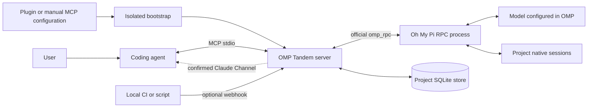

# OMP Tandem — Полное руководство

[Главная страница проекта](../README.ru.md)

[English](guide.md) · **Русский** · [简体中文](guide.zh-CN.md)

**Независимый ИИ-напарник для вашего агента разработки: советуйтесь, проектируйте, реализуйте и проверяйте вместе через Oh My Pi.**

OMP Tandem предоставляет локальный MCP-мост в виде плагина Claude Code и переносимого пакета Agent Plugins для Codex и совместимых клиентов. Другие локальные MCP-клиенты могут использовать тот же сервер без поддержки плагинов.

**Версия: 3.0.1** · [Лицензия MIT](../LICENSE) · [Релизы](https://github.com/Flyozzzz/omp-tandem-public/releases) · [Channels и вебхуки (на английском)](channels.md) · [Oh My Pi](https://github.com/can1357/oh-my-pi)

Встроенных правил для конкретной компании, репозитория или продукта нет. При необходимости вы сами передаёте знания о продукте. Изоляция проектов — это универсальная граница данных, а не жёстко заданная привязка к определённому проекту.

Этот репозиторий начинается с проверенного снимка предыдущей приватной разработки; нумерация версий сохраняет её последовательность. «Legacy history» означает перенос локальных бесед OMP, а не импорт старых Git-коммитов. Старая Git-история в новый репозиторий не включена.

[Участие в разработке](../CONTRIBUTING.md) · [Политика безопасности](../SECURITY.md) · [Непрерывная интеграция](https://github.com/Flyozzzz/omp-tandem-public/actions)

> OMP Tandem запускает настоящий процесс `omp --mode rpc` через официальный Python-клиент `omp_rpc`. Он не подменяет OMP прямыми вызовами OpenAI API. Настройте в OMP поддерживаемого провайдера; у основного агента разработки своя независимая аутентификация. Локальное хранение не означает выполнение модели без сети: контекст задач отправляется настроенным провайдерам моделей.

<a id="contents"></a>
## Содержание

- [Возможности](#what-it-does)
- [Архитектура](#architecture)
- [Требования](#requirements)
- [Установка OMP и настройка провайдера](#install-omp-and-configure-a-provider)
- [Установка плагина](#install-the-plugin)
- [Другие MCP-клиенты](#other-mcp-clients)
- [Автоматическая подготовка среды выполнения](#automatic-runtime-preparation)
- [Хуки и навыки](#hooks-and-skills)
- [Работа с напарником](#working-with-a-peer)
- [Задачи и режимы выполнения](#tasks-and-execution-modes)
- [Знания о продукте и решения](#product-knowledge-and-decisions)
- [Изоляция проектов](#project-isolation)
- [Явная передача контекста](#explicit-context-sharing)
- [Инструменты MCP](#mcp-tools)
- [Результаты, вопросы и артефакты](#results-questions-and-artifacts)
- [Опрос, Channels и вебхуки](#polling-channels-and-webhooks)
- [Настройки и ограничения](#configuration-and-limits)
- [Обновления и прежняя история](#upgrades-and-legacy-history)
- [Безопасность и ограничения](#security-and-limitations)
- [Устранение неполадок](#troubleshooting)
- [Структура репозитория](#repository-layout)
- [Разработка и проверка](#development-and-verification)
- [Распространение и лицензирование](#distribution-and-licensing)

<a id="what-it-does"></a>
## Возможности

Второй агент полезен ещё до реализации, а не только после неё. OMP может поставить под сомнение предположения, сравнить альтернативы, взять на себя отдельную часть реализации или проверить изменение на соответствие требованиям продукта. Координатор не считается правым по умолчанию — как и его напарник.

| Возможность | Назначение |
|---|---|
| Взаимное сотрудничество | Консультации, независимые рассуждения, проектирование, реализация и ревью |
| Асинхронные задачи | Запуск работы с возможностью параллельно заняться дополняющей её задачей |
| Собственная история диалога OMP | Продолжение существующего диалога OMP без незаметного открытия другого чата |
| Цели для каждого хода | Замена текущей цели вместо повторения всего предыдущего аудита |
| Структурированные контракты | Явное задание ограничений, закреплённых файлов, контекста и критериев приёмки |
| Версионируемые снимки знаний о продукте | Сохранение правил с источниками, примеров, принятых и отклонённых решений |
| Вопросы со сроком ответа | Обращение к координатору вместо выдумывания ответа на нерешённый вопрос |
| Неизменяемые артефакты | Обмен отчётами и подтверждающими материалами с идентификаторами версий и хешами SHA-256 |
| Предварительные результаты | Восстановление полезных материалов даже при отсутствии итогового отчёта |
| Групповое ожидание | Ожидание завершения любой из выбранных задач или появления вопроса |
| Изоляция проектов | Раздельные хранилища задач, истории, артефактов, знаний о продукте и событий |
| Явная передача контекста | Передача только выбранного снимка и материалов, на которые он ссылается |
| Необязательная push-доставка | Claude Code Channels и защищённый вебхук на localhost |
| Миграция только копированием | Сохранение прежних результатов и собственных сессий OMP без удаления оригиналов |

<a id="architecture"></a>
## Архитектура



1. Клиент загружает плагин или запускает настроенную stdio-команду.
2. Загрузчик подготавливает Python-окружение с зафиксированными зависимостями и обычной, не editable-установкой пакета вне каталога кода плагина.
3. MCP-сервер получает от клиента доверенный рабочий каталог, прежде чем открывать данные проекта. Он никогда не использует переданный моделью `cwd` задачи для выбора пространства имён.
4. Задача занимает один из общих слотов исполнителей и запускает процесс OMP с текущей целью, постоянной политикой и, при необходимости, снимком знаний о продукте.
5. OMP может задавать вопросы, публиковать подтверждающие материалы и отправлять структурированный итоговый отчёт через инструменты, предоставляемые мостом.
6. Координатор читает сам ответ и независимо оценивает важные утверждения.

Для определения завершения используются подтверждение запроса и завершающие события `agent_end`, а не поиск начала запроса в сохранённой истории событий.

<a id="requirements"></a>
## Требования

- **macOS или Linux**, либо **WSL** с инструментами, установленными внутри Linux. Мост использует POSIX-блокировки; нативный Windows не поддерживается.
- **[uv](https://docs.astral.sh/uv/getting-started/installation/)** в `PATH`. Он выбирает/скачивает Python 3.12+ и подготавливает зависимости.
- **[Oh My Pi](https://github.com/can1357/oh-my-pi)** в `PATH` с настроенными поддерживаемым провайдером и моделью.
- Настроенный клиент, например **[Claude Code](https://code.claude.com/docs/en/quickstart)** или **[Codex CLI](https://developers.openai.com/codex/cli)**.
- Доступ к сети для первоначального скачивания зависимостей и обращения к выбранным удалённым провайдерам моделей.

Установка плагина автоматически регистрирует входящий в комплект MCP-сервер. Она **не** устанавливает OMP скрытно, не выполняет аутентификацию у провайдеров, не копирует учётные данные и не обходит политику организации. Установите `uv` и OMP один раз; Python-зависимости приложения подготавливаются автоматически.

| Клиент | Интеграция | Источник рабочего каталога |
|---|---|---|
| Claude Code | Нативный плагин или ручная настройка stdio MCP | `CLAUDE_PROJECT_DIR`; также поддерживается явное переопределение оператором |
| Codex CLI | Переносимый пакет Agent Plugins или ручная настройка stdio MCP | Созданные клиентом метаданные запроса `codex/sandbox-state-meta.sandboxCwd`; поддерживаются в Codex 0.145.0 |
| Интеграция Codex с IDE | Ручная настройка MCP там, где она поддерживается; доступность плагинов зависит от интерфейса | Тот же механизм клиентских метаданных, если клиент их передаёт |
| Другие локальные MCP-клиенты | Ручная настройка stdio; переносимый плагин, если клиент его поддерживает | Один однозначно определённый корень клиента или явно заданный оператором корень проекта; при обычном запуске вне плагина также поддерживается исходный cwd |
| ChatGPT только в браузере / мобильное приложение | Установка пакета не развёртывает локальные процессы | Нужен подходящий локальный клиент с возможностью выполнения процессов либо отдельно спроектированная удалённая интеграция |

Подключение локального маркетплейса из GitHub не означает принятия в публичный каталог плагинов поставщика. В частности, локальный stdio-сервер не становится автоматически публичным HTTPS-сервисом MCP.

<a id="install-omp-and-configure-a-provider"></a>
## Установка OMP и настройка провайдера

<a id="install-the-prerequisites"></a>
### Установка необходимых инструментов

На машине с Homebrew:

```sh
brew install uv
brew install can1357/tap/omp
```

Официальные автономные установщики для macOS/Linux:

```sh
curl -LsSf https://astral.sh/uv/install.sh | sh
curl -fsSL https://omp.sh/install | sh
```

Эти команды выполняют скрипты с официальных адресов распространения. Ознакомьтесь с ними или используйте одобренный пакетный менеджер, если этого требует ваша организация. OMP Tandem не выполняет их из хука.

Если вы уже используете поддерживаемую версию Bun, документация OMP также предлагает:

```sh
bun install -g @oh-my-pi/pi-coding-agent
```

Сведения о платформах и требованиях к Bun приведены в [актуальных инструкциях по установке OMP](https://github.com/can1357/oh-my-pi#install). Откройте терминал заново, если установщик изменил `PATH`.

<a id="configure-your-own-provider"></a>
### Настройка собственного провайдера

Запустите процедуру настройки OMP:

```sh
omp setup
```

Либо откройте сессию OMP:

```sh
omp
```

Внутри OMP используйте `/login` для поддерживаемых способов входа через учётную запись и `/model` для выбора модели по умолчанию. Для провайдеров с API-ключами следуйте инструкциям OMP по настройке конкретного провайдера или переменных окружения. Не помещайте ключи в манифест плагина, снимок знаний о продукте, репозиторий или примеры в чате.

OMP поддерживает несколько облачных провайдеров, а также локальные и OpenAI-совместимые бэкенды. Используйте модель, которая поддерживает вызов инструментов и способна соблюдать требуемый контракт отчётности. «Любой провайдер» означает провайдера, поддерживаемого OMP, а не гарантию того, что любая произвольная модель будет надёжно выполнять агентные задачи.

Для собственного бэкенда используйте конфигурацию OMP `~/.omp/agent/models.yml` и выберите этого провайдера/модель через `omp setup` или `/model`. См. [справочник провайдеров](https://omp.sh/docs/providers). Мост наследует выбранную в OMP модель, если она не переопределена явно.

Перед использованием плагина выполните один безвредный запрос непосредственно в OMP. Это проверяет реальный доступ к провайдеру; само по себе обнаружение исполняемого файла не проверяет аутентификацию. Настройка OMP не выполняет вход в Claude Code или Codex.

<a id="install-the-plugin"></a>
## Установка плагина

Пока разработка ведётся в закрытом репозитории, вам нужен доступ к нему. Если доступ предоставлен приглашением, сначала примите его и настройте аутентификацию Git-клиента. Установщик никогда не переключает за вас учётные записи GitHub.

<a id="claude-code"></a>
### Claude Code

```sh
claude plugin marketplace add Flyozzzz/omp-tandem-public
claude plugin install omp-tandem@omp-tandem
```

Запустите новую сессию Claude из каталога нужного проекта. Если клиент просит выполнить `/reload-plugins`, следуйте этой инструкции после завершения активной делегированной работы.

Попросите:

> Используй OMP Tandem. Вызови `tandem_scope` и сообщи, к какому проекту выполнена привязка, затем попроси OMP независимо рассмотреть моё предложение в режиме `think`. Дождись ответа и оцени его, а не считай автоматически правильным.

Общий навык совместной работы доступен как `/omp-tandem:tandem`, а навык настройки — как `/omp-tandem:setup`. Видимые в клиенте имена инструментов MCP включают префикс плагина, но суффиксы инструментов остаются `tandem_*`.

<a id="codex-cli"></a>
### Codex CLI

```sh
codex plugin marketplace add Flyozzzz/omp-tandem-public
codex plugin add omp-tandem@omp-tandem --json
```

Запустите новую сессию Codex в нужном проекте. Используйте `/plugins`, чтобы проверить установку. Попросите Codex использовать OMP Tandem и вызвать `tandem_scope` до делегирования.

Codex требует явной проверки доверия для хуков, не управляемых централизованной политикой; просмотрите их через `/hooks`. MCP-сервер работает без необязательного диагностического хука, поэтому обход проверки доверия к хукам не нужен.

<a id="local-development-or-a-checked-out-copy"></a>
### Локальная разработка или рабочая копия репозитория

```sh
TANDEM_ROOT=/absolute/path/to/omp-tandem
claude plugin marketplace add "$TANDEM_ROOT"
codex plugin marketplace add "$TANDEM_ROOT"
```

После добавления локального маркетплейса установите плагин через соответствующий клиент. Оба каталога маркетплейсов указывают на самодостаточный корень репозитория. Не ссылайтесь на файлы за пределами каталога плагина: клиенты могут скопировать его в версионируемый кеш.

**Избегайте повторной регистрации.** Если вы уже установили MCP отдельно, завершите его задачи и явно удалите/отключите прежнюю регистрацию перед переходом на плагин. Помощник настройки не перезаписывает существующую запись скрытно. В Codex ручная регистрация может иметь приоритет над сервером плагина.

<a id="other-mcp-clients"></a>
## Другие MCP-клиенты

Поддержка плагинов необязательна. Настройте локальный stdio MCP-сервер с тем же скриптом запуска. Подставьте настоящий абсолютный путь к пакету:

```json
{
  "mcpServers": {
    "omp-tandem": {
      "command": "uv",
      "args": [
        "run", "--no-project", "--python", ">=3.12",
        "python", "-I", "/absolute/path/to/omp-tandem/server.py"
      ]
    }
  }
}
```

Клиент должен передать доверенный рабочий каталог. Если он не может этого сделать, добавьте `--project-root` и абсолютный путь к нужному проекту в аргументы сервера **в клиентской конфигурации этого проекта**, а не в одну глобальную конфигурацию с жёстко заданным путём, общую для несвязанных проектов.

Помощник для отдельной установки может подготовить среду выполнения и вернуть точный план конфигурации без изменения настроек клиента:

```sh
uv run --no-project --python '>=3.12' python -I \
  "$TANDEM_ROOT/scripts/install.py" --client none --json
```

Для отдельной регистрации выберите `--client claude` или `--client codex`. Claude поддерживает `--scope user` и `--scope local`; регистрация Codex через помощник поддерживает только пользовательскую область. Локальную для проекта конфигурацию Codex в TOML оператор может вести явно. Используйте `--check` только для проверки необходимых инструментов или `--no-register` для подготовки без регистрации.

Форматы клиентской конфигурации и механизмы одобрения различаются. Поддержка стандартного MCP не подразумевает поддержку Claude Channels, навыков плагина, хуков или локального процесса внутри клиента, работающего только в браузере.

<a id="automatic-runtime-preparation"></a>
## Автоматическая подготовка среды выполнения

Канонический способ запуска использует изолированный Python:

```sh
uv run --no-project --python '>=3.12' python -I "$TANDEM_ROOT/server.py"
```

`--no-project` не позволяет считать Python-конфигурацию основного проекта окружением запуска. `-I` не позволяет модулям из cwd/PYTHONPATH подменить импорты загрузчика или среды выполнения; это **не** песочница ОС. Фактический рабочий каталог и окружение провайдера остаются доступны запущенному приложению.

При первом использовании загрузчик:

1. Вычисляет идентификатор по байтам исходников/ресурсов, метаданным зависимостей/сборки, соответствующим файлам исключений и выбранному интерпретатору.
2. Захватывает блокировку для этого идентификатора, чтобы параллельные запуски не публиковали частично подготовленные окружения.
3. Устанавливает зафиксированные зависимости и пакет не в editable-режиме в новое отдельное поколение окружения.
4. Проверяет, что подготовленный интерпретатор может импортировать среду выполнения.
5. Атомарно публикует маркер готовности только после успешной подготовки.
6. Выполняет `python -I -m omp_tandem`; stdout MCP зарезервирован для протокольного обмена.

Неудачная подготовка не помечает окружение как готовое. Новые или восстановленные поколения не перезаписывают старое работающее окружение. Логи зависимостей выводятся в stderr.

Кеши находятся в `PLUGIN_DATA` или `CLAUDE_PLUGIN_DATA`, а при их отсутствии — в `~/.cache/omp-tandem/runtimes`. Они отделены от историй проектов. При удалении плагина клиент может удалить данные его зависимостей; каталог состояния проектов по умолчанию хранится не там.

Полезные команды:

```sh
uv run --no-project --python '>=3.12' python -I "$TANDEM_ROOT/server.py" --doctor
uv run --no-project --python '>=3.12' python -I "$TANDEM_ROOT/server.py" --prepare
```

`--doctor` не устанавливает зависимости приложения, не читает учётные данные и не проверяет вход к провайдеру. При этом внешний вызов `uv` всё же может скачать Python. `--prepare` выполняет настоящую установку и возвращает путь к интерпретатору в JSON.

Первоначальное скачивание может занять больше времени, чем допускает тайм-аут запуска клиента. Заранее подготовьте окружение или переподключитесь после устранения ошибки настройки; не путайте «MCP настроен» с готовностью исполнителя. Ручная подготовка вне клиента может использовать другой кеш: при предварительной подготовке среды плагина используйте тот же каталог данных, который предоставляет этот клиент.

<a id="hooks-and-skills"></a>
## Хуки и навыки

Плагин намеренно содержит **только один вид хука: лёгкую диагностику `SessionStart`**.

- Проверяет только наличие `uv` и `omp` в `PATH`.
- Ничего не выводит, если оба инструмента найдены.
- Выводит краткие инструкции по настройке, если нужного инструмента нет.
- Игнорирует входные данные хука, а не копирует запросы или пути в вывод.
- Не устанавливает пакеты, не вызывает модель, не читает данные аутентификации, не опрашивает задачи, не отменяет работу и не одобряет разрешения.

Хуков `Stop`, `SessionEnd` и одобрения разрешений нет. Ожидание задач, отмена и устойчивое хранение событий уже входят в обязанности моста; дублирование этой логики в хуках могло бы мешать другим сессиям. Отсутствующие или недоверенные хуки не отключают основной рабочий процесс MCP.

Общие навыки предоставляют:

- **`tandem`**: взаимные консультации/проектирование/реализацию/ревью, делегирование с заданными границами, вопросы, отчёты и явную передачу данных.
- **`setup`**: установку необходимых инструментов с согласия пользователя, подготовку среды выполнения, настройку провайдера и инструкции по подключению для конкретного клиента.

<a id="working-with-a-peer"></a>
## Работа с напарником

Хорошие запросы разделяют взаимодополняющую работу, а не дублируют её:

> Попроси OMP независимо оспорить этот проект решения и сравнить альтернативы. Пока он работает, изучи ограничения нашего API. Затем сопоставь подтверждающие материалы и объясни оставшиеся разногласия.

> Раздели эту реализацию на непересекающиеся наборы файлов. Поручи одну часть OMP в режиме `work` с критериями приёмки. Объедини изменения и организуй взаимную проверку важного поведения.

> Проверь это изменение по закреплённым правилам продукта. Если улучшение безопасности нарушает обязательный пользовательский сценарий, объясни конфликт и предложи альтернативы, а не удаляй этот сценарий молча.

> Продолжи тот же диалог, но обсуждай только предложенное исправление. Не повторяй весь предыдущий аудит и не переноси его старый список критериев приёмки в новую цель.

Наблюдения, подтверждённые пользователем, отличаются от гипотез напарника. Не запускайте уже подтверждённый эксперимент снова лишь для повторной проверки слов пользователя; исследуйте новые утверждения или изменённый код. Ни один участник не должен автоматически одобрять всё, что предлагает другой.

<a id="tasks-and-execution-modes"></a>
## Задачи и режимы выполнения

| Режим | Инструменты OMP | Типичное применение |
|---|---|---|
| `think` | Без инструментов проекта/оболочки; предоставленные мостом инструменты сотрудничества остаются доступны | Консультации и рассуждения по переданному контексту |
| `analyze` | Чтение/поиск/glob/веб-поиск; без оболочки, редактирования и LSP | Исследование и ревью; режим по умолчанию |
| `work` | Анализ плюс edit/write/bash/LSP/todo | Явно разрешённая реализация и проверка |

`work` разрешает выполнение без постоянного надзора и не является песочницей. Политики запрета отдельных инструментов продолжают действовать. Декларации закрепления файлов предотвращают пересечение назначений внутри хранилища проекта, но не ограничивают все возможные обращения к файловой системе.

Укажите **ровно одно** из `prompt` и `contract`. Пример аргументов `tandem_start`; замените пути и имена файлов своими:

```json
{
  "cwd": "/absolute/project",
  "mode": "work",
  "contract": {
    "goal": "Fix repeated upload handling",
    "context": "The cause is established; investigate the proposed fix, not the entire system again",
    "scope": {"owned_files": ["src/upload.py"]},
    "constraints": ["Keep the public API", "Preserve concurrent changes"],
    "acceptance": ["Repeated uploads behave correctly", "The existing successful flow is preserved"]
  },
  "timeout_seconds": 1800,
  "question_timeout_seconds": 300
}
```

Закреплённые файлы задаются явными относительными путями внутри `cwd`, без glob-шаблонов и выхода за пределы каталога. Не объявляйте закрепление файлов, о котором вы в действительности не договорились.

Новый `tandem_start` создаёт новый диалог. `tandem_continue` создаёт новую задачу/ход в существующем диалоге. Режим, cwd и базовая `WorkPolicy` сохраняются; новый `TurnContract` заменяет цель/контекст/критерии приёмки и добавляет ограничения только для текущего хода. Он не может изменить закрепление файлов или расширить базовую политику.

<a id="product-knowledge-and-decisions"></a>
## Знания о продукте и решения

`tandem_project_context` публикует неизменяемые снимки краткого описания продукта, его компонентов, правил, примеров, источников и решений. Снимок никогда не выдумывается автоматически из имени репозитория.

Пример публикации с **вымышленными учебными данными**, а не правилами вашего реального продукта:

```json
{
  "action": "publish",
  "context": {
    "project_id": "example-product",
    "product_summary": "A sample product with an automatic normal upload flow",
    "components": ["upload"],
    "rules": [{
      "id": "UX-01",
      "text": "Normal uploads do not require an extra manual confirmation",
      "requirement": "required",
      "applies_to": ["upload"],
      "source": "Teaching example; replace with a confirmed source",
      "positive_examples": ["The authorized flow completes automatically"],
      "negative_examples": ["Every ordinary upload requires manual approval"]
    }],
    "decisions": [{
      "id": "D-01",
      "text": "Use a substring match as a path ownership boundary",
      "status": "rejected",
      "source": "Teaching example of a rejected proposal"
    }]
  }
}
```

- Правила имеют уровень `required` или `advisory`; каждому правилу/решению нужен источник.
- Статусы решений: `accepted`, `rejected`, `deferred`, `superseded`.
- `supersedes` ссылается на другое решение в снимке; циклы отклоняются.
- Идентификаторы правил/решений уникальны в пределах снимка.
- URL источников не загружаются автоматически и не доказывают записанные рядом с ними утверждения.

При запуске работы передайте полученный `context_id` как `project_context_id`. Для обновления существующего `project_id` требуется его текущий `expected_revision`, что предотвращает незаметные конфликты между авторами.

Публикация не обновляет уже работающие задачи. Следующий ход наследует тот же самый снимок, если явно не выбрать другую ревизию того же продукта. Для смены продукта нужен новый диалог.

OMP получает полный выбранный снимок и может предлагать изменения, но ему не предоставляется инструмент публикации снимков. Отчёты могут ссылаться на известные правила через `rule_references`, а на решения — через `decision_references`. Неизвестные идентификаторы отклоняются; корректная ссылка всё равно не доказывает вывод.

<a id="project-isolation"></a>
## Изоляция проектов

Пространство имён определяется хешем канонического корня проекта, а не путём установки плагина, выбранной моделью, веткой Git или названием продукта.

- У разных корней проектов отдельные задачи, диалоги, артефакты, снимки и очереди событий.
- Несколько координаторов в одном корне могут намеренно сотрудничать через общее хранилище проекта.
- `cwd` новой задачи никогда не выбирает и не переключает пространство имён истории.
- По идентификаторам из другого пространства имён нельзя читать его данные, отвечать на вопросы, отменять или продолжать задачи либо восстанавливать данные.
- Один и тот же `project_id` может независимо существовать в разных пространствах имён.

<a id="trusted-client-binding"></a>
### Привязка по доверенным данным клиента

Явно заданный оператором `--project-root` имеет приоритет. В остальных случаях:

- **Claude Code:** используется экспортированный им `CLAUDE_PROJECT_DIR`.
- **Codex:** сервер объявляет поддержку `codex/sandbox-state-meta`; привязка выполняется отложенно по файловому URI `sandboxCwd`, созданному клиентом и переданному с первым запросом инструмента. Последующие запросы без корня или с изменённым корнем отклоняются, а не перепривязывают существующее соединение.
- **Другие клиенты:** поддерживается один однозначно определённый корень `roots/list`. Несколько корней без меток требуют явного корня от оператора. При запуске вне плагина может использоваться исходный cwd.
- **Неизвестный рабочий каталог плагина:** доступ отклоняется по безопасному принципу. Процессы переносимых плагинов обычно запускаются в каталоге плагина; этот каталог никогда не принимается по догадке за проект пользователя.

`tools/list` может обслуживаться без открытия базы данных неизвестного проекта. Вызовите `tandem_scope`, чтобы посмотреть `project_root`, `scope_id` и `root_source`.

Дополнительные разрешения Claude на каталоги перечитываются через `roots/list` перед каждым новым ходом. Метаданные песочницы Codex используются для идентификации, а не для повторной реализации механизма разрешений ОС. Дополнительное разрешение на файловую систему не открывает историю другого проекта. Если клиент меняет рабочий корень уже привязанного соединения, переподключитесь к нужному проекту или осознанно настройте стабильный корень от оператора.

Не запускайте оба окна из одной широкой родительской папки, если ожидаете изоляции вложенных репозиториев. Не указывайте фиксированный `--project-root` одного проекта в глобальной регистрации, используемой несвязанными проектами.

Расположение данных по умолчанию:

```text
~/.local/state/omp-tandem/
  projects/<scope_id>/
    scope.json
    tasks.sqlite3
    sessions/
    channels/
  worker-slots/
  transfers/
```

По умолчанию данные локальны для машины/пользователя. Git не синхронизирует историю выполнения. Другой корневой путь или worktree получает другое пространство имён; мост не предполагает, что перемещённая папка должна унаследовать чужое пространство имён.

<a id="explicit-context-sharing"></a>
## Явная передача контекста

Чтобы передать выбранные знания о продукте из A в B:

1. В A вызовите `tandem_export_context(context_id, target_project_root)`, указав настоящий корень B.
2. Передайте полученный `transfer_id` в B только тогда, когда пользователь намерен поделиться этими данными.
3. В B вызовите `tandem_import_context(transfer_id, expected_revision)`.
4. Используйте новый локальный `context_id` для задач B.

Передаются только выбранный снимок и подтверждающие материалы, на которые он непосредственно ссылается. Задачи, диалоги, вопросы и события не передаются. Идентификаторы контекста/материалов создаются заново, а ссылки переназначаются. Импортированные материалы принадлежат снимку, а не фиктивной задаче.

Экспорт привязан к получателю. Третий проект не может выполнить импорт вместо B; исходные идентификаторы остаются недоступны. Импорт атомарен, учитывает ревизии и идемпотентен для одного и того же идентификатора передачи. Происхождение сохраняется, но импорт **не означает одобрения** и не предоставляет разрешений на инструменты.

Механизм работает локально в пределах одной базовой директории состояния (state-base). Пакеты передачи сохраняются до удаления оператором; автоматического срока истечения нет. Считайте содержимое пакетов и идентификаторы передачи конфиденциальными данными, а не публичными ссылками для скачивания.

<a id="mcp-tools"></a>
## Инструменты MCP

Префиксы зависят от клиента; ниже приведены стабильные суффиксы инструментов. MCP `Context` внедряется автоматически и не является пользовательским аргументом.

| Инструмент | Основные входные данные | Назначение |
|---|---|---|
| `tandem_scope` | Нет | Просмотр неизменяемой границы проекта и результата миграции при запуске |
| `tandem_start` | `cwd`, `prompt` или `contract`, `mode`, тайм-ауты, `project_context_id` | Новая задача и диалог |
| `tandem_continue` | `conversation_id`, `prompt` или `contract`, тайм-ауты, `project_context_id` | Новый ход с существующей историей |
| `tandem_result` | `task_id`, `wait_seconds`, `details` | Чтение ответа, исхода, вопроса, артефактов и диагностики |
| `tandem_wait` | `task_ids`, `wait_seconds` | Ожидание любого выбранного результата/вопроса |
| `tandem_list` | `limit` | Последние задачи в этом пространстве имён без объёмного содержимого |
| `tandem_reply` | `task_id`, `question_id`, `answer` | Ответ на конкретный ожидающий вопрос |
| `tandem_cancel` | `task_id` | Запрос отмены; не откатывает правки |
| `tandem_publish_artifact` | `conversation_id`, `name`, `content`, `media_type` | Публикация неизменяемой версии материала |
| `tandem_read_artifact` | `artifact_id`, `offset`, `limit` | Постраничное чтение материала |
| `tandem_project_context` | `action=publish/get/list`, снимок/идентификаторы, `expected_revision`, `limit` | Управление снимками знаний о продукте с указанием источников |
| `tandem_export_context` | `context_id`, `target_project_root` | Предложение снимка конкретному получателю |
| `tandem_import_context` | `transfer_id`, `expected_revision` | Приём адресованного снимка |
| `tandem_channel` | `action=status/probe/ack/pending/recover`, соответствующие идентификаторы/токен, `include_previous`, `limit` | Управление необязательной доставкой |

Сам OMP получает `tandem_ask`, `tandem_finish`, `tandem_publish_artifact` и `tandem_read_artifact` как инструменты моста, привязанные к его задаче. `tandem_finish` обязателен даже для обычного текстового ответа; это не обычный инструмент координатора.

<a id="results-questions-and-artifacts"></a>
## Результаты, вопросы и артефакты

`task_id` обозначает один ход, а `conversation_id` — его сохраняемый диалог OMP. `question_id`, `artifact_id` и `context_id` обозначают соответственно конкретный вопрос, неизменяемую версию материала и снимок знаний о продукте.

| Статус | Значение |
|---|---|
| `starting` | Запуск исполнителя |
| `running` | Активная работа |
| `waiting_input` | Ожидание ответа координатора |
| `cancelling` | Запрошена отмена |
| `completed` | Ход завершён; проверьте его исход |
| `failed` | Ошибка выполнения или отсутствие обязательного отчёта |
| `cancelled` | Работа отменена |
| `interrupted` | При восстановлении обнаружена работа без живого владельца |

`completed` не доказывает `success`. Исход бывает `success`, `partial` или `blocked`; у исторического неструктурированного ответа может не быть оценённого исхода.

Читайте **`answer`**, а не только `summary`. Для длинных ответов в стандартном результате доступны `answer_truncated` и `answer_artifact_id`. `details=true` включает полный ответ/отчёт, контракт, текущую цель и `diagnostics`, например путь к собственной сессии OMP и действующие лимиты.

Отсутствие `tandem_finish` не превращается в успех лишь потому, что обычный текст звучит уверенно. Сохранённый текст и `provisional_artifacts` остаются доступны. Просмотрите их перед повторным запуском всей задачи.

Сроки ответа на вопросы задаёт координатор. Истечение срока не означает согласия. `tandem_reply` возобновляет ожидающего исполнителя; новый `tandem_continue` нужен для нового хода после завершения. Одинаковые повторные ответы идемпотентны; противоречащие или устаревшие ответы отклоняются.

`tandem_wait` возвращает сведения о готовности, а не полные ответы. Прочитайте готовые результаты и исключите обработанные идентификаторы завершённых задач из последующих наборов ожидания. При подтверждённой push-доставке следуйте `await_event`, а не выполняйте повторный опрос.

Артефакты — это неизменяемые версии текста/Markdown/JSON с SHA-256. Имена являются логическими метками, а не произвольными путями файловой системы. Читайте страницы с помощью `next_offset`; смещения считаются в символах Unicode, а не в байтах. Предварительные артефакты не являются одобренными итоговыми результатами.

<a id="polling-channels-and-webhooks"></a>
## Опрос, Channels и вебхуки

Опрос — обычный и полностью функциональный способ работы для каждого поддерживаемого MCP-клиента. Используйте `tandem_result` или `tandem_wait`; для сотрудничества с напарником Channels не требуются.

Claude Code может дополнительно доставлять события задач/вопросов/вебхуков через Channels. Флаг запуска или подключённый MCP-сервер не доказывает работоспособность доставки: прежде чем будет подтверждено `delivery=push`, координатор должен подтвердить проверочный токен, полученный из настоящего события канала.

<a id="one-command-launch"></a>
### Запуск одной командой: `claude-tandem`

Для собственного канала OMP Tandem сохрани явное разрешение development-плагина, но спрячь рабочие переменные и флаги в shell-функцию. **Один раз** добавь в `~/.zshrc` (для zsh), предварительно просмотрев код:

```sh
claude-tandem() {
  OMP_TANDEM_CHANNEL=1 \
  MCP_PROTOCOL_NEGOTIATION=legacy \
  OMP_TANDEM_WEBHOOK=1 \
  OMP_TANDEM_WEBHOOK_PORT=0 \
    command claude \
      --dangerously-load-development-channels plugin:omp-tandem@omp-tandem \
      "$@"
}
```

Перезагрузи настройки shell и запускай из папки нужного проекта:

```sh
source ~/.zshrc
claude-tandem
claude-tandem --resume
```

Функция сохраняет текущую папку и передаёт аргументы без подмены обычного `claude`. Она не зависит от пути к конкретной версии плагина в кеше.

Это **одноразовая ручная настройка shell**, а не launcher, который уже автоматически устанавливает плагин. Хук не может задним числом включить Channels в родительском процессе Claude. Подтверждение доверия development-каналу и политика организации продолжают действовать; webhook появляется только после обычного подтверждения получения события канала.

`--dangerously-skip-permissions` не включает webhook. Он отдельно отключает многие запросы разрешений на инструменты, поэтому намеренно не добавлен в функцию по умолчанию. Если ты явно выбираешь такой режим в доверенной среде:

```sh
claude-tandem --dangerously-skip-permissions
```

Без этого флага подтверждай обычные запросы разрешений при необходимости, включая подтверждение канала. Молчание или неподтверждённая проба не означают работающий push.

### Другие способы запуска

Для плагина, уже одобренного списком разрешённых каналов клиента, а не просто установленного:

```sh
uv run --no-project --python '>=3.12' python -I \
  "$TANDEM_ROOT/scripts/launch.py" --approved-plugin omp-tandem@omp-tandem
```

Для отдельно зарегистрированного локального MCP опустите `--approved-plugin`; скрипт запуска запросит локальный канал разработки. Используйте `--delivery poll` для отключения проверок, `--no-webhook` для событий задач без HTTP и `--check` для вывода плана запуска. Аргументы Claude передавайте после `--`.

Скрипт запуска не добавляет обход разрешений на инструменты и не изменяет централизованно управляемые настройки. Держите клиент открытым, чтобы получать события. Организационные настройки `channelsEnabled` и списки разрешённых плагинов продолжают действовать; ранее проверенная учётная запись Team блокировала Channels, и мост не обходил это ограничение.

Необязательный вебхук запускается только после подтверждения, привязывается к `127.0.0.1` и требует bearer-токен. Выбирайте точный дескриптор сессии из `tandem_channel(status)`, а не самый новый файл среди всех окон. HTTP 202 означает устойчивое сохранение, а не выполнение модели. Вебхуки — это данные, а не одобрение разрешений и не HTTP-эндпоинт MCP.

Формат запросов, выбор получателя, подтверждения, восстановление и корпоративная настройка описаны в [документе о Channels и вебхуках (на английском)](channels.md).

<a id="configuration-and-limits"></a>
## Настройки и ограничения

<a id="runtime-arguments"></a>
### Аргументы среды выполнения

| Аргумент | Назначение |
|---|---|
| `--state-dir` | Общая базовая директория состояния; по умолчанию `OMP_TANDEM_STATE_DIR` или `~/.local/state/omp-tandem` |
| `--project-root` | Явное переопределение рабочего каталога оператором |
| `--scope-info` | Просмотр оператором в JSON без запуска MCP и импорта истории |
| `--omp` | Исполняемый файл OMP; по умолчанию поиск в `PATH` |
| `--model` | Переопределение модели OMP; иначе `OMP_TANDEM_MODEL` или конфигурация OMP |
| `--disable-channel` | Принудительный опрос без проверок канала/вебхука |
| `--no-webhook` | Отключение HTTP-слушателя |
| `--webhook-port` | Порт loopback; `0` выбирает свободный порт для каждой сессии |
| `--no-legacy-import` | Отключение автоматического копирования прежних данных |
| `--migrate-only` | Явная миграция оператором, вывод JSON, без MCP-сессии |
| `--legacy-cwd` | Явное назначение старого cwd/worktree; можно повторять с `--migrate-only` |
| `--legacy-context` | Явное назначение старого снимка; можно повторять с `--migrate-only` |

Загрузчик дополнительно обрабатывает `--doctor` и `--prepare`. Параметры среды выполнения можно дописывать к канонической команде запуска. Управляющие переменные окружения: `OMP_TANDEM_STATE_DIR`, `OMP_TANDEM_MODEL`, `OMP_TANDEM_CHANNEL`, `OMP_TANDEM_WEBHOOK` и `OMP_TANDEM_WEBHOOK_PORT`. В клиентах, фильтрующих переменные окружения, нужна явная передача/настройка на стороне клиента.

<a id="effective-limits"></a>
### Действующие лимиты

| Ограничение | Значение |
|---|---|
| Одновременные исполнители OMP | 4 суммарно для пространств имён проектов с общей базовой директорией состояния |
| Активные ходы на один диалог | 1 |
| Время на ход | По умолчанию 1800 секунд; 1–7200 |
| Срок ответа на вопрос | По умолчанию 300 секунд; 1–1800, дополнительно ограничен сроком завершения хода |
| Одно ожидание MCP | До 25 секунд |
| Выбранные задачи `tandem_wait` | 1–32 идентификатора |
| Диагностическая история событий RPC | 200,000 событий; не неограниченная память и не замена собственной истории OMP |
| Полностью сформированные входные данные задачи | До 200,000 байт UTF-8, включая контекст |
| Снимок знаний о продукте | До 64,000 байт UTF-8, 50 правил, 100 решений |
| Артефакт | До 4 MiB UTF-8; обычный текст, Markdown или JSON |
| Страница артефакта | По умолчанию 16,000 символов, максимум 50,000 |
| Структурированный ответ | До 60,000 символов; стандартный встроенный результат — до 16,000 |
| Передача контекста | До 8 MiB UTF-8, без скрытого усечения |
| Автоматическое копирование прежних файлов | До 64 MiB на запуск |

Исполнители отключают автоматические бэкенды памяти и autolearn, чтобы не создавать общую межпроектную базу знаний. Настроенные пользователем глобальные инструкции OMP и аутентификация остаются под контролем пользователя и используются совместно согласно его настройкам.

<a id="upgrades-and-legacy-history"></a>
## Обновления и прежняя история

Завершите активную работу перед обновлением или сменой способа установки. Уже запущенные MCP-процессы сохраняют загруженный код; во время обновления клиенты плагинов могут удерживать старый каталог кода. Чтобы использовать новую версию, переподключитесь или начните новую сессию.

При установке в виде плагина обновляйте его через менеджер плагинов клиента. Для отдельной рабочей копии репозитория:

```sh
TANDEM_ROOT="$HOME/.local/share/omp-tandem"
git -C "$TANDEM_ROOT" pull --ff-only &&
uv run --no-project --python '>=3.12' python -I "$TANDEM_ROOT/server.py" --prepare
```

Не сбрасывайте локальную работу принудительно ради успешного обновления. Корневой `server.py` остаётся публичной точкой запуска; модули реализации Python теперь находятся в `src/omp_tandem`, а вспомогательные скрипты — в `scripts`. Старые пути импорта Python не сохраняются в виде модулей совместимости.

При миграции прежняя глобальная база `state-base/tasks.sqlite3` и собственные файлы OMP никогда не удаляются и не перезаписываются. Подходящие завершённые диалоги копируются в правильное пространство имён проекта с сохранением идентификаторов/результатов/материалов.

- Для автоматического отнесения к проекту требуется точное совпадение старого cwd; вложенные проекты и временные worktree не определяются по догадке.
- Активные, заблокированные диалоги, диалоги со смешанными владельцами или межпроектными ссылками откладываются.
- Сохраняются собственные метаданные названия/сессии OMP и сопутствующие файлы с тем же базовым именем.
- При отсутствии собственной истории OMP результаты остаются читаемыми, но нативное продолжение невозможно.
- Копирование файлов не удерживает открытыми транзакции чтения/записи SQLite и не блокирует других исполнителей.
- Импортированный диалог не перезаписывается более поздними изменениями в старом процессе.
- Старые токены и очереди Channels не импортируются.

Примеры для оператора с явно заданными реальными путями:

```sh
uv run --no-project --python '>=3.12' python -I "$TANDEM_ROOT/server.py" \
  --project-root /absolute/project --scope-info
uv run --no-project --python '>=3.12' python -I "$TANDEM_ROOT/server.py" \
  --project-root /absolute/project --migrate-only
uv run --no-project --python '>=3.12' python -I "$TANDEM_ROOT/server.py" \
  --project-root /absolute/project --migrate-only --legacy-cwd /absolute/old-worktree
```

Явный `--migrate-only` снимает автоматический лимит копирования файлов 64 MiB. Явно назначенный удалённый worktree сохраняет исходный cwd: результаты остаются читаемыми, но для продолжения нужны существующий каталог и действующее разрешение. Изучайте счётчики и причины миграции; отложенная работа остаётся в исходном хранилище.

<a id="security-and-limitations"></a>
## Безопасность и ограничения

- **Не песочница ОС:** идентификаторы MCP, ограниченные пространством имён, не мешают процессу с вашими разрешениями ОС напрямую читать файлы. Для взаимно недоверенных клиентов используйте отдельные учётные записи ОС или контейнеры.
- **Не посредник для выдачи разрешений:** правила продукта, импорт, артефакты и сообщения вебхуков не могут расширять разрешения. Инструменты OMP в режиме work не подчиняются автоматически песочнице оболочки основного агента.
- **Не независимая приёмка:** отчёты, проверки и ссылки на правила являются утверждениями агента. Проверяйте важное поведение.
- **Не автономный сервис фоновых задач:** закрытие процесса-владельца MCP останавливает его работу. Отмена не откатывает правки.
- **Не скрытая передача учётных данных:** настройка провайдера остаётся в OMP; установка плагина не передаёт доступ другого пользователя.
- **Не универсальное облачное выполнение:** локальному stdio нужна локальная среда выполнения с доступными инструментами и репозиториями.
- **Не скрытая синхронизация через Git:** не коммитьте базы состояния, собственные сессии OMP, пакеты передачи, токены, приватную конфигурацию и окружения выполнения.

Не помещайте конфиденциальные правила одного продукта в глобальные инструкции, если другие проекты не должны их получать. Инструкции из пакета нейтральны по отношению к продуктам.

<a id="troubleshooting"></a>
## Устранение неполадок

| Симптом | Действие |
|---|---|
| Не удаётся получить репозиторий/маркетплейс | Проверьте доступ и аутентификацию Git; закрытая разработка требует разрешённого доступа |
| Отсутствует `uv` или `omp` | Установите нужный инструмент и откройте терминал заново, если изменился `PATH` |
| Подготовка среды выполнения не удалась | Изучите stderr; при ошибке маркер готовности не публикуется |
| Первый запуск MCP превышает тайм-аут | Заранее подготовьте правильный кеш или переподключитесь после скачивания; изучите настройки тайм-аутов клиента |
| OMP не может получить доступ к модели | Настройте и проверьте провайдера непосредственно в OMP; doctor не проверяет вход |
| Дублируются инструменты отдельного MCP и плагина | Завершите работу и явно отключите/удалите прежнюю регистрацию |
| В Codex уже есть регистрация | Помощник отказывается заменять обнаруженную существующую запись; разрешите ситуацию явно и избегайте одновременного редактирования конфигурации |
| Не удаётся определить рабочий каталог плагина | Используйте поддерживаемый механизм клиентских метаданных/корней или явный `--project-root` для каждого проекта |
| Рабочий каталог Codex изменился | Переподключитесь к новому корню вместо продолжения работы со старым пространством имён |
| Идентификатор из другого окна неизвестен | Сравните `tandem_scope`; у разных корней намеренно разные данные |
| В обоих окнах видны одни и те же задачи | Проверьте, не используется ли один широкий корень запуска или общее фиксированное переопределение оператором |
| cwd находится вне разрешённых корней | Откройте нужный проект или используйте поддерживаемые разрешения клиента; текст задачи не является разрешением |
| Нет свободного слота исполнителя | Общая базовая директория состояния уже использует доступную ёмкость; содержимое чужих задач остаётся скрытым |
| Истёк срок ответа на вопрос | Не считайте это одобрением; изучите результат и предоставьте новое явное решение |
| Нет итогового отчёта | Перед повторным запуском изучите ошибки, сохранённый текст и предварительные артефакты |
| Конфликт ревизии продукта | Прочитайте текущую ревизию и осознанно опубликуйте с `expected_revision` |
| Передача недоступна | Проверьте назначенного получателя и общую базовую директорию состояния, а не чужой исходный идентификатор |
| Подключение есть, но `delivery=poll` | Проверка/подтверждение или политика организации не разрешили push-доставку |
| Хуки недоверенные/отключены | Основной MCP продолжает работать; проверяйте хуки обычным способом, не обходя доверие |

<a id="repository-layout"></a>
## Структура репозитория

```text
omp-tandem/
  plugin.json                 Portable Agent Plugins identity
  mcp.json                    Portable MCP entry
  .claude-plugin/             Claude manifest and marketplace
  .agents/plugins/            OpenAI/Codex marketplace
  config/                     Client-specific MCP/hook wiring
  skills/tandem/              Collaboration workflow
  skills/setup/               Setup/provider guidance
  server.py                   Public dependency-preparing launcher
  src/omp_tandem/
    bootstrap.py              Frozen private runtime preparation
    binding.py                Trusted client workspace binding
    api.py                    MCP handlers
    cli.py                    Operator/runtime CLI
    bridge.py                 Composition facade
    task_store.py             Scoped SQL, recovery, locks, and lifecycle commits
    task_runtime.py           Task admission, threads, and worker leases
    native_worker.py          OMP RPC execution and host tools
    task_interaction.py       Questions and structured report validation
    task_contracts.py         Persistent policy and per-turn messages
    task_results.py           Result projection and readiness snapshots
    runtime_models.py         Shared request/status types
    prompts.py                Product-neutral peer instructions
    models.py                 Contracts and reports
    workspace.py              Namespace and worker-slot controls
    project_context.py        Immutable product knowledge
    context_transfer.py       Explicit recipient-bound sharing
    artifacts.py              Immutable material store
    migration.py              Copy-only old-history import
    channel.py                Optional Claude delivery
    events.py                 Durable event outbox
    webhook.py                Protected loopback HTTP input
    worker_turn.py            Event-driven turn completion
    resources/worker.yml      Packaged worker overlay
  scripts/                    Setup, launch, and maintenance commands
  tests/                      Isolated regression suite and RPC fixtures
  docs/                       Additional reference material
  pyproject.toml              Package metadata and development tools
  uv.lock                     Locked dependency resolution
  SHA256SUMS                  Distribution file checksums
```

<a id="development-and-verification"></a>
## Разработка и проверка

Из рабочей копии репозитория:

```sh
uv sync --frozen
uv run --frozen pytest -q
uv run --frozen ruff check .
uv run --frozen ruff format --check .
claude plugin validate .claude-plugin/plugin.json
claude plugin validate .claude-plugin/marketplace.json
uv build --wheel
```

Регрессионные тесты используют временные хранилища, локальные тестовые процессы с моделированием сбоев и HTTP/MCP-клиенты вместо платных вызовов моделей. Для существенных изменений среды выполнения также нужны изолированные smoke-проверки с настоящими клиентами: установка пакета, привязка рабочего каталога, завершение через настоящий OMP и миграция, если она затронута.

До рефакторинга в плагин версия 2.4.0 прошла 142 теста, а также реальную проверку изоляции двух проектов Claude/OMP и проверку миграции/продолжения собственной истории OMP с побайтово неизменными оригиналами. Проверки текущего релиза должны быть отражены в примечаниях к нему; прежние результаты не означают, что новые изменения автоматически правильны.

Сохраняйте соглашение о немедленном вычислении аннотаций в слое MCP API: обёртки Context закреплённой версии FastMCP разрешают эти типы при регистрации. Не ослабляйте изоляцию, не выводите успех из отсутствия отчётов и не вводите скрытую межпроектную память ради прохождения теста.

<a id="distribution-and-licensing"></a>
## Распространение и лицензирование

OMP Tandem распространяется по [лицензии MIT](../LICENSE), copyright (c) 2026 Flyozzzz. Разрешены использование, копирование, изменение, распространение, сублицензирование и продажа, включая коммерческие и закрытые продукты. В копиях или существенных частях нужно сохранять уведомление об авторстве и текст разрешения. Программа предоставляется «КАК ЕСТЬ», без гарантий. У зависимостей сохраняются собственные лицензии и условия.

Видимость репозитория остаётся под контролем владельца: лицензия MIT сама по себе не делает приватный репозиторий публичным. Перед публикацией проверьте поставку на секреты/внутренние данные и сверьте артефакты. Соблюдайте [правила участия](../CONTRIBUTING.md) и [политику сообщения об уязвимостях](../SECURITY.md). Установка и обновления не должны переписывать Git-историю или менять видимость репозитория.

Первоисточники: [Oh My Pi](https://github.com/can1357/oh-my-pi), [плагины Claude](https://code.claude.com/docs/en/plugins-reference), [плагины Codex](https://developers.openai.com/plugins/build/plugins), [спецификация Agent Plugins](https://agent-plugins.org/specification), [uv](https://docs.astral.sh/uv/).
