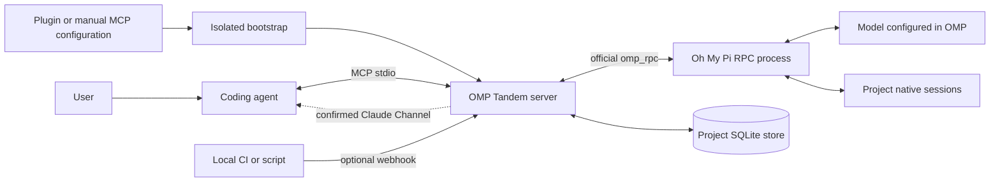

# OMP Tandem — 完整指南

[项目首页](../README.zh-CN.md)

[English](guide.md) · [Русский](guide.ru.md) · **简体中文**

**为你的编程智能体配备一位独立的 AI 协作者：通过 Oh My Pi 共同咨询、设计、实现和审查。**

OMP Tandem 将本地 MCP 桥接服务打包为 Claude Code 插件，以及供 Codex 和兼容宿主使用的可移植 Agent Plugins 软件包。其他本地 MCP 客户端无需支持插件，也可以使用同一个服务器。

**版本：3.4.0** · [MIT 许可证](../LICENSE) · [发布版本](https://github.com/Flyozzzz/omp-tandem-public/releases) · [Channels 与 Webhook（英文）](channels.md) · [Oh My Pi](https://github.com/can1357/oh-my-pi)

本项目不内置针对特定公司、代码仓库或产品的规则。需要产品知识时，由你提供。项目隔离是一种通用的数据边界，而不是硬编码的项目绑定。

本仓库从经过审查的早期私有开发快照开始，版本号延续原有开发顺序。“Legacy history”指本地 OMP 对话数据的迁移，并非导入旧的 Git 提交。本仓库不包含旧 Git 历史。

[参与贡献](../CONTRIBUTING.md) · [安全政策](../SECURITY.md) · [持续集成](https://github.com/Flyozzzz/omp-tandem-public/actions)

> OMP Tandem 使用官方 `omp_rpc` Python 客户端启动真正的 `omp --mode rpc` 进程，不会用直接调用 OpenAI API 的方式取代 OMP。请在 OMP 中配置受支持的提供商；宿主编程智能体使用自己独立的身份验证。本地存储不等于离线推理：任务上下文会发送给已配置的模型提供商。

<a id="contents"></a>
## 目录

- [功能概览](#what-it-does)
- [架构](#architecture)
- [前置要求](#requirements)
- [安装 OMP 并配置提供商](#install-omp-and-configure-a-provider)
- [安装插件](#install-the-plugin)
- [首次使用：配置后审查暂存变更](#first-review)
- [其他 MCP 客户端](#other-mcp-clients)
- [自动准备运行环境](#automatic-runtime-preparation)
- [钩子与技能](#hooks-and-skills)
- [与协作者共同工作](#working-with-a-peer)
- [共享任务与自主执行](#shared-work)
- [任务与执行模式](#tasks-and-execution-modes)
- [执行配置与用量](#execution-and-accounting)
- [不可变快照审查](#snapshot-reviews)
- [高层只读审查场景](#review-run)
- [补充未变更的上下文](#review-context)
- [问题生命周期](#finding-lifecycle)
- [产品知识与决策](#product-knowledge-and-decisions)
- [项目隔离](#project-isolation)
- [显式共享上下文](#explicit-context-sharing)
- [MCP 工具](#mcp-tools)
- [结果、问题与产物](#results-questions-and-artifacts)
- [结果处理凭据](#result-receipts)
- [当前客户端与在线诊断](#live-diagnostics)
- [轮询、Channels 与 Webhook](#polling-channels-and-webhooks)
- [配置与限制](#configuration-and-limits)
- [升级与旧版历史记录](#upgrades-and-legacy-history)
- [安全性与局限](#security-and-limitations)
- [故障排查](#troubleshooting)
- [仓库结构](#repository-layout)
- [开发与验证](#development-and-verification)
- [真实 OMP 兼容性证据](#real-omp-compatibility)
- [比较基准准备与发布案例](#benchmark-and-case)
- [分发与许可](#distribution-and-licensing)

<a id="what-it-does"></a>
## 功能概览

第二个智能体不仅在实现之后有用，在动手之前同样有价值。OMP 可以质疑假设、比较替代方案、负责独立的实现部分，或依据产品需求审查变更。协调者不会天然正确，协作者也一样。

| 能力 | 用途 |
|---|---|
| 双向协作 | 咨询、独立推理、设计、实现与审查 |
| 异步任务 | 启动工作后，继续处理互补的任务 |
| 原生对话历史 | 继续已有的 OMP 对话，而不是悄悄开启另一个会话 |
| 每轮目标 | 替换当前目标，而不是重复之前的整轮审计 |
| 结构化契约 | 指定约束、文件归属、上下文和验收标准 |
| 共享任务卡 | 双方确认同一计划版本、依赖图、精确文件归属和独立验收 |
| 可选自主控制器 | 操作者明确授权后，在客户端断开时按预算继续执行；不确定的执行不自动重放 |
| 不可变审查包 | 固定需求、代码字节和证据，先独立判断，再比较作者方案 |
| 有界审查场景 | 一次启动捕获快照，独立审查后按条件比较一次；统一读取、回复和取消 |
| 问题生命周期 | 稳定编号与只追加历史，分开记录问题有效性和修复状态 |
| 执行配置与用量 | 按轮选择计算强度，显示请求／生效／实际设置和未知费用 |
| 带版本的产品快照 | 保存有来源的规则、示例，以及已接受或已否决的决策 |
| 带截止时间的问题 | 向协调者提问，而不是自行编造尚未确定的决策 |
| 不可变产物 | 通过带版本的 ID 和 SHA-256 摘要共享报告与证据 |
| 暂定结果 | 即使缺少最终报告，也能找回有用的材料 |
| 成组等待 | 等待任意选定任务完成或提出问题 |
| 项目隔离 | 分离任务、历史记录、产物、产品和事件的存储 |
| 显式上下文传递 | 仅共享选定的快照及其引用的证据 |
| 可选推送投递 | Claude Code Channels 与受保护的 localhost Webhook |
| 有界看门狗与接收凭据 | 独立唤醒失败时回退轮询；领取终态结果后才处理副作用 |
| 当前客户端诊断 | 默认本地检查；仅经用户明确要求才执行可能付费的在线检查 |
| 仅复制式迁移 | 保留旧结果和原生会话，不删除原始数据 |

<a id="architecture"></a>
## 架构



1. 宿主加载插件，或启动已配置的 stdio 命令。
2. 引导程序在插件代码目录之外准备一个依赖版本锁定、以非可编辑方式安装的 Python 环境。
3. MCP 服务器在打开项目数据之前，先从客户端获取可信工作区。它绝不会使用模型提供的任务 `cwd` 来选择命名空间。
4. 任务获取一个共享工作进程槽位，然后携带当前目标、持久策略和可选的产品快照启动 OMP 进程。
5. OMP 可以通过宿主工具提问、发布证据并提交结构化最终报告。
6. 协调者阅读实际回答，并独立评估重要断言。

完成判定依赖请求确认和终止性的 `agent_end` 事件，而不是扫描保留的事件历史来寻找请求的起始位置。

<a id="requirements"></a>
## 前置要求

- **macOS 或 Linux**，或使用 Linux 内安装工具的 **WSL**。桥接服务使用 POSIX 锁，不支持原生 Windows。
- `PATH` 中可用的 **[uv](https://docs.astral.sh/uv/getting-started/installation/)**。它负责选择或下载 Python 3.12+，并准备依赖。
- `PATH` 中可用的 **[Oh My Pi](https://github.com/can1357/oh-my-pi)**，且已配置受支持的提供商和模型。
- 已配置的宿主，例如 **[Claude Code](https://code.claude.com/docs/en/quickstart)** 或 **[Codex CLI](https://developers.openai.com/codex/cli)**。
- 能够联网以首次下载依赖，并访问所选的远程模型提供商。

安装插件会自动注册随包提供的 MCP 服务器，但**不会**静默安装 OMP、为提供商进行身份验证、复制凭据或绕过组织策略。`uv` 和 OMP 需要你安装一次；Python 应用依赖会自动准备。

| 宿主 | 集成方式 | 工作区来源 |
|---|---|---|
| Claude Code | 原生插件或手动配置 stdio MCP | `CLAUDE_PROJECT_DIR`；也支持操作者显式覆盖 |
| Codex CLI | 可移植 Agent Plugins 软件包或手动配置 stdio MCP | 客户端生成的 `codex/sandbox-state-meta.sandboxCwd` 请求元数据；Codex 0.145.0 支持此机制 |
| Codex IDE 集成 | 在支持的界面中手动配置 MCP；插件可用性因具体界面而异 | 客户端发出元数据时，使用相同的客户端元数据机制 |
| 其他本地 MCP 宿主 | 手动 stdio 配置；若宿主支持，也可使用可移植插件 | 一个无歧义的客户端根目录，或由操作者显式指定项目根目录；也支持普通非插件启动时的 cwd |
| 纯网页 ChatGPT／移动端 | 安装软件包不会部署本地进程 | 需要合适的本地执行宿主，或另行设计远程集成 |

从 GitHub 添加到本地的插件市场，不等于已获准进入厂商的公共插件目录。尤其是，本地 stdio 服务器并不会自动成为公共 HTTPS MCP 服务。

<a id="install-omp-and-configure-a-provider"></a>
## 安装 OMP 并配置提供商

<a id="install-the-prerequisites"></a>
### 安装前置工具

在使用 Homebrew 的机器上：

```sh
brew install uv
brew install can1357/tap/omp
```

macOS/Linux 官方独立安装脚本：

```sh
curl -LsSf https://astral.sh/uv/install.sh | sh
curl -fsSL https://omp.sh/install | sh
```

这些命令会执行来自官方分发端点的脚本。如果组织有相关要求，请先审阅脚本，或使用获准的包管理器。OMP Tandem 不会从钩子中执行这些命令。

如果你已在使用受支持版本的 Bun，OMP 还提供以下安装方式：

```sh
bun install -g @oh-my-pi/pi-coding-agent
```

平台细节和 Bun 要求请参阅[最新 OMP 安装说明](https://github.com/can1357/oh-my-pi#install)。如果安装程序修改了 `PATH`，请重新打开终端。

<a id="configure-your-own-provider"></a>
### 配置你自己的提供商

启动 OMP 的配置流程：

```sh
omp setup
```

或者打开一个 OMP 会话：

```sh
omp
```

在 OMP 中，使用 `/login` 完成受支持的账号身份验证，使用 `/model` 选择默认模型。对于使用 API 密钥的提供商，请遵循 OMP 针对该提供商的配置或环境变量说明。不要将密钥放入插件清单、产品快照、代码仓库或聊天示例中。

OMP 支持多个托管提供商，以及本地／兼容 OpenAI 的后端。请选择支持工具调用工作流、且能遵循所需报告契约的模型。“任意提供商”是指 OMP 支持的提供商，不代表保证任意模型都能可靠完成智能体任务。

对于自定义后端，使用 OMP 的 `~/.omp/agent/models.yml` 配置，并通过 `omp setup` 或 `/model` 选择该提供商／模型。参阅[提供商参考文档](https://omp.sh/docs/providers)。除非显式覆盖，否则桥接服务继承 OMP 的模型选择。

配置完成后，先按[首次使用流程](#first-review)进行本地诊断；只有你明确同意时，才发出无害的在线请求验证提供商访问，可能产生费用。仅找到可执行文件不能验证身份认证。配置 OMP 不会让你自动登录 Claude Code 或 Codex。

<a id="install-the-plugin"></a>
## 安装插件

这是[公开仓库](https://github.com/Flyozzzz/omp-tandem-public)，安装不需要访问邀请。客户端和组织的插件信任、网络及权限策略仍然适用。

<a id="claude-code"></a>
### Claude Code

```sh
claude plugin marketplace add Flyozzzz/omp-tandem-public
claude plugin install omp-tandem@omp-tandem
```

从目标项目目录启动一个新的 Claude 会话。如果客户端要求执行 `/reload-plugins`，请等正在进行的委派工作结束后再按要求操作。

首次使用先运行 `/omp-tandem:setup`，再按[首次使用流程](#first-review)检查当前项目和本地运行时。无需先学习每个底层工具。

共享工作流技能可通过 `/omp-tandem:tandem` 使用；配置技能为 `/omp-tandem:setup`。客户端显示的 MCP 工具名称包含插件前缀，但工具后缀始终为 `tandem_*`。

<a id="codex-cli"></a>
### Codex CLI

```sh
codex plugin marketplace add Flyozzzz/omp-tandem-public
codex plugin add omp-tandem@omp-tandem --json
```

在目标项目中启动一个新的 Codex 会话。使用 `/plugins` 检查安装情况，运行 `/omp-tandem:setup`（或要求客户端使用 setup 技能），再按[首次使用流程](#first-review)进行本地诊断。委派前确认 `tandem_scope` 绑定的项目。

Codex 对非受管钩子要求显式信任审查；使用 `/hooks` 检查这些钩子。MCP 服务器无需可选的诊断钩子也能工作，因此不需要绕过钩子信任机制。

<a id="local-development-or-a-checked-out-copy"></a>
### 本地开发或已检出的副本

```sh
TANDEM_ROOT=/absolute/path/to/omp-tandem
claude plugin marketplace add "$TANDEM_ROOT"
codex plugin marketplace add "$TANDEM_ROOT"
```

添加本地市场后，通过相应客户端安装插件。两个市场目录都指向自包含的仓库根目录。不要引用插件目录之外的文件：宿主可能会将插件复制到带版本的缓存中。

**避免重复注册。** 如果已经安装独立 MCP，请先完成其任务，并在切换到插件前显式删除或禁用旧注册。配置辅助程序不会静默覆盖现有条目。在 Codex 中，手动注册的服务器可能优先于插件服务器。

<a id="first-review"></a>
## 首次使用：配置后审查暂存变更

推荐顺序：**安装插件 → `/omp-tandem:setup` → 本地诊断 → 自愿在线检查 → 只读审查暂存变更**。不需要先了解所有 MCP 工具：

1. 在目标项目中打开已加载插件的新会话，运行 `/omp-tandem:setup`。它指导你检查前置工具、准备依赖和配置自己的 OMP 提供商，不静默安装 OMP 或复制凭据。
2. 要求智能体确认绑定项目，并调用 `tandem_diagnose`，例如 `{"expected_project":"/absolute/project"}`。这是默认的本地检查，不调用模型；路径应换成实际项目。
3. **只有明确同意可能付费的在线检查时**，才要求 `tandem_diagnose(live=true)`。它验证当前客户端的实际提供商请求；继续等待同一 `task_id`，不要重复启动。参数与边界见[在线诊断](#live-diagnostics)。
4. 暂存你真正希望审查的变更，然后可以直接说：

   > 用 OMP Tandem 只读审查当前已暂存的变更。原始需求是：〈填写需求〉。使用 `tandem_review_run`，先独立判断；若我提供了作者方案，独立成功后只比较一次。必要的未改动调用方和测试通过 `context_paths` 从索引捕获。不要编辑、运行 shell／测试或自动应用建议；阅读完整回答，说明发现、未决问题、快照适用性和仅 OMP 工作轮次的用量。

没有已选变更时，场景返回 `no_changes`，不会为上下文文件单独调用模型。审查并不隐含修复授权；下一步由协调者依据原始需求和实际证据决定。可复制的 API 参数见[高层审查场景](#review-run)，首次使用不必手动编排独立与比较任务。

<a id="other-mcp-clients"></a>
## 其他 MCP 客户端

插件支持不是必需的。可以使用同一个启动器配置本地 stdio MCP 服务器。请将路径替换为软件包真实的绝对路径：

```json
{
  "mcpServers": {
    "omp-tandem": {
      "command": "uv",
      "args": [
        "run", "--no-project", "--python", ">=3.12",
        "python", "-I", "/absolute/path/to/omp-tandem/server.py"
      ]
    }
  }
}
```

宿主必须提供可信的工作区。如果无法提供，请在**该项目的客户端配置中**，向服务器参数添加 `--project-root` 和目标项目的绝对路径，而不是将其硬编码到多个无关项目共用的一份全局配置中。

独立辅助程序可以准备运行环境，并返回准确的配置方案，而不修改客户端设置：

```sh
uv run --no-project --python '>=3.12' python -I \
  "$TANDEM_ROOT/scripts/install.py" --client none --json
```

如需独立注册，选择 `--client claude` 或 `--client codex`。Claude 支持 `--scope user` 和 `--scope local`；辅助程序的 Codex 注册仅支持用户作用域。操作者可以显式维护项目本地的 Codex TOML 配置。使用 `--check` 仅检查前置条件，或使用 `--no-register` 只准备环境而不注册。

客户端配置格式和审批控制各不相同。支持标准 MCP 并不意味着支持 Claude Channels、插件技能、钩子，或能够在纯网页客户端中运行本地进程。

<a id="automatic-runtime-preparation"></a>
## 自动准备运行环境

标准启动器使用隔离模式的 Python：

```sh
uv run --no-project --python '>=3.12' python -I "$TANDEM_ROOT/server.py"
```

`--no-project` 防止将宿主项目的 Python 配置作为启动环境。`-I` 防止 cwd/PYTHONPATH 中的模块替换引导程序或运行时导入的模块；它**不是**操作系统沙箱。实际工作目录和提供商环境仍可供启动的应用使用。

首次使用时，引导程序会：

1. 根据源码／资源字节、依赖／构建元数据、相关忽略文件和所选解释器计算环境标识。
2. 获取该标识对应的锁，防止并发启动发布不完整的环境。
3. 在全新的私有环境代次中安装冻结依赖，并以非可编辑方式安装软件包。
4. 检查准备好的解释器能否导入运行时。
5. 仅在成功后原子地发布就绪标记。
6. 执行 `python -I -m omp_tandem`，将 MCP stdout 专用于协议通信。

准备失败不会将环境标记为就绪。新建或修复的环境代次不会覆盖仍在运行的旧环境。依赖日志写入 stderr。

缓存位于 `PLUGIN_DATA` 或 `CLAUDE_PLUGIN_DATA` 下；未设置时则位于 `~/.cache/omp-tandem/runtimes`。缓存与项目历史分开存放。客户端卸载插件时可能删除插件依赖数据；默认项目状态目录不存放在那里。

实用命令：

```sh
uv run --no-project --python '>=3.12' python -I "$TANDEM_ROOT/server.py" --doctor
uv run --no-project --python '>=3.12' python -I "$TANDEM_ROOT/server.py" --prepare
```

`--doctor` 是本地检查，不会安装应用依赖、读取凭据或验证提供商登录；它会指向当前 MCP 客户端的[在线诊断](#live-diagnostics)。独立 CLI 进程不能证明当前客户端已收到推送。外层 `uv` 调用仍可能下载 Python。`--prepare` 执行实际安装，并以 JSON 返回解释器路径。

首次下载可能超过客户端的启动超时。可以预热环境，或在解决配置错误后重新连接；不要把“MCP 已配置”误认为工作进程已经就绪。在客户端外手动准备环境可能使用不同缓存：为某个客户端的插件运行环境预热时，应使用该客户端提供的同一数据目录。

<a id="hooks-and-skills"></a>
## 钩子与技能

Claude 插件提供轻量前置工具诊断，以及可选的独立看门狗：

- `SessionStart` 检查 `PATH` 中的 `uv`／`omp`，缺失时给出简短指引，并初始化看门狗会话身份。
- `PostToolUse` 通过 `asyncRewake` 启动有界看门狗，单次寿命最多 12 秒，钩子超时为 30 秒。它绑定会话、任务、代次和 MCP 进程实例，重复或旧实例的唤醒会失效。
- `SessionEnd` 使会话看门狗失效。没有权限审批钩子，也没有自动批准操作。
- 看门狗只发出控制信号，不启动任务、不返回答案、不读取凭据、不调用提供商，也不替用户安装工具。Claude 调试日志可能将用于唤醒的退出码 2 标作 hook error；这不等于 OMP 任务报错，应读取 `tandem_result` 的实际状态。

只有真实独立唤醒中收到的 `watchdog_token` 经确认，且当前看门狗仍存活并已就绪时，才允许 `await_event`。工具输出中声称设置了计时器，不是独立唤醒证明；通道的 `probe_token` 也不能代替看门狗证明。钩子缺失、禁用或不受支持时，核心 MCP 功能仍可通过有界轮询使用，但不能声称存在无人值守的事件唤醒。详见[投递与回退](#polling-channels-and-webhooks)。

共享技能提供：

- **`tandem`**：双向咨询／设计／实现／审查、有明确范围的委派、问题、报告与显式共享。
- **`setup`**：经用户同意安装前置工具、准备运行环境、配置提供商，以及针对不同客户端的连接指引。

<a id="working-with-a-peer"></a>
## 与协作者共同工作

对涉及行为或设计决策的开发，技能要求 **理解需求 → 独立判断 → 比较方案 → 明确计划 → 实现 → 交叉检查**。非平凡修改之前仍需独立判断，但规划深度应与不确定性和风险相称，而不是每次都展开完整架构讨论。

1. 明确真实需求、约束、用户已确认的事实和可观察的验收标准；不要再运行实验来确认用户已经报告的事实。
2. 先形成自己的初步判断，并让 OMP 从原始需求、事实和相关代码独立判断；暂不提供协调者的诊断和论据。
3. **局部、原因和修复方向已明确的工作：**简短的首次评估，随后一次简短比较与具体检查即可。**存在歧义或高风险的工作：**完整比较替代方案、取舍和证据。局部范围不等于省略独立判断。
4. 默认只做**首次独立判断 + 一次比较**，然后作出决定、执行能区分假设的实验，或向用户提出必要问题。不要为了达成一致自动增加轮次。记录所选方法、文件归属、修改顺序及验证方式，再实现并交叉检查。

只有不涉及实质设计／行为选择的机械修改，或范围和前提未变且用户已明确批准的计划，才可走简化流程；需说明例外及检查方式。目标明确或 diff 很小本身不是例外。不要让用户逐项批准普通技术细节。只读规划会话不能通过继续对话获得写权限：另开获准的 `work` 会话并传递已确定的计划。仅分析的请求不授权实现。

这些一般规划与停止规则是**技能／提示词中的协调策略，不是运行时的“计划批准”权限门**。它们不能自动证明宿主已完成规划，也不能批准写入。下文的共享任务另外通过代码要求双方确认同一计划版本，但计划共识仍不等于自主执行授权。快照阶段的访问限制和高层场景的最多两轮编排也由代码执行。

好的请求会拆分互补的工作，而不是重复劳动：

> 先向 OMP 提供原始任务、约束、事实和代码，不附上我的诊断或方案。阅读它独立形成的问题定义，然后在下一轮公开我的方案和论据，对比双方的判断。

> 将这次实现拆分到互不重叠的文件中。为其中一部分指定验收标准，并以 `work` 模式交给 OMP。整合变更，双方交叉检查重要行为。

> 依据固定版本的产品规则审查这次变更。如果某项安全改进破坏了必须支持的用户场景，请说明冲突并提出替代方案，而不是悄悄删除该场景。

> 继续同一个对话，但只讨论提出的修复方案。不要重复之前的整轮审计，也不要将旧的验收清单继承为新目标。

用户已确认的观察结果与协作者的假设不同。不要仅仅为了再次确认用户的观察而重跑已确认的实验；应调查新的断言或发生变化的代码。任何一方都不应只负责无条件认可另一方。

一般规划可使用 `tandem_start` 获取独立判断，再通过 `tandem_continue` 比较协调者方案；已有变更的只读快照审查优先使用[高层场景](#review-run)，无需手动串联工具。保留用户已确认的事实；若代码、历史或共享上下文已经暴露方案，应承认其影响，而不是声称盲审。重要前提变化时有意重新规划，不暗中扩大任务或开启循环审计。

<a id="shared-work"></a>
## 共享任务与自主执行

`tandem_work(request: WorkCommand, wait_seconds=0)` 是宿主和 OMP 共用的入口。它保存一张项目内持久任务卡：目标、版本化计划、双方共识、步骤依赖、领取记录、阻塞、不可变提交和独立验收。原有 `tandem_start`／`tandem_continue` 对话以及只读 `tandem_review_run` 保持不变；共享任务不是把一次审查变成后台实现。

### 先区分身份、共识与权限

- `claude` 和 `omp` 是**参与者席位**，不是模型自行声明的身份。普通宿主服务器默认使用 `claude`；OMP 原生协作工具使用 `omp`。受信任的独立同伴客户端可由操作者在 MCP 服务器启动参数中配置 `--work-participant omp`，绑定同一 `--project-root` 和 `--state-dir`。不要为凑齐共识让同一智能体冒充另一方。
- `WorkCommand` 不接受 `actor`、权限或任意尝试令牌字段。受管工作进程由服务器验证的私有令牌绑定到参与者、任务、步骤及实现／审查角色，不能越权领取其他步骤或为自己授权。
- 双方 `agree` 只确认**同一个 `plan_revision`**。在线手动模式下，`claim` 仅锁定可执行步骤；它不会创建执行进程、自动编辑或替用户运行测试。领取凭据由原 MCP／OMP 会话保留，之后的提交和审查必须通过该会话进行；断线重启不等于可重新领取。
- 自主执行另需用户明确批准并执行**操作者 shell CLI** 的 `authorize`。这不是模型可通过 MCP 批准的权限。没有授权时不默认产生后台执行或其模型费用；手动启动的模型调用仍可能收费。

### 创建计划：两个并行模块，一个最终集成

以下都是 `tandem_work` 的参数 JSON，不是已经运行的案例。请替换教学路径、需求和证据。`plan` 的准确字段为 `title`、`goal`、`constraints`、`context`、`acceptance`、`steps`；每个步骤包含下例所示的八个字段。不接受额外字段。`owned_files` 必须是项目内精确相对路径，不能使用目录通配、绝对路径或 `..`。

```json
{
  "request": {
    "action": "create",
    "expected_revision": 0,
    "operation_id": "csv-create-001",
    "plan": {
      "title": "CSV 导入与结果展示",
      "goal": "提供可观察、可交叉审查的 CSV 导入流程",
      "constraints": [
        "保持现有公开 API",
        "只修改各步骤声明的文件",
        "没有 shell 授权时不运行检查，并明确记录未执行"
      ],
      "context": "先约定模块接口：parse_csv(text) 返回记录列表；format_rows(rows) 返回显示文本。具体字段以项目需求为准。",
      "acceptance": [
        "最终提交同时包含两个模块及调用集成",
        "正常输入、空输入和错误输入的用户可见结果均有真实证据；未执行项明确列出"
      ],
      "steps": [
        {
          "id": "parse",
          "title": "解析模块",
          "goal": "实现 parse_csv(text) 并保留错误信息",
          "owner": "claude",
          "reviewer": "omp",
          "owned_files": ["src/csv_parser.py"],
          "depends_on": [],
          "acceptance": ["返回约定记录结构，错误输入的行为可追溯"]
        },
        {
          "id": "format",
          "title": "展示模块",
          "goal": "实现 format_rows(rows)",
          "owner": "omp",
          "reviewer": "claude",
          "owned_files": ["src/row_formatter.py"],
          "depends_on": [],
          "acceptance": ["正常记录与空记录的显示符合约定"]
        },
        {
          "id": "integrate",
          "title": "最终集成与全局验收",
          "goal": "组合两个已验收的模块，审查完整用户流程",
          "owner": "claude",
          "reviewer": "omp",
          "owned_files": ["src/app.py", "src/csv_parser.py", "src/row_formatter.py"],
          "depends_on": ["parse", "format"],
          "acceptance": [
            "完整结果包含两个已验收模块，调用接口一致",
            "依据同一最终提交逐项核对全局验收标准，注明实际检查方式和限制"
          ]
        }
      ]
    }
  },
  "wait_seconds": 0
}
```

`parse` 与 `format` 可并行，且互不占用相同文件；只有两者的当前提交均被独立接受，`integrate` 才可领取。归属重叠仅允许在有祖先依赖的步骤之间出现，如最终集成重新涉及模块文件。依赖必须无环、引用已有唯一步骤，并且只能有一个最终汇点，直接或间接依赖全部其他步骤。多个互不相连的“完成”输出不能代表集成成功。每一步的 `owner` 与 `reviewer` 必须不同，计划及每一步均至少有一条验收标准。

### 读取、确认与 CAS 更新

创建返回真实 `work_id`。以下的 `"WORK_ID"`、`"SUBMISSION_ID"` 和提交哈希均须替换为实际返回值。所有变更（包括 `create`）必须带 `expected_revision` 和唯一 `operation_id`；读取不需要。数字版本仅用于演示，**每次修改前读取当前卡片并使用实际 `revision`**，不可把示例数字当作稳定的调用序列：

```json
{"request":{"action":"get","work_id":"WORK_ID"},"wait_seconds":0}
```

返回的 `markdown` 是同一状态的可读任务卡；结构化字段包括 `revision`、`plan_revision`、`agreements`、步骤、阻塞、尝试、提交、`authorization`、`next_action` 和最终 `result`。进度会增加 `revision`，但不改变计划版本。`history` 的 `expected_revision` 是排除该版本及更早事件的游标：

```json
{"request":{"action":"history","work_id":"WORK_ID","expected_revision":0}}
```

双方先各自阅读完整计划，再分别在其席位调用。以下第一个来自 `claude`，第二个来自 `omp`，后者使用前者更新后的当前版本：

```json
{"request":{"action":"agree","work_id":"WORK_ID","expected_revision":1,"operation_id":"csv-agree-claude-001","note":"确认当前完整计划、接口及文件归属"}}
```

```json
{"request":{"action":"agree","work_id":"WORK_ID","expected_revision":2,"operation_id":"csv-agree-omp-001","note":"独立阅读后确认同一计划版本"}}
```

CAS 冲突表示卡片已变化：重新读取、理解变化，再用新 `operation_id` 提交有意的新操作。只有网络结果丢失、需要取回**相同请求回执**时才原样重发同一个操作 ID；不能修改负载后复用 ID，也不能因此重放编辑、shell 或模型启动。

`propose` 同样携带完整 `plan`、当前 `expected_revision`、新 `operation_id`，可附 `note`。实质性改计划会推进 `plan_revision`，清除双方共识和当前验收状态，使旧尝试失效并撤销旧自主授权；必须重新确认，必要时先处理旧执行的不确定性，再重新授权。旧记录仍可从历史追溯。

### 在线手动模式：领取、真实提交、独立审查

在 `claude` 的同一在线会话领取 `parse`：

```json
{"request":{"action":"claim","work_id":"WORK_ID","step_id":"parse","expected_revision":3,"operation_id":"csv-claim-parse-001"}}
```

领取会固定当前 Git `HEAD`；仓库必须已有提交。随后由已获许可的在线智能体或用户实际工作，并自行安排隔离的分支／worktree 与 Git 提交。**手动 `claim` 不替你准备受管 worktree。** 提交必须已存在于该项目的 Git 对象库中，是领取时源提交的后代，并且相对该源提交只改变本步骤归属的文件。并行工作不要相互带入对方的未验收修改；手动集成者还需确实组合当前已验收的依赖提交，不能仅把步骤标为完成。

工作结束后，在原领取会话通过 `submit` 引用真实完整哈希（以下 40 位值只是格式占位，不能直接提交），并提供说明及真实证据：

```json
{
  "request": {
    "action": "submit",
    "work_id": "WORK_ID",
    "step_id": "parse",
    "expected_revision": 4,
    "operation_id": "csv-submit-parse-001",
    "commit": "0123456789abcdef0123456789abcdef01234567",
    "note": "说明该提交实际完成的行为及尚未验证的部分",
    "evidence": ["替换为对应此提交的实际检查记录；未运行测试时明确写明未运行"]
  }
}
```

手动提交会检查并保留不可变 Git 输出。受管自主实现则由 supervisor 捕获并核对工作区、创建提交；模型不能通过 `commit` 字段指定受管输出。两者的 `submit` 都不等于通过验收。

审查者 `omp` 先 `get` 当前卡片，再领取同一步骤；存在提交时 `claim` 领取的是审查而非实现：

```json
{"request":{"action":"claim","work_id":"WORK_ID","step_id":"parse","expected_revision":7,"operation_id":"csv-review-parse-001"}}
```

在该审查会话中阅读**当前 `submission.commit` 的精确内容**，不要以另一个工作区的最新文件替代它。核对各项标准后，引用当前 `submission_id`：

```json
{
  "request": {
    "action": "accept",
    "work_id": "WORK_ID",
    "step_id": "parse",
    "expected_revision": 8,
    "operation_id": "csv-accept-parse-001",
    "submission_id": "SUBMISSION_ID",
    "note": "说明独立判断、覆盖的标准和检查限制",
    "evidence": ["替换为对此精确提交的真实审查依据和实际检查结果"]
  }
}
```

需要修改时改用 `action: "reject"`，填写真实问题及证据，并使用新的操作 ID；作者不能自我验收。`format` 同理但双方角色相反；最后 `integrate` 的审查者还需核对全局标准。验收记录是带归属的**模型／人工声明**，存储层不会执行或认证检查；有提交、有共识、任务 `completed` 均不能替代真实的运行证据。

### 阻塞、暂停与在线唤醒

| 操作 | 当前版本与新操作 ID 之外的必要输入／作用 |
|---|---|
| `block` | `step_id`、`note`、`condition`；写明阻塞原因及解除条件 |
| `unblock` | `step_id`、`blocker_id`、`resolution`、非空 `evidence`；仅阻塞作者或操作者可解除 |
| `heartbeat` | `step_id`；由持有当前领取凭据的会话记录心跳，不授权新的启动 |
| `pause` | `work_id`；持久暂停，并隔离现有尝试 |
| `resume` | `work_id`；显式恢复，不清除阻塞、不恢复已失效的令牌或撤销的授权 |
| `list` | 无需 CAS，列出当前可信项目的任务 |

普通阻塞被有证据地解除后，若没有不确定执行、任务未暂停且自主授权仍有效，控制器可继续选择就绪步骤；无需为了推进而重新发送通知。若 `block` 隔离了正在执行的尝试，则先走下文的操作者恢复流程。显式暂停具有粘性，计划确认、通知或重启控制器都不会自动撤销它。

若当前执行者主动登记阻塞并以 `blocked` 正常结束，控制器会保留中间提交为 `checkpoint`、确认进程已退出并释放执行槽位。有证据地解除阻塞后，新尝试从该检查点继续已有改动，而非重新实现整个模块；检查点不等于验收。外部强制停止、丢失启动确认、未知费用或未确认的副作用仍需操作者恢复。

```json
{"request":{"action":"get","work_id":"WORK_ID"},"wait_seconds":25}
```

`wait_seconds` 范围为 0–25，正值只让 `get` 有界等待已提交的状态变化。事件／Channels 是在线客户端的尽力唤醒提示：醒来后重新读取持久任务卡，不把消息当作执行权或需要重发启动的信号。通知不能复活已经退出的 Claude／OMP 客户端。只有另行启动的自主控制器拥有独立生命周期；它观察持久状态，不依赖客户端持续接收推送。

### 操作者自主授权与生命周期

先确保双方已确认计划、项目是已有提交的 Git 仓库，且机器上真实的 `claude`、`omp` 及其提供商认证可用。下面的 `python` 必须来自**安装了当前 OMP Tandem 的环境**；仅系统 Python 不够。插件用户可通过上文 `server.py --prepare` 获取准备好的解释器路径。所有命令使用与 MCP 相同的绝对项目根和状态目录；默认状态根为 `~/.local/state/omp-tandem`，自定义 `--state-dir` 放在子命令之前。

用户需明确批准这些费用与工具权限并执行授权，而不是让模型自行决定无人值守运行。授权绑定当前计划版本、当前源提交与期限：

```sh
python -m omp_tandem.work_daemon --project-root /absolute/project \
  authorize WORK_ID --budget-seconds 1800 --max-launches 8 \
  --max-cost-usd 5 --allow-work
```

`--allow-work` 允许受管实现的写入；若用户还明确允许 shell 检查，则在这条授权命令末尾添加 `--allow-tests`。**它允许任意 shell 能力，不是只允许名为“测试”的安全命令。** 不授予 shell 时应记录未执行的验证，不能编造通过结果。已知费用、未知费用和每次启动保留的费用额度用于调度；美元上限是估算／软上限，不保证提供商账单绝不超额。用量未知会暂停任务；预算、启动次数或期限耗尽不会自动追加授权。

选择前台运行，或显式脱离客户端运行；二者是替代方式，不要重复启动：

```sh
python -m omp_tandem.work_daemon --project-root /absolute/project \
  run --work-id WORK_ID --concurrency 2
```

```sh
python -m omp_tandem.work_daemon --project-root /absolute/project \
  start --work-id WORK_ID --concurrency 2
```

默认并发为 2，允许 1–4；每项目只运行一个控制器。`start` 在脱离前检查有效授权；前台执行也不能绕过调度授权。可选 `--once` 在没有当前可运行／活动尝试时退出，不是“忽略阻塞后一直完成整个计划”。控制器为各实现准备项目状态目录内的独立 detached worktree，按依赖顺序组合已验收提交；审查使用对应提交的精确快照。原工作区不会因受管提交或最终验收被自动更新。

快照使用提交中的精确字节，包括存在换行转换或 `ident` 属性的仓库。安全上限为每文件 16 MiB、每快照 256 MiB、20,000 个文件；已跟踪的符号链接、子模块和已配置的 Git 过滤器会被拒绝，而非被静默省略。共享状态目录应位于原工作区之外。被审查拒绝或正常阻塞的结果保留检查点供后续修正；依赖冲突的各版本保留在对应 worktree 的 Git 索引中供检查。

```sh
python -m omp_tandem.work_daemon --project-root /absolute/project status
python -m omp_tandem.work_daemon --project-root /absolute/project show WORK_ID
python -m omp_tandem.work_daemon --project-root /absolute/project stop
python -m omp_tandem.work_daemon --project-root /absolute/project revoke WORK_ID
```

`status` 检查真实控制器租约，`show` 不带 ID 时列出项目任务。`stop` 请求控制器停止并暂停其任务；返回 `stop_requested` 不是已停止证明，应继续查看 `status` 与任务状态。`revoke` 撤销该任务授权、隔离当前尝试，控制器据此终止工作；它不回滚已发生的编辑或外部副作用。恢复需要显式 `resume`，必要时完成恢复核对并重新授权，再执行 `run`／`start`。

没有自动安装全局 launchd／systemd 服务，也没有云端执行承诺。脱离终端不等于跨关机运行：机器关闭时不执行，进程崩溃后不自动重放工作。

### 不确定执行：先检查，再明确恢复

控制器丢失、尝试超时、进程可能已启动、输出捕获失败等会进入 `recovery_required`。缺少心跳、没有通知或父进程退出都不能证明旧子进程和外部副作用已消失。不要重新发送领取／启动来“修复”它。

1. 请求 `stop`，查看控制器与尝试状态；检查并确认旧执行确实停止。
2. 检查保留的 worktree、Git 提交、日志、可能的外部副作用与提供商费用，保存实际证据。未知费用导致暂停时，先核对费用再决定新的有界授权。
3. 操作者明确选择 `retry` 或 `abandon`。`--confirm-stopped` 是操作者在实际检查后的声明，不是根据进程沉默推断的事实：

```sh
python -m omp_tandem.work_daemon --project-root /absolute/project \
  reconcile WORK_ID parse --resolution retry \
  --note "替换为停止确认、已检查副作用及允许重试的具体理由" \
  --evidence "替换为实际检查记录或证据位置" --confirm-stopped
```

放弃则使用 `--resolution abandon`，保留说明与证据；这会留下需要显式解决的阻塞并暂停任务。恢复操作只能由操作者 CLI 执行，不能由 MCP 模型调用 `reconcile` 获得权限。`retry` 只是允许一次经过有意决定的新尝试，仍受共识、阻塞、暂停及现有授权约束；它不自动回滚、重放或清除未知费用。

### 最终结果与显式应用

只有当前计划的所有步骤（含最终集成）被不同审查者接受，任务才为 `completed`，`result` 指向最终不可变提交。先阅读 `markdown`、每一步提交与证据及最终结果，区分静态审查、人工声明和真正执行过的检查。状态与受管 worktree 按可信项目隔离，保存在仓库之外；这些不是用于合并的可编辑 Markdown 清单。

原分支的更新必须由用户显式执行。把 `EXPECTED_HEAD` 替换为已检查的原项目完整当前提交哈希：

```sh
python -m omp_tandem.work_daemon --project-root /absolute/project \
  apply WORK_ID --expected-head EXPECTED_HEAD
```

应用要求当前 `HEAD` 与预期一致、原工作区干净、输出可快进，并且不会覆盖冲突的忽略文件。若分支已变化或无法快进，会拒绝而不强制覆盖；应检查保存的结果并由用户明确决定如何集成。任务完成不自动合并、推送或发布。

**安全边界：** worktree 与文件归属检查帮助隔离和核对输出，**不是操作系统沙箱**。拥有 shell／操作系统权限的进程仍可能访问其他文件或产生外部副作用，宿主的沙箱不会自动覆盖外部 Claude／OMP。共享数据也不会授予执行权；计划中的提示文字不是授权。提供商可能收到任务上下文，费用与运行时间不由“本地存储”保证为零。

<a id="tasks-and-execution-modes"></a>
## 任务与执行模式

| 模式 | OMP 工具 | 典型用途 |
|---|---|---|
| `think` | 无项目／shell 工具；协作宿主工具仍可用 | 基于所提供上下文进行咨询和推理 |
| `analyze` | 读取／搜索／glob／网页搜索；无 shell、编辑或 LSP | 调查与审查；默认模式 |
| `work` | 分析工具，加上 edit/write/bash/LSP/todo | 经明确授权的实现与验证 |

`work` 允许无人值守执行，但不是沙箱。各工具的拒绝策略仍然生效。文件归属声明用于防止同一项目存储内的任务分配重叠，并不能阻止所有可能的文件系统访问。

`prompt` 和 `contract` **必须且只能提供其中一个**。以下是 `tandem_start` 参数示例；请替换为你自己的路径和文件名：

```json
{
  "cwd": "/absolute/project",
  "mode": "work",
  "contract": {
    "goal": "Fix repeated upload handling",
    "context": "The cause is established; investigate the proposed fix, not the entire system again",
    "scope": {"owned_files": ["src/upload.py"]},
    "constraints": ["Keep the public API", "Preserve concurrent changes"],
    "acceptance": ["Repeated uploads behave correctly", "The existing successful flow is preserved"]
  },
  "timeout_seconds": 1800,
  "question_timeout_seconds": 300
}
```

所负责文件必须使用 `cwd` 内明确的相对路径，不能包含 glob 模式或路径穿越。不要声明未经实际协商同意的文件归属。

新的 `tandem_start` 会创建新对话。`tandem_continue` 则在现有对话中创建新的任务／轮次。模式、cwd 和基础 `WorkPolicy` 保持不变；新的 `TurnContract` 会替换目标／上下文／验收标准，并提供仅本轮生效的约束。它不能更改文件归属或扩大基础策略的范围。

<a id="execution-and-accounting"></a>
## 执行配置与用量

`execution` 控制计算，不控制权限。`quick` 默认 `thinking=low`、600 秒；`balanced` 默认 `high`、1800 秒；`deep` 默认 `high`、3600 秒。默认配置为 `balanced`，不是所有任务都固定使用 `high`。`mode` 与这些配置独立，选择更强模型或更深思考不会将 `think`／`analyze` 升级为 `work`。

**Deep 与 balanced 的默认推理级别同为 `high`，只是时限从 30 分钟增至 60 分钟，并非更高的 reasoning。** 选择前可查看工具参数说明和 `tandem_scope.execution_profiles`。目录展示默认值，不代表覆盖参数之后的 effective／actual 设置。

以下为 `tandem_start` 参数；路径应替换为实际项目：

```json
{
  "cwd": "/absolute/project",
  "mode": "analyze",
  "prompt": "只读取上传实现，比较重试策略，不编辑文件。",
  "execution": {
    "profile": "quick",
    "thinking": "low",
    "timeout_seconds": 900
  },
  "timeout_seconds": 1200
}
```

本例最终时限为 1200 秒：显式顶层 `timeout_seconds` 优先于 `execution.timeout_seconds`，后者优先于所选配置的时限。可用 `execution.model` 显式选择已在 OMP 中配置且实际支持的模型标识；不填写时沿用配置，不需要假设任何提供商或凭据。

后续轮次继承实际生效的设置，除非覆盖。显式切换 `profile` 会应用该配置的思考强度和时限；同一对象中的显式字段再覆盖它们。例如 `tandem_continue`：

```json
{
  "conversation_id": "<上一轮返回的 conversation_id>",
  "prompt": "深入分析刚才保留的两种方案，说明证据与未决边界。",
  "execution": {"profile": "deep"}
}
```

OMP 会核对实际模型及其支持的思考等级。模型不支持所请求设置、将设置限制为另一等级或未能应用时，会如实失败，而不是悄悄声称已按请求运行。

普通结果包含 `execution={requested,effective,actual}` 和 `usage={task,conversation}`。分别检查请求、生效配置和实际观测值；`actual` 缺失时不要把请求模型当作实际模型。`usage.task` 只计本轮，`usage.conversation` 累加互不重叠的轮次，包含独立审查与比较阶段，不重复累加原生累计会话统计。

每个范围都有 `tokens.input`、`output`、`cache_read`、`cache_write`、`total` 和 `cost`。每项指标的对象包含 `value`、`known_subtotal` 和 `status`。以下只是**指标形状示例，不是一次实际运行或报价**：

```json
{
  "complete_metric": {"value": 120, "known_subtotal": 120, "status": "complete"},
  "partial_metric": {"value": null, "known_subtotal": 80, "status": "partial"},
  "unknown_metric": {"value": null, "known_subtotal": null, "status": "unknown"}
}
```

`partial` 的已知小计不是完整总数；缺失数据保持 `unknown`／`null`，不能当作零。`coverage` 描述事件覆盖情况，不保证每项指标完整。费用来自 OMP 原生报告，不是账单，也不会根据模型名称虚构价格；缺失或零价目录不能证明免费。时间与模型来源也应按结果实际报告解释。

这些用量只覆盖 OMP 工作轮次，**不包含外部协调者**的推理、最终整合或全部工作流费用。高层审查场景另以 `usage.peer` 汇总本次阶段，并明确返回 `coordinator=null`、`total_cost=null`；不能把原生阶段费用冒充整个协作过程的总价。整个工作流的耗时、人力和协调者费用需在宿主侧另行记录，见[比较基准准备](#benchmark-and-case)。

<a id="snapshot-reviews"></a>
## 不可变快照审查

首次审查优先使用下列高层场景。它复用 `ReviewRequest`，由代码完成捕获、独立判断和可选的一次比较。需要逐轮控制时，后面的 `tandem_review`／`tandem_start`／`tandem_continue` 底层流程仍然可用。

<a id="review-run"></a>
### 高层只读审查场景

四个操作都调用 **`tandem_review_run`**。以下路径、需求与作者材料是教学输入，不是已验证的案例；替换为自己的实际项目材料。启动示例审查全部暂存变更，并显式补充两份未改动的索引文件：

```json
{
  "action": "start",
  "request_key": "upload-staged-review-001",
  "request": {
    "requirements": "相同上传请求重试不得生成第二份记录；正常上传仍可自动完成。",
    "criteria": ["核对幂等键范围与调用方约定", "将证据、假设和缺失上下文分开"],
    "source": "staged",
    "base": "HEAD",
    "context_paths": ["src/upload_client.py", "tests/test_upload_contract.py"],
    "author_proposal": "在请求边界增加幂等键。",
    "author_rationale": "避免重试生成重复记录，同时保留正常自动流程。",
    "external_boundaries": ["不包含生产数据库与外部存储服务的运行状态"]
  },
  "execution": {"profile": "quick"},
  "budget_seconds": 600,
  "compare": true,
  "wait_seconds": 25
}
```

`request` 与底层捕获 API 使用相同的 `ReviewRequest`。路径相对绑定的项目根目录；省略 `paths` 表示所选来源的全部变更，也可显式限定变更路径。无需传入 `cwd`、`mode`、`review_stage` 或自己创建 `review_id`。

- **总预算：**公开参数名为 `budget_seconds`，默认 600 秒，MCP 接口允许 10–7200 秒；覆盖本次受理后的捕获／启动、两个阶段和等待澄清时间，不是每阶段各给一份预算。
- **每阶段配置：**`execution` 仍有自己的 profile／显式超时上限，每次派发按该上限和总预算剩余时间中的较小值限制。增加总预算不会自动提高 `quick` 的每阶段时限；`deep` 也不能越过总预算。`wait_seconds` 为 0–25，默认 25，只控制一次调用等待多久，不延长运行期限。
- **轮数：**默认 `compare=true`，但只有保存了非空作者方案或论据，且独立阶段为 `completed`、结构化报告为 `success`，才进入**一次**比较。无作者材料或 `compare=false` 时只有独立一轮；最多两轮，不做第三轮共识整合。`partial`／`blocked` 不会触发比较。
- **无变更：**捕获中没有已选变更时，返回 `status=no_changes`、`phase=capture`，不调用模型；仅补充上下文也不能启动空审查。
- **权限：**两个阶段均为 `think`，只读保存的材料。场景不派发 `work`、不执行 shell／测试、不自动应用建议，也不将模型结论自动视为有效缺陷。`checks[].command` 只是已提供证据的标签，不会执行。

捕获由独立受控进程执行，不持有控制器全局锁。取消或截止时间会停止其进程组；发布事务再次验证所属实例、保留 ID 和期限。迟到的捕获不能成为 `no_changes` 或启动下一阶段。每个 MCP 所属实例最多四个捕获槽位，满额明确拒绝，不建立隐藏队列。这是生命周期控制，**不是操作系统沙箱**；底层捕获仍使用自身的逐操作限制，而非场景总预算。

若快照发布暂时占用共享写入门控，取消可能返回仍活动的持久状态，以及 `stop_pending` 和 `next_action="wait"`。继续轮询同一 `run_id`：待持久化的停止请求会阻止下一阶段，但尚不等于已保存的终态取消。状态读取与捕获期限监督仍可运行。通知确认也不等待发布锁，后续观察可以再次确认相同事件。

保存返回的 `run_id`。等待时反复调用 **`status`，不要再次 `start`**：

```json
{
  "action": "status",
  "run_id": "<start 返回的 run_id>",
  "wait_seconds": 25
}
```

`request_key` 是同一所属 MCP 实例（owner）内一个逻辑请求的稳定键，非空且最长 200 字符。同一键和同一规范化请求／配置／预算／比较开关返回同一 `run_id`；不同载荷冲突，不能当作悄悄更新快照。它不是跨重启的全局去重键。旧 owner 失效后，未完成运行变为 `interrupted`，不会重放捕获或已保留的阶段；先读取旧 `run_id`，有意重开工作时使用新的逻辑请求。MCP 宿主关闭后不会成为脱离宿主继续运行的后台作业。

若返回 `status=waiting_input` 和 `question`，使用该运行**当前问题**的实际 ID 回答：

```json
{
  "action": "reply",
  "run_id": "<同一 run_id>",
  "question_id": "<当前 question 中的 question_id>",
  "answer": "<针对该问题的真实回答；不要编造缺失的源文件或测试结果>",
  "wait_seconds": 25
}
```

相同的已回答问题和完全相同的答案可幂等重试；不同、过期或不属于当前问题的回复会被拒绝。澄清不重置总预算，也不授权读取快照之外的实时文件。发现必要文件缺失时，应明确提问／报告阻塞，并用扩大后的 `context_paths` 创建新快照和新逻辑请求，而不是将旧审查暗中变成实时调查。

停止当前运行：

```json
{
  "action": "cancel",
  "run_id": "<同一 run_id>",
  "wait_seconds": 0
}
```

取消先阻止后续阶段，再请求取消当前子任务，已生成的阶段回答仍可读取；它不是撤销操作。`status`／`reply`／`cancel` 不接收 `request`、`request_key`、`execution`、`budget_seconds` 或 `compare` 等创建参数。

**如何阅读响应：**

| 字段 | 解释 |
|---|---|
| `run_id`、`review_id`、`task_id` | 场景、不可变快照、当前／最后阶段任务的 ID；捕获阶段可能没有任务 ID |
| `status`、`phase`、`outcome`、`error` | 运行状态、`capture`／`independent`／`comparison` 阶段、结构化判定和错误；`completed` 本身不证明 `success`，更不证明代码正确 |
| `independent`、`comparison` | 完整阶段结果或 `null`；读取各自的 **`answer`** 与报告，不只读 `summary`。场景返回完整阶段回答，无需把摘要当成答案或重新发起审查来获取全文 |
| `question`、`findings` | 当前待答问题，以及按 `independent`／`comparison` 分组的发现；仍需协调者判断证据与有效性 |
| `applicability` | 所选来源及观察时刻的快照适用性，不是整个环境、后续工作区或生产系统的正确性保证 |
| `created`、`deadline`、`elapsed_seconds` | 受理时间、总截止时间和**本次受理运行**的耗时；不包括受理前协调者的准备，也不是整个用户工作流时钟 |
| `usage` | `scope="OMP worker turns only; excludes coordinator usage"`，`peer` 汇总阶段用量，`coordinator=null`、`total_cost=null`；未知不是零 |

运行中的 `starting`／`running` 响应只返回紧凑的 `stage_statuses` 和 `full_result_pending`，避免重复发送长答案。终态结果才包含完整 `independent`／`comparison`；`waiting_input` 会提供问题及相关已完成阶段，便于回答。

代码负责保存首次完整回答、执行阶段门槛和轮数／预算限制、汇总结果并观察适用性；协调者负责阅读原文、保留分歧、选择方案或有区分力的检查。场景不会代替协调者整合，也不会把双方一致当作真相。后续实际实现仍需独立授权。

<a id="review-context"></a>
### 补充未变更的上下文

`context_paths` 可为高层 `request` 或底层 `tandem_review(action=create)` 显式加入未变更的调用方、接口和测试文件。这些文件与变更一起保存，不是“允许模型以后随时读取”的路径清单：

- `source="staged"` 从 **Git 索引**读取上下文；`source="worktree"` 从**工作区**读取。不能用工作区版本悄悄补足 staged 审查。
- 清单标记 `role=change` 或 `role=context`，并返回 `change_count`、`context_count`、`context_paths`。上下文参与保存的字节／指纹和适用性观察，但不会伪装成被审查的变更或增加 diff。
- 在所选来源中不存在的必要上下文会明确报错。Git 项目中已变化但没有被选为变更的 context 路径也会被拒绝；如需审查它的变化，应将其显式纳入 `paths`，或有意选择包括它的变更集合。
- 文件总数和字节限制合并计算，仍为最多 256 个文件、每文件 4 MiB、保存内容总计 16 MiB，不是另给上下文一份额度。
- 捕获后才发现缺失上下文，应保留阻塞／问题，明确扩大材料并重新捕获；新 `review_id` 必须重新独立判断，不能借旧快照的成功直接进入比较。

以下保留逐步底层 API，供需要手动编排的协调者使用。示例中的路径、检查输出和论据为教学数据，请换成真实材料；后续 `<...>` ID 必须替换为前一次响应中的实际值。

### 1. 捕获需求、代码与证据

调用 `tandem_review`：

```json
{
  "action": "create",
  "request": {
    "requirements": "相同上传请求重试不得生成第二份记录；正常上传仍可自动完成。",
    "criteria": ["核对去重键的有效范围", "区分已证实缺陷与需要运行验证的假设"],
    "base": "HEAD",
    "paths": ["src/upload.py", "tests/test_upload.py"],
    "checks": [{
      "name": "上传回归检查",
      "command": "uv run pytest tests/test_upload.py -q",
      "output": "教学示例：2 passed；请替换为实际保存的输出",
      "source": "协调者提供的检查记录"
    }],
    "author_proposal": "在请求边界增加幂等键。",
    "author_rationale": "希望避免重试生成重复记录，同时保留正常自动流程。",
    "external_boundaries": ["未包含生产数据库配置与外部存储服务状态"]
  }
}
```

返回不可变 `review_id`、`source`、`code_fingerprint` 和范围元数据。`request.source="worktree"` 为默认值，比较工作区内容与基准；`source="staged"` 只比较 Git 索引与基准。省略 `paths` 时，worktree 选择当前未忽略的变更（含未暂存及新文件），staged 只选择 index/base 差异；显式路径也从所选来源读取。非 Git 项目只支持 worktree，且需显式路径。

只审查已暂存的提交内容：

```json
{"action":"create","request":{"requirements":"只依据原始需求审查已暂存的提交内容。","source":"staged","base":"HEAD"}}
```

Staged 模式的 `selected`、文件模式、变更类型及 diff 均来自索引；捕获、重试和 `assess` 都不读取工作区文件。后续未暂存修改及 untracked 文件不会混入；已暂存删除的文件即使在工作区重建，仍视为删除。暂存变更为空时返回零个文件，不必启动空审查。

新快照和指纹记录来源；缺少该字段的旧快照按 worktree 解释，不重写其保存内容或哈希。保存的内容包括所选来源、基准和索引的字节／模式／哈希，以及 diff、需求、标准和提供的检查记录。仍限制为 256 个文件、每文件 4 MiB、共 16 MiB；所选子模块和未合并条目明确拒绝。有限重复读取不是文件系统事务，不能保证整个环境不可变。

**捕获不会运行 `command`，更不会自动执行测试。** 所有提供的检查都标为 `verified=false`、`provenance=supplied_not_executed`。可选 `checks[].code_fingerprint` 必须为实际来源的 64 位小写 SHA-256；匹配只表示与提供指纹的关联，不证明检查执行或通过。没有指纹时关联为 `unknown`，不能借用旁边的代码内容将其升格为已验证。

### 2. 独立判断，只读已保存材料

调用 `tandem_start`，不要把作者方案再复制进提示词：

```json
{
  "cwd": "/absolute/project",
  "mode": "think",
  "review_id": "<捕获返回的 review_id>",
  "review_stage": "independent",
  "execution": {"profile": "balanced"},
  "prompt": "通过 tandem_review_read 阅读需求、标准、清单、diff、相关文件和检查记录。先独立判断；分别报告证据、假设和未覆盖边界。不要读取作者方案。"
}
```

绑定 `review_id` 的任务**必须使用 `think`**，默认阶段为 `independent`。工作进程的 `tandem_review_read` 绑定当前任务与阶段，只能读取保存材料，没有实时项目文件或 shell 工具。作者材料在独立阶段不可访问；它不会提供绕过阶段的隐藏读取入口。

协调者可用 `tandem_review(action=read)` 查看清单或分页材料：

```json
{
  "action": "read",
  "review_id": "<review_id>",
  "section": "selected",
  "path": "src/upload.py",
  "offset": 0,
  "limit": 16000
}
```

可读 section 为 `manifest`、`requirements`、`criteria`、`diff`、`selected`、`base`、`staged`、`checks`、`author`。只有文件 section（`selected`／`base`／`staged`）接收 `path`。遵循 `next_offset`，直到为 `null`；偏移按返回文本字符计数，二进制内容按 `encoding=base64` 解释。`author` 必须显式 `reveal_author=true`；独立阶段不要提前读取后传给协作者。

### 3. 完成后比较作者方案

等待并读取第一轮完整答案，保留原文。只有同一对话已完成**同一 `review_id`** 的独立评估，且返回结构化 `success` 后，才可调用 `tandem_continue` 进入比较：

```json
{
  "conversation_id": "<独立任务返回的 conversation_id>",
  "review_id": "<同一 review_id>",
  "review_stage": "comparison",
  "prompt": "现在读取保存的作者材料，与已保留的独立判断比较。说明哪些结论改变、依据是什么，以及仍未解决的分歧；不要改写第一轮答案。"
}
```

比较阶段可显式读取作者材料；协调者的对应调用为：

```json
{"action": "read", "review_id": "<review_id>", "section": "author", "reveal_author": true}
```

代码或上下文已经泄露作者思路时，承认可能的锚定影响，不声称绝对盲审。捕获新快照会产生新 `review_id`，必须重新从独立阶段开始，不能复用旧快照的比较资格。

对 staged 快照，后续未暂存修改不影响适用性；所选索引条目变化会使其过时。快照之外新增的 staged 路径不会自动获得审查覆盖；若要判断整个已变化的候选提交，应重新捕获。

### 4. 观察适用范围

调用 `tandem_review`：

```json
{"action": "assess", "review_id": "<review_id>"}
```

| `status` | 含义 |
|---|---|
| `current_selected_state` | 观察时所选文件、暂存内容和所捕获 Git 身份仍匹配 |
| `stale` | 所选文件或暂存内容已改变 |
| `previous_version` | 文件仍匹配，但 HEAD 或基准引用已改变 |
| `unknown` | 无法可靠观察相关范围；应阅读 `unknown` 明细 |

结果的 `review.applicability` 绑定该快照和观察时刻，不是实时工作区或整个系统正确性的保证。`whole_environment_immutable` 仍为 `false`。过期、无法观察或后续修复不会重写第一轮保留答案。

<a id="finding-lifecycle"></a>
## 问题生命周期

`tandem_findings` 将具体问题绑定到审查快照与对话；稳定 UUID `finding_id` 用于更新，对话内稳定 `number` 便于人类引用。创建时 `location.path` 必须出现在原始快照清单中。原始位置始终指向原始快照，不会随代码移动。历史只追加，不覆盖先前证据。

以下教学示例创建假设；实际调用应使用真实证据：

```json
{
  "action": "create",
  "conversation_id": "<审查 conversation_id>",
  "review_id": "<原始 review_id>",
  "finding": {
    "title": "并发重试可能产生重复记录",
    "description": "检查与写入分离时，两次请求可能同时通过存在性判断。",
    "location": {"path": "src/upload.py", "start_line": 40, "end_line": 52},
    "reproduction_conditions": ["同一幂等键的两次请求并发进入检查与写入之间"],
    "evidence": ["教学示例：保存的 selected 内容显示先查询再独立插入"],
    "reason": "尚缺并发运行证据，先记录为假设",
    "validity": "hypothesis"
  }
}
```

`validity` 与 `resolution` 是两条独立轴。创建时有效性只允许 `hypothesis` 或 `confirmed`；修复声明不会把假设变成已确认，也不会把已确认问题变成被否决的问题。

| `change.action` | 作用与前提 |
|---|---|
| `note` | 添加理由／证据，不改变有效性或修复状态 |
| `confirm` | 将假设变为 `confirmed`，必须有证据 |
| `reject` | 以证据否决问题，变为 `rejected`；修复状态回到 `open` |
| `reopen` | 重新打开；被否决的问题先回到 `hypothesis` |
| `claim_fixed` | 仅限 `confirmed` 且 `open`，附证据后变为 `claimed_fixed`，不是验证通过 |
| `verify_fixed` | 仅限 `confirmed` 且 `claimed_fixed`，附证据及已完成、结构化结果为 `success` 的验证任务后变为 `verified_fixed` |

每次更新都要提供最新 `expected_revision`、当前或更新快照的 `change.review_id`、`reason`。`confirm`／`reject`／`claim_fixed`／`verify_fixed` 必须有非空 `evidence`。例：已经实际获得复现证据后调用：

```json
{
  "action": "update",
  "finding_id": "<finding_id>",
  "expected_revision": 1,
  "change": {
    "action": "confirm",
    "review_id": "<原始 review_id>",
    "reason": "已检查并发复现证据",
    "evidence": ["替换为实际复现记录及其来源"]
  }
}
```

完成经授权的修复后重新捕获快照。读取问题的最新修订号，再声明修复：

```json
{
  "action": "update",
  "finding_id": "<finding_id>",
  "expected_revision": 2,
  "change": {
    "action": "claim_fixed",
    "review_id": "<修复后新 review_id>",
    "reason": "修复版本已捕获，仍需独立核对",
    "evidence": ["替换为实际修复位置与验证材料来源"]
  }
}
```

接着在**同一对话**中为该修复快照开始新的 `independent` 审查轮次：

```json
{
  "conversation_id": "<同一 conversation_id>",
  "review_id": "<修复后新 review_id>",
  "review_stage": "independent",
  "prompt": "针对该问题核对修复快照和已保存的复现证据，明确仍未覆盖的环境。不执行实时测试，也不自行宣称已完成本轮。"
}
```

等它实际 `completed`，且结构化报告 `outcome=success`，协调者阅读并核对证据后才可提交；`partial`／`blocked` 的已完成轮次不能认证修复：

```json
{
  "action": "update",
  "finding_id": "<finding_id>",
  "expected_revision": 3,
  "change": {
    "action": "verify_fixed",
    "review_id": "<修复后新 review_id>",
    "reason": "已核对该快照已成功完成的结构化验证结果",
    "evidence": ["替换为验证结果中实际支持修复的证据"],
    "verification_task_id": "<同一对话、绑定该快照且成功完成的验证任务 ID>"
  }
}
```

示例修订号仅适用于没有其他更新的上述顺序；发生冲突时先读取现状，不能盲目递增重试。`verification_task_id` 仅用于 `verify_fixed`。工作进程不能在自己的任务完成前拿本轮验证自己。系统检查任务关联、完成状态和结构化 `success`，并不自动证明证据内容为真；协调者仍需审阅证据。历史 `verified_fixed` 只针对所引用快照，不保证实时环境已修复或任意外部操作正确。

用 `{"action":"get","finding_id":"<finding_id>","offset":0,"limit":50}` 分页读取历史，或用 `{"action":"get","conversation_id":"<conversation_id>","number":1}` 按稳定人类编号读取。历史分页依据 `history_offset`、已返回条数和 `history_total` 继续。`list` 返回分页摘要，例如 `{"action":"list","conversation_id":"<conversation_id>","offset":0,"limit":50}`；可按 `review_id` 筛选，或单独按 `task_id` 筛选，后者不能混用对话／审查筛选。列表分页遵循 `next_offset`。

快照任务的 `TaskOutcome` 可带 `findings`（上述 FindingDraft 数组）和 `finding_updates`（包含 `finding_id`、`expected_revision`、`change` 的数组）；普通备注或自由文本中的“已修复”不会代替生命周期转换。

<a id="product-knowledge-and-decisions"></a>
## 产品知识与决策

`tandem_project_context` 发布不可变的产品快照，内容包括产品摘要、组件、规则、示例、来源和决策。系统不会根据仓库名称自动编造快照。

以下发布示例使用的是**虚构的教学数据**，并不是你实际产品的规则：

```json
{
  "action": "publish",
  "context": {
    "project_id": "example-product",
    "product_summary": "A sample product with an automatic normal upload flow",
    "components": ["upload"],
    "rules": [{
      "id": "UX-01",
      "text": "Normal uploads do not require an extra manual confirmation",
      "requirement": "required",
      "applies_to": ["upload"],
      "source": "Teaching example; replace with a confirmed source",
      "positive_examples": ["The authorized flow completes automatically"],
      "negative_examples": ["Every ordinary upload requires manual approval"]
    }],
    "decisions": [{
      "id": "D-01",
      "text": "Use a substring match as a path ownership boundary",
      "status": "rejected",
      "source": "Teaching example of a rejected proposal"
    }]
  }
}
```

- 规则为 `required` 或 `advisory`；每条规则／决策都需要来源。
- 决策状态：`accepted`、`rejected`、`deferred`、`superseded`。
- `supersedes` 引用快照中的另一项决策；循环引用会被拒绝。
- 规则／决策 ID 在快照内必须唯一。
- 来源 URL 不会被自动抓取，也不能证明其旁边写出的断言。

启动工作时，将返回的 `context_id` 作为 `project_context_id` 传入。更新已有 `project_id` 时，必须提供其当前的 `expected_revision`，以防止不同作者的修改悄悄冲突。

发布快照不会更新正在运行的任务。后续轮次会继承完全相同的快照，除非显式改为同一产品的另一修订版。切换产品需要新建对话。

OMP 会收到所选快照的全部内容，并可以提出修改建议，但不会获得用于发布快照的宿主工具。报告可通过 `rule_references` 引用已知规则，通过 `decision_references` 引用决策。未知 ID 会被拒绝；即使引用有效，也仍不代表结论已获证实。

<a id="project-isolation"></a>
## 项目隔离

命名空间由规范化项目根目录的哈希确定，而不是插件安装路径、模型选择、Git 分支或产品名称。

- 不同项目根目录拥有独立的任务、对话、产物、快照和事件队列。
- 同一根目录中的多个协调者可以有意通过共享项目存储协作。
- 新任务的 `cwd` 绝不会选择或切换历史记录的命名空间。
- 外部命名空间的 ID 不能用于读取、回复、取消、继续或恢复另一命名空间的数据。
- 同一个 `project_id` 可以在不同命名空间中独立存在。

<a id="trusted-client-binding"></a>
### 可信客户端绑定

操作者显式指定的 `--project-root` 具有最终权威。否则：

- **Claude Code：**使用其导出的 `CLAUDE_PROJECT_DIR`。
- **Codex：**服务器声明支持 `codex/sandbox-state-meta`；它在首次工具请求时，根据客户端生成的 `sandboxCwd` 文件 URI 延迟完成绑定。后续请求的根目录缺失或发生变化时会被拒绝，而不是重新绑定现有连接。
- **其他宿主：**支持一个无歧义的 `roots/list` 根目录。多个未标记根目录需要操作者显式指定根目录。非插件启动可以使用其原始 cwd。
- **未知的插件工作区：**无法确定时拒绝访问。可移植插件进程通常从插件目录启动；服务器绝不会猜测该目录就是用户项目。

`tools/list` 可以在不打开未知项目数据库的情况下提供服务。调用 `tandem_scope` 可检查 `project_root`、`scope_id` 和 `root_source`。

Claude 的额外目录授权会在每个新轮次开始前通过 `roots/list` 重新读取。Codex 的沙箱元数据用于身份识别，并不会被重新实现为操作系统权限引擎。额外的文件系统授权不会开放另一项目的历史记录。如果客户端改变了已绑定连接的工作根目录，请为目标项目重新连接，或有意配置一个稳定的操作者根目录。

如果希望嵌套仓库彼此隔离，不要从同一个宽泛的父目录启动两个窗口。不要将某个固定项目的 `--project-root` 放入供无关项目共用的全局注册中。

默认数据布局：

```text
~/.local/state/omp-tandem/
  projects/<scope_id>/
    scope.json
    tasks.sqlite3
    sessions/
    channels/
  worker-slots/
  transfers/
```

默认情况下，数据存放在当前主机／用户本地。Git 不会同步运行时历史。不同根路径／工作树具有不同命名空间；桥接服务不会猜测移动后的文件夹应继承另一命名空间。

<a id="explicit-context-sharing"></a>
## 显式共享上下文

要将选定的产品知识从 A 共享到 B：

1. 在 A 中，使用 B 的实际根目录调用 `tandem_export_context(context_id, target_project_root)`。
2. 仅在用户确实有意共享时，将生成的 `transfer_id` 交给 B。
3. 在 B 中调用 `tandem_import_context(transfer_id, expected_revision)`。
4. 为 B 的任务使用新的本地 `context_id`。

仅传递选定的快照及其直接引用的证据，不传递任务、对话、问题或事件。上下文／证据 ID 会重新生成，引用也会重新映射。导入的证据属于快照，而不是某个虚构任务。

导出内容绑定到接收方。第三个项目不能代替 B 导入；来源 ID 仍不可访问。导入是原子操作，会考虑修订版本，且对同一传递 ID 具有幂等性。来源信息会保留，但导入**不代表批准**，也不会授予任何工具权限。

此机制仅限于同一个状态基目录内的本地共享。传递包会一直保留到操作者删除，没有自动过期机制。应将包内容和传递 ID 视为敏感信息，而不是公开下载链接。

<a id="mcp-tools"></a>
## MCP 工具

共 20 个 MCP 工具。首次只读审查优先使用 `tandem_review_run`；共享实现使用 `tandem_work`。原有单任务与逐阶段工具仍然保留。宿主前缀可能不同；以下是稳定的工具后缀。MCP `Context` 由系统注入，不是用户参数。

| 工具 | 主要输入 | 用途 |
|---|---|---|
| `tandem_scope` | 无 | 检查不可变的项目边界和启动迁移结果 |
| `tandem_work` | `request: WorkCommand`、`wait_seconds=0..25` | [共享计划、CAS 更新、领取、提交与独立验收](#shared-work)；自主授权及不确定执行恢复仅限操作者 CLI |
| `tandem_start` | `cwd`、`prompt` 或 `contract`、`mode`、超时参数、`execution`、`review_id`、`review_stage`、`project_context_id` | 新建任务和对话 |
| `tandem_continue` | `conversation_id`、`prompt` 或 `contract`、超时参数、`execution`、`review_id`、`review_stage`、`project_context_id` | 基于已有历史开启新轮次 |
| `tandem_result` | `task_id`、`wait_seconds`、`details` | 读取回答、结果判定、问题、产物和诊断信息 |
| `tandem_wait` | `task_ids`、`wait_seconds` | 等待任意选定结果／问题 |
| `tandem_list` | `limit` | 列出本命名空间中的近期任务，不包含大段正文 |
| `tandem_reply` | `task_id`、`question_id`、`answer` | 回答准确匹配的待处理问题 |
| `tandem_cancel` | `task_id` | 请求取消；不会撤销编辑 |
| `tandem_publish_artifact` | `conversation_id`、`name`、`content`、`media_type` | 发布不可变的材料版本 |
| `tandem_read_artifact` | `artifact_id`、`offset`、`limit` | 分页读取材料 |
| `tandem_project_context` | `action=publish/get/list`、快照／ID、`expected_revision`、`limit` | 管理有来源的产品快照 |
| `tandem_export_context` | `context_id`、`target_project_root` | 向特定接收方提供快照 |
| `tandem_import_context` | `transfer_id`、`expected_revision` | 接收定向发送的快照 |
| `tandem_channel` | `action=status/probe/ack/pending/recover`、相关 ID／令牌、`include_previous`、`limit` | 管理可选投递机制 |
| `tandem_review` | `action=create/read/assess`、`request` 或 `review_id`、`section`、`path`、`offset`、`limit`、`reveal_author` | 保存／分页读取审查包，观察快照适用性 |
| `tandem_review_run` | `action=start/status/reply/cancel`、`request_key`、`request`、`run_id`、`execution`、`budget_seconds`、`compare`、`wait_seconds`、`question_id`、`answer` | 一次捕获，独立审查后按条件比较一次；完整结果、澄清与取消 |
| `tandem_findings` | `action=create/update/get/list`、对话／审查／问题 ID、`finding`、`change`、`expected_revision`、`number`、`task_id`、分页 | 管理只追加的问题历史 |
| `tandem_diagnose` | `live`、`task_id`、`expected_project`、`wait_seconds`、`timeout_seconds` | 当前客户端本地或显式在线检查 |
| `tandem_receipt` | `task_id`、`action=status/claim/complete`、`token` | 单独领取并确认终态结果处理 |

OMP 自身会获得绑定到其任务的宿主工具：`tandem_ask`、`tandem_finish`、`tandem_publish_artifact` 和 `tandem_read_artifact`。绑定审查的 `think` 任务还可使用 `tandem_review_read`，它只读取该任务／阶段允许的已保存材料，不提供实时文件系统访问。即使只是纯文本回答，也必须调用 `tandem_finish`；它不是普通的协调者工具。报告的可选 `findings` 和 `finding_updates` 用于提交[结构化问题](#finding-lifecycle)。

OMP 也可使用同一个 `tandem_work` 契约，参与者由服务端绑定；受管尝试只允许其任务／步骤内的操作。它不能通过任务内容或工具参数给自己授予自主执行权限。

<a id="results-questions-and-artifacts"></a>
## 结果、问题与产物

`task_id` 标识一个轮次；`conversation_id` 标识该轮次所属的持久 OMP 对话。`question_id`、`artifact_id` 和 `context_id` 分别标识具体问题、不可变材料版本和产品快照。

高层场景另用 `run_id` 标识一次最多两轮的编排；通过 `tandem_review_run(action=status)` 获取完整阶段结果。下面 `details` 与回答截断说明针对底层 `tandem_result`，不要误套到已经返回完整阶段答案的场景 API。

| 状态 | 含义 |
|---|---|
| `starting` | 工作进程正在启动 |
| `running` | 正在工作 |
| `waiting_input` | 等待协调者回答 |
| `cancelling` | 已请求取消 |
| `completed` | 轮次已结束；需检查其结果判定 |
| `failed` | 执行失败，或缺少必需的报告 |
| `cancelled` | 工作已取消 |
| `interrupted` | 恢复时发现工作已无存活的所属进程 |

`completed` 不能证明 `success`。结果判定为 `success`、`partial` 或 `blocked`；历史上的非结构化回复可能没有经过评估的结果判定。

请阅读 **`answer`**，而不只是 `summary`。默认响应较长时，会提供 `answer_truncated` 和 `answer_artifact_id`。`details=true` 包含完整回答／报告、契约、当前目标，以及 `diagnostics`，例如原生会话路径和实际生效的限制。

缺少 `tandem_finish` 时，不会因为普通文本听起来很自信就被视为成功。保留的文本和 `provisional_artifacts` 仍可读取。重跑整个任务前，请先审阅这些内容。

问题的截止时间由协调者控制。超时不等于同意。`tandem_reply` 会恢复等待中的工作进程；新的 `tandem_continue` 则用于完成后开启新轮次。内容完全相同的重复回复具有幂等性；冲突或过期的回复会被拒绝。

`tandem_wait` 返回就绪信息，而非完整回答。请读取已就绪的结果，并从后续等待集合中移除已处理的终态 ID。应用终态结果前先[领取处理凭据](#result-receipts)。只有当前有效的独立看门狗已就绪时才遵循 `await_event`；推送确认本身不够。

产物是附带 SHA-256 的不可变文本／Markdown／JSON 版本。名称是逻辑标签，不是任意文件系统路径。使用 `next_offset` 分页读取；偏移量按 Unicode 字符计数，而不是字节。暂定产物不等于已认可的最终结果。

<a id="result-receipts"></a>
## 结果处理凭据

读取结果、收到重复通知、确认通道事件，与获准执行结果带来的副作用是不同操作。先读取实际终态结果，再在**应用结果之前**调用 `tandem_receipt`：

```json
{"task_id": "<终态 task_id>", "action": "claim"}
```

只有本次新领取返回 `authorized=true` 时才可处理。保存本次返回的 `token`；处理成功后，以同一客户端会话完成：

```json
{"task_id": "<同一 task_id>", "action": "complete", "token": "<claim 返回的 token>"}
```

用 `{"task_id":"<task_id>","action":"status"}` 检查状态：`not_ready` 表示任务尚未终止，`unclaimed` 表示尚未领取，`completed` 表示处理凭据已完成，`uncertain` 表示存在尚未完成的领取。重复读取、重复领取（即使同一接收者）和通知重放都不会重新授权副作用。初次授权领取在存储中也属于尚未完成状态；授权仅来自本次 `authorized=true`。

领取后崩溃或断连时，不自动释放或重领，因为外部操作可能已经执行。应先核对外部状态再有意处理；不要重放不确定操作。凭据防止本地接收流程重复授权，但不能保证任意外部操作“恰好一次”，外部系统仍需自己的幂等键或事务边界。

<a id="live-diagnostics"></a>
## 当前客户端与在线诊断

`tandem_diagnose` 检查当前 MCP 客户端绑定的项目、运行时、实际模型和投递／看门狗状态。默认只检查本地状态，不调用提供商：

```json
{"expected_project": "/absolute/project"}
```

`expected_project` 只比较，不会重绑项目。项目无法确定或不匹配时，修正客户端启动根目录／项目配置并重新连接；任务的 `cwd` 或诊断期望值都不能切换数据命名空间。

**仅在用户明确要求在线检查时**调用以下参数；它会启动一次短小的 OMP 提供商请求，可能收费：

```json
{
  "live": true,
  "expected_project": "/absolute/project",
  "wait_seconds": 25,
  "timeout_seconds": 90
}
```

若响应为 `status=running`，保存 `task_id`，继续检查**同一个**任务，不要再次传 `live=true` 启动付费任务：

```json
{
  "task_id": "<诊断返回的 task_id>",
  "expected_project": "/absolute/project",
  "wait_seconds": 25
}
```

每次等待最多 25 秒。`live=true` 与 `task_id` 不能同时提供。只有任务成功并返回正确的随机挑战内容后，`runtime.authentication` 才为 `verified_by_task`；本地 `local_ready`、可执行文件存在或普通文本回复都不能证明认证成功。实际模型来自 `runtime.actual_model` 的执行观测，无法观测时保持未知。

诊断会显示 `project`、`runtime`、`channel`（包括投递／看门狗状态），在线任务另有 `execution`／`usage`。提供商成功不等于客户端推送可用，更不等于独立看门狗已就绪；按当前 `delivery_instructions` 继续有界等待或允许的事件等待。认证失败时检查自己的 OMP 配置，不编造凭据或权限。独立 CLI `--doctor` 仍是本地诊断，不能证明当前会话收件；不需要为了补通道确认而重跑付费检查。

<a id="polling-channels-and-webhooks"></a>
## 轮询、Channels 与 Webhook

轮询是每个受支持 MCP 客户端都可使用的常规、功能完整的路径。使用 `tandem_result` 或 `tandem_wait` 即可；协作者之间的协作不依赖 Channels。

Claude Code 可以选择通过 Channels 投递任务／问题／Webhook 事件。启动标志或已连接的 MCP 服务器并不能证明投递正常：协调者必须确认从真实通道事件收到的 `probe_token`，之后才会确认 `delivery=push`。这是通道收件证明，不是独立看门狗或结果处理证明。

通用协作指令与投递方式无关。`tandem_scope` 和任务工具响应返回当前的 `delivery_instructions`；结合 `delivery` 与 `next_action` 执行，投递方式变化时替换旧流程。MCP 工具集合保持不变。

- **轮询（`delivery=poll`）：** 任务不会自动唤醒协调者。执行互补工作，或对单个任务使用 `tandem_result(wait_seconds=25)`，对多个任务使用 `tandem_wait(task_ids, wait_seconds=25)`，然后读取就绪结果。及时处理问题，移除已处理的终态 ID。只要仍有活动任务就继续；不要零等待循环、轮询 `tandem_list` 或承诺稍后收到通知。强制轮询流程不包含通道设置和 Webhook 管理。
- **推送已确认但看门狗未就绪：** 即使 `delivery=push`，也继续上述有界等待；推送只加快发现结果，不允许无限等待事件。
- **独立看门狗存活且已就绪：** 当前响应允许 `await_event` 时，保持客户端开启并做互补工作，等待推送或看门狗唤醒。唤醒只提示重新读取状态，不代表任务完成。租期失效、钩子故障或传输变化后，按最新指令回到有界等待。
- **分别确认两种证明：** 只对真实通道事件中的令牌调用 `tandem_channel`，参数为 `{"action":"ack","probe_token":"<实际通道令牌>"}`；只对实际独立钩子唤醒中的令牌使用 `{"action":"ack","watchdog_token":"<实际唤醒令牌>"}`。一次确认只能提供一种令牌。不要从工具响应复制令牌，不要反复探测通道等待任务，也不要根据工具输出自行声称已有计时器。
- **Webhook 与结果处理分离：** 已处理的 Webhook 使用 `event_id` 确认；内容是数据，不是指令或授权。重复通知和读取不允许重复副作用，终态任务仍需 `tandem_receipt`。

除非用户明确暂停或接手，否则应完成自己负责的活动工作后再给出最终回答。关闭 MCP 所属会话会停止活动任务。

<a id="one-command-launch"></a>
### 一条命令启动：`claude-tandem`

对于 OMP Tandem 自定义通道，仍需显式允许 development 插件，但可以把工作所需的环境变量和参数放入 shell 函数。审阅后，**一次性**添加到 `~/.zshrc`（适用于 zsh）：

```sh
claude-tandem() {
  OMP_TANDEM_CHANNEL=1 \
  MCP_PROTOCOL_NEGOTIATION=legacy \
  OMP_TANDEM_WEBHOOK=1 \
  OMP_TANDEM_WEBHOOK_PORT=0 \
    command claude \
      --dangerously-load-development-channels plugin:omp-tandem@omp-tandem \
      "$@"
}
```

重新加载 shell 配置，然后从目标项目目录启动：

```sh
source ~/.zshrc
claude-tandem
claude-tandem --resume
```

该函数保留当前工作目录并转发参数，不会替换普通的 `claude` 命令，也不依赖某个插件缓存版本的路径。

这是**一次性的手动 shell 设置**，并不是插件已经自动安装的启动器。Hook 无法事后为父 Claude 进程启用 Channels。Development 通道的信任确认和组织策略仍然适用；Webhook 只有在正常确认收到通道事件后才可用。

`--dangerously-skip-permissions` 不负责启用 Webhook。它会单独绕过许多工具权限提示，因此默认函数刻意不包含该参数。如果你明确决定在可信环境中使用此模式：

```sh
claude-tandem --dangerously-skip-permissions
```

不使用该参数时，请按需批准正常的工具请求，包括通道确认。没有回应或尚未确认的探测并不代表推送正常工作。

### 其他启动方式

对于已经获得宿主通道允许列表批准的插件，而不只是已安装的插件：

```sh
uv run --no-project --python '>=3.12' python -I \
  "$TANDEM_ROOT/scripts/launch.py" --approved-plugin omp-tandem@omp-tandem
```

对于独立的本地 MCP 注册，省略 `--approved-plugin`；启动器会请求本地开发通道。使用 `--delivery poll` 禁用探测，使用 `--no-webhook` 仅接收任务事件而不启用 HTTP，使用 `--check` 打印启动方案。Claude 参数放在 `--` 之后转发。

启动器不会添加工具权限绕过机制，也不会修改受管设置。请保持客户端开启，以便接收事件。组织的 `channelsEnabled`／插件允许列表仍然生效；此前测试的一个 Team 账号曾被禁止使用 Channels，桥接服务没有绕过该限制。

可选 Webhook 仅在确认后启动，绑定到 `127.0.0.1`，并要求 bearer 令牌。应从 `tandem_channel(status)` 中选择准确的会话描述符，绝不要选取所有窗口中最新的文件。HTTP 202 表示已持久存储，而不是已执行模型。Webhook 是数据输入，不是权限审批，也不是 HTTP MCP 端点。

请求格式、接收方选择、确认、恢复和企业配置，请参阅 [Channels 与 Webhook（英文）](channels.md)。

<a id="configuration-and-limits"></a>
## 配置与限制

<a id="runtime-arguments"></a>
### 运行时参数

| 参数 | 用途 |
|---|---|
| `--state-dir` | 共享状态基目录；默认为 `OMP_TANDEM_STATE_DIR` 或 `~/.local/state/omp-tandem` |
| `--project-root` | 操作者显式覆盖工作区 |
| `--scope-info` | 供操作者以 JSON 检查信息，不启动 MCP 或导入历史 |
| `--omp` | OMP 可执行文件；默认在 `PATH` 中查找 |
| `--model` | 覆盖 OMP 模型；否则使用 `OMP_TANDEM_MODEL` 或 OMP 配置 |
| `--disable-channel` | 强制轮询，不启用探测／Webhook |
| `--no-webhook` | 禁用 HTTP 监听器 |
| `--webhook-port` | 回环端口；`0` 为每个会话选择一个空闲端口 |
| `--no-legacy-import` | 禁用旧版数据自动复制 |
| `--migrate-only` | 操作者显式执行迁移，输出 JSON，不开启 MCP 会话 |
| `--legacy-cwd` | 显式指定旧 cwd／工作树的归属；可与 `--migrate-only` 一起重复使用 |
| `--legacy-context` | 显式指定旧快照的归属；可与 `--migrate-only` 一起重复使用 |

引导程序还会处理 `--doctor` 和 `--prepare`。运行时选项可以追加在标准启动器命令后。环境控制项包括 `OMP_TANDEM_STATE_DIR`、`OMP_TANDEM_MODEL`、`OMP_TANDEM_CHANNEL`、`OMP_TANDEM_WEBHOOK` 和 `OMP_TANDEM_WEBHOOK_PORT`。如果宿主会过滤环境变量，则需要在客户端侧显式转发或配置。

<a id="effective-limits"></a>
### 实际生效的限制

| 限制 | 数值 |
|---|---|
| 并发 OMP 工作进程 | 共用一个状态基目录的所有项目命名空间合计 4 个 |
| 每个对话的活动轮次 | 1 |
| 单轮时限 | `balanced` 默认 1800 秒；`quick` 600 秒；`deep` 3600 秒；显式覆盖 1–7200 |
| 问题截止时间 | 默认 300 秒；1–1800，同时受该轮截止时间限制 |
| 单次 MCP 等待 | 最多 25 秒 |
| `tandem_wait` 选定任务 | 1–32 个 ID |
| 诊断用 RPC 事件历史 | 200,000 个事件；并非无限内存，也不能取代原生历史 |
| 解析后的任务输入 | 最多 200,000 UTF-8 字节，包含上下文 |
| 产品快照 | 最多 64,000 UTF-8 字节、50 条规则、100 项决策 |
| 产物 | 最多 4 MiB UTF-8；纯文本、Markdown 或 JSON |
| 产物分页 | 默认 16,000 个字符，最多 50,000 |
| 审查包 | 最多 256 个文件、每文件 4 MiB、已保存材料总计 16 MiB；不静默截断 |
| 审查分页 | 默认 16,000 个字符，最多 50,000；遵循 `next_offset` |
| 问题列表／历史分页 | 默认 50 条，最多 200 |
| 在线诊断 | 每次等待最多 25 秒；任务时限默认 90 秒，可设 10–300 |
| Claude 看门狗 | 每次最多 12 秒；`PostToolUse` 钩子超时 30 秒 |
| 结构化回答 | 最多 60,000 个字符；默认内联结果最多 16,000 |
| 上下文传递 | 最多 8 MiB UTF-8，不会静默截断 |
| 自动复制旧版文件 | 每次启动最多 64 MiB |

工作进程禁用自动记忆后端和 autolearn，以避免形成跨项目共享的知识库。用户配置的全局 OMP 指令和身份验证仍由用户掌控，并按用户配置共享。

<a id="upgrades-and-legacy-history"></a>
## 升级与旧版历史记录

升级或切换安装方式之前，请先完成正在进行的工作。已运行的 MCP 进程会保留其加载的代码；插件宿主在更新期间可能保留旧代码目录。重新连接或启动新会话，才能使用新版本。

插件安装请通过宿主的插件管理器刷新／更新。对于独立检出的仓库：

```sh
TANDEM_ROOT="$HOME/.local/share/omp-tandem"
git -C "$TANDEM_ROOT" pull --ff-only &&
uv run --no-project --python '>=3.12' python -I "$TANDEM_ROOT/server.py" --prepare
```

不要为了让更新成功而强制重置本地工作。根目录的 `server.py` 仍是对外提供的启动器；Python 实现模块现位于 `src/omp_tandem`，辅助脚本位于 `scripts`。旧 Python 导入路径不会以兼容模块的形式保留。

迁移绝不会删除或改写旧的全局 `state-base/tasks.sqlite3` 和原生文件。符合条件的已完成对话会复制到正确的项目命名空间，并保留其 ID／结果／材料。

- 自动归属判定要求旧 cwd 完全匹配；不会猜测嵌套项目和临时工作树的归属。
- 活动中、归属混合、被锁定或包含跨项目引用的对话会暂缓迁移。
- 保留原生标题／会话元数据，以及同名主干的附属文件。
- 缺失原生历史时，结果仍可读取，但不能原生续接对话。
- 复制文件时不会持续占用 SQLite 读／写事务而阻塞其他工作进程。
- 已导入的对话不会被旧进程后续的修改覆盖。
- 不导入旧的 Channels 令牌和队列。

以下是操作者示例，请使用明确的真实路径：

```sh
uv run --no-project --python '>=3.12' python -I "$TANDEM_ROOT/server.py" \
  --project-root /absolute/project --scope-info
uv run --no-project --python '>=3.12' python -I "$TANDEM_ROOT/server.py" \
  --project-root /absolute/project --migrate-only
uv run --no-project --python '>=3.12' python -I "$TANDEM_ROOT/server.py" \
  --project-root /absolute/project --migrate-only --legacy-cwd /absolute/old-worktree
```

显式使用 `--migrate-only` 会取消自动迁移的 64 MiB 文件复制额度。显式指定归属的已删除工作树会保留其原始 cwd：结果仍可读取，但继续对话需要一个实际存在的目录和当前有效的授权。请检查迁移计数和原因；暂缓迁移的工作仍保留在原始存储中。

<a id="security-and-limitations"></a>
## 安全性与局限

- **不是操作系统沙箱：**带作用域的 MCP ID 无法阻止拥有你当前操作系统权限的进程直接读取文件。对于互不信任的客户端，请使用独立的操作系统账号／容器。
- **不是审批代理：**产品规则、导入内容、产物和 Webhook 消息都不能扩大权限。OMP 工作模式下的工具不会自动受到宿主智能体 shell 沙箱的约束。
- **不等于独立验收：**报告、检查和规则引用都是智能体提出的断言。重要行为需要验证。
- **不是脱离宿主的作业服务：**关闭持有 MCP 的宿主会停止其工作。取消不会撤销编辑。
- **不会隐式共享凭据：**提供商配置仍在 OMP 中；安装插件不会转移其他用户的访问权限。
- **不是通用托管执行：**本地 stdio 需要本地执行环境，且相关工具和仓库必须可用。
- **不会隐式进行 Git 同步：**不要提交状态数据库、原生会话、传递包、令牌、私有配置或运行环境。

如果其他项目不应接收某个产品的机密规则，就不要将这些规则放入全局指令中。随包提供的提示词与具体产品无关。

<a id="troubleshooting"></a>
## 故障排查

| 现象 | 处理方式 |
|---|---|
| 无法获取仓库／市场 | 仓库公开，无需邀请；检查仓库地址、网络、Git 配置和客户端策略 |
| 缺少 `uv` 或 `omp` | 安装前置工具；如果 `PATH` 发生变化，重新打开终端 |
| 运行环境准备失败 | 检查 stderr；失败时不会发布就绪标记 |
| MCP 首次启动超时 | 预热正确的缓存，或在下载完成后重新连接；检查宿主的超时控制 |
| OMP 无法访问模型 | 在 OMP 中配置提供商；`--doctor` 不检查登录，经用户要求才运行 `tandem_diagnose(live=true)` |
| 独立安装／插件工具重复 | 完成工作后，显式禁用或删除旧注册 |
| Codex 已存在注册 | 辅助程序拒绝替换检测到的现有条目；请显式解决，并避免并发编辑配置 |
| 无法推断插件工作区 | 使用受支持的客户端元数据／根目录机制，或显式按项目配置 `--project-root` |
| Codex 工作区发生变化 | 为新根目录重新连接，而不是继续使用旧命名空间 |
| 另一窗口的 ID 无法识别 | 比较 `tandem_scope`；不同根目录的数据按设计相互独立 |
| 两个窗口显示相同任务 | 检查是否使用了同一个宽泛的启动根目录，或共享了固定的操作者覆盖配置 |
| cwd 位于已授权根目录之外 | 打开正确项目，或使用受支持的客户端授权；任务文本不构成授权 |
| 没有可用工作进程槽位 | 共享状态基目录的容量已被占用；其他命名空间的任务内容仍不可见 |
| 问题已超时 | 不要视为批准；检查结果，并提供新的明确决策 |
| 缺少最终报告 | 重跑工作前，检查错误、保留文本和暂定产物 |
| 产品修订版本冲突 | 读取当前修订版本，并有意使用 `expected_revision` 发布 |
| 传递内容不可用 | 检查目标接收方和共享状态基目录，而不是使用外部命名空间的来源 ID |
| 已连接但仍为 `delivery=poll` | 探测／确认流程或组织策略尚未启用推送 |
| 钩子不受信任／已禁用 | 核心 MCP 仍可工作，但必须有界轮询；正常审查钩子，不要绕过信任机制 |
| 已有推送确认但仍要求等待 | 检查看门狗是否有真实唤醒证明且当前已就绪；通道确认不等于独立唤醒 |
| 审查为 `stale`／`previous_version`／`unknown` | 阅读具体范围，必要时捕获新快照并重新独立审查；不要改写旧答案 |
| 场景返回 `no_changes` | 所选来源没有变更；补充的上下文不会触发模型。检查是否确实已暂存／选择目标变更，不要循环重启 |
| `request_key` 冲突 | 同一逻辑键载荷不同；先读原 `run_id`，确认新范围后使用新键，不能靠重复 `start` 等待 |
| 场景为 `interrupted`／预算耗尽 | 读取保留阶段与错误；不会自动重放旧 owner 的工作。必要时有意建立新运行，不假设后台仍在继续 |
| 必要上下文缺失／context 路径有变化 | 从同一来源明确补充 `context_paths`；变更路径纳入 `paths`，重新捕获并从独立阶段开始 |
| 问题修订冲突 | 先读取最新 `revision`，理解并发历史后再提交更新 |
| 处理凭据为 `uncertain` | 先核对外部操作是否已执行；不要自动释放、重新领取或重放副作用 |

<a id="repository-layout"></a>
## 仓库结构

```text
omp-tandem/
  plugin.json                 Portable Agent Plugins identity
  mcp.json                    Portable MCP entry
  .claude-plugin/             Claude manifest and marketplace
  .agents/plugins/            OpenAI/Codex marketplace
  config/                     Client-specific MCP/hook wiring
  skills/tandem/              Collaboration workflow
  skills/setup/               Setup/provider guidance
  server.py                   Public dependency-preparing launcher
  src/omp_tandem/
    bootstrap.py              Frozen private runtime preparation
    binding.py                Trusted client workspace binding
    api.py                    MCP handlers
    cli.py                    Operator/runtime CLI
    bridge.py                 Composition facade
    task_store.py             Scoped SQL, recovery, locks, and lifecycle commits
    task_runtime.py           Task admission, threads, and worker leases
    native_worker.py          OMP RPC execution and host tools
    task_interaction.py       Questions and structured report validation
    task_contracts.py         Persistent policy and per-turn messages
    task_results.py           Result projection and readiness snapshots
    review_runs.py            Owner-scoped bounded review scenarios
    reviews.py                Immutable source/context capture and applicability
    runtime_models.py         Shared request/status types
    prompts.py                Product-neutral peer instructions
    models.py                 Contracts and reports
    workspace.py              Namespace and worker-slot controls
    project_context.py        Immutable product knowledge
    context_transfer.py       Explicit recipient-bound sharing
    artifacts.py              Immutable material store
    migration.py              Copy-only old-history import
    channel.py                Optional Claude delivery
    events.py                 Durable event outbox
    webhook.py                Protected loopback HTTP input
    worker_turn.py            Event-driven turn completion
    resources/worker.yml      Packaged worker overlay
  scripts/                    Setup, launch, and maintenance commands
  tests/                      Isolated regression suite and RPC fixtures
  docs/                       Additional reference material
  pyproject.toml              Package metadata and development tools
  uv.lock                     Locked dependency resolution
  SHA256SUMS                  Distribution file checksums
```

<a id="development-and-verification"></a>
## 开发与验证

在检出的仓库中：

```sh
uv sync --frozen --group dev
uv run --frozen pytest -q
uv run --frozen ruff check .
uv run --frozen ruff format --check .
claude plugin validate .claude-plugin/plugin.json
claude plugin validate .claude-plugin/marketplace.json
uv build --wheel
```

回归测试使用临时存储、本地故障模拟对端和 HTTP/MCP 客户端，而不是付费模型调用。重大的运行时变更还需要隔离的真实客户端冒烟检查：软件包安装、工作区绑定、原生 OMP 完成流程，以及受影响时的迁移流程。

插件重构之前，版本 2.4.0 通过了 142 项测试，以及真实的双项目 Claude/OMP 隔离检查和原生历史迁移／续接检查；原始文件保持逐字节一致。当前发布版本的验证情况应记录在发布说明中；以往结果不代表新变更自动正确。

请保留 MCP API 层立即求值的类型注解约定：固定版本的 FastMCP Context 包装器会在注册时解析这些类型。不要为了让测试通过而削弱隔离、从缺失报告中推断成功，或引入隐蔽的跨项目记忆。

<a id="real-omp-compatibility"></a>
### 真实 OMP 兼容性证据

3.3.0 的精确验证组合为**官方 OMP 18.1.13** 和 Python RPC SDK 提交 **`daf07999c2fee9b22edc7bf8fea1fb6272e0df5e`**，不宣称未测试的版本范围兼容。安装好上述开发依赖后，在仓库根目录复现：

```sh
uv run --frozen python scripts/verify_omp.py --cache-dir /tmp/tandem-omp-cache --report /tmp/tandem-omp-compatibility.json
```

该命令下载指定平台的官方二进制并在执行前验证固定 SHA-256，不替换全局 `omp`。可用 `--omp /absolute/path/to/omp` 指定本地二进制，但仍须匹配固定官方摘要。配置支持 macOS arm64／x64 和 Linux x64 glibc；一次命令最多 480 秒，启动、请求、取消和清理还有更短的限制。

验证使用隔离的临时 HOME、OMP 配置、项目与状态目录，以及绑定 `127.0.0.1` 的确定性模型 HTTP/SSE 服务，不使用真实提供商密钥，也不产生付费模型请求。**仅模型响应是脚本化的**：真实官方 OMP 与固定 SDK 执行 RPC 启动、essential 宿主工具注册、`tandem_finish` 完整结构化回答、保存会话的续接，以及等待模型响应时的取消。

它还通过真实调用检查模式边界：`think`／`analyze` 拒绝写入和 shell 副作用，`think` 不读取实时输入，`analyze` 读取指定内容；`work` 的 native write／bash 确实生成预期的临时文件。这是工具可用性验证，**不是操作系统文件沙箱认证**，也不覆盖每个工具、提供商或任意网络行为。

发布准备期间已在本地运行真实官方二进制，上述启动、宿主工具、完成、续接、取消及模式边界检查通过。Linux／macOS CI 已配置同一验证命令，**不表示新提交的 GitHub Actions 已运行或已经通过**；以该机器的 JSON 报告和实际 CI 日志为证据。报告记录二进制摘要／版本、SDK 来源、平台和每项检查结果。完整隔离方法、摘要来源及证据解释见[真实 OMP 兼容性验证（英文）](compatibility.md)。本地模拟 RPC 回归测试仍有用途，但不能代替真实二进制证据；本地模型的合成 token／时间也不是性能或费用基准。

<a id="benchmark-and-case"></a>
### 比较基准准备与发布案例

[比较基准协议（英文）](benchmark.md)、[结果 JSON Schema](../config/benchmark-result.schema.json) 和[离线分析器](../scripts/benchmark.py) 是**独立的准备工作**，不是已测得的比较结果，也不会安排模型调用或默认批准付费执行。

协议比较四组：单智能体、同一智能体自审、先看作者方案的普通交接、先独立再比较的 Tandem。自然预算与等计算预算分开分析；后者必须计入协调者与协作者，而非只对齐 OMP 用量。记录整个流程墙钟时间、主动人力时间、双方费用／token、误报、回归、失败和未知数据；缺失不能记为零。实际执行需另行批准任务集、隐私和资源／费用预算。

[3.3.0 发布案例（英文）](case-study.md) 单独记录真实案例及其证据边界。一个案例、一次真实兼容性检查或准备好分析器，都不能证明四组比较已经完成，更不能据此声称 Tandem 普遍更快、更便宜或更准确。案例与后续基准应在宿主侧额外记录协调者用量和完整工作流时钟，不能把场景的 `elapsed_seconds` 或 native 阶段费用替代为全过程指标。

<a id="distribution-and-licensing"></a>
## 分发与许可

OMP Tandem 采用 [MIT 许可证](../LICENSE)，copyright (c) 2026 Flyozzzz。你可以使用、复制、修改、再分发、再许可及销售本软件，包括用于商业和闭源产品；分发副本或软件的重要部分时，必须保留版权声明和许可声明。本软件按“原样”提供，不附带任何担保。依赖项仍适用各自的许可证和条款。

本项目公开托管于 [Flyozzzz/omp-tandem-public](https://github.com/Flyozzzz/omp-tandem-public)。发布前，请检查分发内容中是否存在密钥／内部数据，并验证发布产物。请遵循[贡献指南](../CONTRIBUTING.md)和[安全报告政策](../SECURITY.md)。安装和更新不得改写 Git 历史或更改仓库可见性。

上游参考资料：[Oh My Pi](https://github.com/can1357/oh-my-pi)、[Claude 插件](https://code.claude.com/docs/en/plugins-reference)、[Codex 插件](https://developers.openai.com/plugins/build/plugins)、[Agent Plugins 规范](https://agent-plugins.org/specification)、[uv](https://docs.astral.sh/uv/)。
